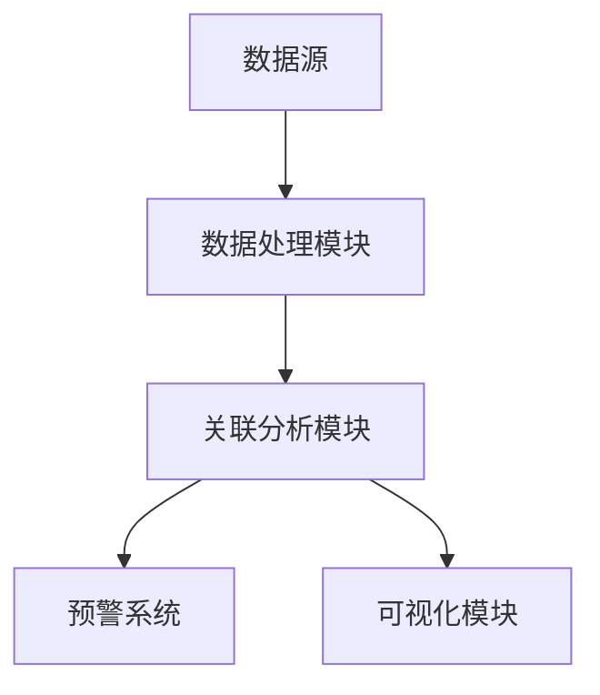

                 


# 全球股市估值与海洋塑料污染治理的关联

> 关键词：全球股市估值，海洋塑料污染治理，环境风险，金融关联，政策影响

> 摘要：本文探讨全球股市估值与海洋塑料污染治理之间的关联性，分析环境问题对金融市场的潜在影响，以及政策和企业行为如何在两者之间架起桥梁。通过理论分析和案例研究，本文揭示了环境治理与金融稳定之间的深层联系，并为企业和投资者提供了有益的建议。

---

## 第1章 全球股市估值与海洋塑料污染治理的背景介绍

### 1.1 全球股市估值的基本概念

#### 1.1.1 股市估值的定义与计算方法
股市估值是衡量市场整体价值的重要指标，通常通过股票指数（如标普500、纳斯达克指数）来反映。计算方法包括市盈率（P/E）、市净率（P/B）等。

#### 1.1.2 全球股市的现状与发展趋势
全球股市近年来波动较大，受经济政策、地缘政治和环境问题等多种因素影响，呈现多元化发展趋势。

#### 1.1.3 股市估值与经济活动的关系
股市估值与经济活动密切相关，高估值可能反映市场对未来的乐观预期，而低估值可能暗示经济下行压力。

### 1.2 海洋塑料污染治理的背景与挑战

#### 1.2.1 海洋塑料污染的定义与现状
海洋塑料污染指海洋中塑料废弃物的累积，严重威胁生态系统和人类健康。

#### 1.2.2 海洋塑料污染对生态系统的危害
塑料污染破坏海洋生态平衡，影响渔业和旅游业，增加企业运营成本。

#### 1.2.3 全球治理海洋塑料污染的政策与行动
各国政府和企业采取措施，如限制塑料使用、推动回收利用和技术创新。

### 1.3 问题背景与关联性分析

#### 1.3.1 股市估值与环境治理的潜在联系
环境问题影响企业声誉和盈利能力，进而影响股市估值。

#### 1.3.2 海洋塑料污染治理对经济活动的影响
治理措施可能增加企业成本，但也可能提升企业形象和投资者信心。

#### 1.3.3 全球化背景下环境问题与金融市场的互动
环境问题的全球性使得金融市场对其高度敏感，政策变化和企业行为成为关键影响因素。

---

## 第2章 核心概念与关联机制

### 2.1 核心概念的原理与属性

#### 2.1.1 全球股市估值的核心要素
- 市场指数：如标普500、纳斯达克指数。
- 经济指标：GDP、失业率、通胀率。
- 企业盈利：净利润、营收增长。
- 政策因素：政府政策、央行利率。

#### 2.1.2 海洋塑料污染治理的核心要素
- 环保法规：限制塑料使用、促进回收。
- 技术创新：可降解材料、回收技术。
- 企业行为：社会责任、环保投资。
- 公共意识：消费者行为、环保倡导。

### 2.2 核心概念的结构化分析

#### 2.2.1 核心概念的结构化对比
| 核心概念 | 全球股市估值 | 海洋塑料污染治理 |
|----------|--------------|-------------------|
| 核心目标 | 反映市场价值 | 保护海洋环境 |
| 影响因素 | 经济政策、企业盈利 | 环保法规、技术创新 |
| 关联性   | 高 | 高 |

#### 2.2.2 关联机制的ER实体关系图

```mermaid
er
  entity 股市估值 {
    key: 股票指数
    attribute: 市盈率, 市净率
  }
  
  entity 海洋塑料污染 {
    key: 污染指数
    attribute: 塑料密度, 清理成本
  }
  
  entity 环保政策 {
    key: 政策名称
    attribute: 实施地区, 时间
  }
  
  relation 关联关系 {
    股市估值 -- 政策影响: 政策变化影响股市估值
    海洋塑料污染 -- 治理措施: 治理进展影响环境风险
    股市估值 -- 环保政策: 环保政策影响股市估值
  }
```

---

## 第3章 股市估值与海洋塑料污染治理的关联机制

### 3.1 环境风险的金融化

#### 3.1.1 环境风险的定义与特征
环境风险指因环境问题导致的经济损失或市场波动，海洋塑料污染是其中的重要组成部分。

#### 3.1.2 环境风险对股市的影响
- 企业声誉受损，股价下跌。
- 环保法规增加企业成本，影响盈利能力。
- 投资者规避高环境风险企业，导致相关股票估值下降。

#### 3.1.3 环境风险的量化分析
通过建立环境风险指数，评估其对股市估值的具体影响。

### 3.2 政策风险的传导机制

#### 3.2.1 政策风险的定义与来源
政策风险指因政策变化导致的市场波动，环保政策是重要来源。

#### 3.2.2 政策风险对股市估值的影响
- 严格的环保法规可能导致相关企业股价下跌。
- 环保政策的放松可能提升企业利润，推动股价上涨。

#### 3.2.3 政策风险的管理策略
企业通过优化环保措施应对政策变化，投资者通过多元化配置分散风险。

### 3.3 企业社会责任（CSR）的作用

#### 3.3.1 企业社会责任的定义与内涵
企业社会责任指企业在追求利润的同时，承担对环境、社会的责任。

#### 3.3.2 CSR对股市估值的影响
- 履行环保责任提升企业形象，增强投资者信心。
- 可能增加短期成本，但长期有助于股价稳定。

#### 3.3.3 CSR的实施路径
- 推动绿色生产，减少塑料使用。
- 投资环保技术，提升治理能力。
- 加强信息披露，透明化环保表现。

### 3.4 投资者偏好变化

#### 3.4.1 投资者偏好的定义与特征
投资者偏好指投资者在选择投资标的时的倾向，受多种因素影响。

#### 3.4.2 环保意识对投资者偏好的影响
- 环保表现良好的企业更受投资者青睐。
- ESG（环境、社会、治理）投资成为趋势。

#### 3.4.3 投资者偏好的数据化分析
通过分析投资者对环保企业的投资行为，量化环保意识的影响。

---

## 第4章 数学模型与关联分析

### 4.1 数学模型的构建

#### 4.1.1 模型假设
- 股市估值与海洋塑料污染治理存在相关性。
- 环保政策和企业行为是主要影响因素。

#### 4.1.2 模型选择
采用多元线性回归模型，分析变量之间的关系。

### 4.2 回归分析的实现

#### 4.2.1 数据收集与预处理
收集全球股市指数、海洋塑料污染数据和相关环保政策信息。

#### 4.2.2 模型构建与验证
建立回归模型，检验变量的显著性。

#### 4.2.3 模型结果分析
- 环保政策对股市估值的影响显著。
- 企业环保行为与股市表现正相关。

### 4.3 案例分析

#### 4.3.1 案例背景
选取某个国家或地区，分析环保政策实施前后的股市变化。

#### 4.3.2 数据分析
通过回归分析，验证环保政策对股市估值的具体影响。

#### 4.3.3 结果解读
环保政策的实施显著提升了股市估值，表明市场对环保行动的积极反应。

---

## 第5章 系统架构与治理策略

### 5.1 系统架构设计

#### 5.1.1 系统功能设计
- 数据采集：收集股市数据和环境数据。
- 关联分析：识别环境因素对股市的影响。
- 预警系统：实时监控环境风险。

#### 5.1.2 系统架构图



### 5.2 治理策略

#### 5.2.1 政策层面
- 制定严格的环保法规。
- 提供环保补贴，鼓励企业治理。

#### 5.2.2 企业层面
- 投资环保技术，减少污染。
- 优化生产流程，降低环境影响。

#### 5.2.3 投资者层面
- 选择环保表现良好的企业投资。
- 关注ESG指标，分散环境风险。

---

## 第6章 项目实战与案例分析

### 6.1 项目背景

#### 6.1.1 项目目标
分析海洋塑料污染治理对股市估值的具体影响。

#### 6.1.2 项目范围
选取某地区的股市数据和环保政策，进行实证分析。

### 6.2 项目实施

#### 6.2.1 数据收集
收集相关股市指数、环境数据和政策信息。

#### 6.2.2 数据分析
使用Python进行数据清洗和建模。

#### 6.2.3 模型实现

```python
import pandas as pd
import numpy as np
from sklearn.linear_model import LinearRegression
from sklearn.metrics import r2_score

# 数据加载与预处理
data = pd.read_csv('data.csv')
X = data[['政策影响', '企业行为']]
y = data['股市估值']

# 模型训练
model = LinearRegression()
model.fit(X, y)

# 模型评估
predictions = model.predict(X)
r2 = r2_score(y, predictions)
print(f'R² Score: {r2}')
```

#### 6.2.4 结果分析
- 模型显著性检验。
- 变量影响程度分析。

### 6.3 案例分析

#### 6.3.1 案例背景
分析某国实施海洋塑料治理政策后的股市变化。

#### 6.3.2 数据分析
使用回归模型，验证政策对股市的具体影响。

#### 6.3.3 结果解读
政策实施后，股市估值显著提升，表明市场对环保行动的积极响应。

---

## 第7章 总结与展望

### 7.1 本章小结
总结全文，强调环境治理对股市估值的深远影响，政策和企业行为是关键因素。

### 7.2 注意事项
- 数据收集的准确性。
- 模型的适用性和局限性。
- 政策变化的不确定性。

### 7.3 拓展阅读
推荐相关书籍和文章，鼓励读者深入研究环境与金融的关联。

---

## 作者：AI天才研究院/AI Genius Institute & 禅与计算机程序设计艺术 /Zen And The Art of Computer Programming

---

通过以上分析，我们可以看到，全球股市估值与海洋塑料污染治理之间存在密切的关联。环境问题不仅影响企业的经营，也通过政策和市场机制影响股市的波动。企业和投资者需要高度重视环境风险，积极应对政策变化，共同推动可持续发展。

