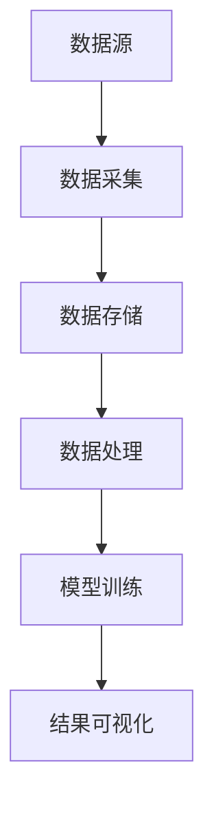

                 


# 全球股市估值与社会不平等问题的关联

> 关键词：全球股市估值，社会不平等，统计分析，回归分析，经济影响

> 摘要：本文探讨全球股市估值与社会不平等问题之间的关联，通过背景分析、概念对比、数学建模和案例研究，揭示两者之间的复杂关系，并提出解决方案。

## 第一部分：背景介绍

### 第1章：全球股市估值与社会不平等问题的背景

#### 1.1 全球股市估值的现状
- 股市估值是衡量市场健康的重要指标，涉及市盈率、市净率等。
- 当前股市波动剧烈，受经济政策、地缘政治等因素影响。
- 不同国家股市估值差异显著，发展中国家与发达国家差异明显。

#### 1.2 社会不平等问题的现状
- 社会不平等体现在收入分配、财富分配等方面，基尼系数是常用的衡量指标。
- 全球范围内，贫富差距问题日益严重，社会矛盾加剧。
- 社会不平等影响社会稳定和经济发展，成为全球关注焦点。

#### 1.3 全球股市估值与社会不平等的关联性
- 股市估值与社会不平等相互影响，股市表现反映经济状况，而经济状况又影响社会分配。
- 高不平等可能导致股市波动，股市波动又可能加剧不平等，形成恶性循环。
- 两者关联性在不同国家和时间段表现不同，需深入分析。

## 第二部分：核心概念与联系

### 第2章：全球股市估值与社会不平等的核心概念

#### 2.1 核心概念的原理
- 股市估值：通过市盈率（P/E）、市净率（P/B）等指标评估市场价值。
- 社会不平等：基尼系数、收入分配数据衡量社会财富分配情况。
- 两者关联：股市估值影响财富分配，财富分配影响股市结构，形成互动关系。

#### 2.2 核心概念的属性特征对比
| 特性       | 股市估值                  | 社会不平等              |
|------------|--------------------------|------------------------|
| 衡量指标    | 市盈率、市净率            | 基尼系数、收入分布      |
| 数据来源    | 交易所数据、公司财报      | 国民收入统计、调查数据  |
| 影响因素    | 经济政策、企业盈利、投资者情绪 | 收入政策、税收、社会福利 |
| 变化趋势    | 波动性大，受市场情绪影响    | 长期趋势，政策影响显著   |

#### 2.3 ER实体关系图架构
```mermaid
er
    entity 股市估值 {
        key 股市指数
        attribute 市盈率, 市净率, 股息率
    }
    entity 社会不平等 {
        key 基尼系数
        attribute 收入分布, 贫富差距, 社会福利
    }
    relationship 关联关系 {
        股市估值 -[影响]-> 社会不平等
        社会不平等 -[影响]-> 股市估值
    }
```

## 第三部分：算法原理讲解

### 第3章：全球股市估值与社会不平等的关联分析

#### 3.1 数据收集与预处理
- 数据来源：世界银行、股票交易所的公开数据。
- 数据清洗：处理缺失值、异常值，标准化处理。
- 数据格式：将股市估值与社会不平等数据对齐，确保可分析。

#### 3.2 关联分析算法
使用回归分析模型，将股市估值作为因变量，社会不平等指标作为自变量，分析其相关性。

#### 3.3 回归分析模型
建立线性回归模型：
$$ y = \beta_0 + \beta_1x + \epsilon $$
其中，y为股市估值，x为社会不平等指标。

#### 3.4 回归结果解读
- 回归系数解释：每个单位x变化对y的影响。
- 显著性检验：p值判断变量是否显著相关。
- 模型拟合度：R²值评估模型解释力。

#### 3.5 实证分析
以美国为例，分析基尼系数与道琼斯指数的关系，展示回归结果，说明社会不平等对股市估值的具体影响。

## 第四部分：数学公式与模型

### 第4章：数学模型与统计分析

#### 4.1 基尼系数计算
基尼系数G的计算公式：
$$ G = \frac{1}{n}\sum_{i=1}^{n}|x_i - \bar{x}| $$
其中，$\bar{x}$为平均值，$x_i$为各个数据点。

#### 4.2 股市估值模型
构建多元回归模型：
$$ y = \beta_0 + \beta_1x_1 + \beta_2x_2 + ... + \beta_kx_k + \epsilon $$
其中，$x_i$为多个社会经济指标，如基尼系数、失业率等。

## 第五部分：系统分析与架构设计

### 第5章：系统架构与设计

#### 5.1 问题场景介绍
设计一个系统，收集和分析全球股市估值与社会不平等数据，建立预测模型。

#### 5.2 系统功能设计
- 数据采集模块：实时获取股市数据和基尼系数。
- 数据处理模块：清洗、转换数据，建立关联模型。
- 分析模块：执行回归分析，生成预测结果。
- 可视化模块：展示分析结果，图形化输出。

#### 5.3 系统架构设计


## 第六部分：项目实战

### 第6章：项目实战与分析

#### 6.1 环境安装
- 安装Python、Pandas、Scipy、Matplotlib等库。
- 数据来源：世界银行和金融数据库。

#### 6.2 核心代码实现
```python
import pandas as pd
import numpy as np
from sklearn.linear_model import LinearRegression
from sklearn.metrics import r2_score
import matplotlib.pyplot as plt

# 数据加载
data = pd.read_csv('global_data.csv')

# 数据预处理
X = data[['基尼系数', '失业率']]
y = data['股市估值']

# 模型训练
model = LinearRegression()
model.fit(X, y)

# 模型预测
y_pred = model.predict(X)

# 模型评估
print('R²:', r2_score(y, y_pred))
```

#### 6.3 代码解读与分析
- 数据加载：读取CSV文件中的数据。
- 数据预处理：提取自变量和因变量。
- 模型训练：使用线性回归模型拟合数据。
- 模型预测：预测股市估值。
- 模型评估：计算R²值，评估拟合优度。

#### 6.4 实际案例分析
以某国为例，分析基尼系数变化对股市估值的影响，展示模型的应用和结果。

## 第七部分：最佳实践

### 第7章：总结与建议

#### 7.1 小结
- 全球股市估值与社会不平等问题相互关联，需系统分析。
- 统计模型可量化这种关联，指导政策制定。

#### 7.2 注意事项
- 数据质量影响结果，需谨慎处理。
- 模型假设需合理，避免过度简化问题。
- 结果解释需结合实际背景，避免误导。

#### 7.3 拓展阅读
建议阅读关于不平等与金融稳定的文献，深入理解两者关系。

---

**作者：AI天才研究院/AI Genius Institute & 禅与计算机程序设计艺术 /Zen And The Art of Computer Programming**

---

这篇文章系统地分析了全球股市估值与社会不平等问题的关联，通过理论探讨、数学建模和项目实战，提供了全面的解决方案。希望对读者理解经济与社会问题的相互作用有所帮助。

