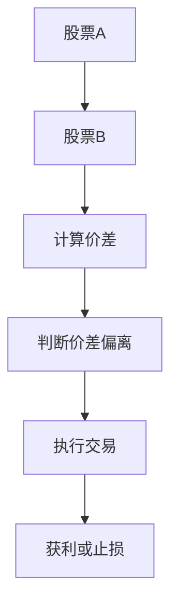
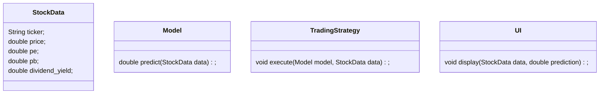
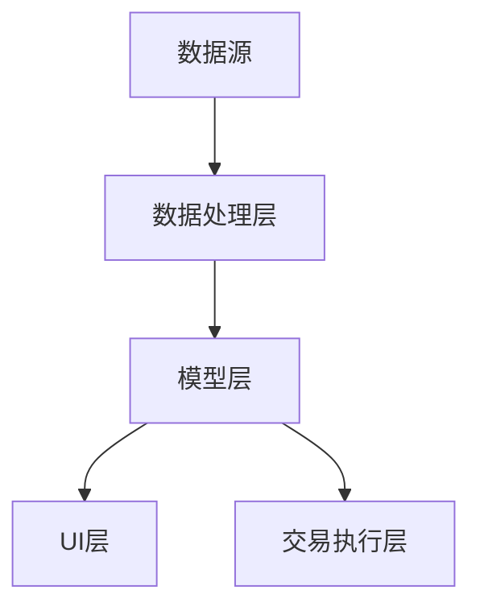

                 


# 全球股市估值与金融科技创新的关联

**关键词**：全球股市估值，金融科技创新，金融科技，股市分析，人工智能，区块链技术

**摘要**：本文探讨了全球股市估值与金融科技创新之间的深刻关联，分析了金融科技创新如何影响股市估值，并通过统计套利算法和机器学习模型展示了如何利用技术创新提升股市估值的准确性。文章结合实际案例，详细讲解了系统架构设计与项目实现，为金融领域的专业人士和科技爱好者提供了有价值的见解。

---

## 第一部分：全球股市估值与金融科技创新的背景介绍

### 第1章：全球股市估值的现状与挑战

#### 1.1 全球股市估值的定义与核心要素

**1.1.1 股市估值的基本概念**

股市估值是指通过分析股票价格、市盈率（P/E Ratio）、市净率（P/B Ratio）和股息率（Dividend Yield）等指标，评估一家公司的价值。这些指标帮助投资者判断股票是否被高估或低估。

**1.1.2 影响股市估值的主要因素**

- 公司基本面：收入、利润、资产负债情况
- 市场情绪：投资者心理和市场波动
- 宏观经济因素：利率、通货膨胀、GDP增长
- 行业动态：行业竞争、技术创新

**1.1.3 全球股市估值的多样性与复杂性**

不同国家和地区的股市受到不同的经济政策和市场结构影响，导致估值方法和标准的差异。例如，美国市场的市盈率通常高于新兴市场。

---

## 第二部分：全球股市估值与金融科技创新的核心概念与联系

### 第2章：全球股市估值的核心概念与数学模型

#### 2.1 股市估值的核心概念

**市盈率（P/E Ratio）**  
$$ P/E = \frac{\text{股价}}{\text{每股收益}} $$  
市盈率反映了投资者对公司的信心，高市盈率可能意味着高增长预期，但也可能意味着高风险。

**市净率（P/B Ratio）**  
$$ P/B = \frac{\text{股价}}{\text{每股净资产}} $$  
市净率适用于评估资产密集型行业的公司，如银行和房地产。

**股息率（Dividend Yield）**  
$$ \text{股息率} = \frac{\text{每股股息}}{\text{股价}} $$  
股息率高的股票通常被视为收益稳定的投资选择。

#### 2.2 金融科技创新的核心概念

**区块链技术**：通过分布式 ledger 实现透明、安全的交易记录，减少欺诈和中间人成本。

**人工智能**：利用机器学习算法分析大量数据，预测市场趋势和优化投资组合。

**大数据技术**：从海量数据中提取有价值的信息，帮助做出更精准的决策。

#### 2.3 全球股市估值与金融科技创新的联系

**统计对比分析**：通过表格和图表对比传统估值方法与创新技术的应用效果。

**数学模型**：构建混合模型，结合传统指标和新兴技术，提升估值的准确性。

---

## 第三部分：全球股市估值与金融科技创新的算法原理

### 第3章：统计套利算法与机器学习模型

#### 3.1 统计套利算法

**统计套利**是一种通过寻找资产价格偏离其理论价值的机会，进行短期交易以获利的方法。常见的策略包括配对交易和市场中性策略。

**配对交易流程图**  


#### 3.2 机器学习模型

**随机森林模型**用于分类和回归，适用于处理非线性关系，适合预测股票价格。

**神经网络模型**通过多层感知器（MLP）学习复杂模式，适用于处理时间序列数据。

**数学模型示例**  
$$ y = w_1x_1 + w_2x_2 + \dots + w_nx_n + b $$  
其中，$y$ 是预测的股价，$x_i$ 是输入特征，$w_i$ 是权重，$b$ 是偏置。

#### 3.3 实战代码示例

```python
import pandas as pd
from sklearn.ensemble import RandomForestRegressor

# 数据加载与预处理
data = pd.read_csv('stock_data.csv')
features = data[['PE', 'PB', 'Volume']]
target = data['Price']

# 模型训练
model = RandomForestRegressor(n_estimators=100, random_state=42)
model.fit(features, target)

# 预测与评估
predictions = model.predict(features)
print('预测值:', predictions)
print('均方误差:', mean_squared_error(target, predictions))
```

---

## 第四部分：系统分析与架构设计

### 第4章：系统功能设计与架构

#### 4.1 系统功能设计

**领域模型类图**  


**系统架构图**  


---

## 第五部分：项目实战

### 第5章：环境安装与代码实现

#### 5.1 环境安装

安装必要的库：
```bash
pip install pandas sklearn matplotlib
```

#### 5.2 核心代码实现

```python
import pandas as pd
import matplotlib.pyplot as plt

# 数据加载
data = pd.read_csv('stock_data.csv')

# 数据可视化
plt.figure(figsize=(10,6))
plt.plot(data['Date'], data['Price'], label='Stock Price')
plt.xlabel('Date')
plt.ylabel('Price')
plt.title('Stock Price Trend')
plt.legend()
plt.show()
```

---

## 第六部分：总结与展望

### 第6章：总结与展望

#### 6.1 内容回顾

本文详细探讨了全球股市估值与金融科技创新的关联，从背景介绍到算法实现，再到系统设计，全面分析了两者的关系。

#### 6.2 未来展望

未来，随着人工智能和大数据技术的进一步发展，股市估值将更加精准，金融科技创新将继续推动行业变革。

---

## 附录

### 附录A：术语表

- 市盈率（P/E Ratio）
- 市净率（P/B Ratio）
- 股息率（Dividend Yield）
- 区块链技术
- 人工智能

### 附录B：数据源

- stock_data.csv

### 附录C：参考文献

- 《金融科技：创新与应用》
- 《股票估值方法论》

---

**作者：AI天才研究院/AI Genius Institute & 禅与计算机程序设计艺术 /Zen And The Art of Computer Programming**

