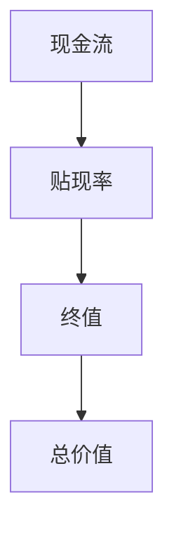
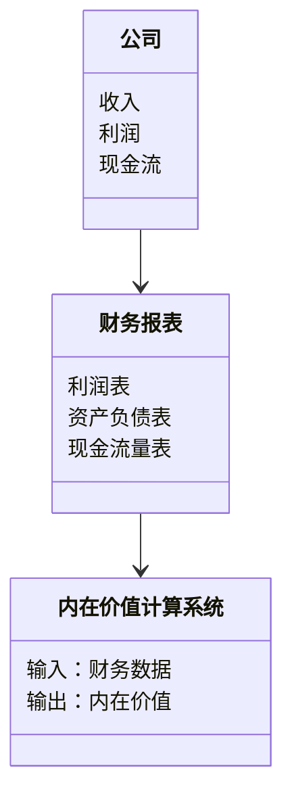
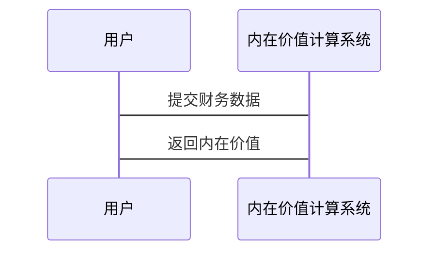

                 


---

# 内在价值的计算：价值投资者必备技能

## 关键词：内在价值、价值投资、DCF模型、财务分析、投资策略

## 摘要：  
内在价值是价值投资的核心概念，它帮助投资者识别被低估的优质资产。本文从内在价值的定义、计算方法、实战应用等方面展开，详细讲解了现金流贴现模型（DCF模型）的原理和应用，并通过实际案例分析，帮助读者掌握内在价值的计算技巧。文章还探讨了内在价值计算的边界条件、行业环境影响以及管理层能力评估等关键因素，为价值投资者提供了系统性的指导。

---

## 第一部分：内在价值的核心概念

### 第1章：内在价值的核心概念

#### 1.1 内在价值的定义与背景

##### 1.1.1 什么是内在价值  
内在价值是指一家公司或资产在未来能够产生的现金流的现值。它是基于公司基本面分析得出的理论价值，与市场波动无关。  
**公式：**  
$$ V = \sum_{t=1}^{n} \frac{CF_t}{(1 + r)^t} + \frac{TV}{(1 + r)^n} $$  

##### 1.1.2 内在价值与市场价值的区别  
- **市场价值**：由市场供需决定，可能高于或低于内在价值。  
- **内在价值**：反映公司的真实价值，是投资决策的基准。  

##### 1.1.3 内在价值的重要性  
内在价值是价值投资者的核心工具，帮助识别被市场低估的机会。通过计算内在价值，投资者可以评估公司是否具有长期投资价值。

#### 1.2 价值投资的基本原理

##### 1.2.1 价值投资的起源与发展  
价值投资由本杰明·格雷厄姆提出，强调以低于内在价值的价格买入优质资产。

##### 1.2.2 价值投资的核心理念  
- 购买被低估的资产。  
- 长期持有，等待市场回归理性。  

##### 1.2.3 内在价值与安全边际的关系  
安全边际是指市场价格低于内在价值的部分，提供缓冲以应对市场波动。  
**公式：**  
$$ \text{安全边际} = \text{内在价值} - \text{市场价格} $$  

#### 1.3 内在价值计算的边界与外延

##### 1.3.1 内在价值的适用范围  
适用于能够产生稳定现金流的公司，如成熟企业、公用事业等。  

##### 1.3.2 内在价值的局限性  
- 需要依赖财务数据的准确性。  
- 对未来的假设可能不准确。  

##### 1.3.3 内在价值与其他投资策略的对比  
- **成长投资**：侧重于高增长潜力的公司，不关注当前估值。  
- **趋势投资**：基于市场趋势，不考虑内在价值。  

#### 1.4 内在价值的核心要素

##### 1.4.1 财务数据的重要性  
包括收入、利润、现金流等，是计算内在价值的基础。  

##### 1.4.2 行业环境的影响  
行业竞争、政策变化等会影响公司的未来现金流。  

##### 1.4.3 管理层能力的作用  
优秀的管理层能够优化资产配置，提升公司价值。

---

## 第二部分：内在价值计算的核心模型

### 第2章：现金流贴现模型（DCF模型）

#### 2.1 DCF模型的基本原理

##### 2.1.1 自由现金流的定义与计算  
自由现金流是公司扣除所有支出后的剩余现金，用于偿还债务和股东回报。  
**公式：**  
$$ FCF = \text{净利润} + \text{折旧} + \text{摊销} - \text{资本支出} $$  

##### 2.1.2 贴现率的确定方法  
贴现率反映了资金的时间价值和风险溢价。  
**公式：**  
$$ r = r_f + \text{风险溢价} $$  

##### 2.1.3 终值的计算方式  
终值是未来现金流的现值，假设公司在永续期后的增长率为零。  
**公式：**  
$$ TV = \frac{CF_{n+1}}{r} $$  

#### 2.2 DCF模型的数学公式

##### 2.2.1 自由现金流公式  
$$ FCF = \text{净利润} + \text{非现金消耗} - \text{增量净投资} $$  

##### 2.2.2 贴现率公式  
$$ r = \text{无风险利率} + \text{风险溢价} $$  

##### 2.2.3 终值公式  
$$ TV = \frac{CF_{n+1}}{(1 + r)^n} $$  

#### 2.3 DCF模型的实体关系图



#### 2.4 DCF模型的优缺点

##### 2.4.1 优点  
- 理论基础清晰，计算过程透明。  

##### 2.4.2 缺点  
- 对未来现金流的假设可能存在偏差。  

---

## 第三部分：内在价值计算的实战应用

### 第3章：财务报表分析与内在价值计算

#### 3.1 财务报表分析的基本方法

##### 3.1.1 利润表分析  
利润表反映公司在一定期间内的收入和利润情况。  

##### 3.1.2 资产负债表分析  
资产负债表展示公司在某一时点的资产、负债和所有者权益情况。  

##### 3.1.3 现金流量表分析  
现金流量表记录公司在一定期间内的现金流入和流出情况。  

#### 3.2 财务指标的计算与解读

##### 3.2.1 市盈率（P/E）  
$$ P/E = \frac{\text{股价}}{\text{每股收益}} $$  

##### 3.2.2 市净率（P/B）  
$$ P/B = \frac{\text{股价}}{\text{每股净资产}} $$  

##### 3.2.3 股息率  
$$ \text{股息率} = \frac{\text{股息}}{\text{股价}} \times 100\% $$  

#### 3.3 财务数据在内在价值计算中的应用

##### 3.3.1 自由现金流的计算  
通过财务报表提取收入、利润、折旧等数据，计算自由现金流。  

##### 3.3.2 贴现率的估算  
结合无风险利率和行业风险溢价，估算贴现率。  

##### 3.3.3 终值的计算  
假设公司永续期后的现金流稳定，计算终值。  

---

## 第四部分：项目实战与案例分析

### 第4章：项目实战与案例分析

#### 4.1 项目背景介绍  
以某制造公司为例，分析其内在价值。

#### 4.2 系统功能设计

##### 4.2.1 领域模型（mermaid类图）  


#### 4.3 系统架构设计

##### 4.3.1 架构图（mermaid架构图）  
```mermaid
docker
    service 内在价值计算服务 {
        deploy 3个实例
        load balancing
    }
    service 数据存储 {
        database 财务数据库
        database 计算结果数据库
    }
```

#### 4.4 系统接口设计

##### 4.4.1 接口描述  
- 输入：财务数据  
- 输出：内在价值  

#### 4.5 系统交互设计（mermaid序列图）  


---

## 第五部分：总结与展望

### 第5章：总结与展望

#### 5.1 最佳实践 Tips

- 确保财务数据的准确性。  
- 合理估计未来现金流和贴现率。  

#### 5.2 小结  
内在价值计算是价值投资者的核心技能，通过DCF模型可以帮助投资者识别被低估的资产。

#### 5.3 注意事项

- 内在价值计算需要结合行业特点。  
- 避免过度依赖模型，忽略定性因素。  

#### 5.4 拓展阅读

- 《投资学》  
- 《价值投资实战》  

---

## 作者：AI天才研究院/AI Genius Institute & 禅与计算机程序设计艺术/Zen And The Art of Computer Programming

---

### 总结  
本文系统地讲解了内在价值的计算方法，从理论到实践，帮助价值投资者掌握这一核心技能。通过DCF模型的详细讲解和实际案例分析，读者可以更好地理解内在价值的计算过程，并在实际投资中灵活应用。

