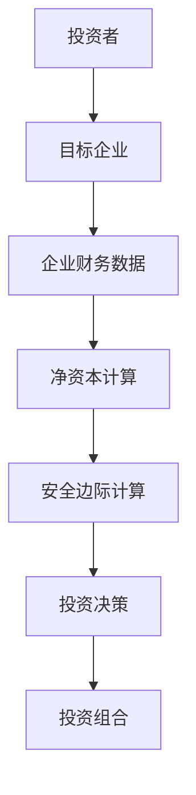
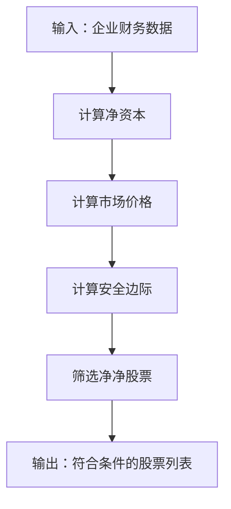
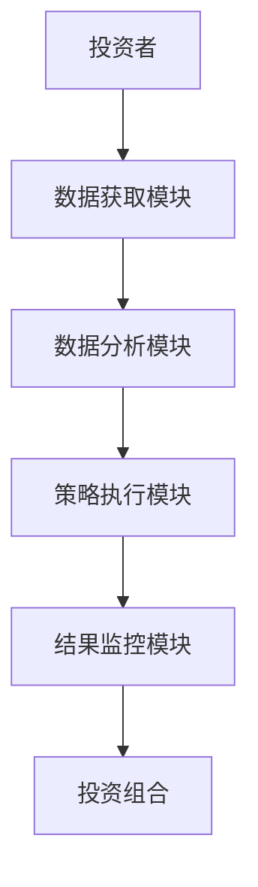

                 


# 净净股票策略：格雷厄姆理论的现代演绎

## 关键词：
- 净净股票策略
- 格雷厄姆理论
- 价值投资
- 现代演绎
- 股票筛选模型
- 投资系统架构

## 摘要：
本文将从格雷厄姆的经典投资理论出发，结合现代编程与数据分析技术，详细探讨“净净股票策略”的现代演绎。通过理论与实践相结合的方式，本文将揭示如何利用格雷厄姆的“安全边际”与“价值评估”两大核心概念，构建一个基于净净股票的投资策略，并通过算法、系统架构与项目实战，展示如何在现代投资环境中实现这一策略。本文将从背景介绍、核心概念、算法原理、系统架构、项目实战等多维度展开，深入剖析净净股票策略的内在逻辑与实现细节。

---

## 第一部分：格雷厄姆理论的现代演绎背景介绍

### 第1章：格雷厄姆理论的起源与核心概念

#### 1.1 格雷厄姆理论的起源
- **1.1.1 价值投资的鼻祖——本杰明·格雷厄姆**
  - 格雷厄姆是20世纪最伟大的投资思想家之一，被誉为“价值投资之父”。
  - 他提出了“市场先生”概念，认为市场情绪波动是投资机会的来源。
  - 格雷厄姆的学生戴维·多德共同提出了“净净股票”（Nets）的概念，即通过分析企业的净资产价值来评估其内在价值。
  
- **1.1.2 格雷厄姆理论的核心思想**
  - 股票的价值应基于企业的基本面分析，而非市场情绪。
  - 安全边际：买入价格低于企业内在价值，以降低投资风险。
  - 长期投资：通过持有优质资产获得长期收益，而非频繁交易。

- **1.1.3 格雷厄姆理论在现代投资中的地位**
  - 格雷厄姆的理论是现代价值投资的基石，影响了巴菲特、彼得·林奇等投资大师。
  - 在现代量化投资中，格雷厄姆的理论被重新演绎，融入编程与数据分析技术。

#### 1.2 格雷厄姆理论的核心概念
- **1.2.1 股票的价值评估**
  - 格雷厄姆认为，股票的内在价值是企业的净资产价值，即“每股净资本”（NCAV）。
  - 净资本 = 总资产 - 流动负债 - 无形资产。
  - 投资者应寻找市场价格低于净资本的企业。

- **1.2.2 安全边际的概念**
  - 安全边际 = 内在价值 - 市场价格。
  - 通过安全边际，投资者可以降低市场波动带来的风险。
  - 安全边际的计算公式：$$\text{安全边际} = \text{内在价值} - \text{市场价格}$$

- **1.2.3 股票市场的周期性**
  - 格雷厄姆认为，市场具有周期性，价格会在短期偏离价值。
  - 投资者应利用市场的周期性波动，寻找低估的股票。

### 第2章：净净股票策略的背景与问题描述

#### 2.1 净净股票策略的定义
- **2.1.1 净净股票的定义**
  - 净净股票（Nets）是指市场价格低于每股净资本的股票。
  - 净资本 = 总资产 - 流动负债 - 无形资产。
  - 净净股票的筛选公式：$$\text{净资本} = \frac{\text{总资产} - \text{流动负债} - \text{无形资产}}{\text{总股数}}$$

- **2.1.2 净净股票与传统股票的区别**
  - 净净股票强调企业的净资产价值，而非市场表现。
  - 净净股票的投资逻辑基于基本面分析，而非技术分析。

#### 2.2 净净股票策略的核心问题
- **2.2.1 净净股票的价值评估**
  - 如何准确计算企业的净资本？
  - 如何识别企业的财务造假风险？

- **2.2.2 净净股票的风险管理**
  - 如何应对市场的短期波动？
  - 如何分散投资风险？

- **2.2.3 净净股票的市场波动性**
  - 净净股票的波动性如何影响投资收益？
  - 如何在市场波动中保持投资纪律？

#### 2.3 净净股票策略的边界与外延
- **2.3.1 净净股票策略的适用范围**
  - 适用于低估值、高分红的股票。
  - 适用于企业基本面稳定、财务状况健康的行业。

- **2.3.2 净净股票策略的局限性**
  - 需要大量财务数据支持，手动计算耗时。
  - 无法预测市场的短期波动。
  - 净净股票可能长期被市场忽视，导致流动性风险。

- **2.3.3 净净股票策略与其他投资策略的关系**
  - 净净股票策略是价值投资的一种形式。
  - 可以与其他策略（如成长型投资、趋势投资）结合使用，形成多元化投资组合。

### 第3章：格雷厄姆理论与现代投资的联系

#### 3.1 格雷厄姆理论的核心要素
- **3.1.1 价值评估模型**
  - 格雷厄姆的净资本模型：$$\text{净资本} = \frac{\text{总资产} - \text{流动负债} - \text{无形资产}}{\text{总股数}}$$
  - 安全边际计算：$$\text{安全边际} = \text{内在价值} - \text{市场价格}$$

- **3.1.2 安全边际的计算公式**
  - 安全边际 = 内在价值 - 市场价格。
  - 安全边际的百分比 = （安全边际 / 内在价值）× 100%。

- **3.1.3 股票市场的周期性分析方法**
  - 市场周期的四个阶段：牛市、熊市、震荡市、结构性牛市。
  - 如何在不同市场阶段应用净净股票策略？

#### 3.2 格雷厄姆理论与现代投资策略的对比
- **3.2.1 传统价值投资与现代量化投资的对比**
  - 传统价值投资：基于基本面分析，寻找低估股票。
  - 现代量化投资：基于大数据与算法，寻找统计套利机会。

- **3.2.2 净净股票策略与其它投资策略的联系**
  - 净净股票策略与动量策略的结合。
  - 净净股票策略与因子投资的联系。

- **3.2.3 格雷厄姆理论在现代投资中的应用**
  - 现代量化投资中的因子筛选。
  - 如何利用编程与数据分析技术实现格雷厄姆的理论？

### 第4章：格雷厄姆理论的核心概念与联系

#### 4.1 核心概念原理
- **4.1.1 价值评估的数学模型**
  - 净资本计算公式：$$\text{净资本} = \frac{\text{总资产} - \text{流动负债} - \text{无形资产}}{\text{总股数}}$$
  - 安全边际计算公式：$$\text{安全边际} = \text{内在价值} - \text{市场价格}$$

- **4.1.2 安全边际的计算公式**
  - 安全边际 = 内在价值 - 市场价格。
  - 安全边际的百分比 = （安全边际 / 内在价值）× 100%。

- **4.1.3 股票市场的周期性分析方法**
  - 市场周期的四个阶段：牛市、熊市、震荡市、结构性牛市。
  - 如何在不同市场阶段应用净净股票策略？

#### 4.2 核心概念属性特征对比表格
| 核心概念 | 定义 | 属性 | 特征 |
|----------|------|------|------|
| 价值评估 | 股票的内在价值 | 客观性 | 可量化 |
| 安全边际 | 买入价格低于内在价值 | 风险控制 | 可调整 |
| 市场周期性 | 股票市场的波动规律 | 时间性 | 可预测 |

#### 4.3 ER实体关系图（Mermaid流程图）



---

## 第二部分：净净股票策略的算法与系统架构

### 第5章：净净股票策略的算法原理

#### 5.1 净净股票筛选的数学模型
- **5.1.1 净资本计算模型**
  - 净资本 = (总资产 - 流动负债 - 无形资产) / 总股数。
  - 公式：$$\text{净资本} = \frac{\text{总资产} - \text{流动负债} - \text{无形资产}}{\text{总股数}}$$

- **5.1.2 安全边际计算模型**
  - 安全边际 = 内在价值 - 市场价格。
  - 公式：$$\text{安全边际} = \text{内在价值} - \text{市场价格}$$

- **5.1.3 净净股票筛选步骤**
  1. 收集目标企业的财务数据。
  2. 计算企业的净资本。
  3. 比较市场价格与净资本。
  4. 计算安全边际。
  5. 筛选出安全边际为正的企业。

#### 5.2 净净股票筛选算法的流程图（Mermaid）



---

### 第6章：净净股票策略的系统架构

#### 6.1 系统功能设计（领域模型）
- **6.1.1 数据获取模块**
  - 从股票数据库中获取企业财务数据。
  - 数据格式：CSV、Excel或数据库表。

- **6.1.2 数据分析模块**
  - 计算净资本与安全边际。
  - 数据分析工具：Python的Pandas库。

- **6.1.3 策略执行模块**
  - 根据筛选条件，选出符合条件的股票。
  - 筛选条件：净资本 > 市场价格，安全边际 > 0。

- **6.1.4 结果监控模块**
  - 监控投资组合的收益与风险。
  - 风险指标：夏普比率、最大回撤。

#### 6.2 系统架构设计（Mermaid）



---

## 第三部分：净净股票策略的项目实战

### 第7章：环境安装与系统核心实现

#### 7.1 环境安装
- **Python版本**：Python 3.8或更高版本。
- **依赖库安装**：
  - Pandas：数据处理。
  - NumPy：数值计算。
  - Matplotlib：数据可视化。
  - requests：网络请求。

```bash
pip install pandas numpy matplotlib requests
```

#### 7.2 系统核心实现
- **代码实现：净净股票筛选模型**

```python
import pandas as pd
import numpy as np
import requests

def get_financial_data(ticker):
    # 获取股票财务数据
    url = f"https://api.example.com/financial_data/{ticker}"
    response = requests.get(url)
    data = response.json()
    return {
        "total_assets": data["total_assets"],
        "current_liabilities": data["current_liabilities"],
        "intangible_assets": data["intangible_assets"],
        "total_shares": data["total_shares"],
        "market_price": data["market_price"]
    }

def calculate_net_capital(data):
    # 计算净资本
    net_capital = (data["total_assets"] - data["current_liabilities"] - data["intangible_assets"]) / data["total_shares"]
    return net_capital

def calculate_margin_of_safety(data, net_capital):
    # 计算安全边际
    margin_of_safety = net_capital - data["market_price"]
    return margin_of_safety

def screen_net_net_stocks(tickers):
    # 筛选净净股票
    screened_stocks = []
    for ticker in tickers:
        data = get_financial_data(ticker)
        net_capital = calculate_net_capital(data)
        margin_of_safety = calculate_margin_of_safety(data, net_capital)
        if margin_of_safety > 0:
            screened_stocks.append(ticker)
    return screened_stocks

# 示例代码
tickers = ["AAPL", "MSFT", "GOOGL"]
screened_stocks = screen_net_net_stocks(tickers)
print("符合条件的股票：", screened_stocks)
```

---

## 第四部分：最佳实践与总结

### 第8章：最佳实践

#### 8.1 小结
- 净净股票策略的核心在于“安全边际”与“价值评估”。
- 通过编程与数据分析技术，可以实现净净股票的自动化筛选与监控。

#### 8.2 注意事项
- 数据质量：确保财务数据的准确性与完整性。
- 风险控制：定期调整投资组合，分散风险。
- 市场波动：关注市场的周期性变化，避免过度集中。

#### 8.3 拓展阅读
- 《聪明的投资者》——本杰明·格雷厄姆
- 《投资学原理》——威廉·夏普
- 《算法交易：数学模型与实践》——刘海峰

---

## 作者：AI天才研究院/AI Genius Institute & 禅与计算机程序设计艺术/Zen And The Art of Computer Programming

---

感谢您的阅读！如需进一步探讨或合作，请随时与我联系。

