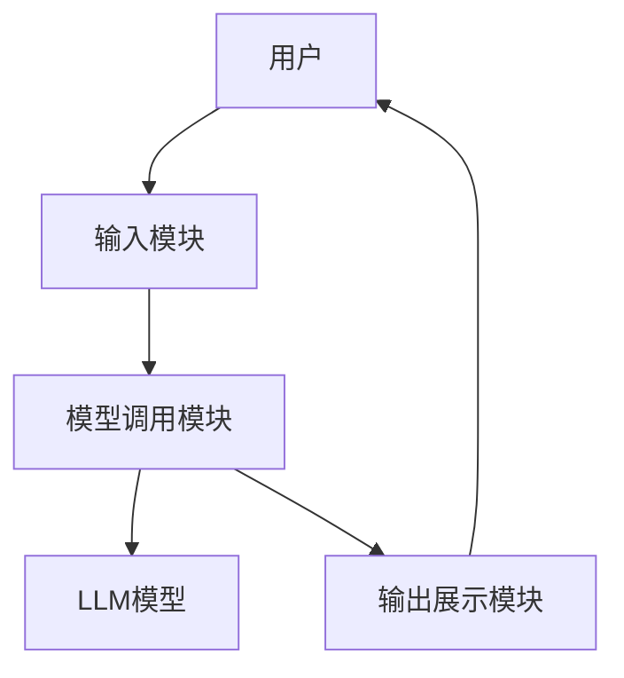
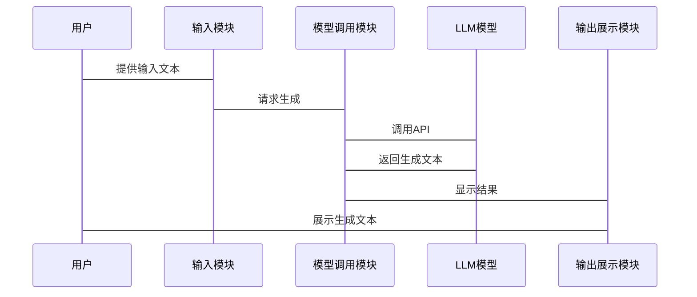

                 


# 创意写作 AI Agent：LLM 辅助内容创作与文案生成

## 关键词
- 创意写作
- AI Agent
- LLM
- 文案生成
- 自然语言处理
- 深度学习
- AI辅助写作

## 摘要
随着人工智能技术的飞速发展，大型语言模型（LLM）在创意写作和文案生成领域展现出巨大潜力。本文深入探讨了LLM辅助创意写作的核心概念、算法原理、系统架构设计及实际应用。通过背景介绍、核心概念分析、算法流程展示、系统架构设计和项目实战，本文系统地阐述了如何利用LLM构建高效的AI Agent，辅助内容创作与文案生成。文章还提供了详细的数学公式、代码实现和系统交互图，帮助读者全面理解相关技术，并通过实际案例展示其应用效果，最后总结了最佳实践和未来展望。

---

# 目录

1. [背景与基础](#背景与基础)
   1.1 创意写作与AI大模型概述
   1.2 LLM辅助创意写作的核心概念
   1.3 创意写作与AI大模型的结合

2. [核心概念与联系](#核心概念与联系)
   2.1 LLM的预训练与微调
   2.2 创意写作中的LLM模型选择
   2.3 创意写作中的LLM训练策略

3. [算法原理讲解](#算法原理讲解)
   3.1 Transformer模型的结构与原理
   3.2 LLM的训练过程
   3.3 文本生成的算法流程

4. [系统分析与架构设计](#系统分析与架构设计)
   4.1 系统功能设计
   4.2 系统架构设计
   4.3 系统接口设计

5. [项目实战与展望](#项目实战与展望)
   5.1 项目环境安装
   5.2 系统核心实现
   5.3 实际案例分析
   5.4 项目小结与未来展望

---

## 第一部分: 背景与基础

### 1.1 创意写作与AI大模型概述

#### 1.1.1 创意写作的核心概念
创意写作是一种通过创新思维和艺术表达来创作文本内容的方式，涵盖小说、诗歌、文案、剧本等多种形式。其核心在于通过独特的视角和语言表达，传递特定的情感、思想或信息。

#### 1.1.2 创意写作的常见形式
- 小说创作
- 诗歌创作
- 广告文案
- 剧本编写
- 技术文档写作

#### 1.1.3 创意写作的挑战与机遇
- **挑战**：创意枯竭、表达受限、效率低下。
- **机遇**：AI技术为创意写作提供了新的工具和灵感。

#### 1.1.4 创意写作的边界与外延
- 边界：专注于文本创作，不涉及图像、视频等内容。
- 外延：涵盖多种文本形式，从文学创作到商业文案。

#### 1.1.5 创意写作的核心要素
- 创意性
- 语言表达
- 题材选择
- 结构安排

### 1.2 AI大模型（LLM）的定义与特点

#### 1.2.1 LLM的核心概念
LLM（Large Language Model）是一种基于深度学习的自然语言处理模型，通过大量数据训练，能够理解和生成人类语言文本。

#### 1.2.2 LLM与传统NLP模型的区别
- **传统NLP模型**：基于规则或小规模数据训练，适用于特定任务。
- **LLM**：基于大规模数据和深度学习，具有通用性和灵活性。

#### 1.2.3 LLM在创意写作中的潜力
- 自动生成文本片段
- 提供创作灵感
- 辅助情节设计

### 1.3 创意写作与AI大模型的结合

#### 1.3.1 创意写作中的AI辅助工具
- 文本生成工具
- 智能改写工具
- 创作灵感辅助工具

#### 1.3.2 LLM在文案生成中的应用
- 广告文案生成
- 市场报告撰写
- 品牌故事创作

#### 1.3.3 创意写作AI Agent的定义与目标
- **定义**：一种基于LLM的智能助手，能够理解创作需求并生成创意文本。
- **目标**：提升创作效率，激发创作灵感，优化文本质量。

---

## 第二部分: 核心概念与联系

### 2.1 LLM的预训练与微调

#### 2.1.1 预训练的定义与作用
预训练是指在大规模通用数据集上训练模型，使其掌握语言的基本规律和语义理解。

#### 2.1.2 微调的定义与作用
微调是指在特定领域或任务上，对预训练模型进行进一步优化，使其适应具体需求。

#### 2.1.3 预训练与微调的对比
| 对比维度 | 预训练 | 微调 |
|----------|--------|------|
| 数据     | 通用数据集 | 领域特定数据集 |
| 目标     | 通用语言理解 | 特定任务优化 |
| 计算资源 | 高 | 中 |

### 2.2 创意写作中的LLM模型选择

#### 2.2.1 常见LLM模型介绍
- GPT系列（GPT-3、GPT-4）
- BERT系列
- T5
- PaLM

#### 2.2.2 模型选择的考虑因素
- 模型大小与性能
- 计算资源限制
- 任务需求

#### 2.2.3 不同场景下的模型适用性
| 场景       | GPT系列       | BERT系列        |
|------------|---------------|-----------------|
| 文本生成   | 适用           | 较少适用         |
| 语义理解   | 较少适用       | 适用             |

### 2.3 创意写作中的LLM训练策略

#### 2.3.1 监督微调
通过标注数据对模型进行微调，提升其在特定任务上的表现。

#### 2.3.2 增量训练
在已有模型基础上，逐步增加新的数据或任务进行训练。

#### 2.3.3 对抗训练
通过生成器和判别器的对抗，提升模型的生成能力。

---

## 第三部分: 算法原理讲解

### 3.1 Transformer模型的结构与原理

#### 3.1.1 Transformer的基本结构
- 编码器
- 解码器

#### 3.1.2 自注意力机制的数学公式
自注意力机制的计算公式如下：

$$
\text{Attention}(Q, K, V) = \text{softmax}\left(\frac{QK^T}{\sqrt{d_k}}\right)V
$$

其中，$Q$、$K$、$V$分别为查询、键、值向量，$d_k$为向量维度。

#### 3.1.3 前馈网络的实现细节
- 多层感知机（MLP）
- 残差连接与层归一化

### 3.2 LLM的训练过程

#### 3.2.1 预训练过程
- 使用大规模通用数据集
- 优化模型的通用语言理解能力

#### 3.2.2 微调过程
- 使用特定任务数据
- 优化模型在特定任务上的性能

#### 3.2.3 生成过程
- 基于输入生成输出文本
- 使用贪心算法或蒙特卡洛采样

### 3.3 文本生成的算法流程

#### 3.3.1 输入处理
- 对输入文本进行分词和编码

#### 3.3.2 模型推理
- 通过自注意力机制生成词向量表示

#### 3.3.3 输出生成
- 根据生成策略输出最终文本

---

## 第四部分: 系统分析与架构设计

### 4.1 系统功能设计

#### 4.1.1 用户输入模块
- 提供输入文本框
- 支持多种输入格式

#### 4.1.2 模型调用模块
- 调用LLM进行文本生成
- 处理生成结果

#### 4.1.3 输出展示模块
- 显示生成文本
- 提供修改和优化选项

### 4.2 系统架构设计

#### 4.2.1 系统架构图


#### 4.2.2 系统交互流程


### 4.3 系统接口设计

#### 4.3.1 API接口设计
- 输入接口：`POST /api/generate`
- 输出接口：`GET /api/output`

#### 4.3.2 接口协议
- 使用JSON格式传输数据
- 支持RESTful API

---

## 第五部分: 项目实战与展望

### 5.1 项目环境安装

#### 5.1.1 安装Python
```bash
python --version
```

#### 5.1.2 安装依赖库
```bash
pip install transformers
pip install torch
```

### 5.2 系统核心实现

#### 5.2.1 模型加载
```python
from transformers import GPT2LMHeadModel, GPT2Tokenizer

model_name = "gpt2"
model = GPT2LMHeadModel.from_pretrained(model_name)
tokenizer = GPT2Tokenizer.from_pretrained(model_name)
```

#### 5.2.2 文本生成
```python
def generate_text(prompt, max_length=50):
    inputs = tokenizer(prompt, return_tensors="np")
    outputs = model.generate(inputs.input_ids, max_length=max_length)
    return tokenizer.decode(outputs[0], skip_special_tokens=True)
```

### 5.3 实际案例分析

#### 5.3.1 环境搭建
- 安装必要的库和框架
- 配置开发环境

#### 5.3.2 代码实现
- 调用LLM API生成文本
- 展示生成结果

#### 5.3.3 案例分析
- 分析生成文本的质量
- 调整模型参数优化生成效果

### 5.4 项目小结与未来展望

#### 5.4.1 项目小结
- 成功实现创意写作AI Agent
- 验证了LLM在文案生成中的应用价值

#### 5.4.2 未来展望
- 提升模型生成质量
- 探索更多AI辅助写作的应用场景

---

## 作者

**作者：AI天才研究院/AI Genius Institute & 禅与计算机程序设计艺术 /Zen And The Art of Computer Programming**

---

本文通过系统地介绍创意写作AI Agent的背景、核心概念、算法原理、系统架构设计和项目实战，全面展示了如何利用LLM技术辅助内容创作与文案生成。希望本文能为创意写作领域带来新的思路和工具，推动AI与创意写作的深度融合。

