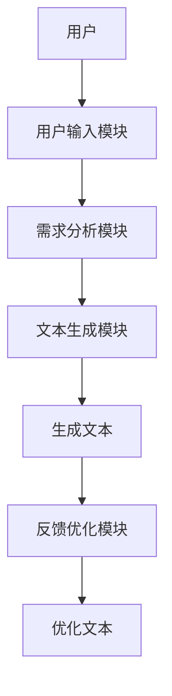

                 


# 创意写作AI Agent：LLM驱动的文学创作辅助系统

**关键词**：创意写作、LLM、AI Agent、文学创作、人工智能

**摘要**：本文探讨了大语言模型（LLM）在创意写作中的应用，提出了一个基于LLM的创意写作AI Agent系统，分析了其核心原理、架构设计和实际应用场景，最后通过具体案例展示了系统的实现过程。

---

## 第一部分：创意写作与AI的结合

### 第1章：创意写作与AI的结合

#### 1.1 创意写作的定义与特点

创意写作是一种通过创造性思维和语言表达来创作文学作品的过程。它不同于传统的学术写作或技术文档写作，更注重情感表达、故事构建和艺术性。创意写作的特点包括：

1. **创新性**：要求创作者突破常规，产生独特的想法和表达方式。
2. **情感性**：作品通常承载创作者的情感和思想。
3. **多样性**：可以涵盖小说、诗歌、剧本等多种形式。

#### 1.2 AI在创意写作中的应用背景

随着人工智能技术的快速发展，AI在创意写作中的应用逐渐成为可能。传统的创意写作过程中，创作者常常面临灵感枯竭、创作瓶颈等问题。AI通过模拟人类的思维过程，可以为创作者提供灵感、完善故事情节、优化语言表达等支持。

**核心概念**：创意写作AI Agent是一种基于LLM的智能辅助工具，能够理解创作需求，生成符合要求的文本内容，并与创作者互动，提供实时反馈和建议。

#### 1.3 创意写作AI Agent的核心功能

创意写作AI Agent的功能包括：

1. **文本生成**：根据用户输入的主题、风格和要求，生成创意文本。
2. **情节建议**：帮助用户构建故事情节，解决创作中的卡壳问题。
3. **语言优化**：优化生成文本的语言表达，使其更符合文学创作的要求。
4. **互动反馈**：与用户互动，根据用户反馈调整生成内容。

---

### 第2章：LLM的基本原理与应用

#### 2.1 大语言模型（LLM）的定义与特点

LLM是一种基于深度学习的自然语言处理模型，具有以下特点：

1. **大规模数据训练**：通过训练大规模的文本数据，模型能够理解语言的规律和上下文关系。
2. **生成能力**：LLM可以通过生成模型（如Transformer）生成连贯的文本内容。
3. **多语言支持**：许多LLM模型支持多种语言，能够适应不同的创作需求。

#### 2.2 LLM在创意写作中的应用

在创意写作中，LLM可以用于以下几个方面：

1. **文本生成**：生成小说、诗歌等文学作品的内容。
2. **情节设计**：帮助创作者构思故事情节和角色发展。
3. **语言优化**：优化生成文本的语言表达，使其更具文学性。

**对比表格**：以下表格展示了传统写作工具与基于LLM的创意写作AI Agent在功能上的对比。

| **功能**       | **传统写作工具**                     | **LLM驱动的创意写作AI Agent** |
|----------------|--------------------------------------|----------------------------------|
| 文本生成       | 提供基本的文字处理功能                | 提供智能化的文本生成服务          |
| 情节设计       | 需要手动输入和调整                   | 可以自动生成情节建议               |
| 语言优化       | 依赖人工校对                          | 可以自动优化语言表达               |
| 互动反馈       | 无法提供实时反馈                     | 提供实时反馈和建议                |

---

### 第3章：创意写作AI Agent的核心概念

#### 3.1 创意写作AI Agent的定义

创意写作AI Agent是一种基于LLM的智能辅助工具，能够理解用户的创作需求，并通过生成模型生成符合要求的文本内容。它不仅能够提供创意写作所需的文本生成服务，还能够与用户进行互动，根据用户的反馈不断优化生成内容。

#### 3.2 创意写作AI Agent的功能

创意写作AI Agent的功能包括：

1. **需求分析**：通过用户输入的主题、风格和要求，分析用户的创作需求。
2. **文本生成**：根据需求生成创意文本。
3. **反馈优化**：根据用户的反馈优化生成内容。
4. **互动建议**：为用户提供创作建议和灵感。

#### 3.3 创意写作AI Agent的优势

创意写作AI Agent的优势体现在以下几个方面：

1. **高效性**：通过自动化生成文本，节省创作时间。
2. **创新性**：能够提供独特的创作思路和表达方式。
3. **灵活性**：可以根据用户需求调整生成内容。

---

## 第二部分：算法原理与系统架构

### 第4章：算法原理

#### 4.1 LLM的训练过程

LLM的训练过程通常包括以下步骤：

1. **数据预处理**：对大规模文本数据进行清洗和格式化。
2. **模型训练**：使用训练数据训练生成模型（如GPT）。
3. **微调优化**：根据具体任务对模型进行微调。

**数学公式**：以下是训练过程中的损失函数公式：

$$
\text{Loss} = -\sum_{i=1}^{n} \log P(w_i | w_{i-1}, \ldots, w_1)
$$

其中，$w_i$ 表示生成的第i个词。

#### 4.2 文本生成策略

文本生成策略包括贪心算法和蒙特卡洛方法等。以下是贪心算法的简单流程：

1. **初始化**：输入初始文本。
2. **生成下一个词**：选择概率最高的词。
3. **重复生成**：直到生成完整的文本。

**代码示例**：以下是一个简单的文本生成代码示例：

```python
def generate_text(model, max_length):
    text = ""
    for _ in range(max_length):
        # 生成下一个词
        next_word = model.predict(text)
        text += next_word
    return text
```

---

### 第5章：系统架构设计

#### 5.1 系统功能设计

创意写作AI Agent的功能模块包括：

1. **用户输入模块**：接收用户的创作需求。
2. **需求分析模块**：分析用户的创作需求。
3. **文本生成模块**：根据需求生成文本。
4. **反馈优化模块**：根据用户反馈优化生成内容。

**Mermaid图**：以下是一个系统架构图：



#### 5.2 系统架构实现

系统架构实现包括以下几个步骤：

1. **需求分析**：分析用户的创作需求。
2. **模型选择**：选择合适的LLM模型。
3. **生成文本**：根据需求生成文本。
4. **优化文本**：根据用户反馈优化生成内容。

---

## 第三部分：项目实战与最佳实践

### 第6章：项目实战

#### 6.1 环境安装

以下是项目所需的环境和工具：

- Python 3.8+
- PyTorch或TensorFlow
- Hugging Face Transformers库

**代码示例**：以下是环境安装代码：

```bash
pip install torch transformers
```

#### 6.2 核心代码实现

以下是一个简单的创意写作AI Agent代码示例：

```python
from transformers import GPT2LMHeadModel, GPT2Tokenizer

def generate_story(tokenizer, model, max_length=50):
    # 初始化输入
    input_ids = tokenizer.encode("Once upon a time...", return_tensors="pt")
    
    # 生成文本
    for _ in range(max_length):
        outputs = model.generate(input_ids, max_length=max_length)
        story = tokenizer.decode(outputs[0], skip_special_tokens=True)
        input_ids = tokenizer.encode(story, return_tensors="pt")
    return story

# 初始化模型和tokenizer
tokenizer = GPT2Tokenizer.from_pretrained('gpt2')
model = GPT2LMHeadModel.from_pretrained('gpt2')

# 生成故事
story = generate_story(tokenizer, model)
print(story)
```

#### 6.3 功能解读与分析

上述代码实现了一个简单的创意写作AI Agent，能够根据输入生成一个故事。生成的故事内容可以通过调整模型参数和输入文本来优化。

---

### 第7章：最佳实践

#### 7.1 小结

创意写作AI Agent通过结合LLM技术，能够为创作者提供智能化的辅助工具，显著提升创作效率和质量。

#### 7.2 注意事项

在实际应用中，需要注意以下几点：

1. **数据隐私**：确保用户数据的安全性。
2. **模型泛化能力**：选择适合具体任务的模型。
3. **用户反馈**：及时根据用户反馈优化生成内容。

#### 7.3 未来展望

未来，创意写作AI Agent将更加智能化和个性化，能够更好地满足创作者的需求。

---

## 作者：AI天才研究院/AI Genius Institute & 禅与计算机程序设计艺术/Zen And The Art of Computer Programming

