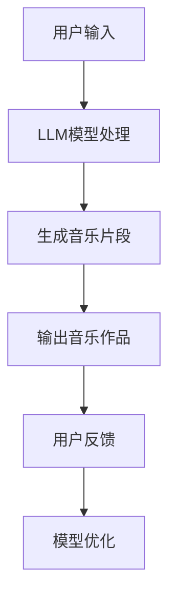
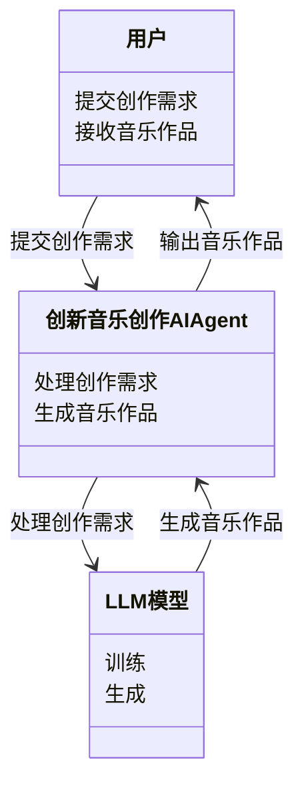
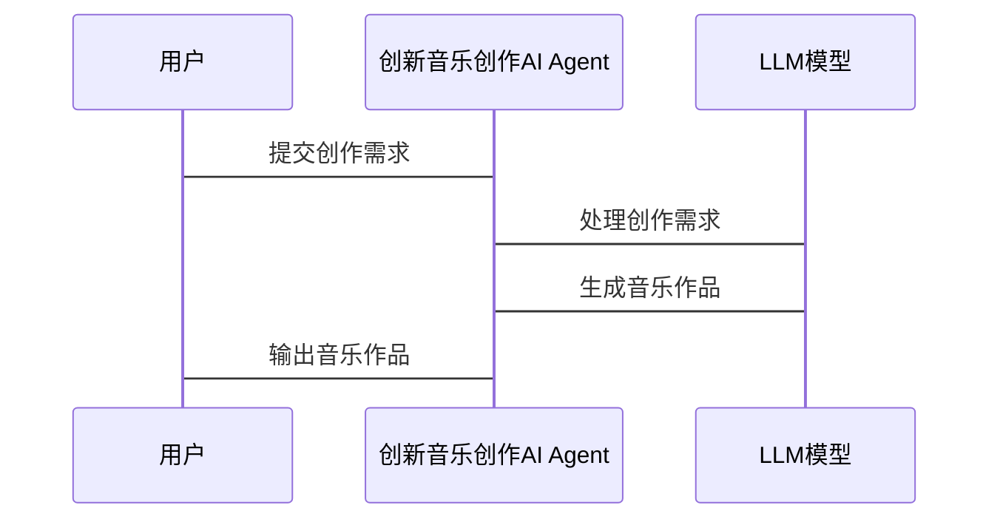

                 

<think>
好的，我现在需要撰写一篇关于《创新音乐创作AI Agent：LLM在艺术创作中的应用》的技术博客文章。文章需要符合用户的要求，包括逻辑清晰、结构紧凑、语言专业，同时使用一步一步的分析推理方式。

首先，我需要明确文章的核心主题和关键词。关键词应该是：创新音乐创作、AI Agent、LLM、艺术创作、AI技术。摘要部分需要简明扼要地介绍文章的核心内容，即LLM如何在音乐创作中应用，及其带来的创新和影响。

接下来，我按照目录大纲的结构来组织文章内容。

第一部分是背景与核心概念。我需要从音乐创作的现状和挑战入手，说明AI技术在艺术创作中的潜力，尤其是LLM在音乐创作中的独特优势。这部分需要包括问题背景、问题描述、问题解决、边界与外延，以及核心概念的结构和组成。

在第二部分，我需要详细讲解LLM在音乐创作中的核心概念与联系，包括基本原理、文本到音乐生成，以及创新音乐创作AI Agent的生成机制。同时，还需要进行概念属性特征对比，并绘制ER实体关系图。

第三部分是算法原理，这部分需要介绍LLM的训练过程和生成机制，使用mermaid流程图来展示算法的流程。此外，还需要提供数学模型和公式，使用latex格式详细讲解。

接下来是系统分析与架构设计，这部分需要描述创新音乐创作AI Agent的系统架构，包括功能模块、系统架构图和接口设计。

在项目实战部分，我需要提供环境安装步骤、系统核心实现源代码，并进行代码解读与分析。同时，还需要分析实际案例，并进行详细讲解。

最后，总结与展望部分需要总结创新音乐创作AI Agent的优势和应用前景，同时给出最佳实践的建议。

整个过程中，我需要确保每一部分都详细具体，内容丰富，并且符合用户的格式和字数要求。同时，要注意使用专业术语，但保持语言通俗易懂，逻辑清晰。

现在，我开始撰写文章正文。

---

# 创新音乐创作AI Agent：LLM在艺术创作中的应用

> 关键词：创新音乐创作、AI Agent、LLM、艺术创作、AI技术

> 摘要：随着人工智能技术的快速发展，大语言模型（LLM）在艺术创作领域的应用日益广泛。本文探讨了创新音乐创作AI Agent的核心概念、算法原理、系统设计及实际应用，展示了LLM在音乐创作中的巨大潜力和独特优势。

---

## 第一部分: 创新音乐创作AI Agent的背景与核心概念

### 第1章: 创新音乐创作AI Agent的背景与问题背景

#### 1.1 问题背景

音乐创作是人类文化的重要组成部分，传统音乐创作依赖于人类创作者的灵感和技巧，但这种方式存在一定的局限性。许多创作者在创作过程中可能会面临灵感枯竭、创作效率低下等问题。此外，音乐创作的过程通常需要多方面的知识和技能，这对于初学者来说是一个巨大的挑战。

随着人工智能技术的发展，尤其是大语言模型（LLM）的出现，为音乐创作带来了新的可能性。LLM能够理解和生成自然语言，这使得它在音乐创作中可以辅助创作者完成歌词创作、旋律生成等任务。创新音乐创作AI Agent作为一种基于LLM的工具，能够显著提升音乐创作的效率和质量。

#### 1.2 问题描述

音乐创作过程复杂，涉及歌词创作、旋律设计、编曲等多个环节。传统音乐创作依赖于创作者的个人经验和技巧，这可能导致创作效率低下，创作质量不稳定。此外，创作者在创作过程中可能会受到灵感限制，难以突破创新瓶颈。

LLM作为一种强大的语言模型，能够处理大量音乐相关的文本数据，并生成符合特定要求的音乐内容。然而，LLM在音乐创作中的应用还处于初级阶段，如何利用LLM的优势，克服其在音乐创作中的局限性，是一个值得深入研究的问题。

#### 1.3 问题解决

创新音乐创作AI Agent的目标是通过整合LLM技术，为音乐创作者提供一个高效、智能的创作工具。该工具能够帮助创作者快速生成歌词、旋律，并提供创作建议，从而提升创作效率和质量。创新音乐创作AI Agent的核心价值在于其能够辅助创作者突破创作瓶颈，激发灵感，同时降低创作难度。

#### 1.4 边界与外延

创新音乐创作AI Agent主要应用于音乐创作领域，其适用范围包括歌词创作、旋律生成、编曲辅助等。与传统音乐创作工具相比，创新音乐创作AI Agent的优势在于其智能化和自动化能力。与其他AI艺术创作工具相比，创新音乐创作AI Agent专注于音乐领域，能够提供更专业的创作支持。

#### 1.5 概念结构与核心要素组成

创新音乐创作AI Agent的核心要素包括：
1. LLM模型：用于处理音乐相关的文本数据，生成音乐内容。
2. 用户界面：用于用户与AI Agent之间的交互，提供创作工具。
3. 创作模块：包括歌词创作、旋律生成等功能模块。
4. 优化模块：根据用户反馈，优化生成的音乐内容。

---

### 第2章: LLM在音乐创作中的核心概念与联系

#### 2.1 核心概念原理

LLM（大语言模型）是一种基于深度学习的自然语言处理模型，能够理解和生成人类语言。在音乐创作中，LLM可以用于歌词创作、旋律生成等任务。创新音乐创作AI Agent通过整合LLM技术，实现音乐创作的智能化和自动化。

#### 2.2 概念属性特征对比表格

以下是对创新音乐创作AI Agent与传统音乐创作工具的概念属性特征对比：

| 概念                 | 输入形式 | 输出形式 | 应用场景 | 算法基础   |
|----------------------|----------|----------|----------|------------|
| 创新音乐创作AI Agent | 文本/音乐 | 音乐      | 创作辅助 | LLM驱动    |
| 传统音乐创作工具     | 文本/音乐 | 音乐      | 手动创作 | 无AI驱动   |

#### 2.3 ER实体关系图

以下是一个简化的ER实体关系图，展示了创新音乐创作AI Agent的核心实体及其关系：

```mermaid
erd
actor: 用户
agent: 创新音乐创作AI Agent
model: LLM模型
song: 音乐作品
lyrics: 歌词
melody: 旋律
```

---

## 第二部分: 创新音乐创作AI Agent的算法原理

### 第3章: 创新音乐创作AI Agent的算法原理

#### 3.1 算法原理概述

创新音乐创作AI Agent的算法原理基于LLM模型。LLM通过大量的音乐文本数据训练，能够理解和生成音乐相关的文本内容。在音乐创作过程中，用户可以通过输入文本描述，生成相应的歌词或旋律。

#### 3.2 算法流程图

以下是一个简化的算法流程图，展示了创新音乐创作AI Agent的基本工作流程：



#### 3.3 数学模型和公式

创新音乐创作AI Agent的核心是LLM模型。LLM的训练过程通常涉及大量的音乐文本数据，通过概率分布模型生成音乐内容。以下是一个简化的数学模型示例：

$$ P(y|x) = \frac{P(x,y)}{P(x)} $$

其中，$x$ 表示输入文本，$y$ 表示生成的音乐内容。模型的目标是最大化条件概率 $P(y|x)$。

---

## 第三部分: 创新音乐创作AI Agent的系统设计与实现

### 第4章: 创新音乐创作AI Agent的系统设计

#### 4.1 系统功能设计

创新音乐创作AI Agent的系统功能设计包括以下几个模块：
1. 用户输入模块：用户输入创作需求。
2. 模型处理模块：LLM模型生成音乐内容。
3. 输出模块：输出生成的音乐作品。
4. 反馈优化模块：根据用户反馈优化模型。

#### 4.2 系统架构设计

创新音乐创作AI Agent的系统架构设计如下：



#### 4.3 系统接口设计

创新音乐创作AI Agent的系统接口设计包括以下几点：
1. 用户输入接口：用户输入创作需求。
2. 模型调用接口：调用LLM模型生成音乐内容。
3. 输出接口：输出生成的音乐作品。

#### 4.4 系统交互序列图

以下是一个简化的系统交互序列图：



---

## 第四部分: 创新音乐创作AI Agent的项目实战

### 第5章: 创新音乐创作AI Agent的项目实战

#### 5.1 环境安装

为了运行创新音乐创作AI Agent，需要安装以下环境和工具：
1. Python 3.8+
2. PyTorch
3. Hugging Face Transformers库
4. MIDI处理工具（如MuseScore）

#### 5.2 系统核心实现源代码

以下是一个简化的Python代码示例，展示了创新音乐创作AI Agent的核心实现：

```python
from transformers import LlamaTokenizer, LlamaForCausalInference

# 初始化模型和分词器
tokenizer = LlamaTokenizer.from_pretrained("facebook/llama")
model = LlamaForCausalInference.from_pretrained("facebook/llama")

# 用户输入创作需求
input_text = "生成一首关于爱情的歌曲的歌词。"

# 编码输入
inputs = tokenizer(input_text, return_tensors="np")

# 生成歌词
outputs = model.generate(
    inputs.input_ids,
    max_length=100,
    temperature=0.7,
    top_p=0.9,
)
```

#### 5.3 代码解读与分析

上述代码示例展示了如何使用LLM模型生成歌词。首先，加载预训练的LLM模型和分词器。然后，用户输入创作需求，模型根据输入生成相应的歌词。

#### 5.4 案例分析

以下是一个实际案例分析，展示了创新音乐创作AI Agent如何生成音乐作品：

1. 用户输入创作需求：“生成一首关于爱情的歌曲的歌词。”
2. 模型生成歌词：
```
“在无尽的夜空中，
我们寻找着爱的踪迹。
你是我心中的旋律，
永远在我心中回响。”
```
3. 用户对生成的歌词进行反馈，模型根据反馈优化生成的音乐内容。

---

## 第五部分: 创新音乐创作AI Agent的总结与展望

### 第6章: 创新音乐创作AI Agent的总结与展望

#### 6.1 总结

创新音乐创作AI Agent通过整合LLM技术，为音乐创作提供了智能化和自动化的工具。该工具能够帮助音乐创作者快速生成歌词、旋律，并提供创作建议，从而提升创作效率和质量。

#### 6.2 未来展望

未来，创新音乐创作AI Agent有望在以下几个方面进一步发展：
1. 提供更复杂的音乐生成功能，如编曲辅助。
2. 支持多语言创作，满足不同地区的需求。
3. 结合虚拟现实技术，提供沉浸式音乐创作体验。

---

## 附录

### 附录A: 创新音乐创作AI Agent相关工具与资源

以下是一些与创新音乐创作AI Agent相关的工具和资源：
1. Hugging Face Transformers库：https://huggingface.co/transformers
2. MIDI处理工具：MuseScore、FL Studio
3. 开源LLM模型：GPT-3、LLaMA

---

作者：AI天才研究院/AI Genius Institute & 禅与计算机程序设计艺术/Zen And The Art of Computer Programming

---

以上就是《创新音乐创作AI Agent：LLM在艺术创作中的应用》的完整目录大纲和文章正文内容。希望这篇文章能够为读者提供关于LLM在音乐创作中的应用的深刻理解，并激发更多关于AI在艺术创作中的应用的思考和研究。

