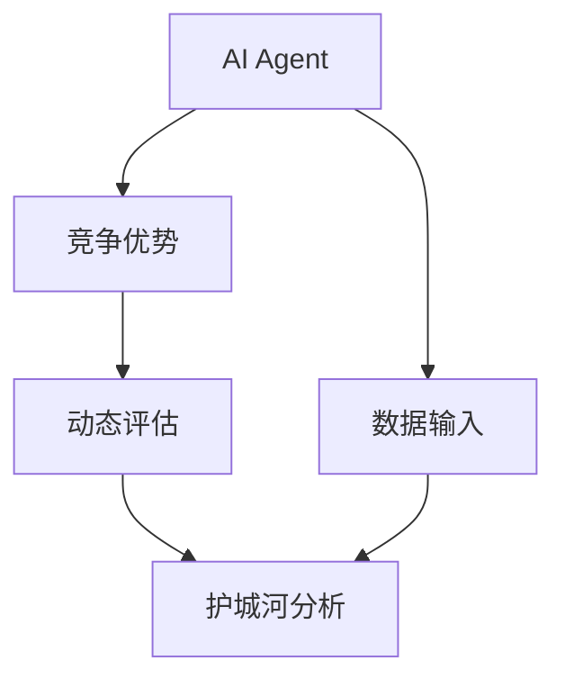
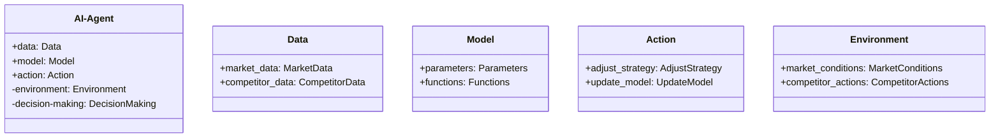
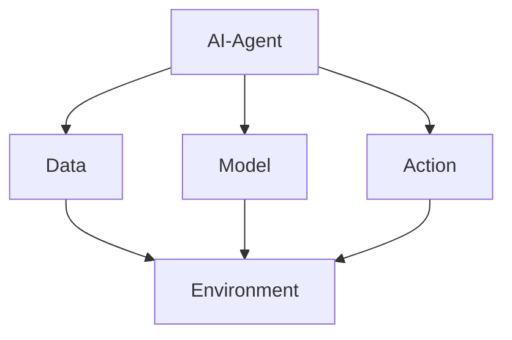
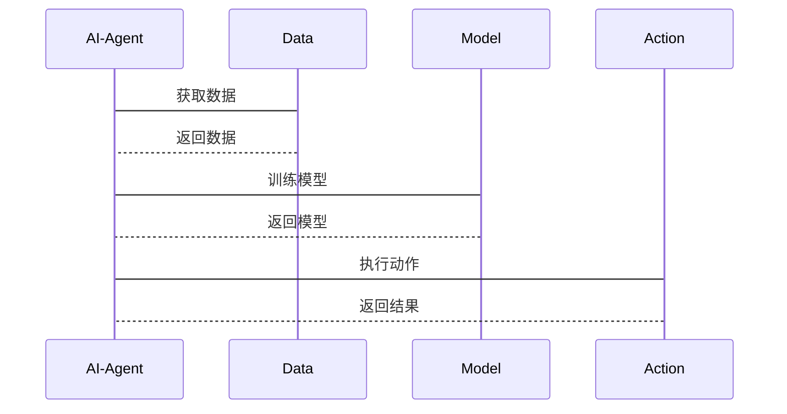

                 


# 利用AI agents构建动态竞争优势评估模型：护城河分析

## 关键词：AI agents，竞争优势评估，动态竞争环境，护城河分析，企业战略

## 摘要：本文将探讨如何利用AI代理构建动态竞争优势评估模型，并重点分析护城河在企业战略中的关键作用。通过结合AI代理的智能决策能力，我们能够实时评估企业的竞争优势，并动态调整策略以应对不断变化的市场环境。护城河分析作为模型的核心部分，将帮助企业识别和强化其独特的竞争优势，从而在激烈的市场竞争中建立稳固的护城河。

---

# 第1章：背景介绍

## 1.1 问题背景

### 1.1.1 企业竞争优势的核心要素
企业的竞争优势来源于多个方面，包括技术、资源、品牌、成本优势等。然而，在动态竞争环境中，这些优势可能会迅速变化，企业需要能够实时捕捉和评估这些变化。

### 1.1.2 动态竞争环境的挑战
现代市场竞争日益激烈，技术进步和消费者需求的变化使得竞争优势难以持久。企业需要一种动态的评估方法来实时监控和调整其竞争优势。

### 1.1.3 AI agents在竞争优势评估中的作用
AI代理（AI agents）是一种能够感知环境、自主决策的智能体。通过AI代理，企业可以实时收集和分析市场数据，快速评估竞争优势，并制定相应的策略。

## 1.2 问题描述

### 1.2.1 传统竞争优势评估的局限性
传统的竞争优势评估方法通常是静态的，难以应对快速变化的市场环境。此外，传统方法依赖于人工分析，效率低下且容易受到主观因素的影响。

### 1.2.2 动态竞争环境下的评估需求
在动态竞争环境中，企业需要一种动态的、实时的评估方法，能够快速响应市场变化并调整战略。

### 1.2.3 AI agents在动态评估中的优势
AI代理能够实时收集和分析数据，具备快速决策的能力，能够满足动态竞争环境下的评估需求。

## 1.3 问题解决

### 1.3.1 AI agents的核心能力
AI代理的核心能力包括感知、推理、决策和行动。这些能力使得AI代理能够实时监控市场环境并做出相应的决策。

### 1.3.2 动态竞争优势模型的构建
动态竞争优势模型是一种能够实时评估企业竞争优势的模型，通过AI代理的应用，模型能够动态调整评估结果。

### 1.3.3 护城河分析的AI化路径
护城河分析是评估企业竞争优势的重要方法。通过AI代理，护城河分析可以实现自动化和动态化，帮助企业快速识别和强化其竞争优势。

## 1.4 边界与外延

### 1.4.1 AI agents的适用范围
AI代理适用于需要实时决策和动态调整的场景，如金融市场、电子商务等领域。

### 1.4.2 动态竞争优势模型的边界
动态竞争优势模型的边界包括实时数据的收集和分析、模型的动态调整等。

### 1.4.3 护城河分析的扩展应用
护城河分析的扩展应用包括行业分析、竞争对手分析、市场趋势预测等。

## 1.5 概念结构与核心要素

### 1.5.1 AI agents的构成要素
AI代理的构成要素包括感知模块、推理模块、决策模块和行动模块。

### 1.5.2 动态竞争优势模型的要素
动态竞争优势模型的要素包括实时数据、模型参数、评估指标等。

### 1.5.3 护城河分析的关键维度
护城河分析的关键维度包括技术优势、资源优势、品牌优势等。

---

# 第2章：核心概念与联系

## 2.1 AI agents的核心原理

### 2.1.1 AI agents的基本定义
AI代理是一种能够感知环境、自主决策的智能体。

### 2.1.2 AI agents的分类与特点
AI代理可以分为简单反射代理和基于模型的代理。简单反射代理基于当前感知做出决策，而基于模型的代理则基于对环境的理解做出决策。

### 2.1.3 AI agents的决策机制
AI代理的决策机制包括感知、推理、决策和行动四个步骤。

## 2.2 动态竞争优势模型的构建

### 2.2.1 模型的基本框架
动态竞争优势模型的基本框架包括数据收集、数据处理、模型评估和结果输出四个部分。

### 2.2.2 模型的动态更新机制
模型的动态更新机制包括实时数据的收集和处理、模型参数的调整等。

### 2.2.3 模型的评估指标
模型的评估指标包括准确率、响应时间、稳定性等。

## 2.3 护城河分析的AI化路径

### 2.3.1 护城河分析的传统方法
传统的护城河分析方法依赖于人工分析，效率低下且容易受到主观因素的影响。

### 2.3.2 AI代理在护城河分析中的应用
通过AI代理的应用，护城河分析可以实现自动化和动态化，帮助企业快速识别和强化其竞争优势。

### 2.3.3 AI驱动的护城河评估模型
AI驱动的护城河评估模型是一种能够实时评估企业竞争优势的模型，通过AI代理的应用，模型能够动态调整评估结果。

## 2.4 核心概念对比分析

### 2.4.1 AI代理与传统算法的对比
AI代理能够实时感知和决策，而传统算法依赖于预设的规则。

### 2.4.2 动态竞争优势模型与静态模型的对比
动态竞争优势模型能够实时调整评估结果，而静态模型无法应对快速变化的市场环境。

### 2.4.3 护城河分析的AI化与非AI化的对比
护城河分析的AI化能够实现自动化和动态化，而非AI化的方法效率低下且容易受到主观因素的影响。

## 2.5 ER实体关系图



---

# 第3章：算法原理讲解

## 3.1 AI代理的算法原理

### 3.1.1 强化学习算法
强化学习是一种通过试错方式学习最优策略的算法。AI代理通过与环境交互，学习最优决策策略。

### 3.1.2 自然语言处理算法
自然语言处理是一种处理人类语言的算法。AI代理可以通过自然语言处理技术理解市场报告、消费者评论等文本信息。

### 3.1.3 多智能体协作算法
多智能体协作算法是一种通过多个智能体协作完成任务的算法。AI代理可以通过协作提高决策的准确性和效率。

## 3.2 动态竞争优势模型的算法

### 3.2.1 数据收集与预处理
AI代理通过收集市场数据并进行预处理，为模型提供输入。

### 3.2.2 模型训练与评估
通过训练模型，AI代理能够学习到竞争优势的评估方法，并通过评估指标优化模型性能。

### 3.2.3 动态调整与预测
模型通过动态调整参数，实时预测企业的竞争优势变化。

---

# 第4章：系统分析与架构设计

## 4.1 问题场景介绍

### 4.1.1 企业竞争优势评估的场景
企业需要实时评估其竞争优势，以便及时调整战略。

### 4.1.2 市场动态变化的场景
市场环境不断变化，企业需要动态调整其竞争优势。

## 4.2 系统功能设计

### 4.2.1 数据采集模块
数据采集模块负责收集市场数据，包括竞争对手信息、消费者行为数据等。

### 4.2.2 数据处理模块
数据处理模块对收集到的数据进行清洗、转换和分析，为模型提供输入。

### 4.2.3 模型评估模块
模型评估模块负责评估企业的竞争优势，并动态调整模型参数。

### 4.2.4 结果输出模块
结果输出模块将评估结果输出，供企业决策者参考。

## 4.3 系统架构设计

### 4.3.1 领域模型类图



### 4.3.2 系统架构图



### 4.3.3 系统接口设计
系统接口设计包括数据接口、模型接口和结果输出接口。

### 4.3.4 系统交互流程图



---

# 第5章：项目实战

## 5.1 环境安装

### 5.1.1 Python安装
安装Python 3.8或更高版本。

### 5.1.2 安装依赖库
安装必要的依赖库，如numpy、pandas、scikit-learn等。

## 5.2 核心代码实现

### 5.2.1 数据采集模块

```python
import requests

def get_market_data():
    # 示例：从API获取市场数据
    response = requests.get('https://api.example.com/market-data')
    return response.json()
```

### 5.2.2 数据处理模块

```python
import pandas as pd

def process_data(data):
    df = pd.DataFrame(data)
    # 数据清洗和转换
    df['date'] = pd.to_datetime(df['date'])
    return df
```

### 5.2.3 模型训练模块

```python
from sklearn.tree import DecisionTreeClassifier

def train_model(data):
    # 示例：训练决策树模型
    X = data.drop('label', axis=1)
    y = data['label']
    model = DecisionTreeClassifier().fit(X, y)
    return model
```

### 5.2.4 动态调整模块

```python
def adjust_strategy(model, data):
    # 示例：根据模型预测结果调整策略
    predictions = model.predict(data)
    # 根据预测结果调整策略
    return predictions
```

## 5.3 代码应用解读与分析

### 5.3.1 数据采集模块
数据采集模块通过API获取市场数据，为模型提供输入。

### 5.3.2 数据处理模块
数据处理模块对获取的数据进行清洗和转换，为模型训练提供干净的数据。

### 5.3.3 模型训练模块
模型训练模块使用决策树算法训练模型，评估企业的竞争优势。

### 5.3.4 动态调整模块
动态调整模块根据模型预测结果，调整企业的战略。

## 5.4 实际案例分析与详细讲解

### 5.4.1 案例背景
某企业需要实时评估其在市场中的竞争优势。

### 5.4.2 数据采集与处理
通过API获取市场数据，并进行清洗和转换。

### 5.4.3 模型训练与评估
训练决策树模型，评估企业的竞争优势。

### 5.4.4 动态调整与优化
根据模型预测结果，调整企业的战略。

## 5.5 项目小结

### 5.5.1 项目成果
通过AI代理构建动态竞争优势评估模型，帮助企业实时评估竞争优势。

### 5.5.2 经验总结
AI代理的应用能够显著提高竞争优势评估的效率和准确性。

---

# 第6章：最佳实践

## 6.1 小结

### 6.1.1 核心知识点回顾
本文介绍了AI代理在竞争优势评估中的应用，详细讲解了动态竞争优势模型的构建和护城河分析的AI化路径。

### 6.1.2 关键技术总结
关键技术和包括AI代理、动态竞争优势模型、护城河分析等。

## 6.2 注意事项

### 6.2.1 数据质量的重要性
数据质量直接影响模型的准确性，需要确保数据的完整性和准确性。

### 6.2.2 模型的动态调整
模型需要定期动态调整，以应对市场环境的变化。

### 6.2.3 安全与隐私
在处理市场数据时，需要注意数据的安全与隐私保护。

## 6.3 拓展阅读

### 6.3.1 AI代理的其他应用
AI代理在金融、医疗、教育等领域的应用。

### 6.3.2 动态竞争优势模型的优化
动态竞争优势模型的优化方法，如引入机器学习、深度学习等技术。

### 6.3.3 护城河分析的深入研究
护城河分析的深入研究，包括护城河的构建与维护策略等。

---

# 作者：AI天才研究院/AI Genius Institute & 禅与计算机程序设计艺术 /Zen And The Art of Computer Programming

