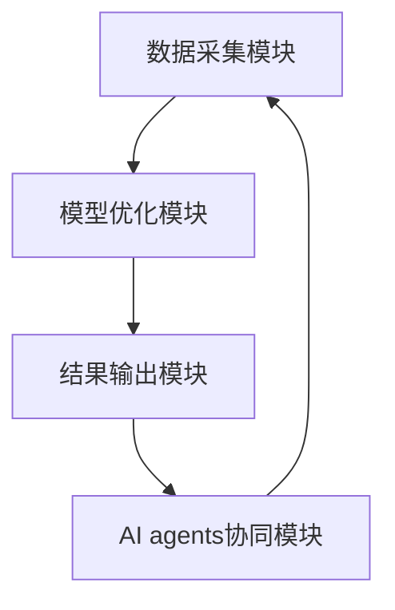

                 


# 利用AI agents构建自适应型估值模型：应对市场变化

> **关键词**：AI agents, 自适应估值模型, 金融市场, 市场变化, 估值模型, 动态调整  
> **摘要**：本文探讨如何利用AI agents构建自适应型估值模型，以应对金融市场中的复杂变化。通过分析AI agents的核心原理、算法设计和系统架构，结合实际案例，详细讲解如何构建动态调整的估值模型，提升企业应对市场波动的能力。

---

## 引言

在现代金融市场中，变化是常态。经济波动、政策调整、突发事件等都可能在短时间内影响企业估值。传统的静态估值模型往往难以捕捉这些动态变化，导致估值结果滞后或失效。为了应对这一挑战，利用AI agents构建自适应型估值模型成为一种创新解决方案。本文将从背景、原理、算法、系统架构等多方面展开探讨，为读者提供一套应对市场变化的估值模型构建方法。

---

## 第1章: 背景介绍与问题分析

### 1.1 问题背景

企业的估值模型是其财务管理的核心工具之一，传统的估值模型（如DCF模型、PE模型）通常基于历史数据和静态假设，难以应对市场的动态变化。例如，当市场环境突变（如经济危机、行业政策调整）时，传统模型无法快速调整，导致估值结果偏离实际价值。

此外，金融市场中的数据复杂性也在不断增加。企业需要考虑的因素包括市场波动、竞争环境、政策变化、技术革新等。这些因素相互作用，使得传统的线性模型难以准确反映企业的实际价值。

### 1.2 自适应估值模型的定义与目标

自适应估值模型是一种能够根据市场变化动态调整参数和假设的模型。其核心目标是通过实时数据输入和动态优化算法，快速调整估值结果，以反映市场的最新变化。与传统模型相比，自适应模型具有更高的灵活性和实时性。

### 1.3 问题解决

AI agents的引入为自适应估值模型的构建提供了新的思路。通过设计多个AI agents协同工作，可以实现对市场数据的实时监控、动态分析和快速响应。每个agent负责特定的任务（如数据采集、模型优化、结果输出），并通过通信机制实现协同合作。

---

## 第2章: AI agents与自适应估值模型的核心概念

### 2.1 AI agents的基本原理

AI agents是指具有感知环境、自主决策和执行任务能力的智能体。在自适应估值模型中，AI agents可以分为数据采集agent、模型优化agent和结果输出agent。每个agent负责不同的功能模块，并通过通信机制协同工作。

### 2.2 自适应估值模型的构建要素

自适应估值模型的构建需要考虑以下几个关键要素：

1. **实时数据输入**：模型需要实时获取市场数据（如股价、行业指数、政策变化等）。
2. **动态调整参数**：根据市场变化，自动调整模型的参数和假设。
3. **多因素分析**：考虑多个影响估值的因素，并建立它们之间的关联关系。
4. **快速迭代优化**：通过AI agents的协作，实现模型的快速迭代和优化。

### 2.3 AI agents与自适应估值模型的关系

通过将AI agents与自适应估值模型结合，可以实现以下目标：

1. **实时监控市场变化**：AI agents可以实时采集市场数据，并将其输入到估值模型中。
2. **动态调整模型参数**：通过AI agents的分析，模型可以根据市场变化自动调整参数。
3. **快速响应市场变化**：当市场环境发生变化时，AI agents可以迅速调整模型，提供最新的估值结果。

---

## 第3章: 自适应估值模型的算法设计

### 3.1 基于AI agents的动态优化算法

在自适应估值模型中，AI agents负责动态优化模型的参数和结构。具体步骤如下：

1. **数据采集**：AI agents实时采集市场数据，并将其传递给模型。
2. **模型优化**：基于当前数据，AI agents通过优化算法（如遗传算法、粒子群优化）调整模型的参数。
3. **结果输出**：优化后的模型生成最新的估值结果，并通过agent传递给用户。

### 3.2 基于强化学习的动态调整机制

为了进一步提升模型的自适应能力，可以引入强化学习算法。AI agents通过与市场的交互，不断学习和优化模型的决策策略。具体步骤如下：

1. **状态定义**：定义市场的当前状态（如市场指数、行业趋势等）。
2. **动作选择**：AI agents根据当前状态选择最优的模型调整动作。
3. **奖励机制**：根据调整结果的好坏，给予奖励或惩罚，以优化agent的决策策略。

### 3.3 算法实现与优化

为了实现高效的动态优化，可以采用以下优化措施：

1. **分布式计算**：将模型的优化任务分配给多个AI agents，提高计算效率。
2. **实时反馈机制**：通过实时反馈，快速调整模型参数，减少优化时间。
3. **自适应学习率**：根据市场变化的剧烈程度，动态调整学习率，提升优化效果。

---

## 第4章: 系统架构设计与实现

### 4.1 系统架构概述

自适应估值模型的系统架构可以分为以下几个部分：

1. **数据采集模块**：负责实时采集市场数据。
2. **模型优化模块**：负责动态优化模型的参数和结构。
3. **结果输出模块**：负责生成和展示估值结果。
4. **AI agents协同模块**：负责各模块之间的通信与协作。

### 4.2 系统功能设计

#### 4.2.1 数据采集功能
- 实时采集市场数据，包括股价、行业指数、政策变化等。
- 数据预处理，包括清洗、标准化和特征提取。

#### 4.2.2 模型优化功能
- 根据实时数据，动态调整模型的参数和假设。
- 使用强化学习算法优化模型的决策策略。

#### 4.2.3 结果输出功能
- 生成最新的估值结果，并以可视化形式展示。
- 提供详细的分析报告，帮助用户理解结果。

### 4.3 系统架构图



### 4.4 实际应用案例

以某科技公司为例，假设其股价受到行业政策和技术进步的影响较大。通过自适应估值模型，可以实时跟踪政策变化和技术创新对公司估值的影响，并动态调整模型参数，生成最新的估值结果。

---

## 第5章: 项目实战与代码实现

### 5.1 环境安装与配置

为了实现自适应估值模型，需要安装以下工具和库：

- Python 3.8+
- NumPy, Pandas, Scikit-learn
- Deep Learning框架（如TensorFlow或Keras）
- AI agents框架（如强化学习库）

### 5.2 核心代码实现

#### 5.2.1 数据采集模块

```python
import requests
import pandas as pd

def get_market_data(api_key):
    url = f"https://api.marketdata.com/stock_data?api_key={api_key}"
    response = requests.get(url)
    data = response.json()
    df = pd.DataFrame(data)
    return df
```

#### 5.2.2 模型优化模块

```python
import numpy as np
from sklearn import linear_model

def optimize_model(data):
    X = data[['price', 'volume', 'industry_index']]
    y = data['valuation']
    model = linear_model.LinearRegression()
    model.fit(X, y)
    return model
```

#### 5.2.3 结果输出模块

```python
def display_results(model, new_data):
    prediction = model.predict(new_data[['price', 'volume', 'industry_index']])
    print(f"预测估值：{prediction[0][0]}")
```

### 5.3 代码解读与优化建议

1. **数据采集模块**：通过API获取市场数据，并使用Pandas进行数据清洗和预处理。
2. **模型优化模块**：使用线性回归模型进行优化，可以根据需求更换为其他模型（如随机森林、神经网络）。
3. **结果输出模块**：根据优化后的模型，生成预测估值，并以可视化形式展示。

---

## 第6章: 最佳实践与未来展望

### 6.1 最佳实践

1. **数据质量**：确保数据的准确性和完整性，避免因数据问题导致模型失效。
2. **模型选择**：根据具体场景选择合适的模型，避免盲目追求复杂性。
3. **实时性优化**：通过分布式计算和并行处理，提高系统的实时性。
4. **可解释性**：确保模型的可解释性，便于用户理解和调整。

### 6.2 未来展望

随着AI技术的不断发展，自适应估值模型将更加智能化和自动化。未来的优化方向包括：

1. **强化学习的深度应用**：通过强化学习进一步提升模型的自适应能力。
2. **多agent协作优化**：设计更复杂的agent协作机制，提升模型的协同优化效果。
3. **边缘计算的应用**：通过边缘计算实现模型的实时优化和快速响应。

---

## 结语

利用AI agents构建自适应型估值模型，是应对金融市场变化的有效手段。通过动态调整模型参数和优化算法，可以实现对市场变化的快速响应，提升企业的估值准确性。未来，随着AI技术的进一步发展，自适应估值模型将在更多领域发挥重要作用。

---

**作者：AI天才研究院/AI Genius Institute & 禅与计算机程序设计艺术 /Zen And The Art of Computer Programming**

