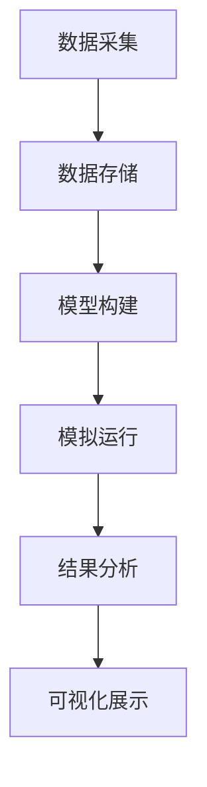

                 


# 利用AI agents进行全球宏观经济情景模拟：增强风险管理

**关键词**：AI代理、宏观经济模拟、风险管理、系统设计、数学建模、全球模型

**摘要**：  
随着全球化的深入和经济复杂性的增加，传统的宏观经济分析方法逐渐暴露出其局限性。本文提出利用AI代理（Artificial Intelligence Agents）进行全球宏观经济情景模拟，通过构建智能代理模型，模拟经济主体的决策行为，从而更准确地预测和应对宏观经济风险。本文将从AI代理的基本概念、宏观经济模拟的理论基础、AI代理在宏观经济模拟中的应用、系统架构设计、项目实战以及未来展望等方面进行详细阐述，为读者提供一个全面的视角，展示如何利用AI技术提升宏观经济风险管理的效率和准确性。

---

## 第一部分：AI代理概述

### 第1章：AI代理的基本概念

#### 1.1 代理的定义与特点
- **代理的定义**：代理（Agent）是一个能够感知环境并采取行动以实现目标的实体。  
- **代理的特点**：
  - **自主性**：能够在没有外部干预的情况下自主决策。
  - **反应性**：能够根据环境的变化调整行为。
  - **社会性**：能够与其他代理或人类进行交互和协作。
  - **学习性**：能够通过经验改进自身的决策能力。

#### 1.2 AI代理的核心要素
- **智能体结构**：包括感知、决策、行动三个核心模块。
- **决策机制**：基于环境信息和目标函数，选择最优行动策略。
- **学习算法**：通过强化学习、监督学习等方法不断优化决策模型。

#### 1.3 AI代理与传统AI的区别
| 特性 | 传统AI | AI代理 |
|------|--------|--------|
| 行为方式 | 基于规则或预设程序 | 具有自主性和反应性 |
| 应用场景 | 任务处理（如图像识别） | 实时决策与交互（如自动驾驶） |
| 复杂性 | 非实时、静态 | 实时、动态 |

---

### 第2章：宏观经济模拟的基础

#### 2.1 宏观经济的基本概念
- **GDP**：国内生产总值，衡量一个国家或地区的经济规模。
- **通货膨胀率**：物价总水平的变化率。
- **失业率**：劳动力市场中失业人口占总劳动力的比例。

#### 2.2 宏观经济模拟的基本概念
- **宏观经济模型**：通过数学公式描述经济系统中各变量之间的关系。
- **情景模拟**：基于不同的假设条件，预测经济变量的变化趋势。

#### 2.3 数据收集与处理
- **数据来源**：政府统计、金融市场数据、学术研究等。
- **数据预处理**：清洗、归一化、特征提取等。

---

## 第二部分：AI代理在宏观经济模拟中的应用

### 第3章：AI代理驱动的宏观经济模型

#### 3.1 宏观经济模型的构建
- **模型框架**：将宏观经济变量（如GDP、通货膨胀率）作为输入，模拟经济主体（如企业和消费者）的行为。
- **代理行为建模**：分析企业和消费者在不同经济环境下的决策过程。

#### 3.2 AI代理的决策机制
- **强化学习**：通过奖励机制训练代理在复杂环境中做出最优决策。
- **策略网络**：使用深度神经网络模拟代理的决策过程。

#### 3.3 宏观经济模拟的实现步骤
1. 确定模拟目标和范围。
2. 收集和整理相关经济数据。
3. 构建AI代理模型。
4. 设定模拟场景和参数。
5. 运行模拟并分析结果。

---

### 第4章：宏观经济模拟的系统架构设计

#### 4.1 系统功能模块
- **数据采集模块**：实时采集宏观经济数据。
- **模型构建模块**：设计和训练AI代理模型。
- **模拟运行模块**：运行模拟场景并输出结果。
- **结果分析模块**：对模拟结果进行可视化和分析。

#### 4.2 系统架构图


#### 4.3 系统接口设计
- **输入接口**：接收用户输入的模拟参数。
- **输出接口**：显示模拟结果和分析报告。

---

### 第5章：项目实战——构建全球宏观经济模拟系统

#### 5.1 环境安装与配置
- **编程语言**：Python 3.8+
- **框架与库**：TensorFlow、PyTorch、NumPy、Pandas、Matplotlib
- **安装命令**：
  ```bash
  pip install numpy pandas matplotlib tensorflow
  ```

#### 5.2 核心代码实现
- **AI代理模型代码**：
  ```python
  import numpy as np
  import tensorflow as tf

  class Agent:
      def __init__(self, input_dim):
          self.model = tf.keras.Sequential([
              tf.keras.layers.Dense(64, activation='relu', input_dim=input_dim),
              tf.keras.layers.Dense(1, activation='linear')
          ])
          self.model.compile(optimizer='adam', loss='mean_squared_error')

      def predict(self, state):
          return self.model.predict(np.array([state]))[0][0]

      def train(self, states, targets):
          self.model.fit(np.array(states), np.array(targets), epochs=100, verbose=0)
  ```

- **宏观经济模拟代码**：
  ```python
  import numpy as np

  def run_simulation(agent, num_agents, initial_conditions):
      states = [initial_conditions] * num_agents
      for _ in range(100):  # 模拟100个时间步
          actions = [agent.predict(state) for state in states]
          next_states = [state * (1 + action) for state, action in zip(states, actions)]
          states = next_states
      return states

  # 示例运行
  initial_conditions = 100
  num_agents = 10
  agent = Agent(input_dim=1)
  final_conditions = run_simulation(agent, num_agents, initial_conditions)
  ```

#### 5.3 案例分析与结果解读
- **模拟场景**：假设全球经济受到供应链中断的影响，模拟不同政策下的经济恢复情况。
- **结果可视化**：
  ```python
  import matplotlib.pyplot as plt

  plt.plot(range(100), final_conditions, label='Final Conditions')
  plt.xlabel('Time Step')
  plt.ylabel('Economic Condition')
  plt.legend()
  plt.show()
  ```

---

## 第三部分：总结与展望

### 第6章：总结与展望

#### 6.1 全文总结
- **AI代理的优势**：能够模拟复杂经济环境中的实时决策，提供更精准的经济预测。
- **系统设计的关键点**：模块化设计、数据处理、模型训练与优化。

#### 6.2 未来展望
- **技术发展**：结合更先进的AI算法（如图神经网络）提升模拟精度。
- **应用场景扩展**：从宏观经济扩展到行业经济、企业战略决策等领域。

#### 6.3 最佳实践Tips
- **数据质量**：确保数据的准确性和完整性。
- **模型调优**：根据实际效果不断优化模型参数。
- **结果验证**：通过历史数据验证模型的准确性。

---

**作者**：AI天才研究院（AI Genius Institute） & 禅与计算机程序设计艺术（Zen And The Art of Computer Programming）

