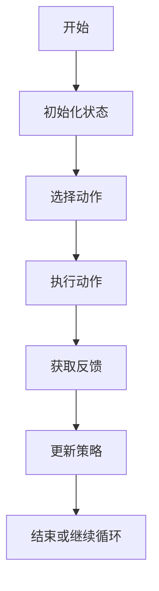
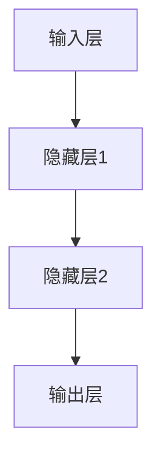
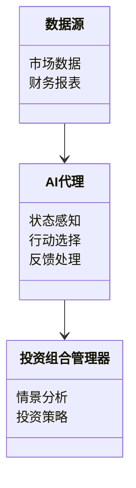
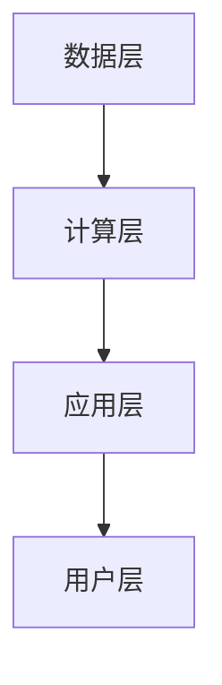
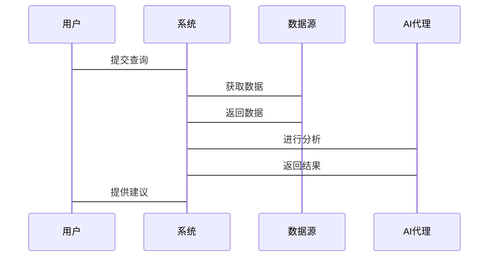

                 


# 利用AI agents进行情景分析：增强价值投资的适应性

## 关键词：
AI代理，情景分析，价值投资，投资适应性，金融建模

## 摘要：
本文探讨了如何利用AI代理进行情景分析，以增强价值投资的适应性。通过分析AI代理的核心原理、情景分析的数学模型以及系统架构设计，本文展示了AI代理如何在复杂金融环境中优化投资决策。结合实际案例和代码实现，本文详细阐述了AI代理在情景分析中的应用，为价值投资者提供了新的视角和工具。

---

## 第一部分: 背景介绍

### 第1章: AI代理与情景分析概述

#### 1.1 AI代理的基本概念
##### 1.1.1 代理的定义与特点
代理（Agent）是能够感知环境并采取行动以实现目标的实体。AI代理通过传感器接收数据，利用算法处理信息，并通过执行器采取行动。其特点包括自主性、反应性、目标导向和学习能力。

##### 1.1.2 AI代理的核心属性
- **智能性**：通过机器学习算法处理复杂数据，识别模式。
- **适应性**：根据环境变化调整行为。
- **交互性**：与人类或其他系统进行交互。

##### 1.1.3 AI代理的分类与应用场景
AI代理可分类为简单反射型、基于模型的反射型、目标驱动型和实用驱动型。在金融领域，AI代理常用于数据挖掘、预测分析和自动化交易。

#### 1.2 情景分析的定义与价值
##### 1.2.1 情景分析的基本概念
情景分析是一种评估不同假设条件下资产或投资组合表现的方法，常用于风险管理和投资决策。

##### 1.2.2 情景分析在投资中的作用
- 评估不同市场条件下的投资组合表现。
- 识别潜在风险和机会。
- 支持投资策略的制定和调整。

##### 1.2.3 情景分析的复杂性与挑战
- 数据的多样性和复杂性。
- 模型的准确性和适用性。
- 计算资源和时间的限制。

### 第2章: 价值投资的背景与挑战

#### 2.1 价值投资的核心理念
##### 2.1.1 价值投资的定义
价值投资是一种通过分析资产的内在价值，寻找市场价格低于内在价值的投资策略。

##### 2.1.2 价值投资的基本原则
- 长期视角。
- 安全边际。
- 市场先生理论。

##### 2.1.3 价值投资的局限性
- 市场波动的短期性。
- 数据获取的难度。
- 分析的复杂性。

#### 2.2 情景分析在价值投资中的应用
##### 2.2.1 情景分析的必要性
- 评估不同经济条件下的资产表现。
- 优化投资组合配置。
- 支持投资决策的动态调整。

##### 2.2.2 传统情景分析的局限性
- 依赖主观假设。
- 计算复杂性。
- 数据局限性。

##### 2.2.3 增强情景分析的适应性
- 利用AI代理提高分析效率和准确性。
- 实现实时动态调整。
- 扩展分析范围和深度。

### 第3章: AI代理与情景分析的结合

#### 3.1 AI代理在情景分析中的优势
##### 3.1.1 数据处理能力
AI代理能够处理大量非结构化数据，提取有用信息。

##### 3.1.2 模型构建能力
通过机器学习算法，AI代理可以构建高精度的预测模型。

##### 3.1.3 实时响应能力
AI代理能够实时处理数据，提供即时反馈。

#### 3.2 AI代理在价值投资中的应用场景
##### 3.2.1 数据挖掘与预测
利用AI代理从海量数据中提取潜在模式，预测市场趋势。

##### 3.2.2 风险评估与管理
通过情景分析，评估不同市场条件下的投资组合风险。

##### 3.2.3 投资策略优化
AI代理帮助投资者优化投资策略，提高收益和风险调整后的回报。

---

## 第二部分: 核心概念与联系

### 第4章: AI代理的核心原理

#### 4.1 代理的决策机制
##### 4.1.1 状态感知
AI代理通过传感器或API接口获取环境数据，如市场数据、经济指标等。

##### 4.1.2 行动选择
基于感知的状态，AI代理选择最优行动，如买入、卖出或持有。

##### 4.1.3 反馈处理
根据行动结果，AI代理调整策略，优化未来决策。

#### 4.2 AI代理的算法基础
##### 4.2.1 监督学习
用于分类和回归任务，如股票价格预测。

##### 4.2.2 强化学习
通过试错机制优化策略，如动态投资组合调整。

##### 4.2.3 无监督学习
用于聚类分析，如市场情绪分析。

### 第5章: 情景分析的数学模型

#### 5.1 情景分析的基本模型
##### 5.1.1 线性回归模型
用于预测资产回报与市场因子的关系。

$$ R_i = \beta_0 + \beta_1 R_m + \epsilon $$

##### 5.1.2 时间序列模型
如ARIMA模型，用于预测未来的价格走势。

##### 5.1.3 风险中性定价模型
用于评估风险调整后的资产价值。

#### 5.2 AI代理驱动的情景分析模型
##### 5.2.1 神经网络模型
通过深度学习算法捕捉复杂市场模式。

##### 5.2.2 预测模型
结合时间序列和神经网络，提供高精度预测。

##### 5.2.3 风险评估模型
利用蒙特卡洛模拟评估不同情景下的风险。

### 第6章: 核心概念的联系与对比

#### 6.1 AI代理与情景分析的关系
##### 6.1.1 AI代理作为情景分析的工具
AI代理通过高效的数据处理和模型构建，提升情景分析的效率和准确性。

##### 6.1.2 情景分析作为AI代理的目标
情景分析帮助AI代理生成多种可能的市场情景，优化投资决策。

##### 6.1.3 两者结合的优势
- 提高分析效率。
- 增强决策的科学性。
- 扩展分析的深度和广度。

---

## 第三部分: 算法原理讲解

### 第7章: 算法原理

#### 7.1 基于强化学习的AI代理算法
##### 7.1.1 算法流程


##### 7.1.2 数学模型
强化学习的目标是最优化奖励函数：

$$ J(\theta) = \mathbb{E}[R] $$

其中，$R$ 是奖励，$\theta$ 是参数。

#### 7.2 基于神经网络的情景分析模型
##### 7.2.1 网络结构


##### 7.2.2 损失函数
使用交叉熵损失：

$$ L = -\sum y \log(p) + (1 - y) \log(1 - p) $$

---

## 第四部分: 系统分析与架构设计

### 第8章: 系统架构设计

#### 8.1 问题场景介绍
系统需要实时处理市场数据，生成多种市场情景，并为投资者提供优化建议。

#### 8.2 系统功能设计
##### 8.2.1 领域模型


#### 8.3 系统架构设计
##### 8.3.1 分层架构


#### 8.4 系统接口设计
- 数据接口：接收市场数据和用户输入。
- API接口：提供情景分析结果和投资建议。

#### 8.5 系统交互
##### 8.5.1 交互流程


---

## 第五部分: 项目实战

### 第9章: 项目实战

#### 9.1 环境安装
- 安装Python和相关库（如NumPy、Pandas、TensorFlow）。

#### 9.2 系统核心实现
##### 9.2.1 代码实现
```python
import numpy as np
import pandas as pd
import tensorflow as tf

# 数据预处理
data = pd.read_csv('market_data.csv')
X = data.iloc[:, :-1].values
y = data.iloc[:, -1].values

# 模型构建
model = tf.keras.Sequential([
    tf.keras.layers.Dense(64, activation='relu'),
    tf.keras.layers.Dense(1, activation='linear')
])
model.compile(optimizer='adam', loss='mse')

# 训练模型
model.fit(X, y, epochs=100, batch_size=32)
```

##### 9.2.2 代码解读
- 数据预处理：将数据划分为特征和目标变量。
- 模型构建：构建一个简单的神经网络模型。
- 模型训练：使用均方误差作为损失函数，Adam优化器。

#### 9.3 实际案例分析
- 使用历史数据训练模型。
- 生成不同市场情景下的投资组合建议。

#### 9.4 项目小结
通过实际案例，展示了AI代理在情景分析中的应用，验证了其在价值投资中的优势。

---

## 第六部分: 最佳实践

### 第10章: 最佳实践

#### 10.1 小结
本文详细探讨了AI代理在情景分析中的应用，展示了其在价值投资中的巨大潜力。

#### 10.2 注意事项
- 数据质量：确保数据的准确性和完整性。
- 模型选择：根据具体需求选择合适的算法。
- 风险管理：定期监控和调整投资策略。

#### 10.3 拓展阅读
推荐阅读《机器学习实战》和《投资学基础》等书籍，深入理解AI与金融的结合。

---

## 结语

通过本文的探讨，我们可以看到，AI代理在情景分析中的应用为价值投资带来了新的可能性。未来，随着技术的不断发展，AI代理将在金融领域发挥更大的作用，帮助投资者做出更明智的决策。

---

## 作者：AI天才研究院/AI Genius Institute & 禅与计算机程序设计艺术 /Zen And The Art of Computer Programming

