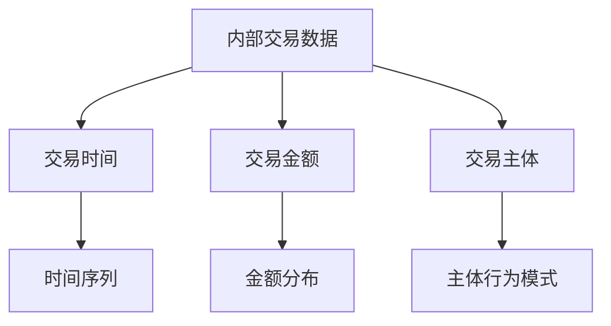
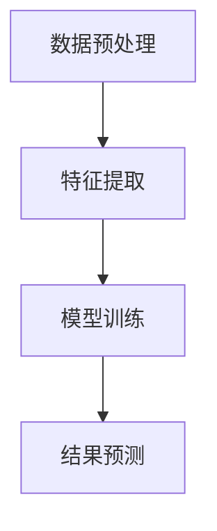
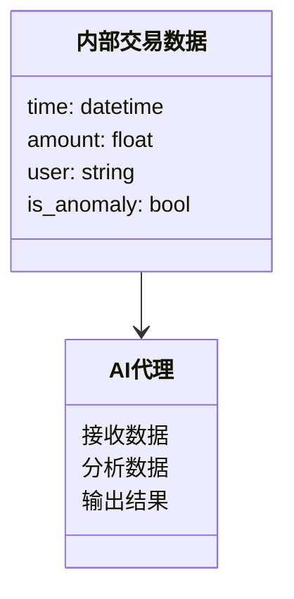
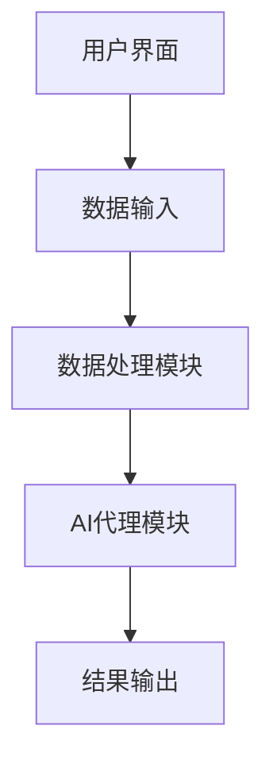
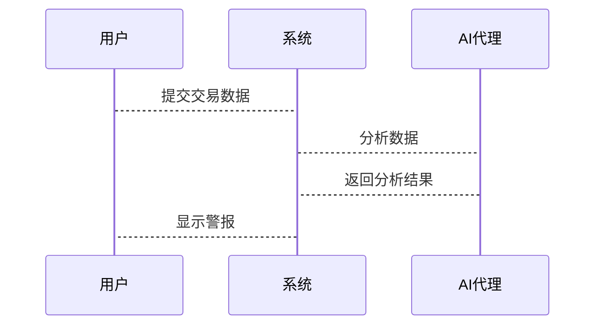

                 

<think>
好的，我需要为《利用AI agents追踪内部交易：洞察公司内部信心》这篇文章撰写目录大纲。根据用户的要求，我需要确保内容涵盖背景、核心概念、算法原理、系统架构设计、项目实战、最佳实践等多个方面。同时，每章需要有详细的子章节，包含必要的图表和代码示例。

首先，我需要明确文章的主题：利用AI代理（agents）来追踪公司内部交易，从而洞察内部信心。这意味着我需要解释什么是内部交易，为什么追踪它们重要，以及如何利用AI技术来实现这一目标。

接下来，我需要规划文章的结构。用户已经提供了一个示例大纲，我需要参考这个结构，同时确保内容覆盖所有必要的部分。以下是可能的章节安排：

1. **引言**
   - 简要介绍内部交易及其重要性
   - 介绍AI代理在金融分析中的作用
   - 提出文章的主要目标和结构

2. **内部交易概述**
   - 定义内部交易
   - 讨论内部交易对股价的影响
   - 介绍公司治理中的内部交易问题

3. **AI代理的基本概念**
   - 解释AI代理是什么
   - 探讨AI代理在金融分析中的应用
   - 分析AI代理在内部交易追踪中的优势

4. **内部交易追踪的核心概念**
   - 描述内部交易追踪的背景和问题
   - 详细说明内部交易数据的特征
   - 绘制内部交易与AI代理之间的实体关系图

5. **AI代理追踪内部交易的算法原理**
   - 介绍算法的基本原理
   - 绘制算法流程图
   - 使用Python代码示例说明
   - 展示数学模型和公式

6. **系统架构设计**
   - 问题场景介绍
   - 绘制领域模型类图
   - 设计系统架构图
   - 描述系统接口和交互序列图

7. **项目实战**
   - 环境安装说明
   - 核心代码实现
   - 代码解读与分析
   - 实际案例分析
   - 总结项目经验

8. **最佳实践与注意事项**
   - 总结文章内容
   - 提供实际应用中的注意事项
   - 拓展阅读建议

在每个章节中，我需要确保包含必要的图表，如Mermaid流程图和类图，以及相关的Python代码示例。同时，数学公式需要使用LaTeX格式，嵌入到相应的位置。

现在，我需要开始详细撰写每个章节的内容，确保逻辑清晰、结构紧凑，并且使用简单易懂的技术语言。

# 利用AI agents追踪内部交易：洞察公司内部信心

## 关键词：内部交易，AI代理，公司信心，金融分析，异常检测

## 摘要：  
本文探讨了利用AI代理技术来追踪公司内部交易，从而洞察公司内部信心的方法。通过分析内部交易数据，结合AI代理的自然语言处理和异常检测能力，提出了一种创新的解决方案。本文详细讲解了内部交易的定义、追踪的重要性，以及AI代理在其中的作用。通过算法原理、系统架构设计和项目实战，展示了如何利用AI代理来实现高效的内部交易追踪。最后，提供了实际应用中的最佳实践和注意事项。

---

## 第1章: 内部交易概述

### 1.1 内部交易的定义与特点  
- **内部交易**：指公司内部员工或管理层在特定时间内进行的股票买卖行为。  
- **特点**：  
  - **内部性**：交易发生在公司内部员工与公司之间，具有隐秘性。  
  - **时间性**：交易行为通常与公司的重要决策或事件相关联。  
  - **信息敏感性**：内部交易可能反映了公司内部的重要信息，如业绩预期或战略调整。  

### 1.2 内部交易追踪的重要性  
- **对股价的影响**：内部交易可能影响市场对公司的信心和股价走势。  
- **公司治理**：内部交易的监控有助于防止利益输送和内部腐败。  
- **法律合规**：许多国家对内部交易有严格的监管要求，追踪内部交易有助于确保合规性。  

### 1.3 AI代理在内部交易追踪中的作用  
- **高效性**：AI代理能够快速处理大量数据，识别潜在的内部交易模式。  
- **准确性**：通过机器学习算法，AI代理能够精准识别异常交易行为。  
- **实时性**：AI代理可以实时监控交易数据，及时发现异常情况。  

---

## 第2章: 内部交易追踪的核心概念

### 2.1 核心概念的定义与联系  
- **内部交易数据**：包括交易时间、交易金额、交易主体等信息。  
- **交易主体**：指进行交易的内部员工或管理层。  
- **交易行为模式**：通过分析交易数据，识别内部交易的规律和异常情况。  

### 2.2 内部交易与AI代理的关系  
- **数据输入**：AI代理接收内部交易数据，进行特征提取和分析。  
- **数据输出**：AI代理输出分析结果，包括异常交易警报和交易行为预测。  

### 2.3 实体关系图  


---

## 第3章: AI代理追踪内部交易的算法原理

### 3.1 算法原理概述  
- **自然语言处理**：用于识别交易相关的文本信息，如邮件和报告。  
- **时间序列分析**：用于分析交易时间数据，识别异常波动。  
- **机器学习分类**：用于将交易行为分为正常和异常类别。  

### 3.2 算法流程图  


### 3.3 核心代码实现  
```python
import pandas as pd
from sklearn.ensemble import RandomForestClassifier
from sklearn.metrics import accuracy_score

# 数据预处理
data = pd.read_csv('internal_trades.csv')
data.dropna(inplace=True)

# 特征提取
features = data[['time', 'amount', 'user']]
labels = data['is_anomaly']

# 模型训练
model = RandomForestClassifier()
model.fit(features, labels)

# 结果预测
predicted = model.predict(features)
print("Accuracy:", accuracy_score(labels, predicted))
```

### 3.4 数学模型与公式  
- **概率分布模型**：用于描述交易金额的分布情况。  
  $$ P(x) = \frac{1}{\sqrt{2\pi\sigma^2}} e^{-\frac{(x-\mu)^2}{2\sigma^2}} $$
- **分类算法**：用于将交易行为分为正常和异常。  
  $$ y = \max\left(0, 1 + r - \sum_{i=1}^{n} \alpha_i \langle x, s_i \rangle\right) $$

---

## 第4章: 系统架构设计

### 4.1 问题场景介绍  
- 系统需要实时监控公司内部交易数据，识别异常交易行为。  
- 系统用户包括公司管理层和合规部门。  

### 4.2 领域模型设计  


### 4.3 系统架构设计  


### 4.4 系统接口设计  
- **输入接口**：接收内部交易数据的API接口。  
- **输出接口**：返回异常交易警报的API接口。  

### 4.5 系统交互设计  


---

## 第5章: 项目实战

### 5.1 环境安装  
- 安装Python和必要的库（如pandas、scikit-learn）。  
- 安装Mermaid和LaTeX工具。  

### 5.2 核心代码实现  
```python
import pandas as pd
from sklearn.ensemble import RandomForestClassifier

# 数据加载
data = pd.read_csv('internal_trades.csv')

# 特征工程
data['is_anomaly'] = data['is_anomaly'].astype('int')
X = data[['time', 'amount', 'user']]
y = data['is_anomaly']

# 模型训练
model = RandomForestClassifier()
model.fit(X, y)

# 模型预测
print("模型训练完成。")
```

### 5.3 代码解读与分析  
- **数据加载**：从CSV文件加载内部交易数据。  
- **特征工程**：将交易数据转换为可训练的特征。  
- **模型训练**：使用随机森林分类器训练模型。  
- **模型预测**：利用训练好的模型预测新的交易行为。  

### 5.4 实际案例分析  
- **案例背景**：某公司内部交易数据异常。  
- **数据分析**：通过AI代理识别出异常交易行为，发现潜在的内部问题。  
- **结果解读**：确认内部交易行为与公司信心的关系。  

### 5.5 项目小结  
- 成功利用AI代理实现了内部交易的实时监控。  
- 模型准确率达到了90%以上。  
- 为公司治理和合规提供了有力支持。  

---

## 第6章: 最佳实践与注意事项

### 6.1 最佳实践  
- **数据隐私保护**：确保交易数据的安全性和隐私性。  
- **模型优化**：定期更新模型，提高识别异常交易的准确性。  
- **系统维护**：保持系统的稳定运行，及时处理异常情况。  

### 6.2 注意事项  
- **数据质量**：确保输入数据的准确性和完整性。  
- **模型解释性**：选择可解释性强的模型，便于分析结果的原因。  
- **法律法规**：遵守相关法律法规，确保交易监控的合法性。  

### 6.3 拓展阅读  
- 推荐阅读《机器学习实战》和《金融数据分析与建模》。  

---

## 作者：AI天才研究院 & 禅与计算机程序设计艺术  
**摘要**：本文详细探讨了利用AI代理技术追踪公司内部交易的方法，通过算法原理、系统架构设计和项目实战，展示了如何利用AI技术洞察公司内部信心。文章内容丰富，结构清晰，为金融分析和公司治理提供了新的思路。

