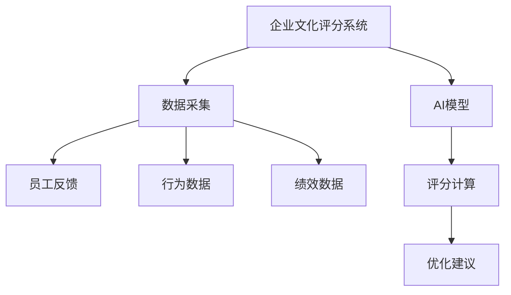
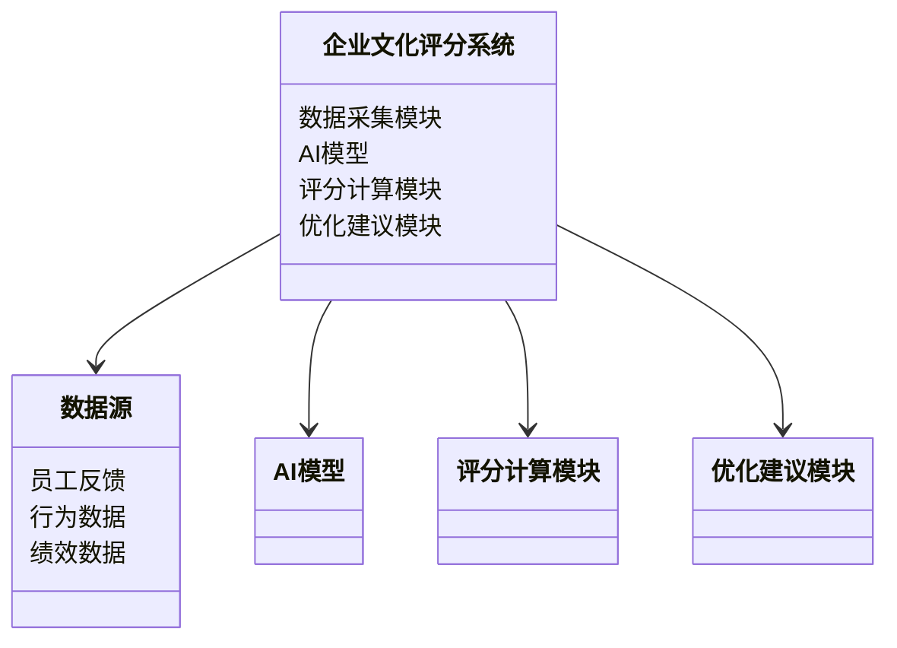
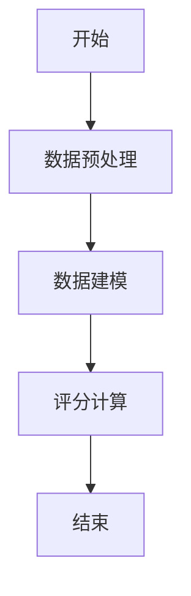
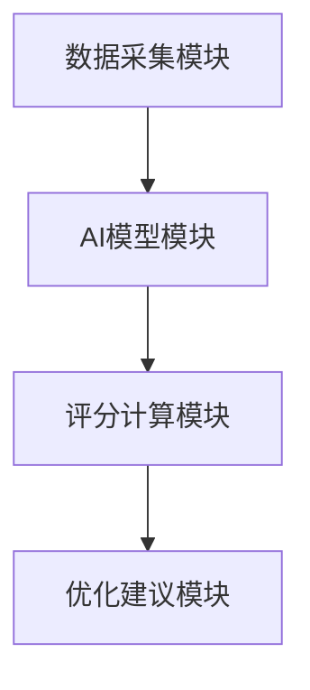

                 


# 利用AI构建自适应型公司文化评分系统：量化软实力

> 关键词：AI、公司文化评分系统、自适应、量化软实力、企业文化评估、人工智能技术

> 摘要：在数字化时代，公司文化作为企业软实力的重要组成部分，其评估与优化变得至关重要。本文通过结合AI技术，提出了一种自适应型公司文化评分系统，能够动态量化企业文化，帮助企业持续改进。文章从背景介绍、核心概念、算法原理、系统架构到项目实战，详细阐述了如何利用AI技术构建这一评分系统，并提供了实际案例分析和最佳实践建议。

---

# 第一部分: 背景介绍

## 第1章: 公司文化评分系统的背景与问题背景

### 1.1 问题背景

#### 1.1.1 传统公司文化评估的局限性
传统公司文化评估方法通常依赖问卷调查和人工分析，存在以下问题：
- **主观性**：问卷结果依赖员工主观反馈，容易受个人情绪和偏见影响。
- **静态性**：评估结果通常是静态的，无法实时反映企业文化的变化。
- **低效性**：人工分析耗时耗力，难以快速为企业提供优化建议。

#### 1.1.2 数字化时代对软实力的新要求
随着数字化转型的推进，企业对软实力的要求越来越高：
- **动态性**：企业文化的动态变化需要实时监控。
- **数据驱动**：企业决策需要依赖数据而非主观判断。
- **个性化**：每个企业的文化特点不同，需要个性化的评估和优化方案。

#### 1.1.3 公司文化评分系统的需求与痛点
企业希望有一个能够量化文化软实力的系统，但现有的解决方案存在以下痛点：
- **难以量化**：缺乏统一的量化标准。
- **难以适应**：无法根据企业实际情况动态调整。
- **难以优化**：无法提供具体的优化建议。

### 1.2 问题描述

#### 1.2.1 公司文化评分系统的定义
公司文化评分系统是一个通过数据采集、分析和建模，为企业提供文化软实力量化评估的系统。

#### 1.2.2 评分系统的目标与核心问题
- **目标**：量化企业文化，提供实时评估和优化建议。
- **核心问题**：如何利用AI技术动态评估企业文化，并提供个性化优化方案。

#### 1.2.3 现有解决方案的不足与改进方向
现有解决方案多依赖人工评估，缺乏数据驱动和动态调整的能力。改进方向在于引入AI技术，构建动态、数据驱动的评估系统。

### 1.3 问题解决思路

#### 1.3.1 引入AI技术的必要性
AI技术能够处理大量数据，识别复杂模式，为文化评估提供客观、动态的分析。

#### 1.3.2 自适应评分系统的概念
自适应评分系统是一种能够根据企业实际情况动态调整评估模型和优化建议的系统。

#### 1.3.3 AI驱动评分系统的实现路径
- 数据采集：通过问卷、行为数据、绩效数据等多源数据采集。
- 数据分析：利用AI算法对数据进行分析和建模。
- 评估与优化：根据分析结果生成评分，并提供优化建议。

### 1.4 问题的边界与外延

#### 1.4.1 评分系统的适用范围
适用于各类企业，尤其适合需要动态优化文化软实力的企业。

#### 1.4.2 评分系统的功能边界
- 数据采集：包括员工反馈、行为数据、绩效数据等。
- 评分计算：基于AI模型生成文化评分。
- 优化建议：提供针对性的优化方案。

#### 1.4.3 评分系统与其他系统的交互关系
与企业绩效管理系统、员工管理系统等其他系统进行数据交互。

### 1.5 概念结构与核心要素

#### 1.5.1 核心概念的层次结构
- **顶层**：企业文化评分系统。
- **中间层**：数据采集、分析、评分计算、优化建议。
- **底层**：员工反馈、行为数据、绩效数据。

#### 1.5.2 核心要素的定义与属性
| 要素 | 定义 | 属性 |
|------|------|------|
| 数据采集 | 数据收集方式 | 多源性、实时性 |
| AI模型 | 数据分析算法 | 自适应性、动态性 |
| 评分计算 | 评分生成 | 客观性、动态性 |
| 优化建议 | 优化方案 | 针对性、可操作性 |

#### 1.5.3 概念结构的图示化展示


---

# 第二部分: 核心概念与联系

## 第2章: 自适应型公司文化评分系统的核心概念

### 2.1 自适应型评分系统的定义与特点

#### 2.1.1 自适应型评分系统的定义
自适应型评分系统是一种能够根据企业实际情况动态调整评估模型和优化建议的系统。

#### 2.1.2 自适应型评分系统的特点
- **动态性**：实时更新评估结果。
- **个性化**：根据企业特点提供定制化建议。
- **数据驱动**：基于大量数据进行分析和建模。

### 2.2 核心概念的原理与机制

#### 2.2.1 AI驱动的评分算法
AI算法通过分析多源数据，生成企业文化评分。

#### 2.2.2 系统的工作原理
1. 数据采集：收集员工反馈、行为数据、绩效数据。
2. 数据分析：利用AI模型进行数据建模和分析。
3. 评分计算：生成企业文化评分。
4. 优化建议：根据评分结果提供优化方案。

### 2.3 核心概念的属性特征对比

| 特性 | 自适应型评分系统 | 传统评分系统 |
|------|-----------------|---------------|
| 动态性 | 高 | 低 |
| 个性化 | 高 | 低 |
| 数据驱动 | 高 | 低 |

### 2.4 实体关系图



---

# 第三部分: 算法原理

## 第3章: AI驱动评分算法的原理与实现

### 3.1 算法原理

#### 3.1.1 算法概述
AI模型通过分析多源数据，生成企业文化评分。

#### 3.1.2 算法实现步骤
1. 数据预处理：清洗和整合多源数据。
2. 数据建模：使用机器学习算法建模。
3. 评分计算：生成企业文化评分。
4. 模型优化：根据反馈优化模型。

### 3.2 算法实现细节

#### 3.2.1 数据预处理
- 数据清洗：去除无效数据。
- 数据整合：整合多源数据。

#### 3.2.2 数据建模
使用线性回归模型进行评分预测。

### 3.3 算法流程图



### 3.4 代码实现

```python
import pandas as pd
from sklearn.linear_model import LinearRegression

# 数据预处理
data = pd.read_csv('culture_data.csv')
data = data.dropna()

# 数据建模
model = LinearRegression()
model.fit(data[['员工反馈', '行为数据', '绩效数据']], data['文化评分'])

# 评分计算
new_data = pd.read_csv('new_culture_data.csv')
predicted_scores = model.predict(new_data[['员工反馈', '行为数据', '绩效数据']])
```

---

# 第四部分: 系统分析与架构设计

## 第4章: 系统架构与功能设计

### 4.1 问题场景介绍

#### 4.1.1 问题场景
企业需要动态评估和优化公司文化。

#### 4.1.2 问题分析
现有系统无法动态评估企业文化。

### 4.2 系统功能设计

#### 4.2.1 功能模块
- 数据采集模块
- AI模型模块
- 评分计算模块
- 优化建议模块

#### 4.2.2 功能流程
1. 数据采集模块收集数据。
2. AI模型模块进行建模。
3. 评分计算模块生成评分。
4. 优化建议模块提供建议。

### 4.3 系统架构设计

#### 4.3.1 系统架构图



---

# 第五部分: 项目实战

## 第5章: 项目实现与案例分析

### 5.1 项目环境安装

#### 5.1.1 安装Python和相关库
```bash
pip install pandas scikit-learn
```

### 5.2 系统核心代码实现

#### 5.2.1 数据预处理代码

```python
import pandas as pd

data = pd.read_csv('culture_data.csv')
data = data.dropna()
```

#### 5.2.2 数据建模代码

```python
from sklearn.linear_model import LinearRegression

model = LinearRegression()
model.fit(data[['员工反馈', '行为数据', '绩效数据']], data['文化评分'])
```

### 5.3 项目案例分析

#### 5.3.1 案例背景
某科技公司希望优化企业文化。

#### 5.3.2 数据分析
通过AI模型分析员工反馈、行为数据、绩效数据，生成文化评分。

#### 5.3.3 优化建议
根据评分结果，提供针对性的优化建议。

### 5.4 项目小结

#### 5.4.1 项目实现总结
通过AI技术成功构建了自适应型公司文化评分系统。

#### 5.4.2 项目经验总结
AI技术能够有效提升企业文化评估的客观性和动态性。

---

# 第六部分: 最佳实践

## 第6章: 最佳实践与注意事项

### 6.1 小结

#### 6.1.1 核心观点总结
AI技术能够帮助企业动态评估和优化企业文化。

#### 6.1.2 主要收获
通过项目实战，掌握了AI驱动评分系统的设计与实现。

### 6.2 注意事项

#### 6.2.1 项目实施中的注意事项
- 数据质量至关重要。
- 模型需要定期优化。

#### 6.2.2 未来发展趋势
- AI技术在企业文化评估中的应用将更加广泛。

### 6.3 拓展阅读

#### 6.3.1 推荐书籍
- 《人工智能：一种现代的方法》
- 《数据驱动的企业管理》

#### 6.3.2 推荐文章
- 《AI在企业管理系统中的应用》
- 《企业文化评估的数字化转型》

---

# 作者：AI天才研究院 & 禅与计算机程序设计艺术

---

通过以上目录大纲，文章从背景、核心概念、算法原理、系统架构、项目实战到最佳实践，详细阐述了利用AI构建自适应型公司文化评分系统的过程。每一部分都结合了理论与实践，确保内容全面且易于理解。

