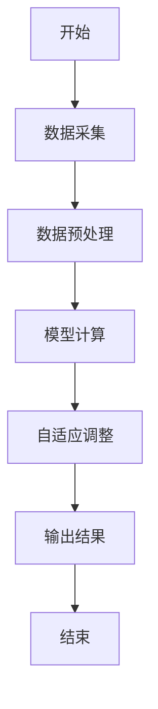
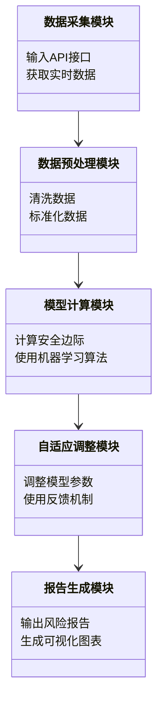

                 


# 利用AI构建自适应型安全边际模型：动态风险管理

> 关键词：自适应型安全边际模型、动态风险管理、人工智能、风险评估、风险管理、安全边界

> 摘要：本文详细探讨了利用人工智能技术构建自适应型安全边际模型的方法，通过动态风险管理的视角，分析了模型的核心概念、算法原理、系统架构以及实际应用场景。文章从理论到实践，结合实际案例，为读者提供了全面的技术指导和深入的行业洞察。

---

# 第一部分: 自适应型安全边际模型概述

## 第1章: 自适应型安全边际模型的背景与概念

### 1.1 什么是自适应型安全边际模型

#### 1.1.1 安全边际模型的定义
安全边际模型是一种用于评估和管理风险的数学模型，通过量化潜在损失和收益的边界，帮助决策者在不确定环境中做出更稳健的决策。传统的安全边际模型通常基于静态假设，适用于环境变化较小的场景。

#### 1.1.2 自适应型安全边际模型的核心概念
自适应型安全边际模型是一种动态风险管理工具，能够根据实时数据和环境变化，自动调整安全边际的范围和参数。它结合了人工智能技术，通过机器学习算法不断优化模型，以适应复杂的动态环境。

#### 1.1.3 自适应型安全边际模型的背景与意义
随着金融、投资和网络安全等领域对实时风险管理需求的增加，传统的静态模型已难以满足实际需求。自适应型安全边际模型通过引入动态调整机制，能够更准确地捕捉风险变化，提高风险管理的效率和准确性。

---

### 1.2 自适应型安全边际模型的必要性

#### 1.2.1 传统风险管理的局限性
传统安全边际模型通常基于历史数据和假设条件，难以应对突发性事件或非线性变化。例如，在金融市场中，传统模型可能无法有效预测市场崩盘或黑天鹅事件。

#### 1.2.2 动态风险管理的需求
现代业务环境复杂多变，风险因素高度动态化。企业需要一种能够实时感知和调整的模型，以应对不确定性和突发事件。

#### 1.2.3 自适应型安全边际模型的优势
自适应型模型能够通过实时数据反馈和机器学习算法，动态优化安全边际，提高风险管理的准确性和响应速度。

---

### 1.3 自适应型安全边际模型的边界与外延

#### 1.3.1 安全边际模型的边界
自适应型安全边际模型主要用于评估和管理风险，其边界包括数据来源、模型适用范围和决策的最终目标。

#### 1.3.2 自适应型的实现范围
自适应型机制主要用于模型参数的动态调整，但不包括外部数据源和决策执行的外部因素。

#### 1.3.3 相关概念的对比与区分
- **静态模型 vs. 动态模型**：静态模型基于固定参数，动态模型能够实时调整。
- **自适应模型 vs. 预测模型**：自适应模型注重实时调整，预测模型注重未来趋势。

---

### 1.4 自适应型安全边际模型的结构与组成

#### 1.4.1 核心要素分析
自适应型安全边际模型由以下几个核心要素组成：
- 数据采集模块：实时收集相关数据。
- 模型计算模块：计算当前的安全边际。
- 自适应调整模块：根据环境变化动态调整模型参数。

#### 1.4.2 模型的层次结构
- 数据层：原始数据输入和存储。
- 计算层：模型的数学计算和参数调整。
- 应用层：结果的应用和决策支持。

#### 1.4.3 各部分之间的关系
数据层为计算层提供输入，计算层根据数据层的变化调整模型参数，应用层将计算结果应用于实际业务决策。

---

## 第2章: 自适应型安全边际模型的核心概念与联系

### 2.1 核心概念原理

#### 2.1.1 安全边际的核心原理
安全边际是风险评估中的一个关键指标，表示在最坏情况下，资产的价值不会低于某个阈值。自适应型模型通过动态调整这个阈值，确保在不同环境下都能保持稳健的风险管理。

#### 2.1.2 自适应机制的实现原理
自适应机制通过机器学习算法，根据实时数据和环境变化，自动调整模型参数。例如，使用反馈机制和在线学习算法，实时优化安全边际。

#### 2.1.3 动态风险管理的数学模型
动态风险管理模型通过引入时间序列分析和回归模型，实现对风险的实时评估和预测。

---

### 2.2 核心概念属性特征对比

#### 2.2.1 表格对比分析
| 特性       | 静态模型             | 自适应模型             |
|------------|---------------------|-----------------------|
| 参数调整   | 静态，固定参数       | 动态，实时调整         |
| 响应速度   | 较慢                | 较快                  |
| 精度       | 较低                | 较高                  |

---

### 2.3 ER实体关系图架构

```mermaid
erd
    title 自适应型安全边际模型的ER图
    章节：章节1
    章节包含：章节
    章节内容：章节内容
```

---

### 2.4 本章小结

---

## 第3章: 自适应型安全边际模型的算法原理

### 3.1 算法原理概述

#### 3.1.1 算法的总体流程
1. 数据采集：从实时数据源获取相关数据。
2. 数据预处理：清洗和标准化数据。
3. 模型计算：计算当前的安全边际。
4. 自适应调整：根据环境变化调整模型参数。
5. 输出结果：生成风险评估报告。

#### 3.1.2 算法的核心步骤
- 数据采集：使用API接口获取实时数据。
- 数据预处理：使用Python进行数据清洗和标准化。
- 模型计算：基于机器学习算法计算安全边际。
- 自适应调整：通过反馈机制调整模型参数。

#### 3.1.3 算法的输入输出
- 输入：实时数据流、历史数据。
- 输出：动态调整后的安全边际值、风险评估报告。

---

### 3.2 算法流程图



---

### 3.3 算法的数学模型与公式

#### 3.3.1 数学模型的建立
假设资产的价值服从某种概率分布，安全边际的计算公式为：
$$ S = V - \text{VaR} $$
其中，$V$ 是资产价值，$\text{VaR}$ 是在给定置信水平下的风险价值。

#### 3.3.2 关键公式的推导
通过引入时间序列模型，动态调整安全边际：
$$ S(t) = S(t-1) + \alpha \cdot \text{error}(t-1) $$
其中，$\alpha$ 是调整系数，$\text{error}(t-1)$ 是上一时刻的预测误差。

#### 3.3.3 举例说明
假设初始安全边际为 $S_0 = 100$，调整系数 $\alpha = 0.1$，上一时刻的误差为 $-5$。则当前安全边际为：
$$ S(1) = 100 + 0.1 \cdot (-5) = 99.5 $$

---

## 第4章: 自适应型安全边际模型的系统分析与架构设计

### 4.1 系统分析

#### 4.1.1 问题场景介绍
在金融投资领域，投资者需要实时监控和调整其投资组合的风险敞口。传统的静态模型难以应对市场的剧烈波动，而自适应型安全边际模型能够动态调整，确保投资组合的安全性。

#### 4.1.2 项目介绍
本项目旨在开发一个基于AI的自适应型安全边际模型，用于实时风险管理。

#### 4.1.3 系统功能设计
- 数据采集模块：实时获取市场数据。
- 模型计算模块：计算当前的安全边际。
- 自适应调整模块：动态优化模型参数。
- 报告生成模块：输出风险评估报告。

---

### 4.2 系统架构设计

#### 4.2.1 Mermaid类图展示



---

### 4.3 本章小结

---

## 第5章: 自适应型安全边际模型的项目实战

### 5.1 环境安装与配置

#### 5.1.1 开发环境的选择
推荐使用Python 3.8及以上版本，安装必要的库，如Pandas、NumPy、Scikit-learn、TensorFlow等。

#### 5.1.2 依赖库的安装
使用以下命令安装依赖：
```bash
pip install pandas numpy scikit-learn tensorflow
```

#### 5.1.3 环境配置步骤
1. 创建虚拟环境。
2. 激活虚拟环境。
3. 安装依赖库。

---

### 5.2 核心代码实现

#### 5.2.1 代码结构
```python
# 安全边际模型类
class SafetyMarginModel:
    def __init__(self):
        self.model = self._build_model()
    
    def _build_model(self):
        # 构建机器学习模型
        pass
    
    def compute_margin(self, data):
        # 计算安全边际
        pass
    
    def adapt(self, error):
        # 自适应调整模型
        pass
```

#### 5.2.2 核心算法实现
```python
import numpy as np
from sklearn.linear_model import LinearRegression

class SafetyMarginModel:
    def __init__(self):
        self.model = LinearRegression()
    
    def compute_margin(self, data):
        # 假设data是一个数据框
        X = data[['return', 'volatility']]
        y = data['value']
        self.model.fit(X, y)
        return self.model.predict(X)
    
    def adapt(self, error):
        # 简单的自适应调整
        alpha = 0.1
        new_error = error - self.model.predict(X) + y
        self.model.coef_ += alpha * new_error
```

---

### 5.3 实际案例分析

#### 5.3.1 案例背景介绍
假设我们有一个股票投资组合，需要实时监控和调整其安全边际。

#### 5.3.2 数据准备与处理
收集过去一年的股票数据，包括收益率、波动率等指标。

#### 5.3.3 模型训练与评估
使用历史数据训练模型，计算安全边际，并通过回测验证模型的准确性。

---

## 第6章: 总结与展望

### 6.1 最佳实践 tips
- 定期监控模型性能，及时调整参数。
- 结合多种数据源，提高模型的鲁棒性。
- 使用高效的计算框架，优化模型运行效率。

### 6.2 小结
自适应型安全边际模型通过动态调整安全边际，能够更准确地应对复杂多变的业务环境。本文从理论到实践，详细介绍了模型的构建和应用。

### 6.3 注意事项
- 模型的准确性和实时性需要权衡。
- 数据质量和完整性对模型性能影响重大。
- 模型的可解释性需要重点关注。

### 6.4 拓展阅读
- 关于时间序列分析的书籍。
- 机器学习在金融风险管理中的应用。

---

# 作者：AI天才研究院/AI Genius Institute & 禅与计算机程序设计艺术 /Zen And The Art of Computer Programming

