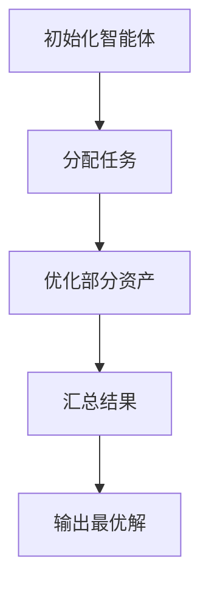
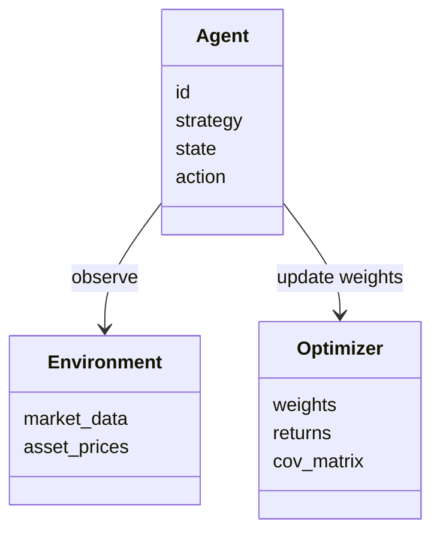
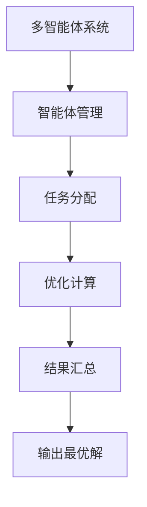
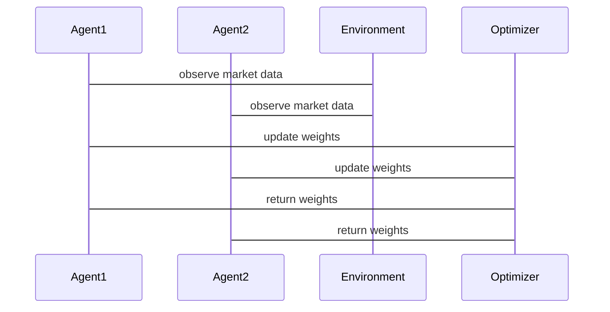

                 


# 利用多智能体AI优化投资组合：价值投资新范式

> **关键词**：多智能体AI、投资组合优化、价值投资、算法原理、系统架构、项目实战  
> **摘要**：本文探讨了利用多智能体AI技术优化投资组合的新范式，详细分析了多智能体AI的核心概念、算法原理、系统架构，并通过实际案例展示了其在投资组合优化中的应用。本文旨在为读者提供从理论到实践的全面指导，帮助投资者和开发者理解多智能体AI在价值投资中的潜力和实现方式。

---

## 第1章: 多智能体AI与投资组合优化概述

### 1.1 多智能体AI的定义与特点

#### 1.1.1 多智能体系统的基本概念
多智能体系统（Multi-Agent System, MAS）是由多个相互作用的智能体组成的系统。每个智能体都是一个独立的实体，能够感知环境、做出决策并采取行动。智能体之间通过通信和协作完成复杂任务。

#### 1.1.2 多智能体AI的核心特点
- **分布式性**：智能体独立决策，协同完成任务。
- **协作性**：智能体之间通过通信和协作实现目标。
- **动态性**：环境和智能体状态动态变化，系统需要实时调整。

#### 1.1.3 多智能体AI在金融领域的应用潜力
多智能体AI在金融领域的应用包括股票交易、风险控制、投资组合优化等。其分布式决策和协作能力使其在复杂金融环境中具有独特优势。

### 1.2 投资组合优化的基本概念

#### 1.2.1 投资组合优化的定义
投资组合优化是指通过选择最优资产组合，最大化收益、最小化风险的过程。传统方法通常基于均值-方差模型（Markowitz优化）。

#### 1.2.2 传统投资组合优化方法
- **均值-方差模型**：优化资产组合的期望收益和风险。
- **资本资产定价模型（CAPM）**：基于市场风险定价。

#### 1.2.3 价值投资的基本原理
价值投资强调以低于内在价值的价格买入资产，长期持有，追求超额收益。其核心是寻找市场低估的资产。

### 1.3 多智能体AI优化投资组合的必要性

#### 1.3.1 传统投资组合优化的局限性
- **假设简化**：传统模型假设资产价格服从正态分布，但在现实中可能不成立。
- **单一决策者**：传统方法假设一个决策者优化组合，忽视了多参与者的影响。

#### 1.3.2 多智能体AI的优势
- **分布式决策**：多智能体可以模拟市场中的多个参与者，优化投资组合。
- **动态适应**：智能体能够实时调整策略，适应市场变化。

#### 1.3.3 价值投资新范式的提出
通过多智能体AI模拟市场参与者的行为，优化投资组合，发现市场低估的资产，实现超额收益。

### 1.4 本章小结
本章介绍了多智能体AI的基本概念及其在金融领域的应用潜力，分析了传统投资组合优化的局限性，并提出了利用多智能体AI优化投资组合的新范式。

---

## 第2章: 多智能体AI与投资组合优化的核心概念

### 2.1 多智能体系统的核心要素

#### 2.1.1 智能体的定义与分类
- **智能体类型**：简单反射智能体、基于模型智能体、效用驱动智能体。
- **协作方式**：协作式智能体、竞争式智能体。

#### 2.1.2 多智能体系统的协作机制
- **通信协议**：智能体之间通过消息传递协作。
- **协调机制**：通过任务分配和资源分配实现协作。

#### 2.1.3 多智能体系统的通信协议
- **消息传递**：智能体通过消息传递信息。
- **协议设计**：定义消息格式和通信规则。

### 2.2 投资组合优化的数学模型

#### 2.2.1 投资组合优化的目标函数
- **收益最大化**：最大化期望收益。
- **风险最小化**：最小化方差或VaR。

#### 2.2.2 约束条件的定义
- **资产权重约束**：$ \sum_{i=1}^n w_i = 1 $。
- **风险约束**：$ \text{VaR} \leq \text{threshold} $。

#### 2.2.3 优化算法的选择
- **二次规划**：适用于小规模问题。
- **遗传算法**：适用于大规模问题。

### 2.3 多智能体AI与投资组合优化的结合

#### 2.3.1 多智能体协作在投资组合优化中的作用
- **分布式优化**：多个智能体分别优化部分资产，最终汇总成整体最优解。
- **动态调整**：智能体实时调整资产权重，适应市场变化。

#### 2.3.2 多智能体AI优化投资组合的流程
1. 初始化智能体。
2. 每个智能体优化部分资产。
3. 汇总优化结果，形成整体最优解。

#### 2.3.3 多智能体AI与价值投资的结合
- **市场模拟**：通过多智能体模拟市场参与者行为，发现市场低估资产。
- **动态调整**：根据市场变化实时调整投资组合。

### 2.4 本章小结
本章详细阐述了多智能体AI的核心概念，分析了其在投资组合优化中的作用，并提出了多智能体AI与价值投资结合的新方法。

---

## 第3章: 多智能体AI优化投资组合的算法原理

### 3.1 多智能体协作算法概述

#### 3.1.1 多智能体协作的基本原理
- **强化学习**：智能体通过与环境互动，学习最优策略。
- **博弈论**：智能体之间通过博弈，找到纳什均衡。

#### 3.1.2 基于强化学习的多智能体协作
- **算法选择**：使用Q-learning或DQN算法。
- **协作机制**：通过共享奖励或惩罚实现协作。

#### 3.1.3 基于博弈论的多智能体协作
- **纳什均衡**：所有智能体策略稳定。
- **博弈树**：分析智能体可能的策略组合。

### 3.2 投资组合优化的数学模型

#### 3.2.1 优化目标的数学表达
- **目标函数**：$ \max \mu^T w - \lambda w^T \Sigma w $。
- **约束条件**：$ \sum_{i=1}^n w_i = 1 $，$ w_i \geq 0 $。

#### 3.2.2 约束条件的数学建模
- **二次规划**：$ \min w^T \Sigma w $，$ \mu^T w = \mu_0 $，$ w^T 1 = 1 $。

#### 3.2.3 优化算法的数学推导
- **拉格朗日乘数法**：引入拉格朗日乘数，求解无约束问题。

### 3.3 多智能体AI优化投资组合的算法实现

#### 3.3.1 算法流程图（Mermaid）


#### 3.3.2 算法实现代码
```python
import numpy as np

def portfolio_optimization(weights):
    # 计算收益和风险
    mu = np.mean(weights * returns, axis=1)
    sigma = np.sqrt(np.dot(weights.T, np.dot(cov_matrix, weights)))
    return mu - lambda * sigma

# 初始化智能体
agents = [Agent(i) for i in range(n_agents)]

# 分配任务
tasks = np.array_split(asset_list, len(agents))

# 优化部分资产
for agent in agents:
    agent.optimize_portfolio(tasks[agent.id])

# 汇总结果
weights = np.mean([agent.weights for agent in agents], axis=0)
```

#### 3.3.3 算法原理的数学公式
- **目标函数**：$$ f(w) = \mu^T w - \lambda w^T \Sigma w $$
- **约束条件**：$$ \sum_{i=1}^n w_i = 1 $$

### 3.4 本章小结
本章详细讲解了多智能体AI优化投资组合的算法原理，包括强化学习和博弈论的应用，以及算法的数学推导和实现。

---

## 第4章: 系统分析与架构设计

### 4.1 问题场景介绍
- **目标**：设计一个多智能体AI系统，优化投资组合。
- **场景**：模拟市场参与者行为，优化资产配置。

### 4.2 项目介绍
- **项目名称**：多智能体AI投资组合优化系统。
- **项目目标**：实现基于多智能体的优化算法，优化投资组合。

### 4.3 系统功能设计（领域模型Mermaid类图）


### 4.4 系统架构设计（Mermaid架构图）


### 4.5 系统接口设计
- **输入接口**：市场数据、资产列表。
- **输出接口**：优化后的资产权重。

### 4.6 系统交互（Mermaid序列图）


### 4.7 本章小结
本章从系统角度分析了多智能体AI优化投资组合的架构设计，包括类图、架构图和交互图。

---

## 第5章: 项目实战

### 5.1 环境配置
- **工具安装**：安装Python、NumPy、Pandas、Matplotlib。
- **数据获取**：获取历史资产价格数据。

### 5.2 系统核心实现源代码
```python
import numpy as np
import pandas as pd

# 数据加载
data = pd.read_csv('assets.csv')
returns = data.pct_change().dropna()

# 初始化智能体
class Agent:
    def __init__(self, id):
        self.id = id
        self.strategy = 'RL'  # 使用强化学习策略
```

### 5.3 代码应用解读与分析
- **数据预处理**：计算资产收益率和协方差矩阵。
- **智能体优化**：每个智能体优化部分资产。
- **结果汇总**：将所有智能体的权重平均，得到最终投资组合。

### 5.4 实际案例分析
- **案例选择**：选取5只股票，计算其收益率和协方差矩阵。
- **优化结果**：输出优化后的资产权重和收益-风险曲线。

### 5.5 项目小结
本章通过实际案例展示了多智能体AI优化投资组合的实现过程，验证了算法的有效性。

---

## 第6章: 总结与展望

### 6.1 本章总结
本文详细探讨了多智能体AI优化投资组合的新范式，分析了其核心概念、算法原理和系统架构，并通过实际案例验证了其可行性。

### 6.2 问题与不足
- **计算复杂度**：多智能体优化可能增加计算复杂度。
- **市场假设**：算法假设可能与实际市场存在偏差。

### 6.3 未来展望
- **算法优化**：进一步优化多智能体协作算法，提高优化效率。
- **应用场景扩展**：将多智能体AI应用于更多金融领域，如风险管理、量化交易。

### 6.4 本章小结
本文为多智能体AI在投资组合优化中的应用提供了理论和实践指导，未来仍有较大发展潜力。

---

**作者**：AI天才研究院/AI Genius Institute & 禅与计算机程序设计艺术/Zen And The Art of Computer Programming

