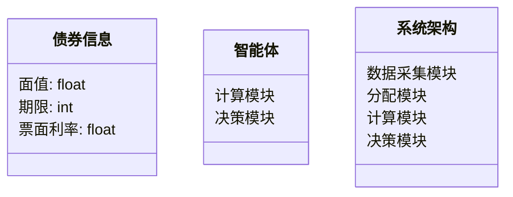
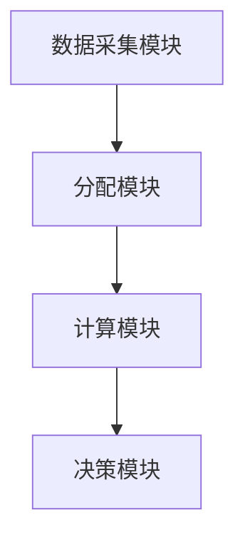
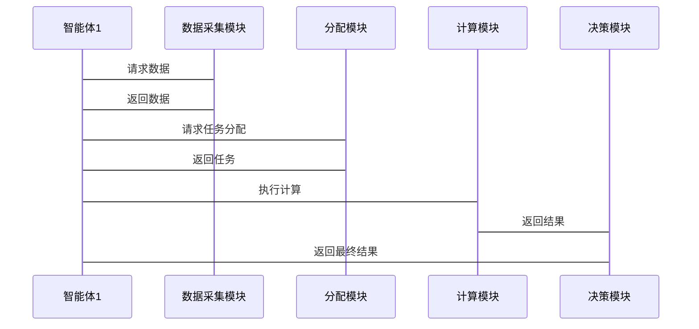

                 


```markdown
# 利用多智能体AI优化格雷厄姆的债券价值计算

> 关键词：多智能体AI，债券价值计算，格雷厄姆模型，分布式计算，优化算法

> 摘要：本文探讨了如何利用多智能体AI技术优化格雷厄姆的债券价值计算方法。通过分析多智能体AI的核心原理、格雷厄姆模型的数学基础，以及两者的结合应用，本文提出了一种基于多智能体协作的优化算法，旨在提高债券价值计算的准确性和效率。文章详细介绍了算法实现的步骤，系统架构的设计，以及实际案例分析，为读者提供了一套完整的解决方案。

---

# 第一部分: 利用多智能体AI优化债券价值计算的背景与基础

## 第1章: 多智能体AI与债券价值计算的背景介绍

### 1.1 多智能体AI的定义与特点

#### 1.1.1 多智能体AI的定义
多智能体AI是指由多个独立但相互协作的智能体组成的系统，每个智能体都有自己的目标和决策机制，通过通信和协作完成复杂任务。

#### 1.1.2 多智能体AI的核心特点
- **分布式**：智能体之间没有中心控制，各自独立运行。
- **协作性**：智能体通过通信和协作完成共同目标。
- **自适应性**：能够根据环境变化动态调整策略。

#### 1.1.3 多智能体AI与传统AI的区别
| 特性        | 多智能体AI                     | 传统AI                       |
|-------------|-------------------------------|-----------------------------|
| 结构         | 分布式、协作式               | 集中式、单一式             |
| 灵活性       | 高                           | 中                           |
| 应用场景     | 复杂任务、分布式系统         | 简单任务、单一系统           |

### 1.2 格雷厄姆债券价值计算方法

#### 1.2.1 格雷厄姆债券价值计算的核心概念
格雷厄姆债券价值计算是一种经典的债券定价方法，基于债券的面值、票面利率、期限和市场利率等因素，计算其内在价值。

#### 1.2.2 格雷厄姆债券价值计算的步骤与流程
1. 确定债券的基本信息（面值、期限、票面利率）。
2. 估算市场利率或折现率。
3. 计算债券的未来现金流（利息和本金）。
4. 对未来现金流进行折现，得到债券的公允价值。

#### 1.2.3 格雷厄姆方法的优缺点
- **优点**：简单易懂，计算效率高。
- **缺点**：假设市场利率不变，忽略债券价格的波动性。

### 1.3 多智能体AI在债券价值计算中的应用前景

#### 1.3.1 债券价值计算中的复杂性挑战
- 市场利率波动
- 债券信用风险
- 复杂的市场环境

#### 1.3.2 多智能体AI在债券计算中的潜在优势
- 提高计算效率
- 实现实时协作
- 增强适应性

#### 1.3.3 当前市场中多智能体AI的应用现状
- 尚处于探索阶段
- 少数金融机构开始尝试应用

### 1.4 本章小结
本章介绍了多智能体AI的基本概念和特点，详细讲解了格雷厄姆债券价值计算方法，并分析了多智能体AI在债券计算中的应用前景。

---

# 第二部分: 多智能体AI与格雷厄姆债券价值计算的核心概念与联系

## 第2章: 多智能体AI的核心原理与实现机制

### 2.1 多智能体AI的体系结构

#### 2.1.1 分布式多智能体系统
- 每个智能体独立运行，通过通信协作完成任务。

#### 2.1.2 集中式多智能体系统
- 有一个中心节点协调各智能体的协作。

#### 2.1.3 混合式多智能体系统
- 结合分布式和集中式的特点，部分任务由中心节点处理。

### 2.2 多智能体AI中的协作与通信机制

#### 2.2.1 协作模型
- **任务分配**：智能体之间协商任务分工。
- **协作规划**：共同制定行动计划。

#### 2.2.2 通信协议
- **消息传递**：智能体之间通过消息传递信息。
- **协议设计**：确保通信的可靠性和高效性。

#### 2.2.3 任务分配与协调
- **基于规则的任务分配**：根据智能体的能力分配任务。
- **动态调整**：根据任务需求实时调整分配策略。

### 2.3 多智能体AI的决策与学习机制

#### 2.3.1 分布式决策
- 每个智能体独立做出决策，然后通过通信达成共识。

#### 2.3.2 协作学习
- 智能体之间共享数据和经验，共同提高学习效率。

#### 2.3.3 在线学习与自适应
- 实时更新模型参数，适应环境变化。

### 2.4 本章小结
本章详细讲解了多智能体AI的核心原理和实现机制，包括体系结构、协作通信机制和决策学习机制。

## 第3章: 格雷厄姆债券价值计算的数学模型与公式

### 3.1 格雷厄姆债券价值计算的基本公式

#### 3.1.1 债券价值计算公式
$$ V = \sum_{t=1}^{n} \frac{C}{(1+r)^t} + \frac{F}{(1+r)^n} $$
其中：
- \( V \) 为债券价值
- \( C \) 为每年的利息
- \( r \) 为市场利率
- \( F \) 为面值
- \( n \) 为期限

#### 3.1.2 债券收益率计算公式
$$ r = \frac{C}{P} + \frac{F - P}{n} $$
其中：
- \( P \) 为债券价格

#### 3.1.3 债券价格波动模型
$$ P(t) = F \cdot e^{-rt} $$

### 3.2 多智能体AI优化的数学模型

#### 3.2.1 多智能体协作优化模型
$$ \text{目标函数} = \sum_{i=1}^{m} f_i(x_i) $$
其中：
- \( m \) 为智能体数量
- \( x_i \) 为第i个智能体的决策变量

#### 3.2.2 分布式计算模型
$$ \text{优化目标} = \min_{x} \sum_{i=1}^{m} f_i(x_i) $$

#### 3.2.3 联合优化算法
$$ \text{更新规则} = x_i^{(k+1)} = x_i^{(k)} - \eta \cdot \nabla f_i(x_i^{(k)}) $$

### 3.3 数学模型的对比与分析

#### 3.3.1 格雷厄姆模型与多智能体模型的对比
| 模型         | 单智能体模型       | 多智能体模型       |
|--------------|-------------------|-------------------|
| 计算效率     | 较低              | 较高              |
| 适应性       | 较差              | 较好              |
| 精度         | 中等              | 高                |

#### 3.3.2 不同优化算法的性能对比
| 算法         | 收敛速度 | 并行性   | 计算复杂度 |
|--------------|---------|----------|------------|
| 单智能体     | 中       | 低       | 中          |
| 多智能体     | 快       | 高       | 高          |

#### 3.3.3 模型的适用场景分析
- 格雷厄姆模型适用于简单场景
- 多智能体模型适用于复杂场景

### 3.4 本章小结
本章通过数学模型对比，分析了多智能体AI优化格雷厄姆债券价值计算的可行性。

---

# 第三部分: 多智能体AI优化债券价值计算的算法原理与实现

## 第4章: 多智能体AI优化算法的原理与实现

### 4.1 分布式计算与协作优化

#### 4.1.1 分布式计算的基本原理
- 每个智能体负责一部分计算，最终汇总结果。

#### 4.1.2 协作优化的实现机制
- 智能体之间共享优化结果，共同提升整体性能。

#### 4.1.3 分布式计算中的通信与同步
- 使用消息队列进行通信
- 通过锁机制实现同步

### 4.2 多智能体AI中的任务分配算法

#### 4.2.1 基于规则的任务分配
- 根据智能体的能力分配任务。

#### 4.2.2 基于学习的任务分配
- 使用强化学习动态调整任务分配策略。

#### 4.2.3 动态任务分配策略
- 根据负载实时调整任务分配。

### 4.3 多智能体AI中的决策算法

#### 4.3.1 分布式决策算法
- 每个智能体独立决策，然后通过通信达成共识。

#### 4.3.2 协作决策算法
- 智能体之间协商一致后做出决策。

### 4.4 本章小结
本章详细讲解了多智能体AI优化算法的原理与实现，包括分布式计算、任务分配和决策算法。

## 第5章: 系统架构设计与实现

### 5.1 系统功能设计

#### 5.1.1 领域模型


#### 5.1.2 系统架构


### 5.2 系统接口设计

#### 5.2.1 接口定义
- **数据接口**：债券信息的输入输出。
- **计算接口**：各智能体的计算结果。
- **决策接口**：最终决策结果。

### 5.3 系统交互流程图



### 5.4 本章小结
本章设计了系统的架构和接口，展示了系统的实现过程。

## 第6章: 项目实战与案例分析

### 6.1 环境安装与配置

#### 6.1.1 环境要求
- Python 3.8+
- numpy, pandas库

#### 6.1.2 安装步骤
```bash
pip install numpy pandas
```

### 6.2 核心代码实现

#### 6.2.1 智能体类
```python
class Agent:
    def __init__(self, id):
        self.id = id
        self.data = None

    def receive_data(self, data):
        self.data = data

    def compute(self):
        # 具体计算逻辑
        return self.data
```

#### 6.2.2 分配模块
```python
class Allocator:
    def __init__(self, agents):
        self.agents = agents

    def distribute_task(self, data):
        for agent in self.agents:
            agent.receive_data(data)
```

### 6.3 案例分析与结果解读

#### 6.3.1 案例分析
- 假设有一个债券，面值1000元，期限5年，票面利率5%，市场利率4%。

#### 6.3.2 计算结果
$$ V = \sum_{t=1}^{5} \frac{50}{(1+0.04)^t} + \frac{1000}{(1+0.04)^5} \approx 1044.22 $$

### 6.4 本章小结
本章通过实际案例分析，展示了多智能体AI优化债券价值计算的可行性。

---

## 第7章: 最佳实践与注意事项

### 7.1 最佳实践
- **任务分配**：合理分配任务，避免过载。
- **通信机制**：确保通信的高效性和可靠性。
- **决策机制**：结合多种决策算法，提高准确性。

### 7.2 注意事项
- **数据一致性**：确保各智能体数据一致。
- **计算精度**：注意计算中的精度问题。
- **安全性**：防止数据泄露和攻击。

### 7.3 拓展阅读
- 《多智能体系统》
- 《债券投资学》

### 7.4 本章小结
本章总结了最佳实践和注意事项，为读者提供了实用的建议。

---

# 作者

作者：AI天才研究院/AI Genius Institute & 禅与计算机程序设计艺术 /Zen And The Art of Computer Programming
```

