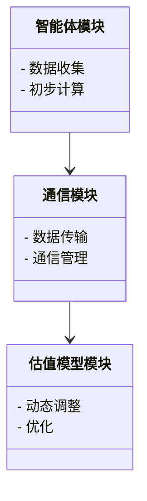

                 


# 利用多智能体AI实现动态估值模型调整

## 关键词：多智能体AI、动态估值模型、协作机制、算法设计、系统架构

## 摘要：本文详细探讨了利用多智能体AI实现动态估值模型调整的方法。通过分析多智能体AI的核心概念、动态估值模型的特性以及它们之间的协作机制，本文提出了基于多智能体的动态估值调整算法，并通过系统架构设计和项目实战展示了其实现过程。文章还讨论了算法的数学模型、系统设计的具体步骤以及实际应用中的注意事项。

---

## 第一部分: 多智能体AI与动态估值模型的基础

### 第1章: 多智能体AI与动态估值模型的背景

#### 1.1 多智能体AI的背景与定义
多智能体AI是指由多个智能体组成的协作系统，每个智能体能够独立执行任务并与其他智能体进行交互。这些智能体通常具有以下特征：
- **自主性**：能够独立决策和行动。
- **反应性**：能够感知环境并实时调整行为。
- **协作性**：通过通信和协调完成共同目标。

#### 1.2 动态估值模型的背景与挑战
动态估值模型是指在动态环境中实时调整和更新的估值模型。传统静态模型在面对环境变化时表现不佳，因此需要动态调整以适应变化。动态估值模型的挑战包括：
- 数据实时性要求高。
- 环境不确定性大。
- 需要快速响应和调整。

#### 1.3 问题描述与目标
本文的目标是利用多智能体AI实现动态估值模型的实时调整。具体问题包括：
- 如何设计多智能体协作机制以优化估值模型。
- 如何实现动态调整以适应环境变化。
- 如何保证系统在动态环境下的稳定性和准确性。

---

### 第2章: 多智能体AI与动态估值模型的关系

#### 2.1 多智能体AI在动态估值中的作用
多智能体AI通过协作和分布式计算，能够有效提升动态估值模型的准确性和响应速度。每个智能体负责特定部分的数据收集和处理，共同完成估值模型的调整。

#### 2.2 动态估值模型的属性特征对比
以下是静态模型与动态模型的对比：

| 特性 | 静态模型 | 动态模型 |
|------|----------|----------|
| 数据更新频率 | 低       | 高       |
| 模型适应性 | 差       | 好       |
| 计算复杂度 | 低       | 高       |

#### 2.3 多智能体模型与单智能体模型的对比
以下是多智能体模型与单智能体模型的对比：

| 特性 | 多智能体模型 | 单智能体模型 |
|------|--------------|--------------|
| 计算能力 | 强大        | 较弱         |
| 并行处理 | 支持        | 不支持       |
| 协作性 | 高           | 低           |

---

## 第二部分: 多智能体AI与动态估值模型的核心概念

### 第3章: 多智能体AI与动态估值模型的关系

#### 3.1 多智能体AI在动态估值中的作用
多智能体AI通过协作和分布式计算，能够有效提升动态估值模型的准确性和响应速度。每个智能体负责特定部分的数据收集和处理，共同完成估值模型的调整。

#### 3.2 动态估值模型的属性特征对比
以下是静态模型与动态模型的对比：

| 特性 | 静态模型 | 动态模型 |
|------|----------|----------|
| 数据更新频率 | 低       | 高       |
| 模型适应性 | 差       | 好       |
| 计算复杂度 | 低       | 高       |

#### 3.3 多智能体模型与单智能体模型的对比
以下是多智能体模型与单智能体模型的对比：

| 特性 | 多智能体模型 | 单智能体模型 |
|------|--------------|--------------|
| 计算能力 | 强大        | 较弱         |
| 并行处理 | 支持        | 不支持       |
| 协作性 | 高           | 低           |

---

### 第4章: 多智能体AI与动态估值模型的实体关系图

#### 4.1 实体关系图的定义
实体关系图（ER图）用于描述系统中各实体之间的关系。在多智能体AI与动态估值模型中，主要实体包括：
- **智能体**：负责数据收集和处理。
- **动态估值模型**：负责估值计算和调整。
- **环境**：提供动态数据和反馈。

#### 4.2 多智能体AI与动态估值模型的ER图
```mermaid
er
  actor 多智能体AI系统
  actor 动态估值模型
  actor 环境
  relation 实现动态调整
  relation 提供实时数据
  relation 接收反馈
```

---

## 第三部分: 算法设计与系统实现

### 第5章: 算法设计

#### 5.1 算法概述
本文提出了一种基于多智能体AI的动态估值调整算法，包括以下几个步骤：
1. 数据收集与预处理。
2. 智能体协作与计算。
3. 动态调整与优化。

#### 5.2 算法的数学模型
以下是一个简化的数学模型：

$$ V_{new} = V_{old} + \alpha \cdot \Delta V $$

其中，\( V_{new} \) 是调整后的估值，\( V_{old} \) 是原始估值，\( \alpha \) 是调整系数，\( \Delta V \) 是变化量。

#### 5.3 算法实现步骤
1. 数据收集：智能体从环境中收集实时数据。
2. 数据预处理：对数据进行清洗和标准化处理。
3. 协作计算：多个智能体协同计算，得到初步估值。
4. 动态调整：根据反馈调整估值模型。
5. 优化与迭代：不断优化模型以提高准确性。

---

### 第6章: 系统架构设计

#### 6.1 系统架构概述
系统架构包括以下几个部分：
- **智能体模块**：负责数据收集和初步计算。
- **估值模型模块**：负责动态调整和优化。
- **通信模块**：负责智能体之间的数据传输和通信。

#### 6.2 系统功能设计
以下是系统功能设计的领域模型类图：



---

### 第7章: 项目实战

#### 7.1 环境安装
需要安装以下工具和库：
- Python
- NumPy
- Pandas
- Scikit-learn
- Mermaid

#### 7.2 核心代码实现
以下是核心代码实现：

```python
import numpy as np
import pandas as pd

class MultiAgentAI:
    def __init__(self, agents):
        self.agents = agents

    def collect_data(self):
        data = []
        for agent in self.agents:
            data.append(agent.collect())
        return data

class DynamicValuationModel:
    def __init__(self):
        self.coefficients = np.random.rand(10, 1)

    def estimate(self, X):
        return X.dot(self.coefficients)

    def update(self, X, y_true):
        self.coefficients = np.linalg.lstsq(X, y_true, rcond=None)[0]

class Agent:
    def __init__(self, id):
        self.id = id

    def collect(self):
        # 模拟数据收集
        return np.random.rand(10)
```

#### 7.3 代码解读与分析
1. **MultiAgentAI类**：管理多个智能体，负责数据的收集和处理。
2. **DynamicValuationModel类**：实现动态估值模型，能够根据新数据调整模型参数。
3. **Agent类**：单个智能体的实现，负责数据收集。

---

## 第四部分: 总结与展望

### 第8章: 总结

#### 8.1 核心结论
- 多智能体AI能够有效提升动态估值模型的准确性和响应速度。
- 通过协作和分布式计算，系统能够在动态环境下实现高效的估值调整。

#### 8.2 实践中的注意事项
- 确保智能体之间的通信延迟在可接受范围内。
- 定期更新和优化估值模型以适应环境变化。

### 第9章: 未来展望

#### 9.1 研究方向
- 进一步优化多智能体协作机制，提高系统的效率和准确性。
- 探索更多应用场景，如金融市场的实时估值、环境监测等。

#### 9.2 技术发展趋势
- 结合边缘计算，进一步提升系统的实时性和响应速度。
- 研究更高效的算法，降低计算复杂度。

---

## 作者：AI天才研究院/AI Genius Institute & 禅与计算机程序设计艺术 /Zen And The Art of Computer Programming

---

以上是《利用多智能体AI实现动态估值模型调整》的完整目录大纲和部分内容。

