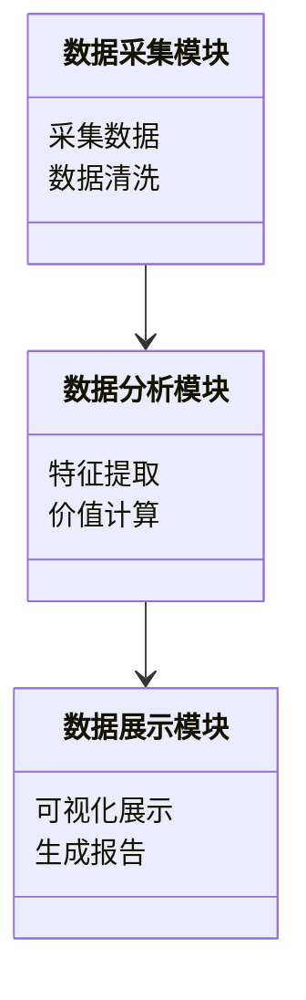

                 


# 利用多智能体AI评估公司的数据资产价值

> 关键词：数据资产价值，多智能体AI，资产评估，数据驱动决策，企业价值最大化

> 摘要：本文系统探讨了利用多智能体AI技术评估公司数据资产价值的方法，详细阐述了数据资产价值评估的核心概念、多智能体AI的基本原理、算法实现、系统架构设计以及实际应用案例。通过深入分析，本文旨在为企业提供一种高效、准确的数据资产评估策略，帮助企业在数字化转型中实现数据驱动的决策和价值最大化。

---

## 第1章：数据资产价值评估的背景与挑战

### 1.1 数据资产的基本概念

#### 1.1.1 数据资产的定义
数据资产是指企业拥有或控制的、能够为企业带来经济利益的数据资源。这些数据可以是结构化的（如数据库中的表格）或非结构化的（如文档、图像），并且具有可访问性、完整性、机密性和合规性等特点。

#### 1.1.2 数据资产的关键特征
- **可访问性**：数据能够被 authorized users 等访问。
- **完整性**：数据的准确性、一致性。
- **机密性**：数据的安全性，防止未授权访问。
- **合规性**：符合相关法律法规。

#### 1.1.3 数据资产在企业中的重要性
- 数据资产是企业的重要资源，能够支持决策、优化流程、提升效率。
- 数据资产的价值不仅体现在其直接贡献，还体现在其衍生价值，如数据产品和服务。

---

### 1.2 数据资产评估的必要性

#### 1.2.1 企业为什么要评估数据资产价值
- 数据驱动决策的需求日益增加，企业需要了解数据的实际价值。
- 数据资产评估是数据治理的重要组成部分，有助于优化数据管理。
- 数据资产评估结果可以为企业的战略决策提供支持。

#### 1.2.2 数据资产评估的常见挑战
- 数据的多样性与复杂性导致评估难度大。
- 数据的价值往往依赖于上下文，难以量化。
- 数据资产评估需要结合技术、业务和法律等多个维度。

---

### 1.3 多智能体AI的基本原理

#### 1.3.1 多智能体系统概述
多智能体系统是由多个相互作用的智能体组成的系统，每个智能体都有自己的目标和决策机制。这些智能体通过协作与竞争，共同完成复杂任务。

#### 1.3.2 多智能体AI的核心特点
- **分布性**：多个智能体独立运作。
- **协作性**：智能体之间通过通信和协作提高整体效率。
- **动态性**：系统环境和智能体状态不断变化。

---

### 1.4 本章小结
本章介绍了数据资产的基本概念、评估的必要性以及多智能体AI的基本原理，为后续内容奠定了基础。接下来，我们将探讨多智能体AI如何与数据资产评估相结合。

---

## 第2章：多智能体AI与数据资产评估的关系

### 2.1 多智能体AI的基本原理

#### 2.1.1 多智能体系统的组成
- **智能体**：独立决策的个体。
- **环境**：智能体所处的外部世界。
- **通信机制**：智能体之间的信息交换方式。

#### 2.1.2 多智能体系统中的通信与协作
- **通信协议**：定义智能体之间的信息交换格式。
- **协作机制**：通过协作提高整体性能。

---

### 2.2 数据资产评估的核心要素

#### 2.2.1 数据的完整性、准确性、及时性
- **完整性**：数据是否全面。
- **准确性**：数据是否真实。
- **及时性**：数据是否更新及时。

#### 2.2.2 数据的可访问性、可扩展性、可维护性
- **可访问性**：数据是否易于获取。
- **可扩展性**：系统是否能处理大量数据。
- **可维护性**：数据是否易于管理和更新。

#### 2.2.3 数据的商业价值与战略价值
- **商业价值**：数据直接带来的经济利益。
- **战略价值**：数据对企业长期发展的潜在影响。

---

### 2.3 多智能体AI在数据资产评估中的应用

#### 2.3.1 提升评估准确性
- 多智能体AI通过协作和互补，提高数据评估的全面性。

#### 2.3.2 优化评估效率
- 多智能体AI能够并行处理大量数据，缩短评估时间。

#### 2.3.3 处理数据资产评估中的不确定性
- 多智能体AI通过分布式计算和自适应机制，有效应对数据资产评估中的不确定性。

---

### 2.4 本章小结
本章探讨了多智能体AI与数据资产评估的关系，重点分析了多智能体AI在提升数据资产评估准确性、效率和应对不确定性方面的优势。下一章将详细介绍多智能体AI的算法原理。

---

## 第3章：多智能体AI的算法原理

### 3.1 多智能体系统的算法框架

#### 3.1.1 分布式计算与协作机制
- 分布式计算：任务分解到多个节点。
- 协作机制：智能体之间通过通信完成协作。

#### 3.1.2 多智能体中的学习与推理
- 机器学习算法：如强化学习、监督学习。
- 推理机制：基于知识库进行推理。

#### 3.1.3 多智能体中的决策优化
- 分布式决策：每个智能体独立决策。
- 协作决策：基于协作机制的联合决策。

---

### 3.2 数据资产评估的数学模型

#### 3.2.1 数据价值的量化模型
- 数据价值 = 函数（数据特征、业务目标、市场环境）
- 数据特征包括完整性、准确性等。

#### 3.2.2 数据资产的评估指标体系
- 综合指标：结合多个评估指标。
- 权重分配：根据重要性分配权重。

---

### 3.3 多智能体AI的数学公式

#### 3.3.1 数据资产评估的公式推导
$$ V = \sum_{i=1}^{n} w_i x_i $$
其中，V为数据价值，w_i为权重，x_i为特征值。

#### 3.3.2 多智能体协作的数学表达
$$ C = \sum_{j=1}^{m} f_j(s_j) $$
其中，C为协作价值，s_j为智能体状态，f_j为协作函数。

---

### 3.4 本章小结
本章详细讲解了多智能体AI的算法原理和数据资产评估的数学模型，为后续的系统设计和实现奠定了基础。

---

## 第4章：数据资产评估系统的架构设计

### 4.1 系统功能需求分析

#### 4.1.1 数据采集与处理模块
- 数据清洗：处理缺失值、异常值。
- 数据转换：将数据转换为统一格式。

#### 4.1.2 数据分析与评估模块
- 数据特征提取：提取关键特征。
- 数据价值计算：使用数学模型计算价值。

#### 4.1.3 数据价值展示与报告
- 可视化展示：图表形式展示评估结果。
- 生成报告：详细报告数据资产评估结果。

---

### 4.2 系统架构设计

#### 4.2.1 领域模型


#### 4.2.2 系统架构图


---

### 4.3 本章小结
本章详细分析了数据资产评估系统的功能需求和架构设计，展示了系统的整体结构和模块关系。

---

## 第5章：项目实战

### 5.1 环境安装与配置

#### 5.1.1 安装Python
```bash
python --version
pip install numpy pandas matplotlib
```

#### 5.1.2 安装多智能体AI框架
```bash
pip install gym
```

---

### 5.2 系统核心实现源代码

#### 5.2.1 数据采集模块
```python
import pandas as pd
def collect_data():
    data = pd.read_csv('data.csv')
    return data
```

#### 5.2.2 数据分析模块
```python
def assess_value(data):
    # 数据预处理
    # 特征提取
    # 价值计算
    return value
```

---

### 5.3 案例分析与详细解读
通过具体案例分析，展示如何利用多智能体AI评估公司数据资产价值，包括数据清洗、特征提取、价值计算和结果展示。

---

### 5.4 本章小结
本章通过项目实战，详细讲解了数据资产评估系统的实现过程，帮助读者理解理论与实践的结合。

---

## 第6章：总结与展望

### 6.1 本章总结
本文系统探讨了利用多智能体AI评估公司数据资产价值的方法，涵盖了背景介绍、核心概念、算法原理、系统设计和项目实战。

### 6.2 注意事项
- 数据资产评估需要结合企业实际情况。
- 多智能体AI的应用需要考虑系统的复杂性和协作性。

### 6.3 拓展阅读
- 推荐相关书籍和论文，供读者深入学习。

---

## 作者：AI天才研究院/AI Genius Institute & 禅与计算机程序设计艺术 /Zen And The Art of Computer Programming

