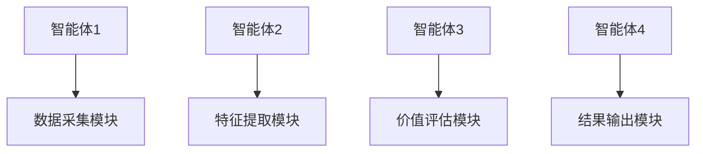

                 


# 利用多智能体AI评估商业秘密价值

> **关键词**：多智能体AI，商业秘密，价值评估，分布式系统，强化学习，知识图谱，协作机制

> **摘要**：  
> 商业秘密是企业核心竞争力的重要组成部分，其价值评估对于企业决策具有重要意义。然而，传统的方法往往难以准确捕捉商业秘密的多维度价值。本文提出利用多智能体AI技术，通过分布式协作和知识共享，实现对商业秘密价值的智能化评估。文章详细探讨了多智能体AI的原理、算法模型、系统架构，并结合实际案例，展示了如何通过技术创新解决商业秘密价值评估的挑战。

---

## 第1章: 商业秘密与多智能体AI概述

### 1.1 商业秘密的基本概念

#### 1.1.1 商业秘密的定义与特征
商业秘密是指企业在经营活动中形成的，不为公众所知悉，能为企业带来经济利益，具有实用性并经企业采取保密措施的技术信息和经营信息。其主要特征包括：
- **秘密性**：不为外界所知。
- **价值性**：能够为企业带来竞争优势。
- **实用性**：可直接用于生产经营活动。
- **保密性**：企业采取了保密措施。

#### 1.1.2 商业秘密的分类与价值
商业秘密可以分为两类：技术秘密和经营秘密。技术秘密包括专利、配方、工艺流程等；经营秘密则包括客户信息、市场策略、财务数据等。其价值体现在以下几个方面：
- **经济价值**：直接关系到企业的盈利能力。
- **竞争优势**：决定了企业在市场中的地位。
- **创新价值**：是企业技术创新的核心。

#### 1.1.3 商业秘密保护的法律框架
全球范围内，商业秘密的保护主要通过《反不正当竞争法》、《专利法》等法律法规实现。例如，美国的《联邦反不正当竞争法》和欧盟的《统一商业秘密指令》都为企业提供了明确的法律保护框架。

---

### 1.2 多智能体AI的基本概念

#### 1.2.1 多智能体系统的基本定义
多智能体系统（Multi-Agent System, MAS）是由多个具有自主决策能力的智能体组成的分布式系统，这些智能体能够通过协作完成复杂任务。

#### 1.2.2 多智能体AI的核心特点
- **分布式性**：多个智能体独立运行，协作完成任务。
- **自主性**：每个智能体都有自己的决策能力。
- **协作性**：智能体之间通过通信和协作提高整体性能。
- **动态性**：系统能够适应环境的变化。

#### 1.2.3 多智能体AI与传统AI的区别
传统AI（如单智能体系统）依赖于中心化的决策机制，而多智能体AI通过分布式协作实现目标。例如，在图像识别任务中，单智能体系统可能由一个模型完成，而多智能体系统则可能由多个模型协作完成。

---

### 1.3 商业秘密价值评估的必要性

#### 1.3.1 商业秘密价值评估的目的
- **资产定价**：帮助企业准确评估商业秘密的价值。
- **风险管理**：识别潜在的法律风险和经济损失。
- **决策支持**：为企业并购、知识产权保护等提供数据支持。

#### 1.3.2 商业秘密价值评估的挑战
- **数据稀疏性**：商业秘密往往缺乏公开数据支持。
- **动态性**：商业秘密的价值可能随市场变化而变化。
- **复杂性**：涉及技术、法律、市场等多维度因素。

#### 1.3.3 多智能体AI在评估中的作用
多智能体AI能够通过分布式协作，整合多源信息，实现对商业秘密价值的全面评估。例如，一个智能体可以负责技术分析，另一个负责市场分析，通过协作得出综合评估结果。

---

### 1.4 本章小结
本章介绍了商业秘密的基本概念、分类、法律保护框架以及多智能体AI的核心特点。通过对比传统AI与多智能体AI，明确了多智能体AI在商业秘密价值评估中的独特优势。

---

## 第2章: 多智能体AI的核心原理与算法

### 2.1 多智能体系统的原理与架构

#### 2.1.1 多智能体系统的组成与功能
- **智能体**：具有感知、决策和行动能力的个体。
- **通信机制**：智能体之间的信息交互方式。
- **协作协议**：智能体之间协作的规则和策略。

#### 2.1.2 多智能体AI的协作机制
- **分布式协作**：智能体独立决策，通过通信实现协作。
- **任务分配**：根据智能体的能力分配任务。
- **动态协调**：根据环境变化调整协作策略。

---

### 2.2 多智能体AI的算法模型

#### 2.2.1 分布式强化学习
分布式强化学习（Distributed Reinforcement Learning, DRL）是多智能体协作的核心算法。其基本思想是通过智能体之间的协作，实现全局目标的优化。例如，在商业秘密评估中，每个智能体负责评估不同的维度，通过协作得出最终结果。

#### 2.2.2 联合学习与知识共享
联合学习（Federated Learning）是一种分布式学习方法，通过在多个设备或中心之间联合训练模型，而不交换数据。知识共享则是通过图结构将智能体的知识整合起来，形成全局知识图谱。

#### 2.2.3 跨智能体决策机制
跨智能体决策机制通过协调多个智能体的决策，实现最优结果。例如，使用加权投票法（Weighted Voting）或共识算法（Consensus Algorithm）。

---

### 2.3 本章小结
本章详细介绍了多智能体AI的核心原理和算法模型，包括分布式强化学习、联合学习和跨智能体决策机制。这些算法为商业秘密价值评估提供了理论基础。

---

## 第3章: 商业秘密价值评估的系统分析与架构设计

### 3.1 问题场景介绍

#### 3.1.1 问题背景
商业秘密价值评估需要考虑技术、市场、法律等多个因素，传统方法难以准确评估。

#### 3.1.2 问题目标
通过多智能体AI技术，实现对商业秘密价值的智能化评估。

#### 3.1.3 问题解决
利用多智能体AI的分布式协作能力，整合多源信息，实现精准评估。

---

### 3.2 系统功能设计

#### 3.2.1 功能模块
- **数据采集**：采集商业秘密相关信息。
- **特征提取**：提取商业秘密的特征。
- **价值评估**：基于多智能体AI算法，评估商业秘密价值。
- **结果输出**：输出评估结果。

#### 3.2.2 功能流程
1. 数据采集：获取商业秘密的相关数据。
2. 特征提取：提取数据中的关键特征。
3. 价值评估：通过多智能体AI算法，综合评估商业秘密价值。
4. 结果输出：输出评估结果，并提供改进建议。

---

### 3.3 系统架构设计

#### 3.3.1 系统架构图


#### 3.3.2 接口设计
- **数据接口**：与数据源对接，获取商业秘密数据。
- **评估接口**：与价值评估模块对接，输出评估结果。
- **用户接口**：与用户交互，展示评估结果。

---

### 3.4 本章小结
本章详细设计了商业秘密价值评估系统的功能模块和架构，为后续的实现提供了明确的指导。

---

## 第4章: 项目实战——商业秘密价值评估系统实现

### 4.1 环境配置

#### 4.1.1 系统环境
- 操作系统：Linux
- 开发工具：Python 3.8，PyTorch 1.9，Flask 2.0

#### 4.1.2 数据集
- 数据来源：企业提供的商业秘密数据。

---

### 4.2 核心代码实现

#### 4.2.1 数据采集模块
```python
import requests

def fetch_data(url):
    response = requests.get(url)
    return response.json()
```

#### 4.2.2 特征提取模块
```python
from sklearn.feature_extraction.text import TfidfVectorizer

def extract_features(text):
    vectorizer = TfidfVectorizer()
    features = vectorizer.fit_transform([text])
    return features
```

#### 4.2.3 价值评估模块
```python
import torch
import torch.nn as nn

class ValueEstimator(nn.Module):
    def __init__(self, input_size, output_size):
        super(ValueEstimator, self).__init__()
        self.fc = nn.Linear(input_size, output_size)
    
    def forward(self, x):
        return self.fc(x)
```

---

### 4.3 代码解读与分析

#### 4.3.1 数据采集模块
通过`requests`库获取数据，实现数据的远程采集。

#### 4.3.2 特征提取模块
使用TF-IDF方法提取文本特征，将非结构化数据转化为结构化特征向量。

#### 4.3.3 价值评估模块
基于神经网络模型，对提取的特征进行评估，输出商业秘密的价值。

---

### 4.4 实际案例分析

#### 4.4.1 案例背景
某企业的技术秘密价值评估。

#### 4.4.2 案例分析
通过多智能体AI算法，整合技术、市场、法律等多方面信息，评估该技术秘密的价值。

---

### 4.5 本章小结
本章通过实际案例，详细展示了商业秘密价值评估系统的实现过程，包括环境配置、核心代码实现和案例分析。

---

## 第5章: 总结与展望

### 5.1 总结
本文提出利用多智能体AI技术，通过分布式协作和知识共享，实现对商业秘密价值的智能化评估。通过详细阐述算法原理、系统架构和实际案例，证明了多智能体AI在商业秘密价值评估中的有效性。

### 5.2 展望
未来的研究方向包括：
- 提高多智能体AI的协作效率。
- 扩展应用场景，如知识产权保护、企业风险管理等。

---

**作者**：AI天才研究院/AI Genius Institute & 禅与计算机程序设计艺术 /Zen And The Art of Computer Programming

