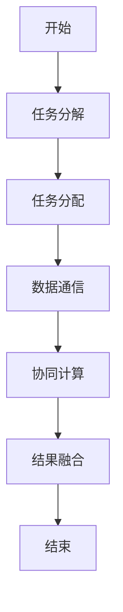
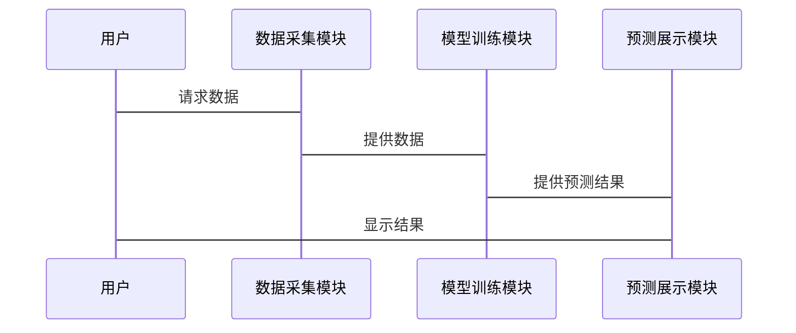

                 


# 利用多智能体系统构建全球宏观经济预测模型

> 关键词：多智能体系统，宏观经济预测，分布式计算，协同优化，系统架构设计

> 摘要：本文探讨如何利用多智能体系统构建全球宏观经济预测模型，结合MAS的核心原理和宏观经济预测的数学模型，详细讲解算法实现和系统架构设计，最后通过项目实战展示模型的应用。

---

## 第1章：多智能体系统与宏观经济预测概述

### 1.1 多智能体系统的概念与特点

#### 1.1.1 多智能体系统的定义
- 多智能体系统（MAS）是由多个智能体组成的分布式系统，每个智能体都是一个独立的实体，能够感知环境、自主决策并与其他智能体协作。

#### 1.1.2 多智能体系统的特征
| 特征 | 描述 |
|------|------|
| 分布性 | 智能体独立运行，分布在网络中 |
| 协作性 | 智能体之间通过通信协作完成任务 |
| 反应性 | 能够感知环境变化并实时响应 |
| 社会性 | 智能体之间存在复杂的社会关系和交互 |

#### 1.1.3 多智能体系统的优缺点
- **优点**：提高系统的灵活性和适应性，增强问题解决能力。
- **缺点**：设计复杂，通信开销大，存在协作冲突。

### 1.2 宏观经济预测的背景与挑战

#### 1.2.1 宏观经济预测的重要性
- 宏观经济预测对政府政策制定、企业战略规划具有重要意义。
- 经济指标如GDP、通胀率、失业率等影响国家经济运行。

#### 1.2.2 传统预测方法的局限性
- 统计模型（如ARIMA）依赖历史数据，难以捕捉复杂关系。
- 机器学习模型（如神经网络）计算复杂，难以解释。

#### 1.2.3 引入多智能体系统的必要性
- MAS能够分解问题，模拟经济主体行为，提供更精确的预测。

---

## 第2章：多智能体系统的原理与方法

### 2.1 多智能体系统的结构

#### 2.1.1 智能体的定义与分类
- **定义**：智能体是具有自主性的实体，能够感知环境并采取行动。
- **分类**：基于智能性和协作性，分为反应式、认知式智能体。

#### 2.1.2 多智能体系统的层次结构
- **物理层**：智能体与环境的交互接口。
- **逻辑层**：智能体的行为逻辑和决策机制。
- **通信层**：智能体间的通信协议和数据交换。

### 2.2 多智能体系统的通信与协作

#### 2.2.1 智能体间的通信机制
- **消息传递**：通过消息传递实现信息共享。
- **发布-订阅模式**：智能体发布信息，其他智能体订阅。

#### 2.2.2 协作与协调算法
- **分布式协商**：智能体通过协商达成一致。
- **冲突解决**：采用协商、仲裁机制解决冲突。

---

## 第3章：宏观经济预测的数学模型

### 3.1 GDP预测模型

#### 3.1.1 模型的构建
- 使用回归模型或时间序列模型预测GDP。
- 结合多智能体系统，模拟各经济主体的行为。

#### 3.1.2 模型的参数估计
- 采用最小二乘法或最大似然估计确定参数。

### 3.2 智能体间的协同优化

#### 3.2.1 协同优化的数学表达
- 使用分布式优化算法，如分布式梯度下降。
- 目标函数：最小化预测误差。

#### 3.2.2 算法的收敛性分析
- 分析算法的收敛速度和稳定性。

---

## 第4章：多智能体系统的算法实现

### 4.1 分布式计算算法

#### 4.1.1 分布式计算的实现步骤
1. **任务分解**：将问题分解为多个子任务。
2. **任务分配**：将子任务分配给不同的智能体。
3. **数据通信**：智能体之间交换数据。
4. **协同计算**：每个智能体完成子任务，汇总结果。

#### 4.1.2 算法的复杂度分析
- 分析算法的时间复杂度和空间复杂度。

### 4.2 协作预测算法

#### 4.2.1 协作预测的实现流程
- 智能体协作，利用各自的数据进行预测。
- 结果融合，生成最终预测结果。

#### 4.2.2 算法流程图（Mermaid）


---

## 第5章：系统设计与架构设计

### 5.1 系统需求分析

#### 5.1.1 项目背景
- 构建一个全球宏观经济预测系统，辅助决策。

#### 5.1.2 功能需求
- 数据采集模块：收集经济指标数据。
- 模型训练模块：训练预测模型。
- 预测展示模块：可视化预测结果。

### 5.2 系统架构设计

#### 5.2.1 系统架构图（Mermaid）


#### 5.2.2 接口设计
- 数据接口：提供数据采集和存储接口。
- 模型接口：提供训练和预测接口。

#### 5.2.3 交互流程图（Mermaid）


---

## 第6章：项目实战

### 6.1 环境安装与配置

#### 6.1.1 安装Python和相关库
- 安装Python 3.x
- 安装NumPy、Pandas、Scikit-learn等库。

### 6.2 核心代码实现

#### 6.2.1 数据采集模块
```python
import pandas as pd

def collect_data():
    data = pd.read_csv('economic_data.csv')
    return data

if __name__ == "__main__":
    collect_data()
```

#### 6.2.2 模型训练模块
```python
from sklearn.linear_model import LinearRegression

def train_model(data):
    model = LinearRegression()
    model.fit(data[['GDP', 'inflation']], data['unemployment'])
    return model

if __name__ == "__main__":
    data = collect_data()
    model = train_model(data)
    print(model.coef_)
```

#### 6.2.3 预测展示模块
```python
import matplotlib.pyplot as plt

def display_results(data, model):
    predictions = model.predict(data[['GDP', 'inflation']])
    plt.plot(data['year'], predictions, label='预测值')
    plt.plot(data['year'], data['unemployment'], label='实际值')
    plt.legend()
    plt.show()

if __name__ == "__main__":
    data = collect_data()
    model = train_model(data)
    display_results(data, model)
```

### 6.3 实际案例分析

#### 6.3.1 数据分析与特征工程
- 数据清洗：处理缺失值、异常值。
- 特征选择：选择影响目标变量的关键特征。

#### 6.3.2 模型评估与优化
- 使用交叉验证评估模型性能。
- 调参优化，提高预测准确率。

---

## 第7章：总结与展望

### 7.1 内容总结
- 本文详细介绍了多智能体系统在宏观经济预测中的应用，包括系统设计、算法实现和项目实战。

### 7.2 未来展望
- 研究更复杂的宏观经济模型。
- 探索更高效的分布式计算方法。

### 7.3 最佳实践 tips
- 选择合适的工具和库，如Python的Scikit-learn、Dask等。
- 注重数据质量和特征工程，提高模型性能。
- 定期更新模型，适应经济环境的变化。

---

## 作者：AI天才研究院 & 禅与计算机程序设计艺术

通过以上目录大纲，我们可以看到，文章从背景到理论，从算法到实现，逐步深入，内容详实，结构清晰。每一章都详细展开，确保读者能够系统地理解如何利用多智能体系统构建全球宏观经济预测模型。

