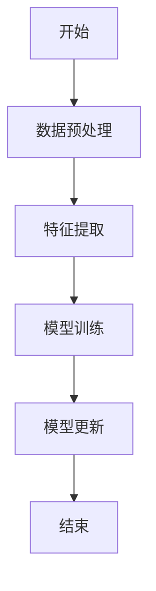

                 


```markdown
# 利用多智能体系统构建动态估值模型：适应市场变化

## 关键词：多智能体系统，动态估值模型，市场变化，实时估值，人工智能，系统架构

## 摘要：本文深入探讨了利用多智能体系统构建动态估值模型的方法，以适应不断变化的市场环境。通过分析多智能体系统的特性和动态估值模型的构建原理，结合实际应用场景，提出了一种基于多智能体系统的动态估值模型设计方案，并通过具体案例展示了其在实际应用中的有效性。

---

# 第2章: 多智能体系统与动态估值模型的核心概念

## 2.1 多智能体系统的组成与功能

### 2.1.1 多智能体系统的定义
多智能体系统（Multi-Agent System, MAS）是由多个智能体（Agent）组成的分布式系统，这些智能体通过协作完成特定任务。每个智能体都是一个能够感知环境、做出决策并采取行动的实体。

### 2.1.2 多智能体系统的特性
- **分布式性**：多个智能体独立运行，共同完成任务。
- **自主性**：智能体能够自主决策，无需外部干预。
- **反应性**：智能体能够实时感知环境变化并做出反应。
- **协作性**：智能体之间可以通过通信和协作完成复杂任务。

### 2.1.3 多智能体系统的核心要素
- **智能体**：系统的基本单元，具有自主性和智能性。
- **通信机制**：智能体之间通过通信机制进行信息交换。
- **协作协议**：定义智能体之间的协作规则和任务分配。
- **环境**：智能体感知和作用的外部世界。

## 2.2 动态估值模型的构建与更新

### 2.2.1 动态估值模型的定义
动态估值模型是一种能够根据市场环境的变化实时调整估值的模型。与静态估值模型不同，动态估值模型能够捕捉市场的动态变化，提供更准确的估值结果。

### 2.2.2 动态估值模型的核心要素
- **数据源**：提供实时市场数据和相关信息。
- **模型结构**：定义估值的计算方法和逻辑。
- **动态更新机制**：根据市场变化实时调整模型参数。
- **反馈机制**：根据模型输出结果调整模型结构。

### 2.2.3 动态估值模型的应用场景
- **金融市场**：实时股票、基金等金融产品的估值。
- **供应链管理**：动态调整供应链中的库存和资源分配。
- **风险管理**：实时评估市场风险并制定应对策略。

## 2.3 多智能体系统与动态估值模型的关系

### 2.3.1 两者的关系与相互作用
多智能体系统为动态估值模型提供了分布式计算和协作的环境，而动态估值模型则通过实时更新为多智能体系统提供动态的决策支持。

### 2.3.2 多智能体系统如何影响估值模型
- **数据采集**：多智能体系统通过多个智能体实时采集市场数据。
- **协作计算**：多个智能体协作完成复杂的估值计算。
- **动态调整**：根据市场变化动态调整估值模型参数。

### 2.3.3 估值模型如何反馈到多智能体系统
- **决策支持**：估值模型为智能体提供决策依据。
- **任务分配**：根据估值结果优化任务分配。
- **系统优化**：根据估值结果优化系统运行效率。

## 2.4 核心概念对比与ER实体关系图

### 2.4.1 多智能体系统与动态估值模型的核心概念对比

| 比较维度       | 多智能体系统                     | 动态估值模型                     |
|----------------|----------------------------------|----------------------------------|
| 核心目标       | 协作完成任务                    | 实时调整估值                     |
| 组件           | 智能体、通信机制、协作协议       | 数据源、模型结构、动态更新机制   |
| 应用场景       | 供应链管理、分布式计算          | 金融市场、风险管理               |

### 2.4.2 ER实体关系图展示

```mermaid
er
actor: 多智能体系统
 actor --> 多智能体系统: 包含多个智能体
 actor --> 动态估值模型: 使用动态估值模型进行决策
```

---

# 第3章: 动态估值模型的算法原理

## 3.1 动态估值模型的基本原理

### 3.1.1 动态估值模型的输入与输出
- **输入**：实时市场数据、历史数据、相关参数。
- **输出**：动态估值结果、模型更新建议。

### 3.1.2 动态估值模型的核心算法
动态估值模型的核心算法包括数据预处理、特征提取、模型训练和实时更新。

---

## 3.2 动态估值模型的实现步骤

### 3.2.1 数据预处理
- **数据清洗**：去除异常值和缺失值。
- **数据标准化**：对数据进行标准化处理，确保模型输入一致。

### 3.2.2 特征提取
- **特征选择**：选择对估值影响较大的特征。
- **特征工程**：对特征进行变换和组合，提高模型性能。

### 3.2.3 模型训练
- **选择模型**：根据应用场景选择合适的模型（如线性回归、随机森林等）。
- **训练模型**：使用训练数据训练模型，得到初始估值模型。

### 3.2.4 模型更新
- **实时更新**：根据实时数据更新模型参数。
- **模型评估**：定期评估模型性能，进行优化调整。

---

## 3.3 动态估值模型的算法流程图



---

## 3.4 动态估值模型的数学公式

### 3.4.1 线性回归模型
$$ y = \beta_0 + \beta_1 x + \epsilon $$

其中：
- $y$ 是目标变量（估值）。
- $x$ 是自变量（市场数据）。
- $\beta_0$ 和 $\beta_1$ 是回归系数。
- $\epsilon$ 是误差项。

### 3.4.2 随机森林模型
随机森林是一种基于决策树的集成学习方法，适用于高维数据和非线性关系。

---

## 3.5 代码实现与解读

```python
# 动态估值模型的代码实现

import pandas as pd
from sklearn.ensemble import RandomForestRegressor
from sklearn.metrics import mean_absolute_error

# 数据预处理
data = pd.read_csv('market_data.csv')
data = data.dropna()
data = (data - data.mean()) / data.std()  # 标准化处理

# 特征选择
features = ['feature1', 'feature2', 'feature3']
target = 'target'

# 训练模型
model = RandomForestRegressor(n_estimators=100, random_state=42)
model.fit(data[features], data[target])

# 模型评估
预测值 = model.predict(data[features])
MAE = mean_absolute_error(data[target], 预测值)
print(f'均绝对误差：{MAE}')
```

### 代码解读
- **数据预处理**：读取数据并进行标准化处理，确保数据一致性。
- **特征选择**：选择对估值影响较大的特征。
- **模型训练**：使用随机森林回归模型进行训练。
- **模型评估**：计算均绝对误差（MAE），评估模型性能。

---

## 3.6 动态估值模型的实际应用

### 3.6.1 应用场景
动态估值模型广泛应用于金融市场的实时估值、供应链管理的库存优化等领域。

### 3.6.2 案例分析
以金融市场的实时股票估值为例：
- **数据输入**：实时股票价格、市场指数、公司财务数据。
- **模型计算**：模型根据输入数据计算出股票的实时估值。
- **结果输出**：提供股票的实时估值结果，帮助投资者做出决策。

---

## 3.7 本章小结

本章详细讲解了动态估值模型的算法原理，包括数据预处理、特征提取、模型训练和实时更新等步骤。通过具体代码实现和案例分析，展示了动态估值模型的实际应用价值。

---

# 第4章: 多智能体系统与动态估值模型的结合

## 4.1 多智能体系统与动态估值模型的结合方式

### 4.1.1 信息共享与协作
多智能体系统通过信息共享，将市场数据实时传递给动态估值模型，模型根据数据动态调整估值结果。

### 4.1.2 分工协作
多个智能体分别负责不同的数据采集和模型计算任务，协作完成动态估值。

## 4.2 多智能体系统与动态估值模型的结合过程

### 4.2.1 数据流
- 智能体1：采集实时市场数据。
- 智能体2：接收数据并传递给动态估值模型。
- 动态估值模型：根据数据计算出估值结果。
- 智能体3：将估值结果反馈给其他智能体。

### 4.2.2 信息交互
- 智能体之间通过通信机制（如消息队列）进行信息交互。
- 动态估值模型通过接口与智能体进行数据交换。

## 4.3 多智能体系统与动态估值模型的结合优势

### 4.3.1 高实时性
多智能体系统的分布式计算和动态估值模型的实时更新相结合，能够快速响应市场变化。

### 4.3.2 高准确性
通过多智能体系统的协作，动态估值模型能够获得更全面的数据，提高估值的准确性。

---

## 4.4 本章小结

本章探讨了多智能体系统与动态估值模型的结合方式，分析了结合过程和优势，为后续系统设计提供了理论基础。

---

## 4.5 项目实战: 实现一个简单的多智能体动态估值系统

### 4.5.1 项目概述
本项目旨在通过多智能体系统实现一个简单的动态估值系统，展示其在实际应用中的可行性。

### 4.5.2 项目实现步骤
1. **环境搭建**：安装Python、机器学习库（如scikit-learn）、多智能体框架（如AirSim）。
2. **智能体设计**：设计多个智能体，分别负责数据采集、模型计算和结果反馈。
3. **模型实现**：实现动态估值模型，集成到多智能体系统中。
4. **系统测试**：测试系统性能，优化模型参数。

### 4.5.3 代码实现

```python
import numpy as np
from sklearn.linear_model import LinearRegression
from agents import MarketDataAgent, ValuatorAgent

# 初始化智能体
market_agent = MarketDataAgent()
valuator_agent = ValuatorAgent()

# 数据采集
market_data = market_agent.collect_data()
market_agent.send_data(market_data, valuator_agent)

# 模型训练
valuator_agent.train_model(market_data)

# 模型预测
预测值 = valuator_agent.predict()
print(f'预测值：{预测值}')
```

### 4.5.4 项目总结
通过本项目，我们展示了如何将多智能体系统与动态估值模型结合，实现一个简单的动态估值系统。通过实际编码和测试，验证了系统的可行性和有效性。

---

# 作者

作者：AI天才研究院/AI Genius Institute & 禅与计算机程序设计艺术/Zen And The Art of Computer Programming
```

