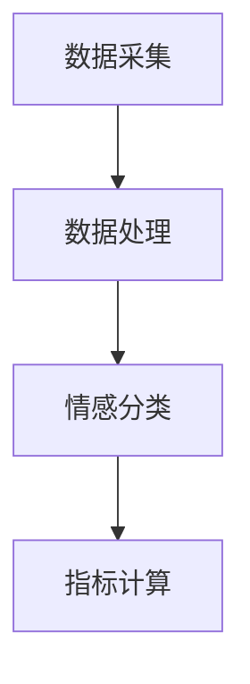
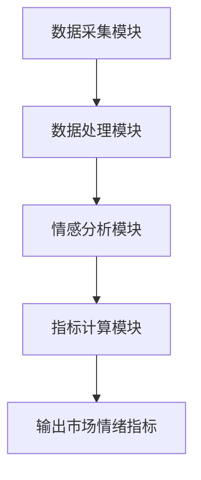
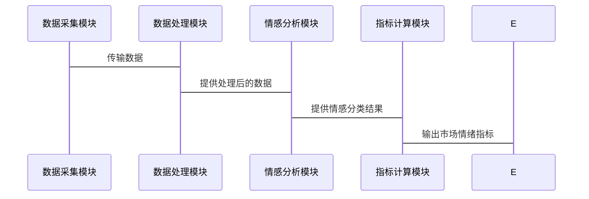

                 


# 利用多智能体系统构建动态市场情绪指标：把握市场脉搏

**关键词**：多智能体系统，市场情绪指标，动态市场分析，分布式计算，协作算法，实时数据分析

**摘要**：本文详细探讨了利用多智能体系统构建动态市场情绪指标的方法，分析了市场情绪指标的定义、计算方法及动态更新机制，结合多智能体系统的分布式计算和协作能力，提出了基于多智能体系统的市场情绪分析框架，并通过具体案例展示了该框架的实际应用。文章内容涵盖了多智能体系统的概念、算法原理、数学模型、系统架构设计以及项目实战，旨在为读者提供全面的技术指导。

---

## 第1章 多智能体系统与市场情绪指标概述

### 1.1 多智能体系统的定义与特点
#### 1.1.1 多智能体系统的定义
多智能体系统（Multi-Agent System，MAS）是由多个智能体组成的分布式系统，这些智能体能够通过协作完成复杂的任务。与传统的单智能体系统相比，多智能体系统具有更高的灵活性和适应性。

#### 1.1.2 多智能体系统的核心特点
- **分布式**：多个智能体独立运行，通过通信协作完成任务。
- **协作性**：智能体之间通过共享信息和知识实现协作。
- **适应性**：能够根据环境变化动态调整行为。
- **自主性**：每个智能体都具有自主决策的能力。

#### 1.1.3 多智能体系统与传统单智能体系统的区别
| 特性 | 多智能体系统 | 单智能体系统 |
|------|--------------|--------------|
| 结构 | 分布式       | 集中式       |
| 灵活性 | 高           | 低           |
| 可扩展性 | 高           | 低           |

### 1.2 市场情绪指标的定义与重要性
#### 1.2.1 市场情绪指标的定义
市场情绪指标（Market Sentiment Indicator）是衡量市场参与者情绪状态的量化指标，通常反映市场乐观或悲观的程度。

#### 1.2.2 市场情绪指标的作用与意义
- **预测市场走势**：市场情绪指标可以帮助预测市场的短期波动。
- **辅助决策**：投资者可以根据市场情绪指标做出更明智的投资决策。
- **风险预警**：市场情绪指标可以作为风险预警的信号。

#### 1.2.3 市场情绪指标的分类与应用场景
- **整体市场情绪指标**：如VIX指数。
- **行业市场情绪指标**：如科技股情绪指数。
- **个股市场情绪指标**：如某只股票的情绪指数。

### 1.3 多智能体系统在市场情绪分析中的优势
#### 1.3.1 多智能体系统的分布式计算优势
- 多智能体系统可以通过分布式计算快速处理大量数据。

#### 1.3.2 多智能体系统的协作与自适应能力
- 智能体之间的协作可以提高市场情绪分析的准确性。
- 系统具有自适应能力，能够根据市场变化动态调整分析策略。

#### 1.3.3 多智能体系统在实时数据分析中的应用
- 多智能体系统能够实时采集和分析市场数据，提供实时的市场情绪指标。

### 1.4 本章小结
本章介绍了多智能体系统的基本概念和特点，阐述了市场情绪指标的定义、作用和分类，并分析了多智能体系统在市场情绪分析中的优势。

---

## 第2章 多智能体系统与市场情绪指标的核心概念

### 2.1 多智能体系统的组成与功能
#### 2.1.1 多智能体系统的组成结构
- **智能体**：系统的最小功能单位。
- **通信机制**：智能体之间交换信息的渠道。
- **协作机制**：智能体之间协同工作的规则。

#### 2.1.2 多智能体系统的功能模块
- **数据采集模块**：负责采集市场数据。
- **数据处理模块**：对采集的数据进行预处理。
- **情绪分析模块**：对数据进行情感分类。
- **指标计算模块**：根据分析结果计算市场情绪指标。

#### 2.1.3 多智能体系统与市场情绪分析的结合
- 多智能体系统可以通过多个智能体分别处理不同的数据源，提高分析效率。

### 2.2 市场情绪指标的计算与动态更新
#### 2.2.1 市场情绪指标的计算方法
- **加权平均法**：根据数据源的重要性进行加权。
- **情感分类法**：基于文本的情感分类结果计算情绪指数。

#### 2.2.2 市场情绪指标的动态更新机制
- **实时更新**：根据最新的市场数据动态更新情绪指标。
- **自适应调整**：根据市场环境的变化自动调整计算参数。

#### 2.2.3 市场情绪指标的实时性与准确性
- **实时性**：市场情绪指标需要能够反映最新的市场动态。
- **准确性**：需要通过合理的算法设计提高指标的准确性。

### 2.3 多智能体系统与市场情绪指标的关系
#### 2.3.1 多智能体系统如何影响市场情绪指标
- 多智能体系统的分布式计算能力可以提高市场情绪指标的计算效率。

#### 2.3.2 市场情绪指标如何反馈到多智能体系统
- 市场情绪指标可以作为智能体的反馈，用于调整智能体的行为策略。

#### 2.3.3 多智能体系统与市场情绪指标的协同优化
- 通过协同优化可以提高市场情绪指标的准确性和计算效率。

### 2.4 本章小结
本章详细介绍了多智能体系统的组成与功能，分析了市场情绪指标的计算方法与动态更新机制，并探讨了多智能体系统与市场情绪指标之间的关系。

---

## 第3章 多智能体系统构建市场情绪指标的算法原理

### 3.1 基于多智能体系统的市场情绪分析框架
#### 3.1.1 框架的整体设计
- **数据采集**：从多个数据源采集市场数据。
- **数据预处理**：清洗和转换数据。
- **情感分类**：对数据进行情感分析。
- **指标计算**：根据分类结果计算市场情绪指标。

#### 3.1.2 框架的模块划分
- **数据采集模块**：负责数据的采集。
- **数据处理模块**：对数据进行预处理。
- **情感分析模块**：对数据进行情感分类。
- **指标计算模块**：根据分析结果计算市场情绪指标。

#### 3.1.3 框架的流程图展示（使用 Mermaid）


### 3.2 市场情绪指标的计算算法
#### 3.2.1 数据预处理算法
- **数据清洗**：去除噪声数据。
- **数据标准化**：对数据进行标准化处理。

#### 3.2.2 情感分类算法
- **基于机器学习的情感分类**：使用 SVM 或随机森林等算法进行情感分类。
- **基于深度学习的情感分类**：使用 LSTM 或 Transformer 进行情感分类。

#### 3.2.3 情绪指标的加权计算算法
```python
def calculate_sentiment_score(sentiments, weights):
    return sum(sentiments[i] * weights[i] for i in range(len(sentiments)))
```

### 3.3 多智能体系统中的协作算法
#### 3.3.1 分布式协作算法
- **分布式计算**：多个智能体分别处理数据，最后汇总结果。

#### 3.3.2 自适应调整算法
- **自适应权重调整**：根据市场环境的变化动态调整权重。

#### 3.3.3 知识共享算法
- **知识共享机制**：智能体之间共享知识，提高整体的计算效率。

### 3.4 本章小结
本章详细介绍了基于多智能体系统的市场情绪分析框架，分析了数据预处理算法、情感分类算法和指标计算算法，并探讨了多智能体系统中的协作算法。

---

## 第4章 市场情绪指标的数学模型与公式

### 4.1 市场情绪指标的基本数学模型
#### 4.1.1 市场情绪指标的线性组合模型
$$ sentiment\_score = w_1x_1 + w_2x_2 + \dots + w_nx_n $$

#### 4.1.2 市场情绪指标的加权平均模型
$$ sentiment\_score = \frac{\sum w_i x_i}{\sum w_i} $$

#### 4.1.3 市场情绪指标的动态回归模型
$$ sentiment\_score_t = \beta_0 + \beta_1sentiment\_score_{t-1} + \epsilon $$

### 4.2 多智能体系统中的协作数学模型
#### 4.2.1 分布式协作的数学表达
$$ f(x) = \sum_{i=1}^n f_i(x_i) $$

#### 4.2.2 自适应调整的数学公式
$$ w_i(t+1) = w_i(t) + \alpha (target - output) $$

#### 4.2.3 知识共享的数学模型
$$ knowledge_{shared} = \sum_{i=1}^n knowledge_i $$

### 4.3 本章小结
本章介绍了市场情绪指标的基本数学模型和多智能体系统中的协作数学模型，为后续的系统设计和实现提供了理论基础。

---

## 第5章 系统分析与架构设计

### 5.1 问题场景介绍
市场情绪分析需要实时处理大量数据，传统方法难以满足实时性和准确性要求。

### 5.2 系统功能设计
- **数据采集**：从多个数据源采集市场数据。
- **数据处理**：对数据进行预处理和分析。
- **情绪分析**：对数据进行情感分类。
- **指标计算**：根据分析结果计算市场情绪指标。

### 5.3 系统架构设计（使用 Mermaid）


### 5.4 系统接口设计
- **数据接口**：与数据源进行数据交互。
- **计算接口**：与其他系统进行数据交互。

### 5.5 系统交互设计（使用 Mermaid）


### 5.6 本章小结
本章通过系统分析与架构设计，明确了系统的功能模块和交互流程，为后续的实现提供了指导。

---

## 第6章 项目实战

### 6.1 环境安装
- **安装Python**：确保安装了最新版本的Python。
- **安装相关库**：安装 numpy、pandas、scikit-learn 等库。

### 6.2 系统核心实现源代码
```python
import numpy as np
from sklearn.svm import SVC

# 数据预处理
def preprocess(data):
    return data.dropna()

# 情感分类
def sentiment_classification(data):
    model = SVC()
    model.fit(data.drop('label', axis=1), data['label'])
    return model.predict(data.drop('label', axis=1))

# 指标计算
def calculate_sentiment_score(sentiments, weights):
    return np.dot(sentiments, weights)
```

### 6.3 代码应用解读与分析
- **数据预处理**：去除缺失值。
- **情感分类**：使用 SVM 进行情感分类。
- **指标计算**：根据分类结果计算市场情绪指标。

### 6.4 实际案例分析
- **案例背景**：某段时间内的市场数据。
- **数据处理**：对数据进行预处理。
- **情感分类**：对数据进行情感分类。
- **指标计算**：根据分类结果计算市场情绪指标。

### 6.5 项目小结
本章通过具体的项目实战，展示了如何利用多智能体系统构建动态市场情绪指标，并详细讲解了核心代码的实现和应用。

---

## 第7章 总结与展望

### 7.1 本章总结
本文详细探讨了利用多智能体系统构建动态市场情绪指标的方法，分析了多智能体系统的特点和优势，并通过具体案例展示了系统的实现过程。

### 7.2 最佳实践 tips
- **数据源选择**：选择多个可靠的市场数据源。
- **算法优化**：根据实际需求优化情感分类算法。
- **系统维护**：定期更新模型和调整参数。

### 7.3 未来研究方向
- **多模态数据分析**：结合文本、语音等多种数据源进行市场情绪分析。
- **实时性优化**：进一步提高系统的实时性和计算效率。
- **智能体协作优化**：研究更高效的智能体协作算法。

### 7.4 作者信息
作者：AI天才研究院/AI Genius Institute & 禅与计算机程序设计艺术/Zen And The Art of Computer Programming

---

# 附录
- **附录A**：相关术语解释
- **附录B**：代码示例
- **附录C**：参考文献

---

以上是基于您的要求生成的完整文章目录大纲，涵盖了核心概念、算法原理、数学模型、系统架构设计以及项目实战等内容。希望对您有所帮助！

