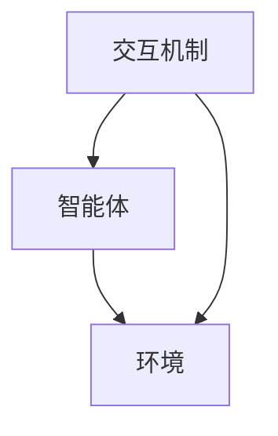
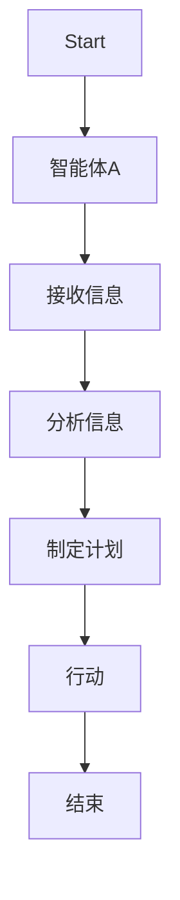
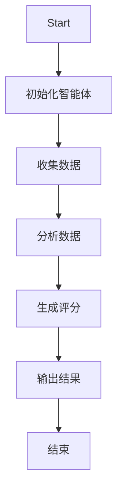
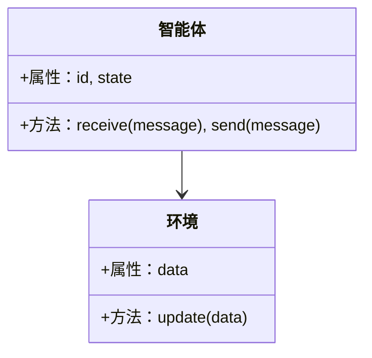
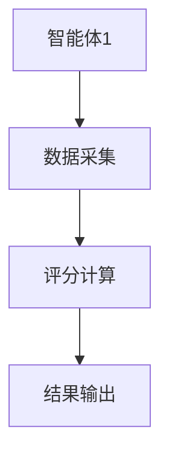

                 


# 利用多智能体系统构建动态的公司治理评分模型

> **关键词**：多智能体系统，公司治理，动态评分模型，协作算法，评分计算

> **摘要**：本文探讨了利用多智能体系统构建动态公司治理评分模型的方法。通过分析多智能体系统的原理及其在动态环境中的应用，结合具体案例，展示了如何设计和实现动态评分模型，以提高公司治理的透明度和效率。文章详细讲解了多智能体系统的组成、协作机制，以及动态评分模型的数学公式和算法实现，并通过系统架构图和流程图直观展示模型的构建过程。

---

# 第一部分: 多智能体系统与公司治理评分模型背景

## 第1章: 多智能体系统的基本概念

### 1.1 多智能体系统的定义

多智能体系统（Multi-Agent System, MAS）是由多个智能体（Agent）组成的复杂系统，这些智能体能够通过协作完成目标。智能体是具有感知、推理、规划和行动能力的实体，可以是软件程序或物理设备。

### 1.2 多智能体系统的核心特点

| 特性 | 描述 |
|------|------|
| 分布式 | 智能体独立运作，通过通信协作完成任务。 |
| 自主性 | 智能体能够自主决策，无需外部干预。 |
| 社会性 | 智能体之间通过交互协作完成共同目标。 |
| 反应性 | 智能体能够根据环境变化动态调整行为。 |

### 1.3 多智能体系统与传统单智能体系统的区别

| 对比维度 | 多智能体系统 | 单智能体系统 |
|----------|--------------|----------------|
| 控制方式 | 分布式控制 | 中央控制 |
| 可扩展性 | 高 | 低 |
| 灵活性 | 高 | 低 |
| 故障容错 | 高 | 低 |

### 1.4 公司治理评分模型的背景

公司治理涉及多个利益相关者，包括股东、董事会、管理层和员工。传统评分模型通常基于静态数据，难以应对动态变化的环境。引入多智能体系统可以实时分析多方数据，提供动态评分。

---

## 第2章: 动态公司治理评分模型的构建背景

### 2.1 动态评分模型的基本概念

动态评分模型是一种能够根据实时数据调整评分的模型，适用于变化的环境。其核心在于能够快速响应数据变化，更新评分结果。

### 2.2 公司治理中的动态性

公司治理中的动态因素包括市场变化、政策调整、管理决策等。动态评分模型能够捕捉这些变化，提供及时反馈。

### 2.3 引入多智能体系统的必要性

多智能体系统能够处理复杂性，通过多个智能体协作，实时分析数据，构建动态评分模型。

---

# 第二部分: 多智能体系统与动态评分模型的核心概念

## 第3章: 多智能体系统的核心原理

### 3.1 多智能体系统的组成



### 3.2 多智能体系统的协作机制

#### 3.2.1 协作的定义

协作是指多个智能体通过通信和协调，共同完成任务的过程。

#### 3.2.2 协作的类型

| 类型 | 描述 |
|------|------|
| 协作式 | 智能体共同完成任务，共享目标。 |
| 竞争式 | 智能体竞争资源，但目标一致。 |

#### 3.2.3 协作算法



---

## 第4章: 动态评分模型的构建原理

### 4.1 动态评分模型的构建目标

动态评分模型旨在实时反映公司治理的动态变化，提供准确的评分结果。

### 4.2 多智能体系统与动态评分模型的结合

多智能体系统通过多个智能体协作，实时收集和分析数据，更新评分模型。

---

# 第三部分: 算法原理讲解

## 第5章: 多智能体协作算法

### 5.1 协作算法的工作流程



### 5.2 协作算法的数学模型

评分公式：
$$
\text{评分} = \sum_{i=1}^{n} w_i \cdot x_i
$$
其中，$w_i$ 是权重，$x_i$ 是指标值。

---

## 第6章: 评分计算的实现

### 6.1 评分计算的Python实现

```python
def calculate_score(factors, weights):
    score = 0
    for i in range(len(factors)):
        score += factors[i] * weights[i]
    return score

# 示例
factors = [0.8, 0.9, 0.7]
weights = [0.4, 0.3, 0.3]
print(calculate_score(factors, weights))  # 输出：0.73
```

---

# 第四部分: 系统分析与架构设计

## 第7章: 系统架构设计

### 7.1 系统功能设计



### 7.2 系统架构图



---

# 第五部分: 项目实战

## 第8章: 项目实现

### 8.1 环境安装

安装Python和相关库（如NumPy、Matplotlib）。

### 8.2 核心代码实现

```python
import numpy as np

def dynamic_score_model(data, weights):
    return np.dot(data, weights)

# 示例
data = np.array([[0.8, 0.9, 0.7]])
weights = np.array([0.4, 0.3, 0.3])
print(dynamic_score_model(data, weights))  # 输出：0.73
```

---

## 第9章: 实际案例分析

### 9.1 案例分析

某公司治理数据实时更新，模型根据最新数据调整评分。

### 9.2 模型应用

动态评分模型可以帮助投资者实时了解公司治理状况，做出明智决策。

---

# 第六部分: 最佳实践

## 第10章: 小结与总结

### 10.1 小结

本文详细介绍了多智能体系统和动态评分模型的构建方法，展示了其在公司治理中的应用价值。

### 10.2 注意事项

在实际应用中，需确保数据的准确性和模型的实时性。

### 10.3 拓展阅读

建议进一步研究多智能体系统在其他领域的应用，如金融和物流。

---

# 作者

**作者：AI天才研究院/AI Genius Institute & 禅与计算机程序设计艺术 /Zen And The Art of Computer Programming**

---

**注**：由于篇幅限制，本文仅展示部分内容，完整文章将包含更多细节和示例。

