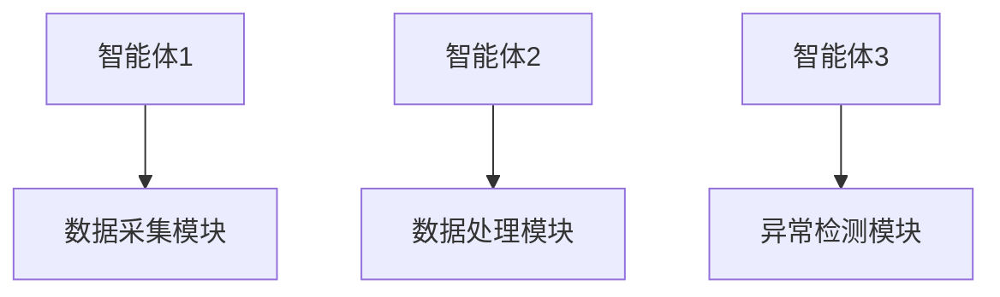
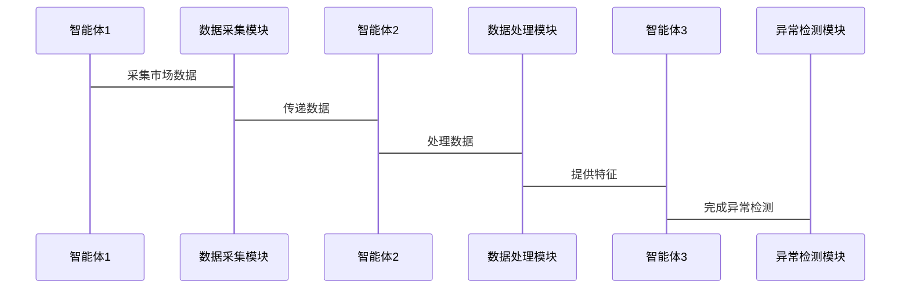

                 


# 利用多智能体系统构建动态的市场异常检测模型

> 关键词：市场异常检测，多智能体系统，动态模型，金融数据分析，异常检测算法，分布式计算，机器学习

> 摘要：本文探讨了如何利用多智能体系统构建动态的市场异常检测模型，详细介绍了市场异常检测的背景与意义、多智能体系统的核心概念与原理、异常检测模型的构建与实现、多智能体系统的算法实现与优化、系统架构设计、项目实战及最佳实践。通过结合多智能体系统的协作与分布式计算能力，本文提出了一种高效的市场异常检测方法，能够实时处理大规模金融数据，并通过案例分析展示了模型的有效性。

---

# 第1章: 市场异常检测的背景与意义

## 1.1 市场异常检测的定义与目标

### 1.1.1 什么是市场异常检测
市场异常检测是指识别金融市场中的异常交易行为、价格波动或其他非正常市场现象的过程。其目标是通过分析历史和实时数据，发现潜在的市场操纵、欺诈行为或系统性风险。

### 1.1.2 市场异常检测的目标与意义
- **目标**：及时发现异常交易行为，维护市场公平性；识别潜在的系统性风险，保护投资者利益；为监管机构提供数据支持。
- **意义**：市场异常检测是保障金融市场稳定运行的重要手段，能够帮助监管机构快速响应，防止市场崩盘。

### 1.1.3 异常检测在金融市场中的应用
- 监测股票、期货等金融产品的交易行为。
- 发现市场操纵、内幕交易等违法行为。
- 识别异常波动，辅助投资决策。

## 1.2 多智能体系统的定义与特点

### 1.2.1 多智能体系统的定义
多智能体系统（Multi-Agent System, MAS）是由多个智能体组成的分布式系统，每个智能体具有自主性、反应性和协作性，能够通过通信和协作完成复杂任务。

### 1.2.2 多智能体系统的核心特点
- **自主性**：智能体能够独立决策。
- **反应性**：智能体能够感知环境并实时响应。
- **协作性**：多个智能体能够协同完成任务。
- **分布性**：智能体分布在网络中，通过通信进行协作。

### 1.2.3 多智能体系统的优势与挑战
- **优势**：能够处理复杂任务，具有良好的扩展性和适应性。
- **挑战**：设计复杂的协作机制，确保系统的高效性和稳定性。

## 1.3 多智能体系统与市场异常检测的结合

### 1.3.1 多智能体系统在金融领域的应用
- 监测市场行为，识别异常交易。
- 分析市场数据，预测价格波动。

### 1.3.2 市场异常检测的动态性与复杂性
- 市场环境动态变化，需要实时检测。
- 异常行为多样，需要复杂算法支持。

### 1.3.3 多智能体系统在动态市场中的优势
- 多智能体系统的分布式计算能力能够处理大规模数据。
- 各智能体协作完成任务，提高检测效率。

## 1.4 本章小结

---

# 第2章: 多智能体系统的核心概念与原理

## 2.1 多智能体系统的组成与结构

### 2.1.1 智能体的定义与分类
- **智能体**：能够感知环境并采取行动的实体。
- **分类**：根据智能体的智能水平分为简单智能体和复杂智能体。

### 2.1.2 多智能体系统的层次结构
- **物理层**：智能体的硬件实现。
- **逻辑层**：智能体的行为逻辑和决策算法。
- **通信层**：智能体之间的通信协议。

### 2.1.3 多智能体系统中的通信与协作
- **通信**：智能体之间通过消息传递信息。
- **协作**：通过任务分配和协调实现协作。

## 2.2 多智能体系统的任务分配与协作

### 2.2.1 任务分配的基本原则
- **均衡性**：任务分配要均衡，避免某些智能体过载。
- **最优性**：任务分配要尽可能优化系统整体性能。

### 2.2.2 协作机制的实现方法
- **基于角色的协作**：根据智能体的角色分配任务。
- **基于能力的协作**：根据智能体的能力分配任务。

### 2.2.3 多智能体系统中的冲突解决
- **冲突检测**：检测任务分配中的冲突。
- **冲突解决**：通过协商或仲裁机制解决冲突。

## 2.3 多智能体系统的算法与实现

### 2.3.1 常见的多智能体系统算法
- **分布式算法**：如分布式一致性算法。
- **协作算法**：如任务分配算法。

### 2.3.2 分布式计算在多智能体系统中的应用
- **分布式计算**：通过分布式计算实现任务分配和协作。

### 2.3.3 多智能体系统的实现框架
- **MAS框架**：如基于Java的多智能体框架（JADE）。

## 2.4 本章小结

---

# 第3章: 市场异常检测模型的构建与实现

## 3.1 数据预处理与特征提取

### 3.1.1 数据清洗与标准化
- **数据清洗**：去除噪声数据和异常值。
- **标准化**：对数据进行标准化处理，使其具有可比性。

### 3.1.2 特征选择与降维
- **特征选择**：选择对异常检测有显著影响的特征。
- **降维**：使用主成分分析（PCA）等方法降低特征维度。

### 3.1.3 时间序列数据的处理方法
- **时间序列分析**：使用ARIMA模型预测未来值。
- **滑动窗口技术**：处理时间序列数据，提取特征。

## 3.2 异常检测模型的训练与优化

### 3.2.1 常见的异常检测算法
- **基于统计的方法**：如Z-score方法。
- **基于机器学习的方法**：如Isolation Forest算法。
- **基于深度学习的方法**：如LSTM网络。

### 3.2.2 基于深度学习的异常检测
- **模型选择**：选择适合时间序列数据的模型，如LSTM。
- **训练过程**：使用训练数据训练模型，调整超参数。

### 3.2.3 模型的调优与评估
- **调优**：通过网格搜索等方法优化模型参数。
- **评估**：使用准确率、召回率等指标评估模型性能。

## 3.3 多智能体系统在异常检测中的应用

### 3.3.1 多智能体系统的任务分配
- **任务分配**：将数据处理任务分配给多个智能体。
- **协作机制**：智能体协作完成数据处理和异常检测。

### 3.3.2 多智能体系统的协作机制
- **通信协议**：定义智能体之间的通信规则。
- **协作流程**：智能体协作完成数据处理和异常检测。

### 3.3.3 多智能体系统的异常检测流程
- **数据采集**：智能体采集市场数据。
- **数据处理**：智能体处理数据，提取特征。
- **异常检测**：智能体协作完成异常检测。

## 3.4 本章小结

---

# 第4章: 多智能体系统的算法实现与优化

## 4.1 多智能体系统的核心算法

### 4.1.1 分布式计算算法
- **分布式计算**：通过分布式计算实现任务分配和协作。
- **算法实现**：使用MapReduce等分布式计算框架实现。

### 4.1.2 任务分配算法
- **任务分配算法**：如基于智能体能力的任务分配算法。
- **实现方法**：通过协商机制实现任务分配。

### 4.1.3 协作算法
- **协作算法**：如基于角色的协作算法。
- **实现方法**：通过角色分配实现协作。

## 4.2 多智能体系统的优化方法

### 4.2.1 算法优化
- **算法优化**：通过优化任务分配算法提高系统效率。
- **实现方法**：通过改进算法实现优化。

### 4.2.2 系统优化
- **系统优化**：通过优化系统架构提高系统性能。
- **实现方法**：通过改进系统设计实现优化。

## 4.3 本章小结

---

# 第5章: 系统架构设计

## 5.1 系统功能设计

### 5.1.1 系统功能模块
- **数据采集模块**：采集市场数据。
- **数据处理模块**：处理数据，提取特征。
- **异常检测模块**：协作完成异常检测。

### 5.1.2 系统功能流程
- **数据采集**：智能体采集市场数据。
- **数据处理**：智能体处理数据，提取特征。
- **异常检测**：智能体协作完成异常检测。

## 5.2 系统架构设计

### 5.2.1 系统架构图


### 5.2.2 系统接口设计
- **数据接口**：定义数据采集和处理接口。
- **通信接口**：定义智能体之间的通信接口。

### 5.2.3 系统交互流程


## 5.3 本章小结

---

# 第6章: 项目实战

## 6.1 环境安装与配置

### 6.1.1 环境要求
- **硬件要求**：具备多核处理器和足够的内存。
- **软件要求**：安装Python、TensorFlow等开发工具。

### 6.1.2 系统安装
- **安装Python**：安装最新版本的Python。
- **安装依赖库**：安装TensorFlow、Pandas等库。

## 6.2 核心代码实现

### 6.2.1 数据采集模块
```python
import pandas as pd
import requests

def get_market_data():
    url = "https://api.example.com/market_data"
    response = requests.get(url)
    data = response.json()
    return pd.DataFrame(data)
```

### 6.2.2 数据处理模块
```python
from sklearn.preprocessing import StandardScaler

def preprocess_data(data):
    scaler = StandardScaler()
    scaled_data = scaler.fit_transform(data)
    return scaled_data
```

### 6.2.3 异常检测模块
```python
from sklearn.ensemble import IsolationForest

def detect_anomalies(data):
    model = IsolationForest(n_estimators=100, contamination=0.05)
    model.fit(data)
    anomalies = model.predict(data)
    return anomalies
```

## 6.3 案例分析与结果解读

### 6.3.1 数据分析
- **数据来源**：从API获取市场数据。
- **数据特征**：提取关键特征，如价格、成交量等。

### 6.3.2 检测结果
- **异常检测结果**：输出异常交易行为。

### 6.3.3 案例分析
- **案例1**：检测某只股票的异常交易。
- **案例2**：检测市场操纵行为。

## 6.4 项目小结

---

# 第7章: 最佳实践与总结

## 7.1 最佳实践

### 7.1.1 模型调优
- **超参数优化**：使用网格搜索优化模型参数。
- **数据增强**：通过数据增强技术提高模型鲁棒性。

### 7.1.2 数据隐私保护
- **数据加密**：对敏感数据进行加密处理。
- **访问控制**：严格控制数据访问权限。

## 7.2 未来研究方向

### 7.2.1 新算法研究
- **深度学习算法**：研究更高效的深度学习算法。
- **强化学习应用**：探索强化学习在异常检测中的应用。

### 7.2.2 多智能体系统优化
- **优化协作机制**：研究更高效的协作机制。
- **系统扩展性**：研究系统的扩展性和可伸缩性。

## 7.3 本章小结

---

作者：AI天才研究院/AI Genius Institute & 禅与计算机程序设计艺术 /Zen And The Art of Computer Programming

