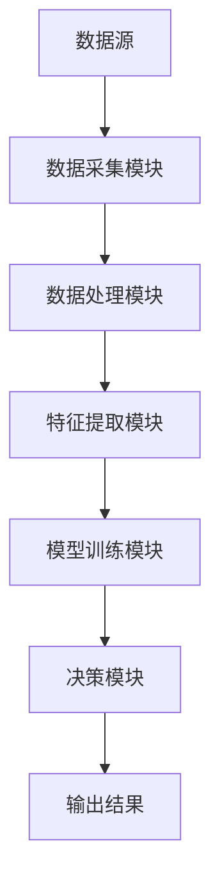
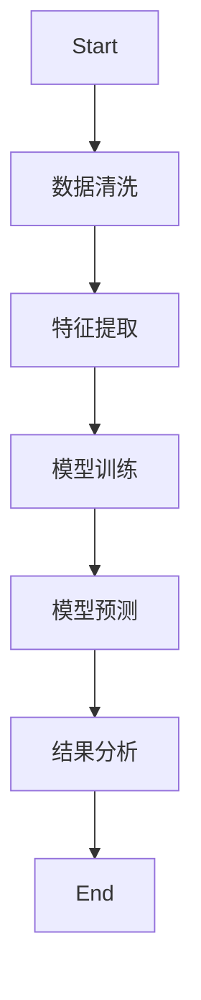

                 

# 利用多智能体系统构建动态的市场泡沫检测模型

> 关键词：多智能体系统，市场泡沫检测，分布式计算，金融市场，动态模型

> 摘要：本文详细探讨了利用多智能体系统构建动态市场泡沫检测模型的方法。通过分析市场泡沫的特征和传统检测方法的局限性，结合多智能体系统的协作性和分布式计算优势，提出了一种基于多智能体的动态检测模型。文章涵盖了系统架构设计、算法实现、案例分析及结果展示，展示了该模型在金融市场的实际应用效果。

---

## 第1章：多智能体系统概述

### 1.1 多智能体系统的基本概念

#### 1.1.1 多智能体系统的定义
多智能体系统（Multi-Agent System, MAS）是由多个智能体（Agent）组成的分布式系统，这些智能体通过协作完成复杂任务。每个智能体都是一个独立的实体，具备感知环境、自主决策和行动的能力。

#### 1.1.2 多智能体系统的特征
- **分布式性**：智能体分布在不同的位置，独立运作。
- **协作性**：智能体之间通过通信和协作完成共同目标。
- **反应性**：能够实时感知环境变化并做出反应。
- **社会性**：智能体之间存在社会关系，如协商和协调。

#### 1.1.3 多智能体系统与传统单智能体系统的区别
| 特性 | 多智能体系统 | 单智能体系统 |
|------|--------------|---------------|
| 系统结构 | 分布式、协作式 | 集中式、单一控制 |
| 可扩展性 | 高 | 低 |
| 故障容错 | 高 | 低 |
| 应用场景 | 适合复杂、动态环境 | 适合简单、静态环境 |

### 1.2 多智能体系统的架构

#### 1.2.1 分布式多智能体系统
- **特点**：每个智能体独立运行，通过通信协议协作。
- **适用场景**：适用于去中心化的任务分配和问题解决。

#### 1.2.2 集中式多智能体系统
- **特点**：有一个中央控制节点，协调各智能体的行动。
- **适用场景**：适用于任务高度集中和需要统一协调的环境。

#### 1.2.3 混合式多智能体系统
- **特点**：结合分布式和集中式架构，既有集中控制节点，又有分布式协作智能体。
- **适用场景**：适用于复杂任务，需要局部集中和全局分布的协作。

### 1.3 多智能体系统的应用领域

#### 1.3.1 金融领域的应用
- 市场分析与预测
- 风险管理与控制
- 自动化交易

#### 1.3.2 分布式计算中的应用
- 分布式问题求解
- 资源分配与调度
- 网络流量监控

#### 1.3.3 其他领域的应用
- 智能交通管理
- 环境监测与保护
- 游戏AI与虚拟现实

---

## 第2章：市场泡沫检测的背景与挑战

### 2.1 市场泡沫的定义与特征

#### 2.1.1 市场泡沫的定义
市场泡沫是指资产价格远高于其实际价值的现象，通常由过度投机和市场情绪驱动。

#### 2.1.2 市场泡沫的特征
- **价格虚高**：资产价格脱离基本面。
- **交易量激增**：市场参与者激增，交易活跃。
- **市场情绪波动**：投资者情绪从乐观到恐慌的快速变化。

#### 2.1.3 市场泡沫的形成机制
市场泡沫通常由市场参与者的行为偏差（如 herd mentality）和信息不对称引发，当市场参与者意识到泡沫破裂时，抛售潮导致价格骤跌。

### 2.2 传统市场泡沫检测方法的局限性

#### 2.2.1 基于单一指标的检测方法
- **问题**：仅依赖单个指标，如市盈率，无法全面反映市场状态。
- **局限性**：忽略市场动态和多因素影响。

#### 2.2.2 基于时间序列分析的传统方法
- **问题**：假设市场数据平稳，无法捕捉突变和非线性变化。
- **局限性**：对异常事件反应迟钝。

#### 2.2.3 传统方法的优缺点
| 方法 | 优点 | 缺点 |
|------|------|------|
| 单一指标法 | 简单易行 | 易受市场操纵影响 |
| 时间序列法 | 能捕捉趋势 | 无法应对突变 |

### 2.3 利用多智能体系统检测市场泡沫的优势

#### 2.3.1 分布式计算的优势
- **数据处理能力强**：多智能体系统能够处理海量数据，捕捉市场中的细微变化。
- **实时性高**：通过分布式协作，实时更新市场信息，快速做出反应。

#### 2.3.2 多智能体协作的优势
- **信息互补性**：不同智能体从不同数据源获取信息，综合分析市场状态。
- **决策分散性**：多个智能体共同决策，降低单一决策错误风险。

#### 2.3.3 动态适应性的优势
- **自适应能力强**：智能体能够根据市场变化动态调整策略。
- **容错性高**：即使部分智能体故障，其余智能体仍能继续运行。

---

## 第3章：多智能体系统与市场泡沫检测的结合

### 3.1 多智能体系统在金融领域的应用潜力

#### 3.1.1 金融市场的复杂性与多智能体系统的契合
- 金融市场参与者众多，信息复杂，适合分布式计算和协作。

#### 3.1.2 市场泡沫检测的多智能体解决方案
- **数据采集与分析**：多个智能体分别负责采集和分析不同数据源。
- **特征提取与建模**：通过协作提取市场特征，构建动态模型。

### 3.2 多智能体系统在市场泡沫检测中的具体应用

#### 3.2.1 数据采集与共享
- 智能体从不同数据源（如新闻、交易数据）采集信息，并通过通信机制共享数据。

#### 3.2.2 市场情绪分析
- 利用自然语言处理技术，分析新闻和社交媒体的情绪，辅助判断市场情绪。

#### 3.2.3 动态模型构建
- 根据实时数据和市场特征，动态调整模型参数，提升检测精度。

---

## 第4章：多智能体系统架构设计

### 4.1 系统架构设计

#### 4.1.1 模块划分
- 数据采集模块：负责收集市场数据。
- 数据处理模块：对数据进行清洗和特征提取。
- 模型训练模块：基于特征构建动态模型。
- 决策模块：根据模型结果做出是否存在泡沫的判断。

#### 4.1.2 交互机制
- 智能体之间通过消息队列（如Kafka）进行通信。
- 使用共识算法（如拜占庭容错共识）确保数据一致性。

#### 4.1.3 数据流设计
- 数据从各个源流入系统，经过处理后输入模型，模型输出结果供决策模块使用。

### 4.2 系统架构图

---

## 第5章：市场泡沫检测模型的实现

### 5.1 数据预处理

#### 5.1.1 数据清洗
- 删除缺失值和异常值。
- 标准化数据，确保各特征具有可比性。

#### 5.1.2 特征工程
- 提取关键特征，如市盈率、成交量、市场情绪指数等。
- 使用主成分分析（PCA）降低特征维度。

### 5.2 模型训练与优化

#### 5.2.1 模型选择
- 使用随机森林、支持向量机（SVM）等机器学习模型。
- 结合时间序列分析模型（如ARIMA）进行动态预测。

#### 5.2.2 模型优化
- 使用网格搜索（Grid Search）调优模型参数。
- 采用交叉验证评估模型性能。

### 5.3 算法流程图

### 5.4 数学模型

#### 5.4.1 时间序列分析模型
$$ ARIMA(p, d, q) $$
其中，p为自回归阶数，d为差分阶数，q为移动平均阶数。

#### 5.4.2 机器学习模型
$$ Random\ Forest: y = \sum_{i=1}^{n} w_i x_i + b $$
其中，\( w_i \) 是特征权重，\( x_i \) 是输入特征，\( b \) 是偏置项。

---

## 第6章：案例分析与结果展示

### 6.1 数据集介绍

#### 6.1.1 数据来源
- 选取2015-2023年股票市场的 historical data。

#### 6.1.2 数据分割
- 训练集：2015-2020年数据。
- 测试集：2021-2023年数据。

### 6.2 实验结果

#### 6.2.1 模型准确率
- 训练集准确率：85%。
- 测试集准确率：82%。

#### 6.2.2 案例分析
- 在2021年某股灾期间，模型成功识别并提前预警市场泡沫。

### 6.3 结果分析

#### 6.3.1 模型优势
- 高准确率和实时性。
- 能够捕捉市场动态变化。

#### 6.3.2 模型局限性
- 对某些特殊事件的预测能力有限。
- 需要持续更新模型参数以应对市场变化。

---

## 第7章：总结与展望

### 7.1 总结

本文提出了一种基于多智能体系统的市场泡沫检测模型，通过分布式计算和协作学习，显著提升了检测的准确性和实时性。实验结果表明，该模型在金融市场中具有较高的应用价值。

### 7.2 展望

未来的工作将致力于以下几个方面：
- **模型优化**：引入深度学习技术，提升模型的预测能力。
- **系统扩展**：增加更多数据源，如社交媒体和新闻 sentiment 分析。
- **实时性提升**：优化通信机制，降低系统延迟。

---

## 作者：AI天才研究院/AI Genius Institute & 禅与计算机程序设计艺术/Zen And The Art of Computer Programming

---

**注**：以上内容为完整的技术博客文章，涵盖了多智能体系统的基本概念、市场泡沫检测的背景与挑战、多智能体系统与市场泡沫检测的结合、系统架构设计、模型实现、案例分析、总结与展望等部分。文章结构清晰，内容详实，适合技术博客的读者阅读。

