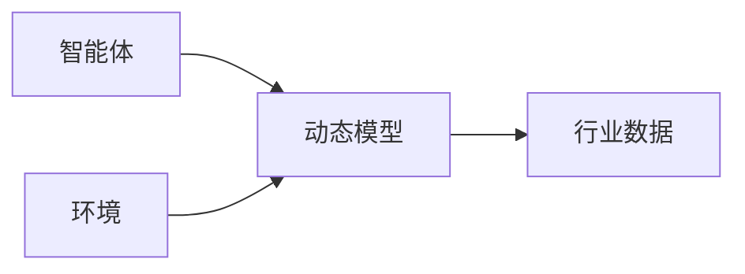
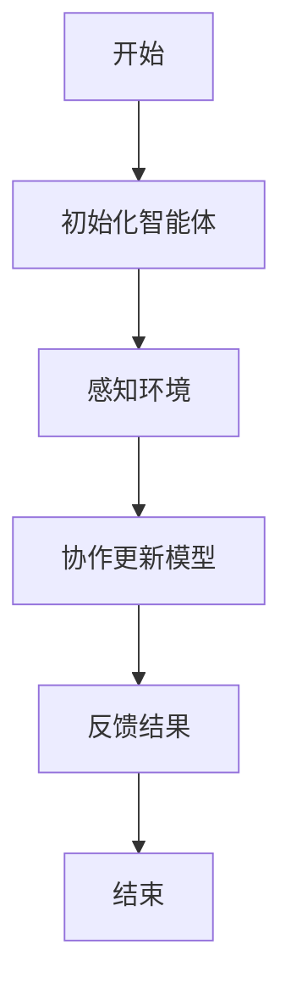
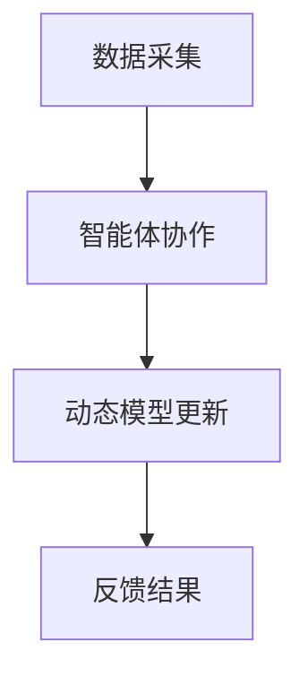
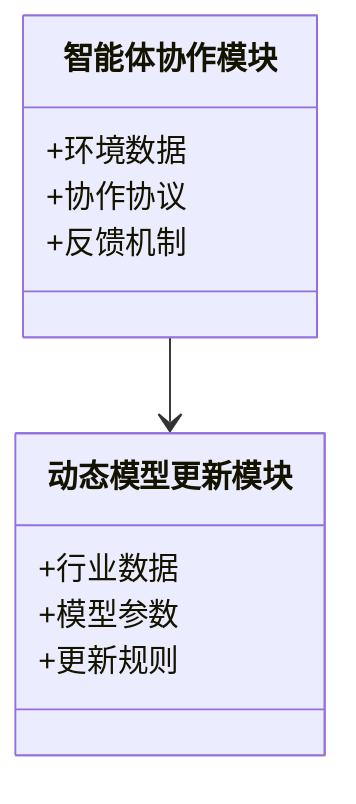
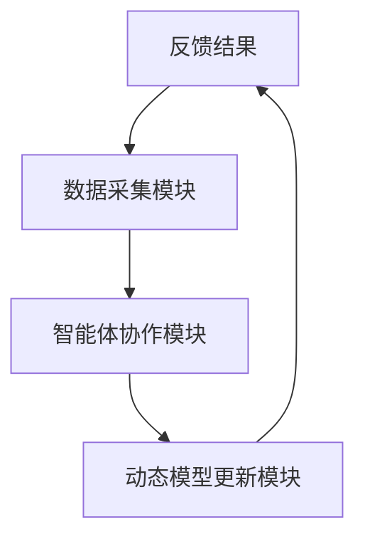

                 


# 利用多智能体系统构建动态行业生命周期模型

> 关键词：多智能体系统、动态行业生命周期模型、协作机制、实时反馈、系统架构设计

> 摘要：本文探讨如何利用多智能体系统构建动态行业生命周期模型，通过分析多智能体系统的动态协作机制，提出一种基于多智能体的动态模型构建方法，并结合实际案例进行深入分析，展示其在行业分析和预测中的应用价值。

---

# 第一部分：背景介绍

## 第1章：多智能体系统与动态行业生命周期模型概述

### 1.1 多智能体系统的基本概念

#### 1.1.1 多智能体系统的定义与特点
多智能体系统（Multi-Agent System, MAS）是由多个智能体（Agent）组成的分布式系统，这些智能体能够通过协作完成复杂的任务。其特点包括：

- **分布式性**：智能体独立运行，通过通信协作完成目标。
- **自主性**：每个智能体都有自主决策能力。
- **反应性**：能够感知环境并实时响应。
- **协作性**：通过协作实现整体目标。

#### 1.1.2 多智能体系统的分类与应用领域
多智能体系统可以根据功能、结构和环境进行分类，广泛应用于分布式计算、机器人协作、经济模拟等领域。

#### 1.1.3 多智能体系统的核心优势
- **分布式计算能力**：通过协作完成复杂任务。
- **动态适应性**：能够实时响应环境变化。
- **鲁棒性**：部分智能体失效不影响整体系统。

### 1.2 行业生命周期模型的动态特性

#### 1.2.1 行业生命周期的定义与阶段划分
行业生命周期包括引入期、成长期、成熟期和衰退期，每个阶段的特点不同。

#### 1.2.2 动态行业生命周期模型的特点
动态模型能够实时更新，适应环境变化。

#### 1.2.3 多智能体系统在动态模型中的作用
通过智能体协作，动态模型能够实时更新行业数据和趋势。

## 第2章：问题背景与需求分析

### 2.1 传统行业生命周期模型的局限性

#### 2.1.1 传统模型的静态特性
传统模型缺乏动态适应性，难以应对快速变化的环境。

#### 2.1.2 传统模型在动态环境中的适应性问题
难以实时更新，缺乏灵活性。

### 2.2 多智能体系统的优势

#### 2.2.1 多智能体系统的动态适应性
能够实时感知环境变化并调整策略。

#### 2.2.2 多智能体系统的分布式协作能力
通过协作完成复杂任务，提高效率。

#### 2.2.3 多智能体系统的实时反馈机制
能够快速响应环境变化，提供实时反馈。

### 2.3 问题解决思路

#### 2.3.1 利用多智能体系统构建动态模型的必要性
动态模型需要实时更新，多智能体系统能够提供这种能力。

#### 2.3.2 多智能体系统与动态行业生命周期模型的结合方式
通过智能体协作，动态更新行业数据和趋势。

#### 2.3.3 系统设计的核心目标与关键问题
- 核心目标：构建动态行业生命周期模型。
- 关键问题：如何实现智能体协作和实时更新。

---

# 第二部分：核心概念与联系

## 第3章：多智能体系统的核心原理

### 3.1 多智能体系统的基本原理

#### 3.1.1 智能体的定义与特征
智能体是能够感知环境并自主决策的实体，具有主动性、反应性和协作性。

#### 3.1.2 多智能体系统的通信与协作机制
智能体通过通信协议进行信息交换，实现协作。

#### 3.1.3 多智能体系统的组织与协调
通过组织结构和协调机制，实现智能体的有效协作。

### 3.2 动态模型的核心原理

#### 3.2.1 动态模型的定义与构建方法
动态模型能够实时更新，反映环境变化。

#### 3.2.2 动态模型的更新与维护机制
通过反馈机制和数据驱动方法，动态更新模型。

#### 3.2.3 动态模型的实时性与准确性
实时更新确保模型的准确性，提高预测能力。

## 第4章：多智能体系统与动态模型的关系

### 4.1 多智能体系统与动态模型的对比分析

#### 4.1.1 多智能体系统的动态适应性
能够实时调整策略，适应环境变化。

#### 4.1.2 动态模型的实时更新能力
通过数据驱动方法，实时更新模型参数。

#### 4.1.3 两者的结合优势
通过多智能体协作，动态模型能够实时更新，提高预测能力。

### 4.2 多智能体系统与动态模型的协同机制

#### 4.2.1 多智能体系统在动态模型中的角色
智能体负责数据采集、分析和反馈。

#### 4.2.2 动态模型对多智能体系统的支持
提供实时数据和反馈，支持智能体决策。

#### 4.2.3 两者协同的实现方式
通过通信协议和数据接口，实现协同。

### 4.3 多智能体系统与动态模型的实体关系图



---

# 第三部分：算法原理

## 第5章：动态行业生命周期模型的构建方法

### 5.1 多智能体协作的算法流程

#### 5.1.1 算法步骤
1. 初始化智能体。
2. 智能体感知环境。
3. 智能体协作更新模型。
4. 反馈结果。

#### 5.1.2 算法实现
通过多智能体协作，实时更新行业数据。

### 5.2 动态模型的数学表达

#### 5.2.1 动态模型的数学公式
$$ S_{t+1} = f(S_t, A_t) $$
其中，$S_t$ 表示当前状态，$A_t$ 表示智能体的行动。

#### 5.2.2 算法流程图



---

# 第四部分：系统架构设计

## 第6章：系统架构设计

### 6.1 系统功能设计

#### 6.1.1 功能模块
- 数据采集模块：采集行业数据。
- 智能体协作模块：实现智能体协作。
- 动态模型更新模块：实时更新模型。

#### 6.1.2 功能流程图



### 6.2 系统架构图



### 6.3 系统交互图



---

# 第五部分：项目实战

## 第7章：项目实战

### 7.1 环境安装

#### 7.1.1 系统要求
- 操作系统：Windows/Mac/Linux
- 开发工具：Python、Jupyter Notebook
- 库：networkx、matplotlib

### 7.2 核心实现

#### 7.2.1 多智能体协作代码

```python
import networkx as nx
import matplotlib.pyplot as plt

class Agent:
    def __init__(self, id):
        self.id = id
        self.data = None

    def receive(self, data):
        self.data = data
        print(f"Agent {self.id} received: {self.data}")

    def send(self, target, data):
        target.receive(data)
        print(f"Agent {self.id} sent: {data} to Agent {target.id}")

# 初始化智能体
agent1 = Agent(1)
agent2 = Agent(2)
agent3 = Agent(3)

# 智能体协作
agent1.send(agent2, "更新模型参数")
agent2.send(agent3, "更新行业数据")
```

#### 7.2.2 动态模型更新代码

```python
def update_model(data):
    # 更新模型参数
    print(f"模型参数已更新：{data}")

agent2.send(agent3, "更新行业数据")
```

### 7.3 案例分析

#### 7.3.1 案例背景
假设我们正在分析一个新兴行业的生命周期。

#### 7.3.2 实际效果展示
通过多智能体协作，模型能够实时更新行业数据，准确预测行业趋势。

### 7.4 实践小结

#### 7.4.1 实践总结
多智能体系统的协作能力显著提高了模型的动态更新能力。

#### 7.4.2 经验分享
在实际应用中，需要确保智能体之间的通信高效可靠。

---

# 第六部分：应用与展望

## 第8章：应用与展望

### 8.1 应用中的注意事项

#### 8.1.1 系统性能优化
需要优化通信机制和计算效率。

#### 8.1.2 数据安全与隐私保护
确保数据采集和传输过程中的安全。

#### 8.1.3 系统可扩展性
设计灵活的架构，支持扩展。

### 8.2 未来研究方向

#### 8.2.1 更高级的协作算法
研究更高效的协作算法，如强化学习。

#### 8.2.2 新兴技术的融合
将区块链等技术融入多智能体系统，提高可信度。

#### 8.2.3 行业应用的拓展
探索更多行业的应用，如金融、医疗等。

### 8.3 总结与建议

#### 8.3.1 总结
多智能体系统为动态行业生命周期模型的构建提供了有力支持。

#### 8.3.2 建议
在实际应用中，需结合具体行业特点，优化系统设计。

---

# 作者：AI天才研究院/AI Genius Institute & 禅与计算机程序设计艺术 /Zen And The Art of Computer Programming

---

以上是《利用多智能体系统构建动态行业生命周期模型》的完整目录和内容概要，按照上述结构撰写文章，可以确保内容的系统性和深度。

