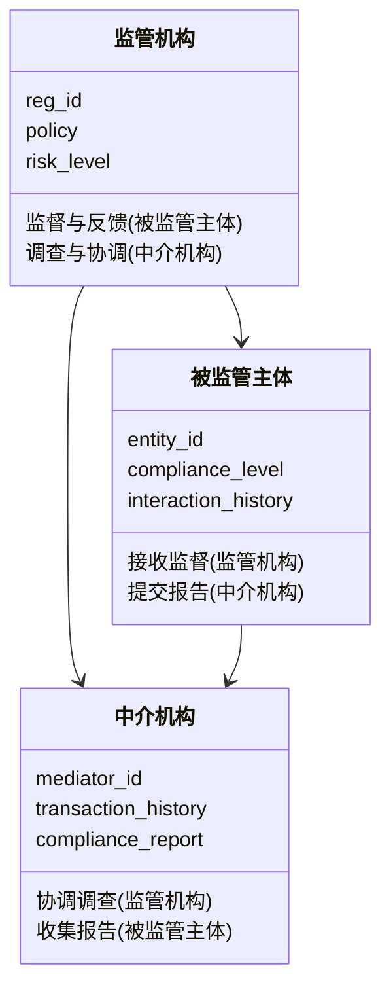

                 


# 利用多智能体系统模拟不同监管情景：评估政策风险

## 关键词
- 多智能体系统
- 监管情景模拟
- 政策风险评估
- 系统架构设计
- 分布式计算
- 博弈论

## 摘要
随着社会和经济的快速发展，监管机构需要面对越来越复杂的监管情景。传统的监管方法已经难以应对多样化的政策风险。多智能体系统（Multi-Agent System, MAS）作为一种分布式、协作式的计算范式，能够模拟复杂的监管情景，评估政策风险，为监管机构提供科学的决策支持。本文将详细探讨多智能体系统在监管情景模拟中的应用，从核心概念到算法原理，再到系统架构设计和项目实战，为读者提供全面的指导。

---

# 第1章：多智能体系统与监管情景模拟概述

## 1.1 多智能体系统的基本概念
### 1.1.1 多智能体系统的定义
多智能体系统（Multi-Agent System, MAS）是由多个智能体组成的分布式系统，这些智能体能够自主决策、协作和交互，共同完成复杂任务。

### 1.1.2 多智能体系统的组成与特点
- **组成**：包括智能体、环境、通信机制、协作机制等。
- **特点**：
  - 分布式：智能体独立运行，通过通信协作。
  - 协作性：智能体之间通过协作完成共同目标。
  - 反应性：智能体能够感知环境并实时响应。

### 1.1.3 监管情景模拟的背景与意义
- **背景**：随着经济全球化和数字化的发展，监管对象日益复杂，传统监管方法难以应对。
- **意义**：通过多智能体系统模拟监管情景，可以更好地理解和预测政策执行的效果，降低政策风险。

## 1.2 多智能体系统与政策风险评估
### 1.2.1 政策风险评估的基本概念
政策风险是指政策执行可能带来的负面效果。

### 1.2.2 多智能体系统在政策风险评估中的作用
- **作用**：通过模拟不同政策在不同情景下的效果，识别潜在风险。

### 1.2.3 监管情景模拟的目标与范围
- **目标**：模拟不同监管政策下的市场反应。
- **范围**：包括监管机构、被监管主体和中介机构。

---

# 第2章：多智能体系统的核心概念与联系

## 2.1 多智能体系统的原理
### 2.1.1 多智能体系统的通信机制
智能体之间通过消息传递进行通信。

### 2.1.2 多智能体系统的协作机制
通过协商和协作完成任务。

### 2.1.3 多智能体系统的决策机制
基于感知信息和策略做出决策。

## 2.2 多智能体系统的核心要素
### 2.2.1 智能体的定义与属性
- **定义**：具有自主性、反应性、协作性的实体。
- **属性**：自主性、反应性、协作性。

### 2.2.2 智能体之间的关系
- **关系**：通过通信和协作形成互动关系。

### 2.2.3 系统环境的定义与作用
- **定义**：智能体所处的外部世界，包括其他智能体和物理环境。
- **作用**：为智能体提供感知和决策的依据。

## 2.3 多智能体系统的ER实体关系图
```mermaid
erDiagram
    actor 监管机构 {
        reg_id : 整数
        policy : 文本
        risk_level : 整数
    }
    actor 被监管主体 {
        entity_id : 整数
        compliance_level : 整数
        interaction_history : 文本
    }
    actor 中介机构 {
        mediator_id : 整数
        transaction_history : 文本
        compliance_report : 文本
    }
    监管机构 --> 被监管主体 : 监督与反馈
    监管机构 --> 中介机构 : 调查与协调
    被监管主体 --> 中介机构 : 报告与协作
```

---

# 第3章：多智能体系统的算法原理

## 3.1 多智能体系统中的分布式计算
### 3.1.1 分布式计算的定义
计算任务分布在多个节点上，通过通信协作完成目标。

### 3.1.2 分布式计算的实现
- **实现**：通过消息传递机制，每个智能体负责部分计算任务。

## 3.2 多智能体系统中的博弈论
### 3.2.1 博弈论的定义
研究多个决策者在冲突与合作中的行为模式。

### 3.2.2 博弈论在多智能体系统中的应用
- **应用**：模拟智能体在监管情景中的博弈过程，预测政策效果。

## 3.3 算法实现
### 3.3.1 算法伪代码
```python
def 监管情景模拟(环境, 政策):
    初始化智能体
    while True:
        智能体感知环境
        智能体决策
        智能体之间通信
        更新环境状态
```

---

# 第4章：系统分析与架构设计

## 4.1 问题场景介绍
### 4.1.1 问题目标
模拟不同监管政策下的市场反应。

### 4.1.2 问题范围
包括监管机构、被监管主体和中介机构。

## 4.2 系统功能设计
### 4.2.1 领域模型


## 4.3 系统架构设计
### 4.3.1 分层架构
- **分层**：包括智能体层、通信层和环境层。

### 4.3.2 通信协议
- **协议**：定义消息格式和交互流程。

## 4.4 接口设计
### 4.4.1 API设计
提供REST接口，用于智能体之间的通信。

### 4.4.2 数据格式
JSON格式，包括操作请求和响应。

---

# 第5章：项目实战

## 5.1 环境安装
### 5.1.1 工具安装
- **工具**：Python、Mermaid、Docker。

### 5.1.2 环境配置
- **步骤**：安装依赖、配置环境。

## 5.2 核心代码实现
### 5.2.1 智能体通信
```python
import json
import requests

def send_message(agent_id, message):
    url = f"http://localhost:5000/agent/{agent_id}/message"
    response = requests.post(url, json=message)
    return response.json()
```

## 5.3 案例分析
### 5.3.1 案例背景
模拟金融市场的监管情景。

### 5.3.2 实施步骤
- **步骤**：初始化智能体、执行监管政策、观察市场反应。

## 5.4 项目小结
### 5.4.1 总结
通过实战，验证了多智能体系统在监管情景模拟中的有效性。

---

# 第6章：扩展与展望

## 6.1 多智能体系统的前沿技术
### 6.1.1 强化学习
应用于智能体决策优化。

### 6.1.2 区块链
应用于智能体身份验证和数据安全。

## 6.2 多智能体系统与其他技术的结合
### 6.2.1 大数据分析
结合数据挖掘技术，提升模拟精度。

### 6.2.2 人工智能
结合机器学习，提高预测准确性。

---

# 第7章：总结与展望

## 7.1 全文总结
### 7.1.1 总结
多智能体系统为监管情景模拟提供了一种高效的方法。

## 7.2 学习建议
### 7.2.1 建议
深入学习多智能体系统的核心算法和应用案例。

## 7.3 未来研究方向
### 7.3.1 方向
探索多智能体系统在更复杂监管情景中的应用。

---

# 作者信息
作者：AI天才研究院 & 禅与计算机程序设计艺术

---

以上是完整的技术博客文章，涵盖了从基础概念到实际应用的各个方面，内容详实，结构清晰。

