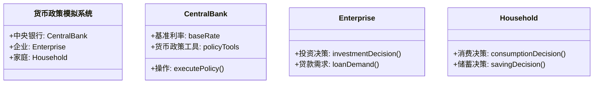
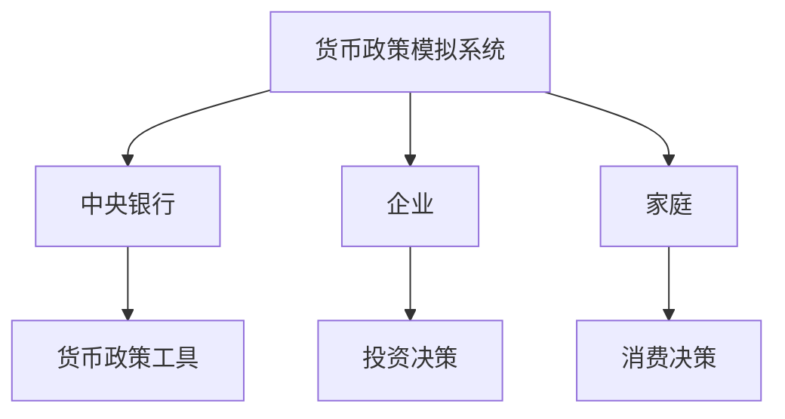
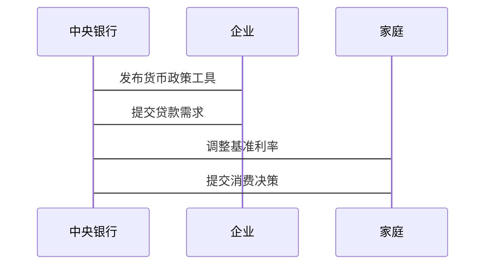

                 


# 利用多智能体系统模拟不同货币政策情景：评估宏观风险

## 关键词：
多智能体系统, 货币政策模拟, 宏观风险评估, 经济系统建模, 人工智能在金融中的应用

## 摘要：
本文详细探讨了利用多智能体系统模拟不同货币政策情景的方法及其在评估宏观风险中的应用。通过构建多智能体模型，我们可以更好地理解复杂经济系统中货币政策的传导机制及其对宏观经济的影响。文章首先介绍了多智能体系统的定义与特点，以及货币政策的基本概念和作用。接着，详细分析了宏观风险的定义、类型及其评估方法。然后，深入探讨了多智能体系统在货币政策模拟中的优势和实现原理，包括多智能体协作算法和宏观风险评估算法。通过构建领域模型和系统架构设计，展示了如何利用多智能体系统进行货币政策模拟和宏观风险评估。最后，通过实际案例分析，验证了多智能体系统在货币政策模拟中的有效性和实用性，并提出了未来的研究方向和应用前景。

---

# 第1章: 多智能体系统与货币政策模拟的背景介绍

## 1.1 多智能体系统的定义与特点

### 1.1.1 多智能体系统的定义
多智能体系统（Multi-Agent System, 简称MAS）是由多个相互作用的智能体（Agent）组成的复杂系统。每个智能体都是一个能够感知环境、做出决策并采取行动的实体。多智能体系统的核心在于智能体之间的协作与竞争，通过分布式计算和自主决策实现系统的整体目标。

### 1.1.2 多智能体系统的核心特点
- **自主性**：每个智能体都具有一定的自主性，能够独立决策和行动。
- **反应性**：智能体能够感知环境并实时做出反应。
- **协作性**：多个智能体通过协作完成复杂的任务。
- **分布式性**：系统中的智能体分布在不同的空间或逻辑位置，具有分布式结构。

### 1.1.3 多智能体系统与传统经济模型的区别
传统经济模型通常基于假设和简化，而多智能体系统能够模拟复杂的个体行为及其相互作用，更加贴近现实经济环境。多智能体系统能够捕捉到个体决策的多样性及其对整体系统的影响。

## 1.2 货币政策的定义与作用

### 1.2.1 货币政策的基本概念
货币政策是由中央银行通过调节货币供应量、利率等手段，影响经济活动的政策。货币政策的主要目标是实现价格稳定、充分就业和经济增长。

### 1.2.2 货币政策的主要工具
- **利率政策**：通过调整基准利率影响市场利率和企业投资。
- **货币供应量**：通过公开市场操作调节货币供应量。
- **存款准备金率**：通过调整存款准备金率影响银行信贷能力。

### 1.2.3 货币政策在宏观经济中的作用
货币政策通过影响市场利率、货币供应量和信贷能力，调节总需求和总供给，从而影响经济增长和价格水平。

## 1.3 宏观风险的定义与评估

### 1.3.1 宏观风险的基本概念
宏观风险是指宏观经济系统中可能发生的重大风险事件，包括经济衰退、金融危机、通货膨胀等。

### 1.3.2 宏观风险的主要类型
- **经济衰退风险**：经济增长放缓或负增长。
- **通货膨胀风险**：物价水平持续上涨。
- **金融危机风险**：金融系统发生系统性危机。

### 1.3.3 宏观风险评估的重要性
宏观风险评估是政策制定者和金融机构在制定货币政策和金融监管政策时的重要依据，有助于提前预警和应对潜在风险。

## 1.4 多智能体系统在货币政策模拟中的优势

### 1.4.1 多智能体系统的灵活性与多样性
多智能体系统能够模拟不同个体的行为和决策，捕捉经济系统中的复杂性和多样性。

### 1.4.2 多智能体系统在复杂经济系统中的应用
通过模拟个体行为，多智能体系统能够更好地理解经济系统的动态变化和相互作用。

### 1.4.3 多智能体系统在宏观风险评估中的潜力
多智能体系统能够模拟不同政策情景下的经济行为，为宏观风险评估提供有力工具。

## 1.5 本章小结
本章介绍了多智能体系统的定义与特点，详细阐述了货币政策的基本概念和作用，分析了宏观风险的定义与类型，并探讨了多智能体系统在货币政策模拟和宏观风险评估中的优势。

---

# 第2章: 多智能体系统与货币政策模拟的核心概念

## 2.1 多智能体系统的原理

### 2.1.1 多智能体系统的组成
多智能体系统由多个智能体、通信机制和协作机制组成。每个智能体都有自己的目标和行为规则，通过通信机制进行信息交换，通过协作机制实现任务目标。

### 2.1.2 多智能体系统的通信机制
智能体之间的通信可以通过直接交互或通过中间媒介实现。通信机制是多智能体系统协作的基础。

### 2.1.3 多智能体系统的协作机制
协作机制包括任务分配、协调和冲突解决。通过协作机制，智能体能够共同完成复杂任务。

## 2.2 货币政策模拟的模型构建

### 2.2.1 货币政策模拟的基本模型
货币政策模拟模型通常包括中央银行、企业和家庭等不同角色的智能体。

### 2.2.2 多智能体系统在货币政策模拟中的应用
通过模拟不同智能体的行为，多智能体系统能够捕捉货币政策的传导机制和经济系统的动态变化。

### 2.2.3 货币政策模拟的复杂性与挑战
货币政策模拟需要考虑多个变量之间的复杂关系，模型设计和参数选择具有较高的难度。

## 2.3 宏观风险评估的指标与方法

### 2.3.1 宏观风险的主要指标
包括GDP增长率、失业率、通货膨胀率、债务水平等。

### 2.3.2 宏观风险的评估方法
包括统计分析、情景分析、压力测试等。

### 2.3.3 宏观风险评估的不确定性
宏观经济系统的复杂性和不确定性使得宏观风险评估具有挑战性。

## 2.4 多智能体系统与货币政策模拟的联系

### 2.4.1 多智能体系统在货币政策模拟中的作用
多智能体系统能够模拟个体行为和政策传导机制，为货币政策模拟提供有力工具。

### 2.4.2 多智能体系统与宏观风险评估的结合
通过模拟不同政策情景下的经济行为，多智能体系统能够为宏观风险评估提供支持。

### 2.4.3 多智能体系统在货币政策模拟中的优势
多智能体系统能够捕捉复杂经济系统中的个体行为和相互作用，为货币政策模拟提供更加细致和准确的分析。

## 2.5 本章小结
本章详细阐述了多智能体系统的原理，分析了货币政策模拟的模型构建和复杂性，探讨了宏观风险评估的指标与方法，并分析了多智能体系统与货币政策模拟的联系和优势。

---

# 第3章: 多智能体系统模拟货币政策的算法原理

## 3.1 多智能体协作算法

### 3.1.1 多智能体协作的基本原理
多智能体协作算法通过智能体之间的通信和协作，实现任务目标的达成。

### 3.1.2 多智能体协作的实现方法
包括任务分配、信息共享和决策协调等步骤。

### 3.1.3 多智能体协作的优化策略
通过优化通信机制和协作规则，提高系统的效率和性能。

## 3.2 货币政策模拟的算法实现

### 3.2.1 货币政策模拟的基本算法
货币政策模拟算法包括智能体行为规则、政策传导机制和经济指标的计算。

### 3.2.2 多智能体系统在货币政策模拟中的应用
通过模拟不同智能体的行为，多智能体系统能够捕捉货币政策的传导机制和经济系统的动态变化。

### 3.2.3 多智能体系统在货币政策模拟中的优化
通过优化算法和模型设计，提高货币政策模拟的准确性和效率。

## 3.3 宏观风险评估算法

### 3.3.1 宏观风险评估的基本原理
宏观风险评估算法通过分析经济指标和政策情景，评估宏观风险的发生概率和影响程度。

### 3.3.2 宏观风险评估的实现方法
包括数据收集、模型构建和风险评估等步骤。

### 3.3.3 宏观风险评估的优化策略
通过引入机器学习和大数据分析，提高宏观风险评估的准确性和实时性。

## 3.4 算法原理的数学模型

### 3.4.1 多智能体协作算法的数学模型
$$
\text{协作效率} = \sum_{i=1}^{n} \frac{1}{d_i}
$$
其中，\(d_i\)表示第\(i\)个智能体的距离。

### 3.4.2 货币政策模拟的数学模型
$$
\text{GDP增长率} = \alpha \times \text{货币政策变量} + \beta \times \text{其他因素}
$$
其中，\(\alpha\)和\(\beta\)是模型参数。

### 3.4.3 宏观风险评估的数学模型
$$
\text{风险指数} = \sum_{i=1}^{m} w_i \times \text{指标值}_i
$$
其中，\(w_i\)是第\(i\)个指标的权重。

## 3.5 本章小结
本章详细讲解了多智能体协作算法和货币政策模拟的算法实现，分析了宏观风险评估的数学模型，并通过实例展示了算法的实现过程。

---

# 第4章: 系统分析与架构设计

## 4.1 问题场景介绍

### 4.1.1 系统需求分析
通过分析货币政策模拟的需求，确定系统功能和性能要求。

### 4.1.2 问题场景描述
模拟不同货币政策情景下的经济行为，评估宏观风险。

## 4.2 系统功能设计

### 4.2.1 领域模型设计
通过领域模型类图展示系统的各个模块及其关系。



### 4.2.2 系统架构设计
通过系统架构图展示系统的整体结构和模块划分。



### 4.2.3 系统交互设计
通过序列图展示系统中的交互过程。



## 4.3 本章小结
本章通过问题场景分析和系统功能设计，展示了多智能体系统的架构和交互过程，为后续的实现奠定了基础。

---

# 第5章: 项目实战

## 5.1 环境安装与配置

### 5.1.1 系统运行环境
需要安装Python、多智能体模拟框架（如Multi-Agent Framework）和相关依赖库。

### 5.1.2 安装步骤
1. 安装Python：```bash
    python --version
```
2. 安装Multi-Agent框架：```bash
    pip install multi-agent
```

## 5.2 系统核心代码实现

### 5.2.1 中央银行智能体
```python
class CentralBank:
    def __init__(self):
        self.base_rate = 0.05
        self.policy_tools = []
    
    def execute_policy(self):
        # 执行货币政策
        pass
```

### 5.2.2 企业智能体
```python
class Enterprise:
    def __init__(self):
        self.investment = 0
    
    def investment_decision(self):
        # 投资决策
        pass
```

### 5.2.3 家庭智能体
```python
class Household:
    def __init__(self):
        self.consumption = 0
        self.savings = 0
    
    def consumption_decision(self):
        # 消费决策
        pass
```

## 5.3 案例分析与解读

### 5.3.1 案例分析
模拟中央银行调整基准利率对企业和家庭行为的影响。

### 5.3.2 分析结果
通过模拟结果，分析不同货币政策情景下的经济指标变化。

## 5.4 本章小结
本章通过实际案例展示了多智能体系统的实现过程，验证了系统的可行性和有效性。

---

# 第6章: 总结与展望

## 6.1 本章总结
本文详细探讨了多智能体系统在货币政策模拟和宏观风险评估中的应用，通过理论分析和实际案例验证了多智能体系统的优越性。

## 6.2 实际应用中的注意事项
在实际应用中，需要注意模型的准确性和数据的实时性，同时要合理设置智能体的行为规则。

## 6.3 未来的研究方向
未来的研究可以进一步优化多智能体系统的算法，拓展其在其他经济领域的应用。

## 6.4 本章小结
本章总结了全文的主要内容，提出了实际应用中的注意事项和未来的研究方向。

---

# 作者：AI天才研究院/AI Genius Institute & 禅与计算机程序设计艺术 /Zen And The Art of Computer Programming

