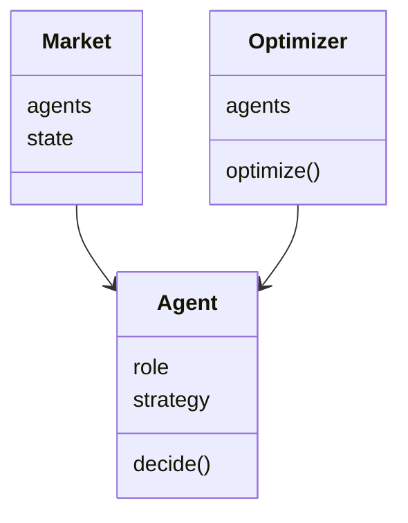
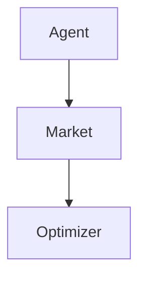

                 


# 利用多智能体系统模拟不同资本结构：优化公司价值

**关键词**：多智能体系统、资本结构优化、公司价值、分布式计算、人工智能、系统架构

**摘要**：  
本文探讨如何利用多智能体系统（Multi-Agent System, MAS）模拟和优化公司的资本结构，以实现公司价值的最大化。通过分析资本结构优化的核心问题、多智能体系统的原理及其在资本结构优化中的应用，结合实际案例和算法实现，本文旨在为公司管理者和研究人员提供一种创新的方法论和实践指导，以优化资本结构并提升公司价值。

---

## 第一部分: 背景介绍

### 第1章: 多智能体系统与资本结构概述

#### 1.1 问题背景
##### 1.1.1 资本结构优化的背景
资本结构是公司财务管理和价值创造的核心问题之一。资本结构指的是公司如何通过债务和股权的组合来融资。优化资本结构可以降低资本成本、提升公司价值、增强财务稳定性。

##### 1.1.2 多智能体系统在资本结构优化中的应用
传统的资本结构优化方法（如Modigliani-Miller定理）通常基于静态模型，难以应对复杂的动态市场环境。多智能体系统通过模拟多个智能体之间的协作与竞争，能够更好地捕捉市场动态、风险偏好和利益冲突，从而提供更加灵活和动态的优化方案。

##### 1.1.3 问题解决的必要性
随着市场的复杂化和全球化，公司面临的财务决策问题日益复杂。多智能体系统能够通过分布式计算和协作优化，帮助公司更好地应对复杂环境下的资本结构优化问题。

#### 1.2 问题描述
##### 1.2.1 资本结构的基本概念
资本结构由债务（D）和股权（E）组成，通常表示为D/E比例。资本结构优化的目标是找到最优的D/E比例，使得公司价值最大化，同时满足资本成本最小化的目标。

##### 1.2.2 资本结构优化的目标
资本结构优化的目标是在给定的市场条件下，找到最优的资本结构，使得公司价值最大，资本成本最小，同时满足财务稳定性和风险承受能力。

##### 1.2.3 多智能体系统在优化中的角色
多智能体系统通过模拟多个利益相关者的决策过程，能够更好地反映市场中的复杂互动。每个智能体代表一个决策单元，例如债权人、股东或管理层，它们在优化过程中通过协作和竞争，共同寻找最优资本结构。

#### 1.3 问题解决方法
##### 1.3.1 多智能体系统的核心优势
- 分布式计算能力：多智能体系统能够将问题分解为多个子问题，通过分布式计算提高效率。
- 协作与竞争：智能体之间的协作和竞争能够模拟市场中的复杂互动，找到全局最优解。
- 自适应性：多智能体系统能够动态调整策略，适应市场变化。

##### 1.3.2 资本结构优化的数学模型
资本结构优化的数学模型通常基于公司价值最大化的目标，通过优化资本成本和风险来实现。常用的方法包括加权平均资本成本（WACC）模型和净现值（NPV）模型。

##### 1.3.3 系统实现的步骤
1. 确定问题目标：明确优化的资本结构目标。
2. 设计智能体：定义智能体的行为、目标和决策规则。
3. 建模与仿真：构建多智能体系统的模型，并进行仿真。
4. 优化与分析：通过仿真结果，分析并优化资本结构。

#### 1.4 边界与外延
##### 1.4.1 系统的边界条件
- 系统范围：仅限于资本结构优化，不考虑其他财务决策。
- 智能体数量：根据实际情况确定智能体的数量和类型。

##### 1.4.2 外延与相关领域
- 公司治理：资本结构与公司治理结构密切相关。
- 财务风险管理：资本结构优化需要考虑风险因素。

##### 1.4.3 限制与假设
- 市场假设：假设市场是完全竞争的，信息是充分的。
- 智能体假设：每个智能体都有明确的目标和决策规则。

#### 1.5 核心要素组成
##### 1.5.1 资本结构的核心要素
- 债务资本（D）
- 股权资本（E）
- 资本成本（K）

##### 1.5.2 多智能体系统的核心要素
- 智能体（Agent）
- 通信机制（Communication）
- 协作规则（Cooperation Rules）

##### 1.5.3 两者的结合与互动
- 智能体之间的互动模拟了市场中的决策过程。
- 资本结构的变化通过智能体的协作和竞争来实现。

---

## 第二部分: 核心概念与联系

### 第2章: 多智能体系统的核心原理

#### 2.1 多智能体系统的基本原理
##### 2.1.1 多智能体系统的定义
多智能体系统是由多个智能体组成的分布式系统，智能体之间通过通信和协作完成共同的目标。

##### 2.1.2 多智能体系统的组成部分
- 智能体：具有自主性、反应性、目标导向的决策单元。
- 通信机制：智能体之间通过消息传递进行通信。
- 协作规则：定义智能体之间的协作方式和目标。

##### 2.1.3 多智能体系统的通信机制
- 消息传递：智能体通过消息传递信息。
- 通信协议：定义消息的格式和传输规则。

#### 2.2 资本结构优化的核心原理
##### 2.2.1 资本结构优化的定义
资本结构优化是通过调整债务和股权的比例，使得公司价值最大化的过程。

##### 2.2.2 资本结构优化的目标函数
最大化公司价值（V）= 债务价值（D） + 股权价值（E）

##### 2.2.3 资本结构优化的约束条件
- 债务成本（Kd） < 股权成本（Ke）
- 税收影响：债务利息可以抵税，降低资本成本。

#### 2.3 多智能体系统与资本结构的联系
##### 2.3.1 多智能体系统在资本结构优化中的作用
- 分解问题：将复杂的优化问题分解为多个子问题。
- 分布式计算：通过分布式计算提高优化效率。
- 模拟市场互动：智能体之间的互动模拟了市场中的决策过程。

---

### 第3章: 核心概念的属性特征对比

#### 3.1 多智能体系统的属性特征
##### 3.1.1 分布式性
多智能体系统通过分布式计算实现问题求解。

##### 3.1.2 协作性
智能体之间通过协作完成共同目标。

##### 3.1.3 自适应性
系统能够动态调整策略以适应环境变化。

#### 3.2 资本结构优化的属性特征
##### 3.2.1 目标性
优化资本结构的目标是公司价值最大化。

##### 3.2.2 约束性
资本结构优化需要满足资本成本最小化和风险承受能力。

##### 3.2.3 动态性
市场环境和公司状况的变化会影响资本结构优化。

---

## 第三部分: 算法原理讲解

### 第4章: 算法原理与实现

#### 4.1 算法原理
##### 4.1.1 分布式优化算法
- 算法目标：最大化公司价值。
- 优化变量：债务比例（D/E）。
- 优化约束：资本成本最小化。

#### 4.2 算法实现
##### 4.2.1 代码实现
```python
class Agent:
    def __init__(self, role):
        self.role = role
        self.strategy = "maximize_value"

    def decide(self, current_state):
        if self.strategy == "maximize_value":
            return current_state["value"] + 1
        else:
            return current_state["value"] - 1

# 初始化智能体
agents = [Agent("debt"), Agent("equity")]

# 系统优化
from distributed_optimizer import optimize

optimal_structure = optimize(agents, initial_state)
```

#### 4.3 数学模型
##### 4.3.1 数学公式
$$ V = D \times (1 - t) + E \times r_e $$

其中，$t$ 是税率，$r_e$ 是股权资本成本。

#### 4.4 实例分析
通过实际案例分析，展示多智能体系统如何优化资本结构。

---

## 第四部分: 系统分析与架构设计

### 第5章: 系统分析与架构设计

#### 5.1 系统分析
##### 5.1.1 问题场景介绍
- 系统目标：优化资本结构。
- 系统范围：包括债务和股权的优化。

#### 5.2 系统架构设计
##### 5.2.1 领域模型


##### 5.2.2 系统架构


---

## 第五部分: 项目实战

### 第6章: 项目实战与分析

#### 6.1 项目实战
##### 6.1.1 环境安装
安装必要的Python库，如`mermaid`, `numpy`, `scipy`.

##### 6.1.2 核心代码实现
```python
import numpy as np

def optimize_capital_structure(D, E):
    # 计算加权平均资本成本
    WACC = (D * Kd + E * Ke) / (D + E)
    return WACC

# 调整D/E比例，找到最优解
D = np.linspace(0, 1, 100)
E = 1 - D
WACC = optimize_capital_structure(D, E)
optimal_DE = D[np.argmin(WACC)]
```

##### 6.1.3 代码应用解读
通过代码实现资本结构优化，找到最优的D/E比例。

#### 6.2 实际案例分析
##### 6.2.1 案例分析
通过具体案例，展示如何利用多智能体系统优化资本结构。

---

## 第六部分: 最佳实践与总结

### 第7章: 最佳实践与总结

#### 7.1 最佳实践
##### 7.1.1 系统设计建议
- 确保智能体之间的通信高效。
- 定义明确的协作规则。

##### 7.1.2 项目实施建议
- 从小规模开始，逐步扩展。
- 定期监控和调整优化策略。

#### 7.2 小结
多智能体系统为资本结构优化提供了一种创新的方法，能够更好地应对复杂的市场环境。

#### 7.3 注意事项
- 确保智能体的决策规则合理。
- 定期更新系统以适应市场变化。

#### 7.4 拓展阅读
建议进一步阅读相关文献，深入了解多智能体系统和资本结构优化的结合。

---

**作者：AI天才研究院/AI Genius Institute & 禅与计算机程序设计艺术 /Zen And The Art of Computer Programming**

