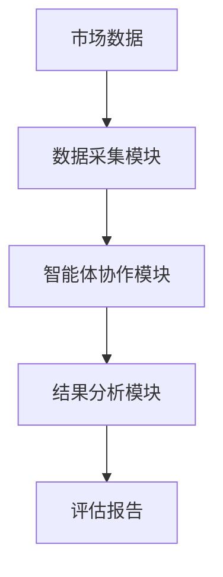
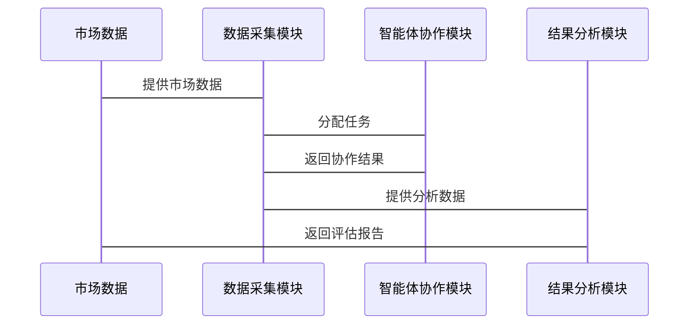

                 


# 利用多智能体系统评估公司的国际化战略

**关键词**：多智能体系统, 国际化战略, 战略评估, 企业战略, 人工智能

**摘要**：随着全球化的深入发展，企业在制定国际化战略时面临越来越复杂的环境和决策挑战。传统的战略评估方法往往难以应对多维度、多因素的动态变化。本文通过引入多智能体系统（Multi-Agent System, MAS）的概念，详细阐述了如何利用MAS的强大协作能力和分布式计算特性，为企业提供更高效、更精准的国际化战略评估方案。文章从MAS的基本原理、算法实现、系统设计到实际应用案例，全面分析了其在国际化战略评估中的优势和应用前景。

---

## 第1章 多智能体系统概述

### 1.1 多智能体系统的基本概念

#### 1.1.1 多智能体系统的定义
多智能体系统（MAS）是由多个相互作用的智能体（Agent）组成的分布式系统。每个智能体都是一个能够感知环境、做出决策并采取行动的实体。智能体之间通过通信和协作完成复杂的任务。

#### 1.1.2 多智能体系统的特征
- **分布式性**：智能体独立运行，不存在集中化的控制中心。
- **协作性**：智能体之间通过协作完成共同目标。
- **反应性**：智能体能够根据环境变化动态调整行为。
- **自主性**：智能体在没有外部干预的情况下自主决策。

#### 1.1.3 多智能体系统的优势
- **高效性**：通过分布式计算提高任务处理效率。
- **鲁棒性**：单个智能体故障不会导致整个系统崩溃。
- **灵活性**：智能体可以根据环境变化快速调整策略。

### 1.2 多智能体系统在企业战略中的应用

#### 1.2.1 企业战略评估的复杂性
国际化战略涉及市场、竞争、政策等多个因素，传统方法难以全面考虑这些复杂关系。

#### 1.2.2 多智能体系统在战略评估中的作用
- **模拟市场环境**：通过模拟不同市场条件下的企业行为，帮助企业预测战略效果。
- **优化决策过程**：利用MAS的协作能力，优化战略实施中的资源配置。
- **实时反馈机制**：通过智能体的实时通信，提供动态反馈，帮助企业在复杂环境中快速调整策略。

#### 1.2.3 多智能体系统与国际化战略的结合
国际化战略的实施往往需要协调多个部门和外部合作伙伴，MAS的协作特性使其成为理想的工具。

---

## 第2章 多智能体系统的核心概念与原理

### 2.1 多智能体系统的组成结构

#### 2.1.1 智能体的基本构成
- **感知**：通过传感器或数据源获取环境信息。
- **决策**：基于感知信息做出决策。
- **行动**：执行决策并采取行动。

#### 2.1.2 多智能体系统的层次结构
- **物理层**：智能体与物理环境的交互。
- **逻辑层**：智能体的逻辑推理和决策过程。
- **通信层**：智能体之间的信息交互。

#### 2.1.3 多智能体系统的通信机制
- **直接通信**：智能体之间直接交换信息。
- **间接通信**：通过中间媒介传递信息。

### 2.2 多智能体系统的协作机制

#### 2.2.1 协作的基本原理
协作是MAS的核心，通过智能体之间的协作完成复杂任务。

#### 2.2.2 协作协议的设计
- **协商协议**：智能体之间通过协商确定任务分配。
- **协调协议**：确保智能体协作过程中的同步与协调。

#### 2.2.3 协作过程中的冲突解决
- **优先级机制**：通过优先级确定任务的执行顺序。
- **仲裁机制**：在发生冲突时，通过仲裁机制确定最优解决方案。

### 2.3 多智能体系统的算法与数学模型

#### 2.3.1 分布式计算算法
- **分布式搜索算法**：用于任务分配和路径规划。
- **分布式优化算法**：用于资源分配和目标优化。

#### 2.3.2 协作学习算法
- **强化学习**：智能体通过与环境的互动学习最优策略。
- **协作学习**：多个智能体共同学习，提高整体性能。

#### 2.3.3 跨智能体通信算法
- **消息传递协议**：定义智能体之间的通信规则。
- **共识算法**：确保智能体之间达成一致。

---

## 第3章 多智能体系统的数学模型与算法

### 3.1 多智能体系统的数学模型

#### 3.1.1 智能体行为模型
智能体的行为可以用状态、动作和奖励函数来描述：
- **状态**：智能体所处的环境状态。
- **动作**：智能体在给定状态下的行动。
- **奖励函数**：定义智能体行为的奖励或惩罚。

#### 3.1.2 系统状态模型
系统状态由多个智能体的状态组成，可以用向量表示。

#### 3.1.3 协作目标模型
协作目标可以通过多目标优化问题来建模。

### 3.2 多智能体系统的算法实现

#### 3.2.1 多智能体协作算法
```python
def multi_agent_collaboration():
    agents = [Agent1, Agent2, Agent3]
    for agent in agents:
        agent.initiate()
    while True:
        for agent in agents:
            agent.act()
            agent.communication()
        if goal_achieved:
            break
```

#### 3.2.2 协作学习算法
```python
import numpy as np

def collaborative_learning():
    agents = [Agent1, Agent2]
    for _ in range(100):
        for agent in agents:
            state = agent.observation()
            action = agent.policy(state)
            reward = agent.env.get_reward(action)
            agent.update_policy(reward)
```

---

## 第4章 国际化战略评估的系统设计与实现

### 4.1 系统功能设计

#### 4.1.1 数据采集模块
- **市场数据**：收集目标市场的经济、政策等信息。
- **竞争数据**：分析竞争对手的市场行为。

#### 4.1.2 智能体协作模块
- **任务分配**：根据市场情况分配智能体的任务。
- **协作执行**：智能体协作完成战略评估。

#### 4.1.3 结果分析模块
- **评估报告**：生成战略评估报告。
- **优化建议**：提出战略优化建议。

### 4.2 系统架构设计

#### 4.2.1 系统架构图


#### 4.2.2 接口设计
- **API接口**：提供给外部系统调用。
- **通信接口**：智能体之间的通信接口。

### 4.3 系统交互设计

#### 4.3.1 交互流程图


---

## 第5章 项目实战与案例分析

### 5.1 项目实战

#### 5.1.1 环境安装
- **Python**：安装Python 3.8及以上版本。
- **库依赖**：安装numpy、scikit-learn、matplotlib等库。

#### 5.1.2 核心代码实现
```python
import numpy as np
from sklearn.metrics import accuracy_score

class Agent:
    def __init__(self, id):
        self.id = id
        self.strategy = None

    def observe(self, data):
        # 数据处理逻辑
        pass

    def decide(self, data):
        # 决策逻辑
        pass

    def communicate(self, other_agent):
        # 通信逻辑
        pass

def main():
    agents = [Agent(1), Agent(2), Agent(3)]
    data = np.random.randn(100, 10)
    for agent in agents:
        agent.observe(data)
    for agent in agents:
        agent.decide(data)
    for agent in agents:
        agent.communicate(agents[0])
    results = [agent.strategy for agent in agents]
    print("策略结果:", results)

if __name__ == "__main__":
    main()
```

#### 5.1.3 实际案例分析
以某跨国公司为例，分析其国际化战略中的市场进入策略、竞争对手分析和政策风险评估。

---

## 第6章 总结与展望

### 6.1 总结
本文详细探讨了多智能体系统在国际化战略评估中的应用，从理论到实践，全面分析了其优势和实现方法。

### 6.2 展望
未来，随着人工智能技术的不断发展，多智能体系统在国际化战略评估中的应用将更加广泛和深入。

---

**作者：AI天才研究院/AI Genius Institute & 禅与计算机程序设计艺术 /Zen And The Art of Computer Programming**

