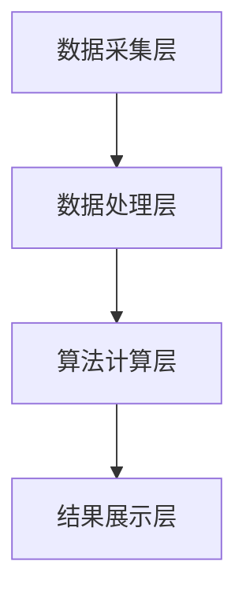
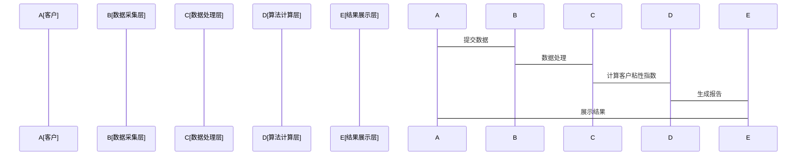

                 


# 利用多智能体系统评估公司的客户粘性

## 关键词：多智能体系统，客户粘性，评估模型，行为建模，协作过滤

## 摘要：  
在当今竞争激烈的市场环境中，客户粘性是企业成功的关键因素之一。本文通过多智能体系统的方法，深入探讨了如何评估和提升客户粘性。文章从多智能体系统的定义、客户粘性的核心概念出发，结合数学建模和实际案例，详细阐述了多智能体系统在客户粘性评估中的应用。通过系统设计和项目实战，本文为读者提供了实用的工具和方法，帮助企业在数字化时代中建立更强的客户关系。

---

## 第1章: 多智能体系统与客户粘性评估基础

### 1.1 多智能体系统的基本概念

#### 1.1.1 多智能体系统的定义  
多智能体系统（Multi-Agent System, MAS）是由多个智能体（Agent）组成的协作系统。每个智能体都是一个能够感知环境、自主决策、执行任务的实体，具备主动性、反应性和协作性。智能体可以是软件程序、机器人或其他实体。

#### 1.1.2 多智能体系统的特征  
- **分布式**：智能体独立运行，通过通信协作完成任务。  
- **协作性**：智能体之间通过信息共享和协作完成共同目标。  
- **反应性**：智能体能够根据环境变化动态调整行为。  
- **自主性**：智能体在没有外部干预的情况下独立运行。  

#### 1.1.3 多智能体系统与单智能体系统的区别  
| 特性 | 多智能体系统（MAS） | 单智能体系统（SAS） |  
|------|----------------------|----------------------|  
| 独立性 | 多个智能体独立运行 | 单个智能体运行 |  
| 协作性 | 智能体之间协作完成任务 | 无协作需求 |  
| 复杂性 | 系统复杂度高 | 系统复杂度低 |  

---

### 1.2 客户粘性概述

#### 1.2.1 客户粘性的定义  
客户粘性是指客户对某个产品、服务或品牌的情感依赖和行为习惯，表现为客户在面对替代选择时，仍然选择保持与原企业的关系。

#### 1.2.2 客户粘性的衡量指标  
- **重复购买率**：客户在一定时间内多次购买同一产品或服务的概率。  
- **客户生命周期价值（CLV）**：客户在企业生命周期内为企业带来的总收入。  
- **客户满意度（CSAT）**：客户对产品或服务的满意程度。  
- **净推荐值（NPS）**：客户推荐产品或服务给他人的概率。  

#### 1.2.3 客户粘性对企业的重要性  
客户粘性高的企业通常具有更强的市场竞争力，客户流失率低，客户忠诚度高，为企业创造更高的长期价值。

---

### 1.3 多智能体系统在客户粘性评估中的应用前景

#### 1.3.1 多智能体系统的优势  
- **分布式计算**：能够处理大规模、复杂的客户数据。  
- **协作能力**：多个智能体协同工作，提供更全面的客户分析。  
- **实时反应**：智能体能够实时感知客户行为变化，快速响应。  

#### 1.3.2 多智能体系统在客户粘性评估中的潜在价值  
通过多智能体系统，企业可以实时分析客户的互动行为、偏好和反馈，从而更精准地评估客户粘性，并制定个性化的客户管理策略。

#### 1.3.3 应用中的挑战与机遇  
- **挑战**：数据隐私、智能体之间的协调问题、系统复杂性。  
- **机遇**：通过智能化手段提升客户体验，降低客户流失率。  

---

## 第2章: 多智能体系统与客户粘性评估的核心概念

### 2.1 多智能体系统的行为模型

#### 2.1.1 多智能体系统的组成结构  
- **智能体**：系统的最小单元，负责执行特定任务。  
- **通信机制**：智能体之间通过消息传递进行协作。  
- **协调机制**：确保智能体之间的协作和任务分配。  
- **知识库**：存储智能体的知识和经验，供其他智能体共享。  

#### 2.1.2 多智能体系统的行为特征  
- **主动性**：智能体主动感知环境并采取行动。  
- **反应性**：智能体能够实时响应环境变化。  
- **协作性**：智能体之间通过协作完成共同目标。  

---

### 2.2 客户粘性的影响因素

#### 2.2.1 产品因素  
- 产品质量：产品是否能满足客户需求。  
- 产品创新：产品是否能持续满足客户需求。  

#### 2.2.2 服务因素  
- 售后服务：客户在使用过程中是否能获得及时有效的支持。  
- 客户关系管理：企业是否能维护良好的客户关系。  

#### 2.2.3 用户体验因素  
- 交互体验：客户与产品或服务的互动是否顺畅。  
- 情感因素：客户是否对产品或服务产生情感依赖。  

---

### 2.3 多智能体系统与客户粘性评估的核心联系

#### 2.3.1 多智能体系统如何影响客户行为  
通过分析客户的行为数据，多智能体系统可以预测客户的潜在需求，提供个性化的服务，从而影响客户的购买决策。

#### 2.3.2 客户粘性如何反哺多智能体系统  
客户粘性高的企业通常会提供更多高质量的数据，这些数据可以进一步优化多智能体系统的模型和算法，提升系统的智能性。

#### 2.3.3 核心概念的对比表格  
| 概念 | 多智能体系统 | 客户粘性 |  
|------|-------------|----------|  
| 定义 | 由多个智能体组成的协作系统 | 用户对产品或服务的依赖程度 |  
| 特征 | 分布式、协作性、反应性 | 稳定性、长期性、互动性 |  
| 关系 | 多智能体系统提供数据支持 | 客户粘性驱动系统优化 |  

---

## 第3章: 多智能体系统与客户粘性评估的数学模型

### 3.1 多智能体系统的行为建模

#### 3.1.1 贝叶斯网络模型  
贝叶斯网络是一种概率图模型，可以用来表示变量之间的概率关系。在多智能体系统中，贝叶斯网络可以用来建模智能体之间的依赖关系。

#### 3.1.2 协作过滤算法  
协作过滤是一种推荐算法，通过分析用户的行为数据，找到与当前用户相似的用户，推荐他们喜欢的物品。

#### 3.1.3 马尔可夫决策过程  
马尔可夫决策过程是一种用于描述决策过程的数学模型，适用于智能体在不确定环境中的决策问题。

---

### 3.2 客户粘性评估的数学公式

#### 3.2.1 客户粘性指数公式  
$$ S = \frac{\sum_{i=1}^{n} w_i x_i}{\sum_{i=1}^{n} w_i} $$  
其中，\( S \) 为客户粘性指数，\( w_i \) 为第 \( i \) 个因素的权重，\( x_i \) 为第 \( i \) 个因素的得分。

#### 3.2.2 多智能体系统协作评分公式  
$$ C = \sum_{j=1}^{m} \alpha_j \cdot S_j $$  
其中，\( C \) 为协作评分，\( \alpha_j \) 为第 \( j \) 个智能体的权重，\( S_j \) 为第 \( j \) 个智能体的评分。

---

### 3.3 举例说明

#### 3.3.1 客户粘性指数计算案例  
假设某公司有三个客户粘性影响因素：产品质量（权重0.4）、售后服务（权重0.3）、用户体验（权重0.3）。客户在产品质量上的得分为0.8，在售后服务上的得分为0.7，在用户体验上的得分为0.6。则客户粘性指数为：  
$$ S = \frac{0.4 \times 0.8 + 0.3 \times 0.7 + 0.3 \times 0.6}{0.4 + 0.3 + 0.3} = \frac{0.32 + 0.21 + 0.18}{1} = 0.71 $$  

---

## 第4章: 系统设计与实现

### 4.1 系统设计概述

#### 4.1.1 系统目标  
通过多智能体系统的协作，实时评估客户的粘性指数，并为企业提供个性化的客户管理策略。

#### 4.1.2 系统架构  
- **数据采集层**：采集客户行为数据。  
- **数据处理层**：对数据进行清洗、转换和存储。  
- **算法计算层**：计算客户粘性指数和协作评分。  
- **结果展示层**：以可视化的方式展示评估结果。  

#### 4.1.3 系统功能  
- **数据采集**：收集客户的交互数据。  
- **数据分析**：通过算法计算客户粘性指数。  
- **结果展示**：生成可视化的报告。  

---

### 4.2 系统架构设计

#### 4.2.1 系统架构图  


---

### 4.3 系统接口设计

#### 4.3.1 数据接口  
- **输入接口**：接收客户的交互数据。  
- **输出接口**：返回客户粘性指数和协作评分。  

---

### 4.4 系统交互设计

#### 4.4.1 系统交互流程  


---

## 第5章: 项目实战

### 5.1 项目背景

#### 5.1.1 项目目标  
通过多智能体系统评估客户的粘性指数，帮助企业优化客户管理策略。

#### 5.1.2 数据来源  
- **客户行为数据**：包括客户的购买记录、浏览记录、互动记录等。  
- **客户反馈数据**：包括客户的满意度调查、评价等。  

---

### 5.2 项目核心实现

#### 5.2.1 数据采集  
使用爬虫技术采集客户的交互数据。

#### 5.2.2 数据分析  
通过Python脚本计算客户粘性指数和协作评分。

#### 5.2.3 结果展示  
使用可视化工具（如Matplotlib）生成报告。

---

### 5.3 项目代码实现

#### 5.3.1 数据采集代码  
```python
import requests
from bs4 import BeautifulSoup

url = 'https://example.com'
response = requests.get(url)
soup = BeautifulSoup(response.text, 'html.parser')
# 提取数据并存储
```

#### 5.3.2 数据分析代码  
```python
def calculate_customer_sticky(customers_data):
    weights = [0.4, 0.3, 0.3]
    scores = [customer.quality, customer.service, customer.experience]
    sticky_index = sum(weights[i] * scores[i] for i in range(len(weights))) / sum(weights)
    return sticky_index

customers = [...]  # 客户数据列表
sticky_index = calculate_customer_sticky(customers[0])
print(sticky_index)
```

---

## 第6章: 总结与展望

### 6.1 本章总结  
本文通过多智能体系统的方法，详细探讨了客户粘性评估的核心概念、算法原理和系统设计。通过实际案例的分析，验证了多智能体系统在客户粘性评估中的有效性。

### 6.2 未来研究方向  
- **智能体协作优化**：进一步研究多智能体系统在客户粘性评估中的协作优化问题。  
- **动态适应性**：探索多智能体系统如何动态适应客户行为的变化。  
- **跨领域应用**：研究多智能体系统在其他领域的应用，如金融、医疗等。  

---

## 作者：AI天才研究院/AI Genius Institute & 禅与计算机程序设计艺术 /Zen And The Art of Computer Programming

---

**本文版权归作者所有，转载请注明出处。**

