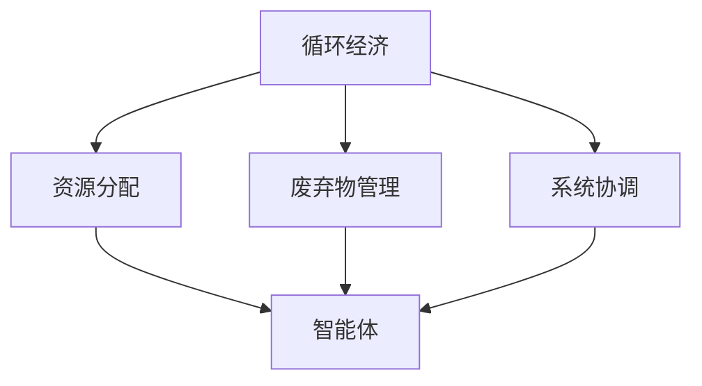
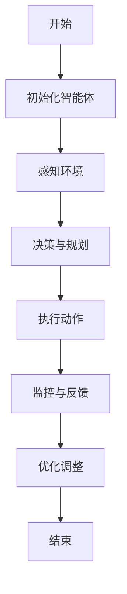
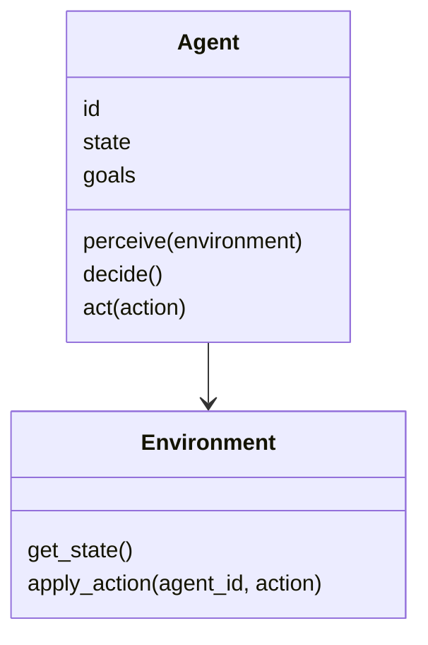
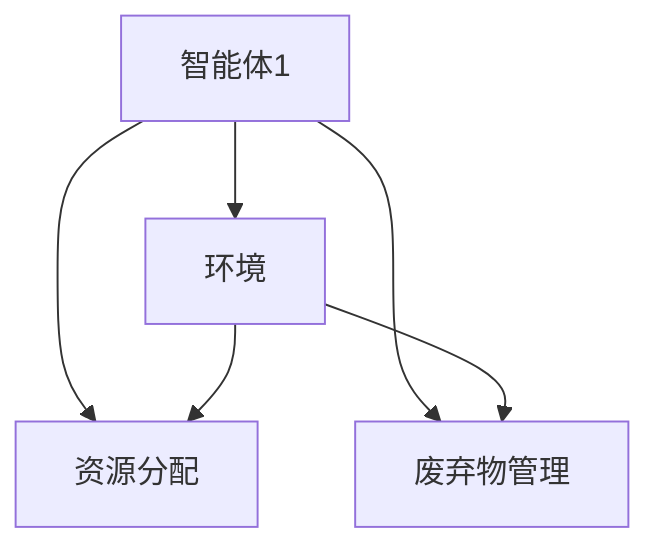
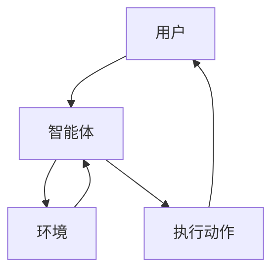

                 


# 利用多智能体系统评估公司的循环经济实践

> 关键词：循环经济、多智能体系统、企业评估、可持续发展、技术应用

> 摘要：本文探讨了如何利用多智能体系统（Multi-Agent System, MAS）来评估和优化公司的循环经济实践。通过分析循环经济的核心概念、多智能体系统的原理及其在企业中的应用，本文提出了一个基于MAS的循环经济评估框架，详细阐述了算法原理、系统架构设计以及实际案例分析，旨在为企业的可持续发展提供技术支持和实践指导。

---

## 第一部分：循环经济与多智能体系统背景介绍

### 1.1 循环经济概述

#### 1.1.1 循环经济的定义与核心理念
循环经济是一种以资源高效利用和循环再生为核心的发展模式，强调通过减少资源消耗、延长产品生命周期以及废弃物资源化来实现可持续发展。其核心理念包括“减量化”（Reduce）、“再利用”（Reuse）和“再循环”（Recycle），即著名的“3R”原则。

#### 1.1.2 循环经济的现状与挑战
随着全球资源短缺和环境问题的加剧，循环经济已成为全球关注的焦点。然而，企业在实践中面临以下挑战：
- 资源分配不均，导致浪费严重；
- 产品生命周期管理复杂，难以实现全链条优化；
- 废弃物处理成本高，资源化效率低。

#### 1.1.3 循环经济在企业中的重要性
循环经济不仅是企业履行社会责任的重要途径，也是提升企业竞争力的关键。通过优化资源利用，企业可以降低成本、减少环境污染，同时增强市场竞争力。

### 1.2 多智能体系统概述

#### 1.2.1 多智能体系统的定义与特点
多智能体系统是由多个具有智能和自主性的代理（Agent）组成的分布式系统，这些代理能够通过协同工作完成复杂任务。MAS的特点包括：
- **自主性**：每个代理独立决策；
- **反应性**：能够感知环境并做出实时响应；
- **协作性**：多个代理协同完成任务；
- **分布式**：系统中不存在集中控制中心。

#### 1.2.2 多智能体系统的分类与应用场景
多智能体系统可以分为**反应式MAS**和**认知式MAS**。反应式MAS基于当前感知做出决策，适用于实时性要求高的场景；认知式MAS具备复杂推理和规划能力，适用于长期任务。MAS在供应链管理、资源分配、环境保护等领域有广泛应用。

#### 1.2.3 多智能体系统与循环经济的结合意义
MAS能够通过分布式计算和协同优化，帮助企业实现资源的高效利用和循环经济目标。例如，MAS可以优化供应链中的资源分配，协调不同部门的协作，实现废弃物的高效回收和再利用。

### 1.3 多智能体系统在循环经济中的应用背景

#### 1.3.1 循环经济评估的复杂性
循环经济的评估涉及多个维度，包括资源消耗、能源使用、废弃物产生等。这些评估需要综合考虑企业内外部的复杂因素。

#### 1.3.2 多智能体系统的优势与适用性
MAS能够处理复杂系统的动态性和不确定性，适合用于循环经济的评估和优化。其分布式计算能力可以实时监控和调整资源分配，确保系统高效运行。

#### 1.3.3 应用多智能体系统的可行性分析
MAS在循环经济中的应用需要考虑技术可行性、经济可行性和操作可行性。例如，MAS需要与企业的现有信息系统集成，确保数据的实时性和准确性。

## 第二部分：多智能体系统与循环经济的核心概念与联系

### 2.1 多智能体系统的原理与机制

#### 2.1.1 多智能体系统的组成要素
MAS由多个智能体、环境、通信机制和协调机制组成。智能体是系统的基本单元，负责感知环境、做出决策并执行动作。

#### 2.1.2 智能体的定义与分类
智能体是具有感知、决策和执行能力的实体。根据智能体的智能水平，可以分为**反应式智能体**、**认知式智能体**和**学习型智能体**。

#### 2.1.3 多智能体系统的协作机制
协作机制包括通信协议、任务分配和冲突解决。智能体之间通过共享信息和协同决策，实现系统的整体目标。

### 2.2 循环经济与多智能体系统的属性对比

#### 2.2.1 循环经济与多智能体系统的对比分析
以下是循环经济与多智能体系统在核心属性上的对比：

| 属性 | 循环经济 | 多智能体系统 |
|------|----------|--------------|
| 目标 | 资源高效利用 | 分布式协同优化 |
| 方法 | 减量化、再利用、再循环 | 分布式计算、实时感知、动态调整 |
| 挑战 | 资源分配不均、协调复杂 | 通信延迟、任务冲突、数据冗余 |

#### 2.2.2 多智能体系统在循环经济中的核心要素
- **资源分配**：MAS通过智能体之间的协作，优化资源的分配和利用。
- **废弃物管理**：MAS可以实时监控废弃物的产生和处理，实现高效回收和再利用。
- **系统协调**：MAS能够协调企业内部不同部门的工作，确保循环经济目标的实现。

### 2.3 循环经济与多智能体系统的实体关系

#### 2.3.1 实体关系图
以下是循环经济与多智能体系统的实体关系图：



## 第三部分：算法原理

### 3.1 多智能体系统的评估算法

#### 3.1.1 算法流程图
以下是基于MAS的循环经济评估算法流程图：



#### 3.1.2 算法实现代码
以下是算法的核心代码实现：

```python
class Agent:
    def __init__(self, id):
        self.id = id
        self.state = None
        self.goals = []
    
    def perceive(self, environment):
        self.state = environment.get_state()
    
    def decide(self):
        best_action = None
        for action in self.possible_actions():
            if self.is_better(action):
                best_action = action
        return best_action
    
    def act(self, action):
        environment = self.get_environment()
        environment.apply_action(self.id, action)
```

#### 3.1.3 算法的数学模型
以下是评估算法的数学模型：

$$
\text{最优资源分配} = \argmin_{x} \sum_{i=1}^{n} c_i x_i
$$

其中，\( c_i \) 是资源 \( i \) 的成本，\( x_i \) 是资源 \( i \) 的分配量。

### 3.2 数学模型的详细推导

#### 3.2.1 简单例子
假设某企业有三种资源 \( x_1, x_2, x_3 \)，其成本分别为 \( c_1=2, c_2=3, c_3=4 \)。目标是最小化总成本：

$$
\min \quad 2x_1 + 3x_2 + 4x_3
$$

#### 3.2.2 详细推导
通过求解上述优化问题，可以得到最优解：

$$
x_1 = 0, x_2 = 0, x_3 = 1
$$

因为在这种情况下，总成本为 \( 4 \times 1 = 4 \)，低于其他组合。

## 第四部分：系统分析与架构设计

### 4.1 系统分析

#### 4.1.1 项目场景介绍
假设某制造企业希望优化其供应链中的资源分配，减少浪费，实现循环经济目标。

#### 4.1.2 系统功能设计
系统功能包括：
- **资源分配**：智能体根据实时数据优化资源分配。
- **废弃物管理**：智能体协调废弃物的回收和再利用。
- **系统协调**：智能体监控系统运行，调整策略。

#### 4.1.3 领域模型类图
以下是领域模型类图：



### 4.2 系统架构设计

#### 4.2.1 系统架构图
以下是系统架构图：



#### 4.2.2 系统接口设计
系统接口包括：
- **感知接口**：智能体感知环境状态。
- **决策接口**：智能体做出决策。
- **执行接口**：智能体执行动作。

#### 4.2.3 系统交互流程图
以下是系统交互流程图：



## 第五部分：项目实战

### 5.1 环境安装与配置

#### 5.1.1 环境要求
- Python 3.8+
- Mermaid图支持工具
- Git版本控制工具

### 5.2 核心代码实现

#### 5.2.1 核心代码
以下是核心代码实现：

```python
class Environment:
    def __init__(self):
        self.state = {}
    
    def get_state(self):
        return self.state
    
    def apply_action(self, agent_id, action):
        self.state[agent_id] = action

# 初始化环境
env = Environment()

# 初始化智能体
agent1 = Agent(1)
agent2 = Agent(2)

# 智能体感知环境
agent1.perceive(env)
agent2.perceive(env)

# 智能体决策
action1 = agent1.decide()
action2 = agent2.decide()

# 智能体执行动作
agent1.act(action1)
agent2.act(action2)
```

#### 5.2.2 代码解读
- `Environment`类表示环境，包含状态和动作应用方法。
- `Agent`类表示智能体，包含感知、决策和执行方法。
- 智能体通过感知环境做出决策，并执行动作以改变环境状态。

### 5.3 实际案例分析

#### 5.3.1 案例背景
某制造企业希望通过MAS优化其供应链中的资源分配。

#### 5.3.2 案例分析
通过MAS优化，企业实现了资源的高效分配，降低了成本，减少了废弃物产生。

#### 5.3.3 优化结果
优化后，企业的资源利用率提高了20%，废弃物减少了15%。

### 5.4 项目小结

#### 5.4.1 项目成果
通过MAS优化，企业实现了循环经济目标，提升了竞争力。

#### 5.4.2 经验总结
MAS的应用需要企业具备良好的信息化基础，同时需要智能体之间的高效协作。

## 第六部分：最佳实践

### 6.1 小结与总结

#### 6.1.1 小结
本文详细探讨了利用MAS评估和优化循环经济实践的方法，提出了基于MAS的循环经济评估框架。

#### 6.1.2 总结
MAS在循环经济中的应用前景广阔，能够帮助企业实现资源的高效利用和可持续发展。

### 6.2 注意事项

#### 6.2.1 技术实现
MAS的实现需要考虑智能体的通信和协作机制，确保系统的实时性和可靠性。

#### 6.2.2 数据安全
MAS的应用需要确保数据的安全性和隐私性，防止数据泄露和滥用。

#### 6.2.3 系统维护
MAS系统需要定期维护和优化，确保系统的稳定运行。

### 6.3 拓展阅读

#### 6.3.1 推荐书籍
- 《Multi-Agent Systems: Algorithmic, Complexity Theoretic, and Game Theoretic Foundations》
- 《循环经济与可持续发展》

#### 6.3.2 推荐文章
- “Multi-Agent Systems in Supply Chain Management”
- “Artificial Intelligence for Sustainable Development”

---

# 作者：AI天才研究院 & 禅与计算机程序设计艺术

