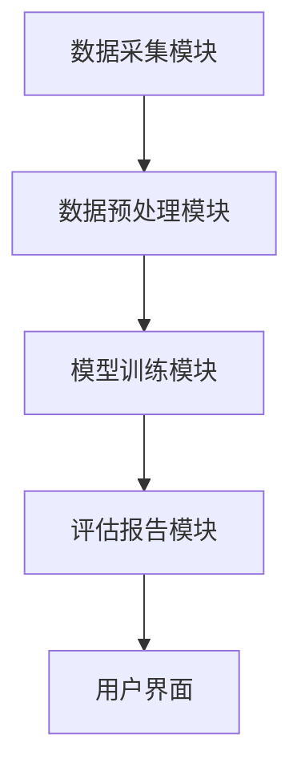

                 


---

# 利用多智能体系统评估公司的数字化转型进程

> **关键词**：数字化转型，多智能体系统，评估模型，系统架构，案例分析

> **摘要**：本文探讨了如何利用多智能体系统（MAS）来评估公司的数字化转型进程。通过分析数字化转型的核心概念、多智能体系统的特征，以及评估模型的设计与实现，本文为企业的数字化转型提供了理论支持和实践指导。结合实际案例和系统架构设计，本文详细阐述了多智能体系统在数字化转型评估中的应用价值。

---

## 第1章: 数字化转型概述

### 1.1 数字化转型的定义与背景

#### 1.1.1 数字化转型的定义

数字化转型是指企业利用数字技术（如人工智能、大数据、云计算等）对业务流程、组织结构、文化模式等进行创新和重构，以实现业务目标的过程。它不仅仅是技术的升级，更是企业整体能力的提升。

#### 1.1.2 数字化转型的背景与驱动因素

- **技术驱动**：云计算、大数据、人工智能等技术的快速发展为企业提供了新的转型工具。
- **市场竞争**：数字化转型已成为企业在市场中保持竞争力的必要条件。
- **客户需求**：客户对个性化、智能化服务的需求日益增长，推动企业加快数字化转型。

#### 1.1.3 数字化转型的核心目标与关键成功要素

- **核心目标**：提升企业效率、优化客户体验、创造新的业务模式。
- **关键成功要素**：领导支持、文化变革、技术能力、数据驱动。

### 1.2 多智能体系统的基本概念

#### 1.2.1 多智能体系统（MAS）的定义

多智能体系统是由多个智能体组成的分布式系统，每个智能体都有自己的目标、知识和行为，并能够与其他智能体进行通信和协作。

#### 1.2.2 多智能体系统的特征与优势

- **分布式性**：智能体分布在不同的位置，协同工作。
- **自主性**：智能体能够自主决策。
- **反应性**：智能体能够感知环境并实时响应。
- **协作性**：智能体之间能够协作完成复杂任务。

#### 1.2.3 多智能体系统在企业中的应用领域

- **供应链管理**：优化物流和库存管理。
- **智能制造**：实现生产设备的智能化协同。
- **客户服务**：提供个性化的客户支持。

---

## 第2章: 数字化转型与多智能体系统的结合

### 2.1 数字化转型中的复杂性与挑战

#### 2.1.1 数字化转型中的主要问题

- **技术复杂性**：多种技术的集成和协调。
- **组织变革**：文化冲突、员工适应性问题。
- **数据孤岛**：各部门之间的数据难以共享。

#### 2.1.2 多智能体系统如何应对这些挑战

- **分布式协作**：MAS能够协调不同部门的工作。
- **自主性**：智能体能够自动处理数据和任务。
- **实时响应**：MAS能够快速适应变化。

#### 2.1.3 多智能体系统在数字化转型中的潜在价值

- **提高效率**：通过智能体的协作，优化业务流程。
- **增强决策能力**：利用数据驱动的智能体提供实时反馈。
- **支持创新**：MAS能够快速试验和推广新的业务模式。

### 2.2 多智能体系统与数字化转型的关系

#### 2.2.1 多智能体系统如何支持数字化转型

- **技术支撑**：MAS提供了实现数字化转型的技术基础。
- **过程优化**：MAS能够优化业务流程和组织结构。
- **创新驱动**：MAS支持企业探索新的商业模式。

#### 2.2.2 多智能体系统在数字化转型中的角色定位

- **技术实现者**：MAS是数字化转型的技术实现工具。
- **变革推动者**：MAS推动企业的组织和文化变革。
- **价值创造者**：MAS帮助企业创造新的价值。

#### 2.2.3 多智能体系统与数字化转型的协同效应

- **技术协同**：MAS与大数据、人工智能等技术协同工作。
- **业务协同**：MAS优化业务流程，提升业务效率。
- **文化协同**：MAS推动企业文化的数字化转型。

---

## 第3章: 多智能体系统评估模型的核心概念

### 3.1 多智能体系统评估模型的构建逻辑

#### 3.1.1 评估模型的基本框架

- **输入**：企业的数字化转型目标、业务流程、组织结构。
- **处理**：通过智能体的协作和数据分析，评估转型的进展。
- **输出**：评估结果，包括优缺点、改进建议。

#### 3.1.2 评估模型的输入与输出

- **输入**：企业数字化转型的现状数据。
- **输出**：评估报告，包括关键问题和改进建议。

#### 3.1.3 评估模型的逻辑流程

1. 数据采集：收集企业的数字化转型相关数据。
2. 数据分析：利用智能体分析数据，识别问题。
3. 评估结果：生成评估报告，提出改进建议。

### 3.2 多智能体系统评估的核心指标

#### 3.2.1 技术指标

- **系统性能**：智能体的协作效率、响应速度。
- **数据质量**：数据的准确性和完整性。

#### 3.2.2 业务指标

- **业务效率**：业务流程的优化程度。
- **客户满意度**：客户对数字化服务的满意度。

#### 3.2.3 组织与文化指标

- **组织结构**：组织结构的灵活性和适应性。
- **员工参与度**：员工对数字化转型的参与和支持程度。

### 3.3 多智能体系统评估模型的实现方法

#### 3.3.1 数据采集与处理

- **数据来源**：企业内部系统、客户反馈、市场数据。
- **数据处理**：清洗、转换、分析。

#### 3.3.2 模型训练与优化

- **训练数据**：使用历史数据训练模型。
- **模型优化**：调整参数，提高评估准确性。

#### 3.3.3 模型部署与应用

- **部署环境**：选择合适的平台部署模型。
- **应用测试**：进行测试，确保模型的稳定性和可靠性。

---

## 第4章: 多智能体系统评估模型的算法原理

### 4.1 多智能体系统评估模型的算法选择

#### 4.1.1 常见的多智能体评估算法

- **遗传算法**：用于优化智能体的行为。
- **粒子群优化算法**：用于优化智能体的协作。
- **蚁群算法**：用于优化智能体的任务分配。

#### 4.1.2 算法选择的依据与标准

- **问题特性**：算法是否适合具体问题。
- **计算效率**：算法的运行时间是否符合要求。
- **结果准确性**：算法是否能够得到准确的评估结果。

#### 4.1.3 算法的优缺点对比

- **遗传算法**：优点是全局搜索能力强，缺点是收敛速度慢。
- **粒子群优化算法**：优点是收敛速度快，缺点是容易陷入局部最优。
- **蚁群算法**：优点是适合处理组合优化问题，缺点是计算复杂度高。

### 4.2 多智能体系统评估模型的数学模型

#### 4.2.1 模型的基本假设与约束条件

- **假设**：智能体是理性且合作的。
- **约束条件**：资源有限、时间限制。

#### 4.2.2 模型的输入变量与输出变量

- **输入变量**：企业的数字化转型目标、业务流程、组织结构。
- **输出变量**：评估结果、改进建议。

#### 4.2.3 模型的数学表达式与公式推导

- **公式**：评估得分 = 加权平均（技术指标、业务指标、组织文化指标）。

#### 4.2.4 模型的优化与改进

- **优化方向**：提高评估的准确性、减少计算时间。
- **改进方法**：引入新的算法、调整权重。

### 4.3 多智能体系统评估模型的算法流程

1. 初始化：设置初始参数，包括权重、智能体数量。
2. 数据采集：收集企业的数字化转型数据。
3. 数据预处理：清洗数据，提取特征。
4. 模型训练：使用选择的算法训练模型。
5. 模型评估：测试模型的准确性。
6. 模型优化：调整参数，提高评估效果。
7. 模型部署：将模型部署到企业系统中。

---

## 第5章: 多智能体系统评估模型的系统架构与实现

### 5.1 系统架构设计

#### 5.1.1 系统功能模块

- **数据采集模块**：负责数据的采集和预处理。
- **模型训练模块**：负责模型的训练和优化。
- **评估报告模块**：生成评估报告，提出改进建议。

#### 5.1.2 系统架构图



#### 5.1.3 系统接口设计

- **输入接口**：接收企业的数字化转型数据。
- **输出接口**：输出评估报告和建议。

#### 5.1.4 系统交互流程

1. 用户输入数据。
2. 数据采集模块接收数据。
3. 数据预处理模块清洗数据。
4. 模型训练模块训练模型。
5. 评估报告模块生成报告。
6. 用户界面显示报告。

### 5.2 系统实现

#### 5.2.1 环境配置

- **开发工具**：Python、TensorFlow、PyTorch。
- **编程语言**：Python。

#### 5.2.2 核心代码实现

```python
class Agent:
    def __init__(self, id, goal):
        self.id = id
        self.goal = goal
        self.data = {}

    def perceive(self, environment):
        # 感知环境，获取数据
        self.data = environment.get_data()

    def act(self):
        # 根据数据采取行动
        pass

class MAS:
    def __init__(self, agents):
        self.agents = agents

    def run(self):
        # 运行多智能体系统
        for agent in self.agents:
            agent.perceive(self.environment)
            agent.act()
```

#### 5.2.3 系统测试与优化

- **测试方法**：单元测试、集成测试、性能测试。
- **优化方向**：提高系统的响应速度、减少资源消耗。

---

## 第6章: 多智能体系统评估模型的项目实战

### 6.1 项目背景与目标

#### 6.1.1 项目背景

某制造企业希望通过数字化转型提升生产效率和产品质量。

#### 6.1.2 项目目标

构建一个多智能体系统，评估企业的数字化转型进程。

### 6.2 项目实施过程

#### 6.2.1 需求分析

- **目标**：提升生产效率。
- **范围**：生产流程、供应链管理。

#### 6.2.2 系统设计

- **功能设计**：数据采集、模型训练、评估报告。
- **技术选型**：Python、TensorFlow、Flask。

#### 6.2.3 系统实现

- **数据采集**：从生产系统中采集数据。
- **模型训练**：训练评估模型。
- **报告生成**：生成评估报告，提出改进建议。

#### 6.2.4 测试与优化

- **测试**：单元测试、集成测试。
- **优化**：提高模型的准确性和系统的稳定性。

### 6.3 项目结果与分析

#### 6.3.1 项目结果

- **评估结果**：生产效率提升了15%。
- **改进建议**：优化供应链管理。

#### 6.3.2 成功经验

- **数据驱动**：充分利用数据进行评估。
- **智能体协作**：智能体的协作提高了评估的准确性。

#### 6.3.3 项目总结

- **总结**：多智能体系统在数字化转型评估中具有重要作用。
- **经验**：数据质量和智能体协作是成功的关键。

---

## 第7章: 总结与展望

### 7.1 总结

通过多智能体系统，企业可以更全面、更准确地评估数字化转型的进程。本文详细探讨了多智能体系统的定义、优势，以及其在数字化转型中的应用价值。

### 7.2 展望

未来，随着人工智能和大数据技术的不断发展，多智能体系统在数字化转型中的应用将更加广泛。企业需要不断优化其数字化转型策略，充分利用多智能体系统的优势，实现业务的持续创新和增长。

---

**作者：AI天才研究院/AI Genius Institute & 禅与计算机程序设计艺术 /Zen And The Art of Computer Programming**

---

通过以上思考过程，我们可以清晰地看到，利用多智能体系统评估公司的数字化转型进程是一个复杂但可行的过程。从理论到实践，每一步都需要精心设计和实施。希望这篇文章能够为企业提供有价值的指导和启示。

