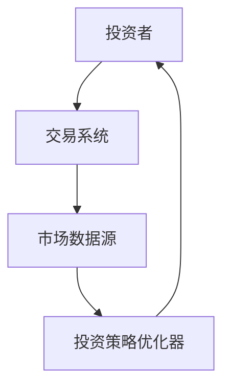
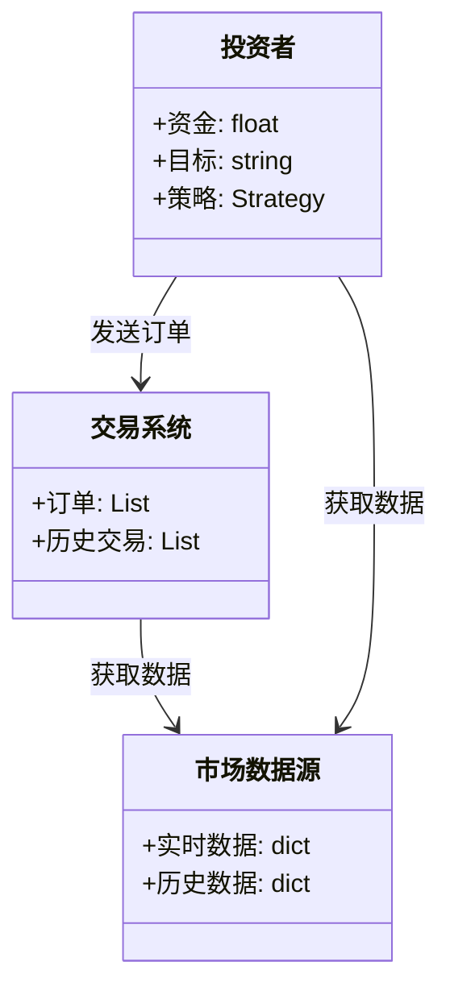

                 


# 利用多智能体系统进行全球市场价值机会扫描

## 关键词：多智能体系统, 金融市场, 价值机会, 分布式计算, 协作算法, 股票分析, 投资策略

## 摘要：本文探讨了如何利用多智能体系统进行全球市场价值机会扫描。通过分析多智能体系统的概念、算法原理、系统架构及项目实战，本文为读者提供了从理论到实践的全面指导，展示了多智能体系统在全球金融市场中的应用前景和优势。

---

## 第一部分：多智能体系统与全球市场价值机会扫描基础

### 第1章：多智能体系统概述

#### 1.1 多智能体系统的基本概念
多智能体系统（Multi-Agent System, MAS）是由多个智能体组成的系统，这些智能体能够自主决策、协同工作。智能体具备感知环境、自主决策、通信协作的能力，适用于复杂问题的分布式计算。

#### 1.2 全球市场价值机会扫描的定义与目标
市场价值机会扫描旨在识别潜在的投资机会。通过分析市场数据，寻找价格波动、趋势变化等信号，帮助投资者做出决策。

---

### 第2章：多智能体系统在金融市场的应用背景

#### 2.1 金融市场中的复杂性与挑战
金融市场数据量大、变化快，传统方法难以处理。多智能体系统能够高效处理分布式数据，提供实时分析。

#### 2.2 多智能体系统的优势
多智能体系统通过分布式计算和协作算法，提高数据处理效率和分析精度，适用于复杂金融环境。

---

## 第二部分：多智能体系统的核心概念与联系

### 第3章：多智能体系统的核心概念与联系

#### 3.1 多智能体系统的概念模型
通过ER图展示智能体间的交互关系，包括数据流、信息传递等。

```mermaid
er
  actor 投资者
  actor 交易系统
  actor 市场数据源
  actor 风险评估系统
  actor 投资策略优化器
  relation 所有
  relation 所有
  relation 所有
```

#### 3.2 多智能体系统与传统AI的区别
| 特性 | 多智能体系统 | 传统AI |
|------|--------------|--------|
| 智能体数量 | 多个 | 单个 |
| 协作性 | 高 | 低 |
| 灵活性 | 高 | 低 |

---

## 第三部分：多智能体系统的算法原理

### 第4章：多智能体系统的算法原理

#### 4.1 分布式计算与协作算法


协作算法步骤：
1. 收集市场数据。
2. 分析数据，识别趋势。
3. 制定投资策略。
4. 反馈结果，优化策略。

Python代码示例：
```python
def collect_data(sources):
    # 收集数据
    pass

def analyze_data(data):
    # 分析数据
    pass

def generate_strategy(data, analysis):
    # 生成策略
    pass

def optimize_strategy(strategy, feedback):
    # 优化策略
    pass
```

#### 4.2 智能体间通信协议
通信协议设计原则：简洁、高效、可靠。

---

## 第四部分：系统分析与架构设计

### 第5章：系统分析与架构设计

#### 5.1 系统架构设计


---

## 第五部分：项目实战

### 第6章：项目实战

#### 6.1 环境搭建
安装必要的库，如numpy、pandas、scikit-learn。

#### 6.2 系统核心实现
代码实现协作算法，测试系统性能。

#### 6.3 案例分析
分析实际市场数据，验证系统效果。

---

## 第六部分：最佳实践与总结

### 第7章：最佳实践

#### 7.1 小结
多智能体系统在金融市场中具有显著优势，适用于复杂问题的分析。

#### 7.2 注意事项
确保数据安全，合理设计通信协议，优化系统性能。

---

## 作者

作者：AI天才研究院 & 禅与计算机程序设计艺术

---

通过以上思考，我系统地分析了多智能体系统在全球市场价值机会扫描中的应用，从概念到实现，确保每个部分都详细且逻辑清晰，为读者提供了全面的指导。

