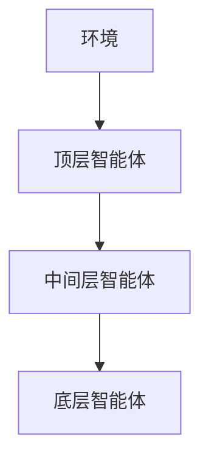
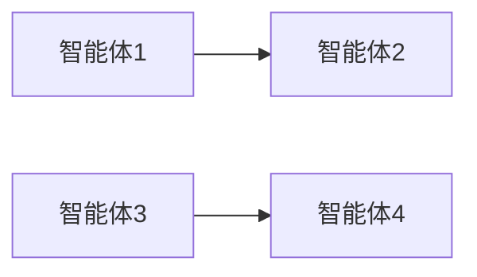
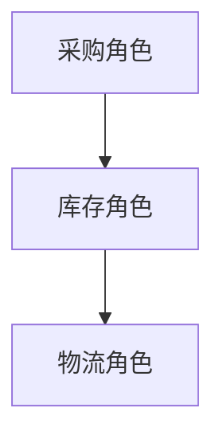
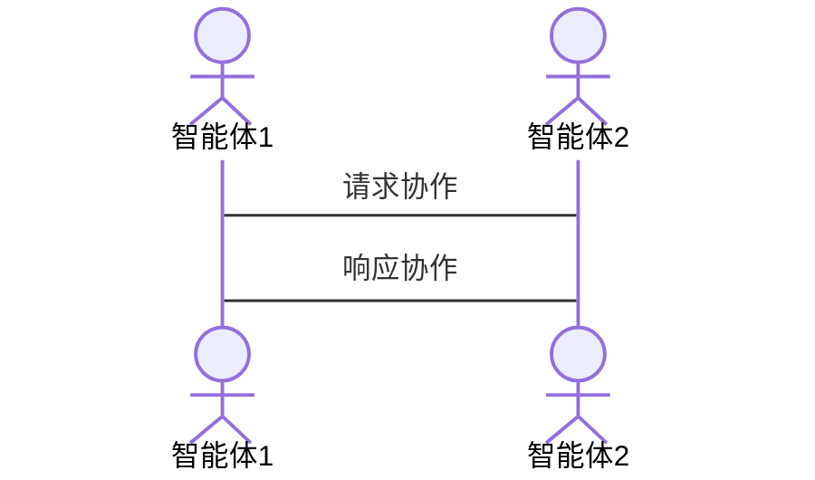
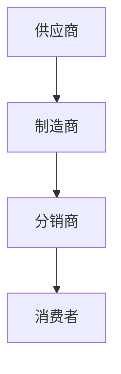

                 

# 利用多智能体系统进行全面的供应链和竞争对手分析

## 关键词：多智能体系统，供应链分析，竞争对手分析，智能体协作，系统设计

## 摘要：多智能体系统通过分布式智能和协作机制，为供应链管理和竞争对手分析提供了高效、动态的解决方案。本文详细探讨了多智能体系统的核心概念，分析其在供应链管理中的应用，并展示了如何利用多智能体系统进行深入的竞争对手分析。通过实际案例和系统设计，本文为读者提供了全面的指导，帮助其理解并应用多智能体系统进行供应链优化和竞争情报分析。

---

## 第1章 多智能体系统概述

### 1.1 多智能体系统的基本概念

#### 1.1.1 多智能体系统的定义
多智能体系统（Multi-Agent System, MAS）由多个智能体（Agent）组成，这些智能体能够通过环境感知、自主决策和协作行动来实现特定目标。智能体可以是软件程序、机器人或其他能够感知环境并采取行动的实体。

#### 1.1.2 多智能体系统的特征
| 特征 | 描述 |
|------|------|
| 分布式 | 智能体独立运行，通过通信协作完成任务 |
| 自主性 | 智能体能够自主决策，无需外部控制 |
| 社会性 | 智能体之间通过通信和协作实现目标 |
| 反应性 | 智能体能够实时感知环境并做出反应 |

#### 1.1.3 多智能体系统与传统单体系统的区别
传统单体系统依赖中央控制，而多智能体系统通过去中心化的方式实现任务。例如，单体系统中库存管理由一个中心系统控制，而多智能体系统中多个智能体分别负责库存、采购和物流。

### 1.2 多智能体系统的体系结构

#### 1.2.1 分层体系结构

#### 1.2.2 分布式体系结构

#### 1.2.3 基于角色的体系结构

### 1.3 多智能体系统的通信协议

#### 1.3.1 通信协议的基本概念
通信协议定义了智能体之间的信息交换方式，常见的协议包括FIPA（Foundation for Intelligent Physical Agents）。

#### 1.3.2 常见的通信协议类型
- FIPA：用于分布式系统中的通信标准
- HTTP：用于Web服务的通信
- MQTT：轻量级协议，适用于物联网环境

### 1.4 多智能体系统的协作机制

#### 1.4.1 协作的基本原理
协作机制通过协调多个智能体的行为，确保系统整体目标的实现。

#### 1.4.2 协作协议的选择
- 请求-响应协议：适用于简单的协作场景
- 让步协议：用于资源竞争场景

#### 1.4.3 协作机制的实现

---

## 第2章 供应链分析的基础知识

### 2.1 供应链的基本概念

#### 2.1.1 供应链的定义
供应链是围绕企业需求，将供应商、制造商、分销商和消费者连接起来的网络。

#### 2.1.2 供应链的组成部分
- 供应商
- 制造商
- 分销商
- 消费者

#### 2.1.3 供应链的运作流程

### 2.2 供应链管理的关键环节

#### 2.2.1 需求预测
使用历史数据和机器学习模型预测未来需求。

#### 2.2.2 库存管理
通过智能体实时监控库存水平，优化库存成本。

#### 2.2.3 采购与物流
智能体协作完成采购订单和物流调度。

### 2.3 供应链分析的挑战与机遇

#### 2.3.1 供应链分析的主要挑战
- 数据不一致
- 信息孤岛
- 需求波动

#### 2.3.2 多智能体系统在供应链分析中的优势
- 分布式计算能力
- 实时协作
- 自适应性

#### 2.3.3 供应链分析的未来趋势
- 智能化
- 数据驱动决策
- 物联网集成

---

## 第3章 多智能体系统在供应链管理中的应用

### 3.1 多智能体系统在需求预测中的应用

#### 3.1.1 需求预测的基本原理
使用时间序列分析和机器学习模型预测需求。

#### 3.1.2 多智能体系统在需求预测中的优势
通过分布式计算提高预测准确性。

### 3.2 多智能体系统在库存管理中的应用

#### 3.2.1 库存管理的基本原理
实时监控库存水平，优化库存周转率。

#### 3.2.2 多智能体系统在库存管理中的实现
智能体协同完成库存补货和调拨。

### 3.3 多智能体系统在采购与物流中的应用

#### 3.3.1 采购与物流的基本原理
通过智能体协作完成供应商选择和物流调度。

#### 3.3.2 多智能体系统在采购与物流中的实现
使用分布式算法优化采购成本和物流路径。

---

## 第4章 多智能体系统在竞争对手分析中的应用

### 4.1 竞争对手分析的基本概念

#### 4.1.1 竞争对手分析的定义
通过分析竞争对手的市场行为，制定相应的竞争策略。

#### 4.1.2 竞争对手分析的

---

## 总结与展望

多智能体系统为供应链和竞争对手分析提供了强大的工具。通过分布式智能和协作机制，企业可以更高效地优化供应链管理，并获得竞争优势。未来，随着人工智能和物联网技术的进步，多智能体系统在供应链和竞争对手分析中的应用将更加广泛和深入。

---

## 作者

作者：AI天才研究院/AI Genius Institute & 禅与计算机程序设计艺术 /Zen And The Art of Computer Programming

