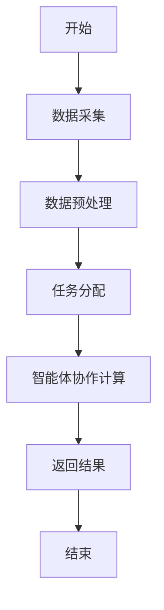
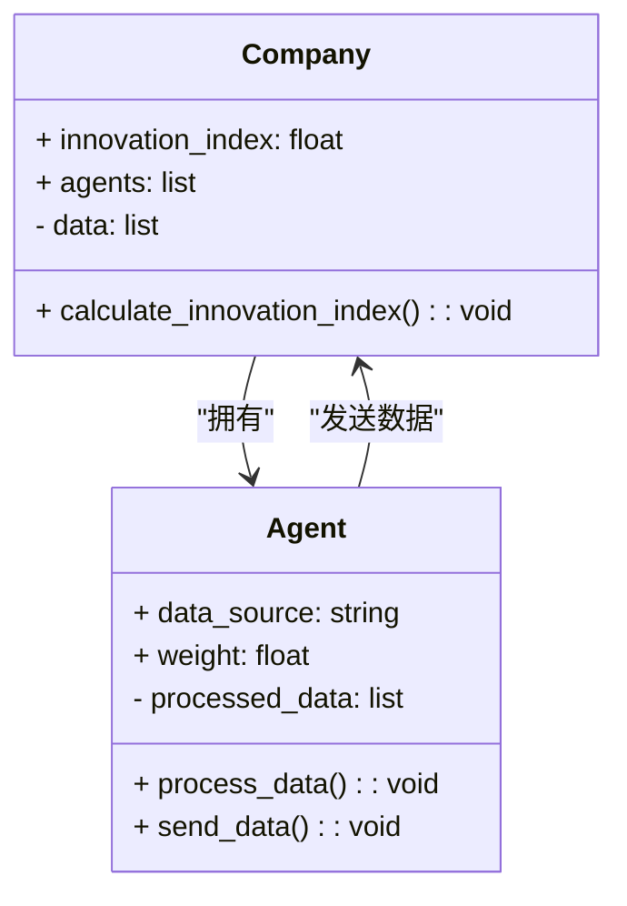
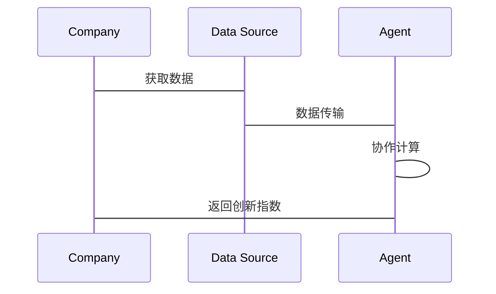

                 


# 利用多智能体系统进行全面的公司创新指数评估

> 关键词：多智能体系统、公司创新指数、创新评估、系统设计、算法实现

> 摘要：本文探讨了利用多智能体系统进行全面的公司创新指数评估的方法。通过分析多智能体系统的原理、创新指数评估的核心要素以及两者结合的算法实现，本文提出了一种基于多智能体系统的创新指数评估模型，并详细介绍了该模型的设计与实现过程，包括系统架构、算法流程、项目实战等内容，为公司创新评估提供了新的思路和方法。

---

## 第1章: 多智能体系统与公司创新指数评估概述

### 1.1 多智能体系统的基本概念

#### 1.1.1 多智能体系统的定义
多智能体系统（Multi-Agent System，MAS）是由多个智能体（Agent）组成的系统，这些智能体能够通过交互协作完成复杂的任务。每个智能体都有一定的自主性、反应性和社会性，能够感知环境、做出决策并采取行动。

#### 1.1.2 多智能体系统的核心特征
| 特征 | 描述 |
|------|------|
| 分布式 | 智能体独立运行，通过通信协作完成任务 |
| 协作性 | 智能体之间需要协作以实现共同目标 |
| 反应性 | 智能体能够实时感知环境并做出响应 |
| 社会性 | 智能体之间存在一定的社会关系和交互规则 |

#### 1.1.3 多智能体系统与传统单智能体系统的区别
- **单智能体系统**：单个智能体完成任务，决策集中。
- **多智能体系统**：多个智能体协作完成任务，决策分散。

### 1.2 公司创新指数评估的背景与意义

#### 1.2.1 创新指数评估的定义
创新指数评估是对公司在技术创新、产品创新、管理创新等方面的能力进行量化评估的过程，旨在衡量公司在市场中的竞争力和创新能力。

#### 1.2.2 公司创新指数评估的重要性
- 为企业制定战略提供数据支持。
- 帮助投资者评估公司的投资价值。
- 为政府制定相关政策提供参考。

#### 1.2.3 创新指数评估的边界与外延
- **边界**：仅评估公司的创新能力，不涉及其他因素。
- **外延**：创新指数可以用于行业比较和趋势分析。

### 1.3 多智能体系统在创新指数评估中的应用前景

#### 1.3.1 多智能体系统的优势
- 分布式计算能力强，适合复杂任务。
- 多智能体协作能够提高评估的全面性和准确性。

#### 1.3.2 多智能体系统在创新指数评估中的潜在应用
- 分散数据采集与处理。
- 多维度指标协作评估。
- 实时数据更新与反馈。

#### 1.3.3 多智能体系统应用的挑战与机遇
- **挑战**：智能体之间的通信与协作需要高效机制。
- **机遇**：通过多智能体协作，可以实现更复杂的评估任务。

## 第2章: 多智能体系统的原理与核心概念

### 2.1 多智能体系统的原理

#### 2.1.1 多智能体系统的组成要素
- **智能体**：独立的计算实体。
- **通信机制**：智能体之间的信息交换。
- **协作协议**：智能体协作的规则和流程。

#### 2.1.2 多智能体系统的基本工作原理
- 智能体感知环境，获取数据。
- 智能体根据数据做出决策。
- 智能体通过通信机制与其它智能体协作。

#### 2.1.3 多智能体系统中的通信与协作机制
- **通信机制**：智能体之间通过消息传递进行通信。
- **协作机制**：智能体通过协商达成一致，完成任务。

### 2.2 多智能体系统的实体关系分析

#### 2.2.1 实体关系图（ER图）
```mermaid
erDiagram
    company --> innovation_index : "评估"
    innovation_index --> agent : "由智能体计算"
    agent --> data_source : "从数据源获取数据"
    data_source --> innovation_indicator : "提供创新指标"
```

#### 2.2.2 实体关系的详细描述
- **公司（Company）**：需要进行创新指数评估的主体。
- **创新指数（Innovation Index）**：评估的结果。
- **智能体（Agent）**：负责数据采集、处理和计算的实体。
- **数据源（Data Source）**：提供创新指标的数据来源。

#### 2.2.3 实体关系与创新指数评估的关系
- 智能体从数据源获取数据，计算创新指数，反馈给公司。

### 2.3 多智能体系统的算法原理

#### 2.3.1 分布式计算的基本原理
- 数据分布处理，智能体协作完成任务。

#### 2.3.2 多智能体系统中的共识算法
- **共识算法**：确保所有智能体达成一致的算法。

#### 2.3.3 多智能体系统中的任务分配算法
- **任务分配**：智能体之间分配任务，确保高效协作。

## 第3章: 创新指数评估的核心要素与指标体系

### 3.1 创新指数评估的核心要素

#### 3.1.1 技术创新
- 研发投入、专利数量、技术领先性。

#### 3.1.2 产品创新
- 产品更新频率、市场反馈、新产品数量。

#### 3.1.3 管理创新
- 管理模式创新、组织结构优化、管理效率提升。

### 3.2 创新指数评估的指标体系

#### 3.2.1 指标体系的构建方法
- 确定关键指标、权重分配、数据采集与处理。

#### 3.2.2 指标权重的确定方法
- 层次分析法（AHP）。

#### 3.2.3 指标数据的采集与处理
- 数据清洗、标准化处理、数据融合。

### 3.3 创新指数评估的数学模型

#### 3.3.1 创新指数的计算公式
$$创新指数 = \sum_{i=1}^{n} w_i \cdot x_i$$
其中，$w_i$为指标权重，$x_i$为指标得分。

#### 3.3.2 创新指数的权重分配模型
- 使用层次分析法确定权重。

#### 3.3.3 创新指数评估的数学推导
- 确定各指标权重，计算综合得分。

## 第4章: 多智能体系统在创新指数评估中的算法实现

### 4.1 多智能体系统的算法流程

#### 4.1.1 算法的整体流程
- 数据采集与预处理。
- 分配任务给智能体。
- 智能体协作计算创新指数。
- 返回结果。

#### 4.1.2 算法的详细步骤


#### 4.1.3 算法的优化与改进
- 提高通信效率，减少延迟。

### 4.2 多智能体系统的数学模型

#### 4.2.1 算法的数学表达式
$$创新指数 = \sum_{i=1}^{n} w_i \cdot x_i$$

#### 4.2.2 算法的收敛性分析
- 算法在有限步内收敛。

#### 4.2.3 算法的复杂度分析
- 时间复杂度为$O(n)$。

### 4.3 多智能体系统的代码实现

#### 4.3.1 环境安装
- 安装Python和相关库（如numpy、scipy）。

#### 4.3.2 系统核心实现源代码
```python
import numpy as np

def calculate_innovation_index(data, weights):
    return np.dot(data, weights)

# 示例数据
data = np.array([1, 2, 3])
weights = np.array([0.3, 0.4, 0.3])
result = calculate_innovation_index(data, weights)
print("创新指数计算结果:", result)
```

#### 4.3.3 代码应用解读
- 数据表示创新指标，权重表示各指标的重要性，计算结果为创新指数。

## 第5章: 系统分析与架构设计

### 5.1 项目介绍与背景

#### 5.1.1 项目介绍
- 开发一个多智能体系统，用于公司创新指数评估。

#### 5.1.2 项目背景
- 当前公司创新评估方法的局限性。
- 多智能体系统的优势。

### 5.2 系统功能设计

#### 5.2.1 系统功能模块
- 数据采集模块、数据处理模块、智能体协作模块。

#### 5.2.2 系统功能流程


### 5.3 系统架构设计

#### 5.3.1 系统架构图


#### 5.3.2 系统架构设计说明
- 公司通过智能体从数据源获取数据，计算创新指数。

### 5.4 系统接口设计

#### 5.4.1 系统接口设计
- 数据接口：数据采集与处理。
- 智能体接口：协作与通信。

#### 5.4.2 系统交互流程


## 第6章: 项目实战

### 6.1 环境安装与配置

#### 6.1.1 环境安装
- 安装Python、numpy、scipy。

#### 6.1.2 系统核心实现源代码
```python
import numpy as np

class Agent:
    def __init__(self, data_source, weight):
        self.data_source = data_source
        self.weight = weight

    def process_data(self):
        # 数据处理逻辑
        pass

    def send_data(self, data):
        # 发送数据
        pass

class Company:
    def __init__(self, agents):
        self.agents = agents
        self.data = []

    def calculate_innovation_index(self):
        for agent in self.agents:
            agent.process_data()
            agent.send_data(self.data)
        # 计算创新指数
        return np.dot(self.data, [agent.weight for agent in self.agents])
```

#### 6.1.3 代码应用解读
- Agent类表示智能体，Company类表示公司。
- calculate_innovation_index方法计算创新指数。

### 6.2 实际案例分析与详细讲解

#### 6.2.1 案例分析
- 某公司创新指数评估案例。

#### 6.2.2 详细讲解
- 数据采集、处理、计算过程。

### 6.3 项目小结

#### 6.3.1 项目总结
- 多智能体系统在创新指数评估中的优势。

#### 6.3.2 项目中的问题与解决方案
- 通信延迟问题，优化通信机制。

## 第7章: 总结与展望

### 7.1 本章总结

#### 7.1.1 核心内容回顾
- 多智能体系统的基本原理。
- 创新指数评估的核心要素。
- 算法实现与系统设计。

#### 7.1.2 主要结论
- 多智能体系统能够有效提高创新指数评估的效率和准确性。

### 7.2 未来研究方向与展望

#### 7.2.1 未来研究方向
- 多智能体系统的优化与改进。
- 新算法和新技术的应用。

#### 7.2.2 创新点总结
- 提出了一种基于多智能体系统的创新指数评估模型。

### 7.3 最佳实践 tips

#### 7.3.1 实践建议
- 合理设计智能体的通信机制。
- 定期更新数据源和模型。

#### 7.3.2 注意事项
- 确保数据安全和隐私保护。
- 处理好智能体之间的协作关系。

### 7.4 拓展阅读

#### 7.4.1 相关领域
- 分布式系统、多智能体系统、创新管理。

#### 7.4.2 推荐书籍与论文
- 推荐阅读《Multi-Agent Systems: Algorithmic, Complexity, and Inferential Foundations》。

---

## 作者：AI天才研究院/AI Genius Institute & 禅与计算机程序设计艺术 /Zen And The Art of Computer Programming

