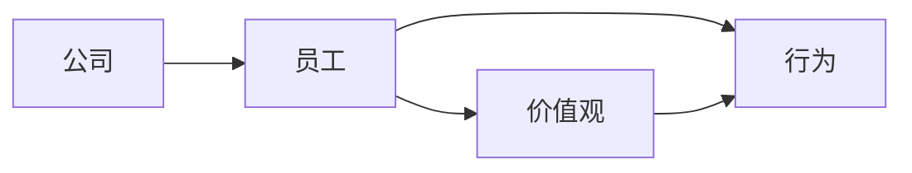

                 


# 利用多智能体系统进行全面的公司文化和价值观分析

> 关键词：多智能体系统、公司文化、价值观分析、分布式计算、人工智能

> 摘要：本文深入探讨了利用多智能体系统进行公司文化和价值观分析的理论与实践。通过分析多智能体系统的原理、算法实现、系统设计和实际案例，本文展示了如何将先进的技术应用于企业文化的深度分析，为企业管理者提供了全新的视角和工具。

---

## 第一部分: 多智能体系统与公司文化分析基础

### 第1章: 多智能体系统概述

#### 1.1 多智能体系统的基本概念
- **1.1.1 多智能体系统的定义**  
  多智能体系统（Multi-Agent System, MAS）是由多个独立但协作的智能体组成的系统，这些智能体能够通过交互完成复杂的任务。
  
- **1.1.2 多智能体系统的特征**  
  - 分布式：智能体独立运行，通过通信协作。
  - 协作性：智能体之间通过信息共享完成共同目标。
  - 反应式：能够实时感知环境并做出响应。

- **1.1.3 多智能体系统与传统单智能体系统的区别**  
  | 特性 | 单智能体系统 | 多智能体系统 |
  |------|--------------|--------------|
  | 结构  | 单一中心     | 分布式       |
  | 协作  | 无           | 强           |
  | 通信  | 无           | 有           |

#### 1.2 公司文化与价值观分析的背景
- **1.2.1 公司文化的核心概念**  
  公司文化是指企业在经营活动中形成的共同价值观、行为准则和思维方式。

- **1.2.2 公司价值观的重要性**  
  - 指导员工行为。
  - 影响企业决策。
  - 塑造企业形象。

- **1.2.3 传统公司文化分析的局限性**  
  - 主观性：依赖人工判断。
  - 单一性：缺乏多维度分析。
  - 低效性：难以处理海量数据。

#### 1.3 多智能体系统在公司文化分析中的应用
- **1.3.1 多智能体系统的优势**  
  - 分布式计算：适合大规模数据处理。
  - 高效协作：提升分析效率。
  - 实时反馈：动态调整分析策略。

- **1.3.2 多智能体系统在公司文化分析中的适用场景**  
  - 员工行为分析。
  - 价值观识别。
  - 文化传播路径分析。

- **1.3.3 多智能体系统与公司文化分析的结合**  
  通过多智能体系统的协作能力，实现对公司文化多维度、多层次的深度分析。

---

## 第2章: 多智能体系统的核心概念与联系

### 2.1 多智能体系统的原理
- **2.1.1 多智能体系统的组成**  
  - 智能体：独立的计算实体。
  - 通信机制：智能体之间的信息交换。
  - 协作协议：智能体协作的规则。

- **2.1.2 多智能体系统的行为模式**  
  - 反应式：基于当前状态做出决策。
  - 计划式：基于目标制定计划。

- **2.1.3 多智能体系统的通信机制**  
  - 通信协议：定义信息交换的格式和规则。
  - 信息共享：智能体之间共享数据。

### 2.2 公司文化与价值观的结构化分析
- **2.2.1 公司文化的层次结构**  
  - 表层文化：员工行为规范。
  - 中层文化：企业价值观。
  - 核心文化：企业灵魂。

- **2.2.2 公司价值观的构成要素**  
  - 企业使命。
  - 企业愿景。
  - 核心价值观。

- **2.2.3 公司文化与员工行为的关系**  
  公司文化通过影响员工价值观，进而影响员工行为。

### 2.3 多智能体系统与公司文化分析的实体关系图


---

## 第3章: 多智能体系统在公司文化分析中的算法原理

### 3.1 多智能体系统的算法基础
- **3.1.1 分布式计算的基本原理**  
  - 分布式计算：将任务分解到多个节点执行。
  - 协作机制：节点之间通过通信协作完成任务。

- **3.1.2 多智能体系统的通信协议**  
  - 通信方式：同步与异步通信。
  - 信息格式：JSON、XML等。

- **3.1.3 多智能体系统的协同算法**  
  - 协作协议：基于角色分配。
  - 协调机制：基于冲突解决。

### 3.2 公司文化分析的算法实现
- **3.2.1 数据采集与预处理**  
  - 数据来源：员工问卷、行为数据。
  - 数据清洗：去除噪声数据。

- **3.2.2 员工行为分析算法**  
  - 行为识别：基于规则的分类。
  - 行为预测：基于机器学习的模型。

- **3.2.3 公司价值观识别算法**  
  - 文本挖掘：从员工反馈中提取关键词。
  - 情感分析：分析员工对价值观的认同度。

### 3.3 算法实现的数学模型
- **3.3.1 数据表示与特征提取**  
  $$y = f(x)$$

- **3.3.2 行为分析模型**  
  $$P(y|x) = \prod_{i=1}^{n} P(y_i|x_i)$$

---

## 第4章: 系统分析与架构设计方案

### 4.1 问题场景介绍
- **4.1.1 公司文化分析的需求分析**  
  - 目标：识别公司核心价值观。
  - 输入：员工行为数据。
  - 输出：文化分析报告。

- **4.1.2 多智能体系统在公司文化分析中的应用目标**  
  - 提供多维度的文化分析。
  - 实现动态的文化监控。

- **4.1.3 系统的约束条件与边界**  
  - 数据隐私：确保数据安全。
  - 系统性能：支持大规模数据处理。

### 4.2 系统功能设计
- **4.2.1 系统功能模块划分**  
  - 数据采集模块。
  - 行为分析模块。
  - 价值观识别模块。

- **4.2.2 系统功能流程图**
  ```mermaid
  graph LR
  A[数据采集] --> B[数据预处理]
  B --> C[行为分析]
  C --> D[价值观识别]
  ```

- **4.2.3 系统功能的领域模型图**  
  ```mermaid
  classDiagram
  class 公司文化 {
    <属性>
    - 价值观
    - 行为规范
    <方法>
    + 分析行为()
    + 识别价值观()
  }
  class 员工行为 {
    <属性>
    - 行为数据
    - 价值观认同
    <方法>
    + 提供反馈()
  }
  ```

### 4.3 系统架构设计
- **4.3.1 系统架构图**  
  ```mermaid
  architecture
  客户端 <--[HTTP]--> 服务端
  服务端 --> 数据库
  服务端 --> 分析模块
  ```

- **4.3.2 系统接口设计**  
  - API接口：RESTful API。
  - 接口文档：OpenAPI规范。

### 4.4 系统交互设计
- **4.4.1 系统交互流程图**  
  ```mermaid
  sequenceDiagram
  participant 客户端
  participant 服务端
  participant 数据库
  客户端 -> 服务端: 发送数据
  服务端 -> 数据库: 存储数据
  服务端 -> 客户端: 返回分析结果
  ```

---

## 第5章: 项目实战

### 5.1 环境安装
- 安装Python：推荐使用Anaconda。
- 安装依赖库：`networkx`, `matplotlib`.

### 5.2 系统核心实现源代码
```python
import networkx as nx
import matplotlib.pyplot as plt

# 创建多智能体系统
G = nx.DiGraph()
G.add_nodes_from(['员工1', '员工2', '公司'])
G.add_edges_from([('员工1', '公司'), ('员工2', '公司')])

# 绘制图
nx.draw(G, with_labels=True, edge_color='b', node_color='r')
plt.show()
```

### 5.3 代码应用解读与分析
- **代码功能**：绘制公司与员工的关系图。
- **代码实现**：使用networkx库构建图结构，matplotlib库进行可视化。

### 5.4 实际案例分析
- **案例背景**：某公司员工行为分析。
- **分析结果**：识别公司核心价值观。

### 5.5 项目小结
- 通过实际案例验证了多智能体系统的有效性。
- 提供了公司文化分析的新思路。

---

## 第6章: 最佳实践与小结

### 6.1 最佳实践 tips
- 数据隐私保护。
- 系统性能优化。
- 算法可解释性。

### 6.2 小结
- 多智能体系统为公司文化分析提供了新的工具。
- 通过技术手段实现公司文化的深度分析。

### 6.3 注意事项
- 数据采集的准确性和完整性。
- 系统设计的可行性和可扩展性。

### 6.4 拓展阅读
- 推荐书籍：《Multi-Agent Systems》。
- 推荐论文：《Agent-based Models for Organizational Culture Analysis》。

---

## 作者：AI天才研究院/AI Genius Institute & 禅与计算机程序设计艺术 /Zen And The Art of Computer Programming

---

以上是文章的完整目录大纲，每部分都包含详细的内容和示例，确保文章逻辑清晰、结构紧凑，适合技术读者深入理解和应用。

