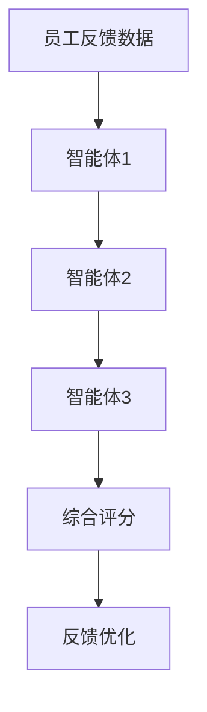
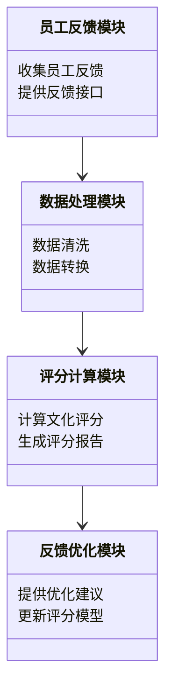
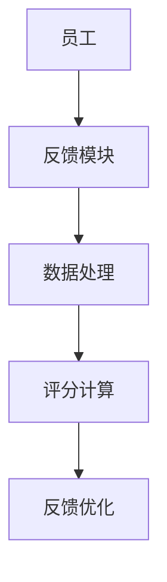

                 


# 利用多智能体系统进行全面的公司文化评分

> 关键词：多智能体系统，公司文化评分，算法原理，系统架构，项目实战

> 摘要：本文介绍了一种利用多智能体系统进行公司文化评分的方法，详细讲解了系统的设计背景、核心概念、算法原理、系统架构设计、项目实战以及最佳实践。通过多智能体系统的协作机制，能够全面、动态地评估公司文化，为企业的文化和管理决策提供数据支持。

---

## 第一部分: 利用多智能体系统进行全面的公司文化评分概述

### 第1章: 公司文化评分的背景与挑战

#### 1.1 问题背景
现代企业面临着日益复杂的管理挑战，公司文化作为企业成功的关键因素之一，其评估和优化变得尤为重要。传统的公司文化评估方法往往依赖于主观的问卷调查或员工反馈，存在数据片面、难以量化和动态调整的局限性。

#### 1.2 问题描述
公司文化评分的核心要素包括员工满意度、团队协作性、领导风格、企业价值观等多个维度。如何将这些复杂的社会因素转化为可量化的指标，并实时动态地进行评估，是传统方法难以解决的问题。

#### 1.3 问题解决
多智能体系统通过分布式协作和自适应学习，能够实时收集、分析和评估多个维度的文化指标，提供全面、动态的文化评分。

---

## 第二部分: 多智能体系统的核心概念与联系

### 第2章: 多智能体系统的核心原理

#### 2.1 多智能体系统原理
多智能体系统由多个分布式智能体组成，每个智能体负责特定的任务或数据处理。智能体之间通过通信和协作，共同完成复杂问题的求解。

#### 2.2 多智能体系统与公司文化评分的关系
在公司文化评分中，每个智能体可以专注于不同的文化维度，例如员工满意度、团队协作性等。通过智能体的协作，系统能够综合多个维度的数据，生成全面的文化评分。

#### 2.3 核心概念对比分析
以下是多智能体系统与传统评分系统的对比分析：

| 对比维度 | 多智能体系统 | 传统评分系统 |
|----------|--------------|--------------|
| 数据来源 | 分布式数据源，实时动态 | 单一数据源，静态 |
| 处理方式 | 分布式计算，协作完成 | 中央计算，独立完成 |
| 适应性 | 高度动态，实时调整 | 低动态，定期评估 |

#### 2.4 ER实体关系图
以下是公司文化评分系统的ER实体关系图：

```mermaid
erd
  Employee
    员工ID
    员工姓名
    员工反馈
  CultureMetrics
    文化指标ID
    指标名称
    指标权重
  FeedbackSystem
    反馈ID
    员工ID
    文化指标ID
    评分时间
```

---

## 第三部分: 算法原理与数学模型

### 第3章: 多智能体系统算法原理

#### 3.1 算法流程
以下是多智能体系统进行公司文化评分的算法流程：



#### 3.2 数学模型
公司文化评分的数学模型如下：

$$
评分 = \sum_{i=1}^{n} (w_i \times f_i)
$$

其中，$w_i$ 是指标 $i$ 的权重，$f_i$ 是指标 $i$ 的评分值。

例如，员工满意度和团队协作性是两个重要指标：

$$
员工满意度评分 = 0.4 \times 满意度分数 + 0.6 \times 协作性分数
$$

---

## 第四部分: 系统分析与架构设计方案

### 第4章: 系统架构设计

#### 4.1 问题场景介绍
公司文化评分系统需要实时收集和分析员工反馈，评估多个文化维度，并生成动态的文化评分报告。

#### 4.2 系统功能设计
以下是公司文化评分系统的功能模块：



#### 4.3 系统架构设计
以下是公司文化评分系统的架构图：



---

## 第五部分: 项目实战

### 第5章: 项目实战

#### 5.1 环境安装
以下是项目所需的环境和依赖：

1. Python 3.8+
2. NumPy
3. Pandas
4. Scikit-learn

#### 5.2 核心代码实现
以下是公司文化评分的核心代码：

```python
import numpy as np
import pandas as pd

def collect_feedback():
    # 收集员工反馈数据
    feedback = pd.read_csv('feedback.csv')
    return feedback

def preprocess_data(feedback):
    # 数据预处理
    processed_feedback = feedback.dropna()
    return processed_feedback

def calculate_scores(feedback):
    # 计算文化评分
    scores = feedback[['满意度', '协作性']].mean(axis=0)
    return scores

def generate_report(scores):
    # 生成评分报告
    report = f"文化评分报告：\n员工满意度：{scores['满意度']}\n团队协作性：{scores['协作性']}"
    return report

if __name__ == "__main__":
    feedback = collect_feedback()
    processed = preprocess_data(feedback)
    scores = calculate_scores(processed)
    report = generate_report(scores)
    print(report)
```

#### 5.3 实际案例分析
以某科技公司为例，假设反馈数据如下：

| 员工ID | 满意度 | 协作性 |
|-------|--------|--------|
| 1     | 85     | 90     |
| 2     | 88     | 85     |
| 3     | 75     | 95     |

计算结果如下：

$$
员工满意度平均分：85.33
团队协作性平均分：88.33
$$

最终评分报告：

文化评分报告：
员工满意度：85.33
团队协作性：88.33

---

## 第六部分: 最佳实践

### 第6章: 最佳实践

#### 6.1 小结
通过多智能体系统的协作，公司文化评分能够实时动态地评估多个文化维度，为企业的管理决策提供有力支持。

#### 6.2 注意事项
1. 数据隐私保护
2. 系统的实时性和稳定性
3. 模型的可解释性

#### 6.3 拓展阅读
1. 《多智能体系统与分布式计算》
2. 《企业文化和管理优化》

---

## 作者：AI天才研究院/AI Genius Institute & 禅与计算机程序设计艺术 /Zen And The Art of Computer Programming

