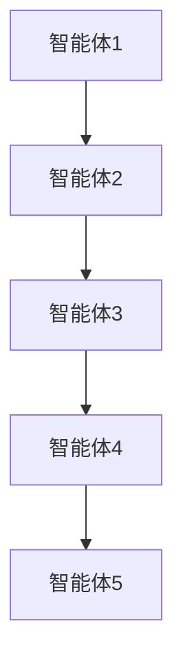
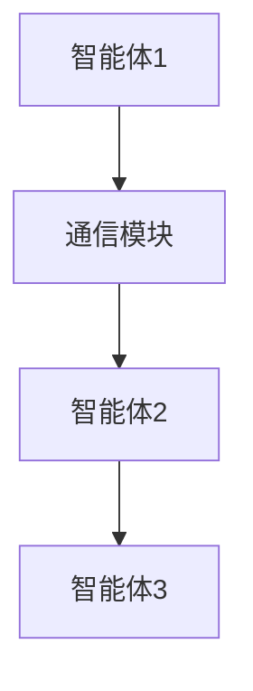
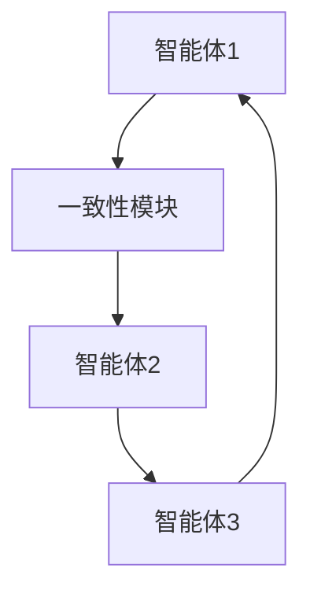
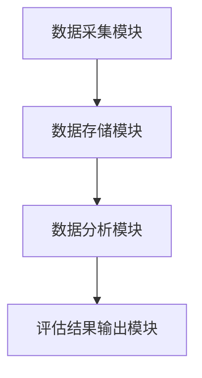
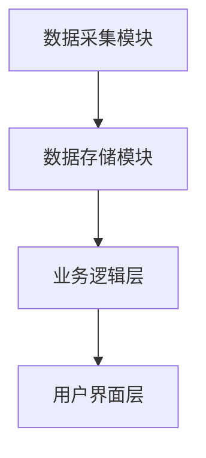
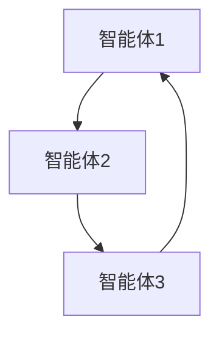

                 


---

# 利用多智能体系统进行全面的公司知识产权价值评估

**关键词**：多智能体系统、知识产权评估、算法原理、系统架构、项目实战

**摘要**：  
随着企业竞争的日益激烈，知识产权的价值评估变得至关重要。传统的知识产权评估方法往往依赖人工分析，存在效率低下、主观性强、难以量化等问题。为了克服这些挑战，多智能体系统（Multi-Agent System, MAS）作为一种新兴的技术手段，逐渐被应用于知识产权评估领域。本文将详细介绍多智能体系统在知识产权价值评估中的应用背景、核心概念、算法原理、系统架构以及实际项目案例，全面探讨如何利用多智能体系统进行高效、精准的知识产权价值评估。

---

# 正文

## 第1章 多智能体系统与知识产权评估的背景

### 1.1 多智能体系统的基本概念

多智能体系统（Multi-Agent System, MAS）是由多个智能体（Agent）组成的分布式系统，这些智能体能够通过交互和协作完成复杂的任务。智能体是指具有感知环境、自主决策和执行任务能力的实体。多智能体系统的特点包括分布性、协作性、反应性和智能性。

#### 图1-1 多智能体系统的构成



多智能体系统在知识产权评估中的优势在于能够同时处理多个维度的信息，例如技术、法律、市场等，从而提供更加全面的评估结果。

### 1.2 知识产权评估的必要性

知识产权是企业的重要资产，包括专利、商标、版权等。知识产权的价值不仅取决于其法律保护，还与其技术价值、市场价值和经济价值密切相关。传统的知识产权评估方法通常依赖于人工分析，存在以下问题：

1. **效率低下**：人工评估需要大量时间和资源。
2. **主观性强**：评估结果受评估人员的经验和主观判断影响。
3. **难以量化**：难以将技术、法律和市场因素量化。

### 1.3 多智能体系统在知识产权评估中的应用

多智能体系统可以通过分布式计算和协作能力，解决传统评估方法的不足。多智能体系统可以分别负责不同的评估任务，例如：

1. **技术评估**：分析专利的技术先进性和创新性。
2. **法律评估**：分析专利的法律保护范围和风险。
3. **市场评估**：分析专利的市场应用前景和经济价值。

通过多智能体系统的协作，可以实现知识产权的全面评估，并提供更加精准的结果。

---

## 第2章 多智能体系统的算法原理

### 2.1 多智能体系统的通信机制

多智能体系统的通信机制是实现智能体协作的基础。智能体之间可以通过以下方式进行通信：

1. **直接通信**：智能体之间通过消息传递直接交换信息。
2. **间接通信**：通过共享数据库或中间件进行信息交换。

#### 图2-1 多智能体系统的通信流程



### 2.2 多智能体系统的协作算法

多智能体系统的协作算法是实现智能体协同工作的核心。常见的协作算法包括：

1. **分布式一致性算法**：用于保证系统中各智能体的状态一致。
2. **分布式协商算法**：用于智能体之间的任务分配和资源协调。
3. **分布式决策算法**：用于智能体的集体决策。

#### 图2-2 分布式一致性算法流程



---

## 第3章 知识产权评估的系统架构设计

### 3.1 系统功能设计

知识产权评估系统的主要功能包括：

1. **数据采集**：收集专利、商标等知识产权数据。
2. **数据分析**：对知识产权数据进行技术、法律和市场分析。
3. **评估结果输出**：输出知识产权的综合评估结果。

#### 图3-1 系统功能模块图



### 3.2 系统架构设计

知识产权评估系统的架构设计包括：

1. **数据层**：存储知识产权数据。
2. **业务逻辑层**：实现数据分析和评估逻辑。
3. **用户界面层**：提供用户交互界面。

#### 图3-2 系统架构图



---

## 第4章 项目实战：多智能体系统的实现

### 4.1 环境安装

为了实现多智能体系统，需要安装以下环境：

1. **Python**：用于编写智能体程序。
2. **Python库**：如`networkx`、`matplotlib`等，用于数据处理和可视化。

### 4.2 核心代码实现

以下是多智能体系统的核心代码示例：

```python
import networkx as nx
import matplotlib.pyplot as plt

# 创建多智能体系统图
G = nx.DiGraph()

# 添加智能体节点
G.add_nodes_from(['A', 'B', 'C'])

# 添加智能体之间的边
G.add_edges_from([('A', 'B'), ('B', 'C'), ('C', 'A')])

# 绘制图
nx.draw(G, with_labels=True, node_color='white')
plt.show()
```

#### 图4-1 多智能体系统图



### 4.3 项目小结

通过以上代码实现，我们可以看到多智能体系统的协作流程。每个智能体负责不同的任务，通过通信和协作完成知识产权评估。

---

## 第5章 总结与展望

### 5.1 本章总结

本文详细介绍了多智能体系统在知识产权评估中的应用，包括多智能体系统的定义、算法原理、系统架构设计和项目实战。通过多智能体系统的协作，可以实现知识产权的全面评估，提高评估效率和准确性。

### 5.2 展望

未来，随着人工智能技术的发展，多智能体系统在知识产权评估中的应用将更加广泛。可以通过引入更多智能体和更复杂的算法，进一步提高评估的精度和效率。

---

**作者：AI天才研究院/AI Genius Institute & 禅与计算机程序设计艺术 /Zen And The Art of Computer Programming**

---

以上是关于《利用多智能体系统进行全面的公司知识产权价值评估》的技术博客文章的完整目录大纲和内容示例。如果您有任何问题或需要进一步的调整，请随时告诉我！

