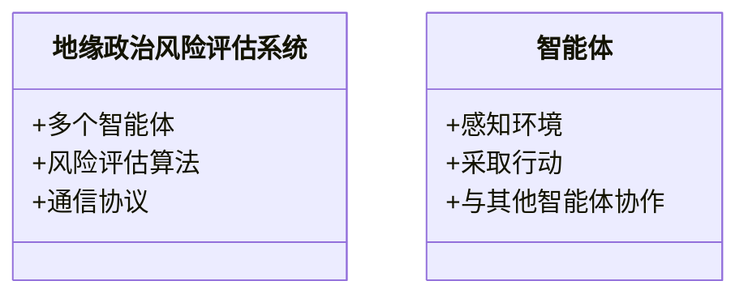
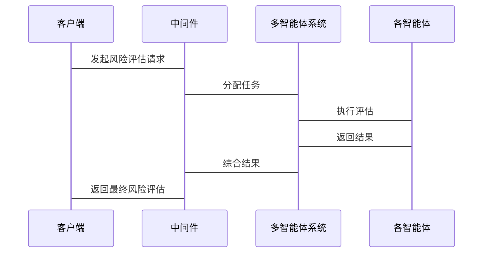

                 


# 利用多智能体系统进行全面的地缘政治风险评估

## 关键词：多智能体系统，地缘政治风险，风险评估，分布式计算，人工智能

## 摘要：本文探讨了如何利用多智能体系统进行全面的地缘政治风险评估。通过分析多智能体系统的原理、算法及数学模型，结合实际案例，展示了如何在复杂多变的地缘政治环境中，利用多智能体系统的协作机制和动态适应能力，实现对地缘政治风险的实时、全面评估。文章详细介绍了系统的架构设计、核心算法实现及风险评估的数学模型，并通过具体案例分析，验证了该方法的有效性和可行性。

---

# 第1章 多智能体系统与地缘政治风险评估概述

## 1.1 多智能体系统的基本概念

### 1.1.1 智能体的定义与分类
智能体（Agent）是指能够感知环境并采取行动以实现目标的实体。多智能体系统（Multi-Agent System, MAS）由多个智能体组成，通过协作完成复杂任务。智能体可以分为反应式和认知式两类，前者基于当前感知采取行动，后者具备推理、规划能力。

### 1.1.2 多智能体系统的定义与特点
多智能体系统是由多个智能体组成的分布式系统，具有分布式性、协作性、自主性、反应性和动态性等特点。这些特点使其能够适应复杂多变的地缘政治环境。

### 1.1.3 多智能体系统在地缘政治中的应用潜力
地缘政治环境复杂，涉及多方利益和动态变化。多智能体系统能够模拟各方行为，预测风险，为决策者提供支持。

## 1.2 地缘政治风险评估的背景与意义

### 1.2.1 地缘政治风险的定义与构成
地缘政治风险是指由于政治、经济、军事等因素变化引发的潜在风险。其构成包括经济、政治、军事、文化和社会因素。

### 1.2.2 地缘政治风险评估的必要性
准确评估地缘政治风险有助于制定有效的应对策略，减少潜在损失。

### 1.2.3 多智能体系统在风险评估中的优势
多智能体系统能够模拟多方互动，提供动态评估，弥补传统方法的不足。

## 1.3 本章小结
本章介绍了多智能体系统的基本概念及其在地缘政治风险评估中的应用潜力。

---

# 第2章 多智能体系统的原理与地缘政治风险分析

## 2.1 多智能体系统的架构设计

### 2.1.1 分布式计算与协作机制
分布式计算是多智能体系统的核心，协作机制确保智能体之间的有效配合。

### 2.1.2 智能体之间的通信协议
智能体通过通信协议交换信息，实现协作。

### 2.1.3 多智能体系统的动态性与适应性
系统能够动态调整以适应环境变化。

## 2.2 地缘政治风险分析的核心要素

### 2.2.1 经济因素分析
经济波动、贸易政策变化可能引发风险。

### 2.2.2 政治因素分析
政治不稳定、政策变化影响地缘政治风险。

### 2.2.3 军事因素分析
军事冲突、军备竞赛增加风险。

### 2.2.4 文化与社会因素分析
文化冲突、社会动荡影响地缘政治环境。

## 2.3 多智能体系统与地缘政治风险的关联性分析

### 2.3.1 智能体行为与地缘政治事件的映射
智能体行为模拟地缘政治事件，帮助预测风险。

### 2.3.2 多智能体系统的动态演化与地缘政治风险的变化
系统动态演化反映地缘政治风险的变化。

## 2.4 本章小结
本章分析了多智能体系统的架构及其在地缘政治风险分析中的应用。

---

# 第3章 多智能体系统的算法与数学模型

## 3.1 分布式计算与协调算法

### 3.1.1 分布式计算的基本原理
分布式计算通过多智能体协作完成任务。

### 3.1.2 协调算法的实现机制
协调算法确保智能体之间的协作。

### 3.1.3 多智能体系统中的共识算法
共识算法用于智能体达成一致。

## 3.2 地缘政治风险评估的算法实现

### 3.2.1 风险评估指标体系的构建
构建包含经济、政治、军事等指标的体系。

### 3.2.2 风险评估的权重分配与计算
通过权重分配计算各因素对风险的影响。

### 3.2.3 基于多智能体的动态风险评估算法
动态算法实时更新风险评估结果。

## 3.3 数学模型与公式推导

### 3.3.1 风险指数的计算公式
$$风险指数 = \sum_{i=1}^{n} w_i \cdot f_i$$
其中，\(w_i\) 是第i个因素的权重，\(f_i\) 是第i个因素的风险值。

### 3.3.2 基于概率论的风险评估模型
概率模型用于预测风险发生的可能性。

### 3.3.3 基于博弈论的风险评估模型
博弈论模型分析各方策略对风险的影响。

## 3.4 本章小结
本章详细介绍了多智能体系统的算法及其在地缘政治风险评估中的应用。

---

# 第4章 多智能体系统的系统分析与架构设计

## 4.1 系统功能设计

### 4.1.1 地域模型
地域模型展示地缘政治环境中的各个实体。

### 4.1.2 领域模型的 mermaid 类图


## 4.2 系统架构设计

### 4.2.1 系统架构的 mermaid 架构图


## 4.3 系统接口设计

### 4.3.1 接口定义
智能体之间通过特定接口通信。

## 4.4 系统交互设计

### 4.4.1 交互的 mermaid 序列图


## 4.5 本章小结
本章详细描述了系统的架构设计和交互流程。

---

# 第5章 项目实战与案例分析

## 5.1 环境配置

### 5.1.1 系统环境
安装必要的开发工具和库。

### 5.1.2 依赖管理
使用包管理工具安装所需的依赖。

## 5.2 核心代码实现

### 5.2.1 智能体类的实现
```python
class Agent:
    def __init__(self, id):
        self.id = id
        self.state = None

    def perceive(self, environment):
        self.state = environment感知结果

    def act(self):
        根据self.state采取行动
```

### 5.2.2 风险评估算法的实现
```python
def assess_risk(agents):
    total_risk = 0
    for agent in agents:
        total_risk += 评估该智能体的风险
    return total_risk
```

## 5.3 案例分析与解读

### 5.3.1 案例场景
分析某个具体地缘政治事件的风险。

### 5.3.2 实际案例分析
通过具体案例展示系统的应用。

## 5.4 本章小结
本章通过实际案例展示了多智能体系统的应用。

---

# 第6章 总结与展望

## 6.1 总结
本文详细探讨了多智能体系统在地缘政治风险评估中的应用。

## 6.2 展望
未来研究方向包括提高系统的实时性和准确性。

## 6.3 最佳实践 tips
- 定期更新模型参数。
- 加强数据收集和分析能力。
- 提高系统的可解释性。

## 6.4 本章小结
总结全文，展望未来。

---

# 作者：AI天才研究院 & 禅与计算机程序设计艺术

---

这篇文章全面介绍了利用多智能体系统进行地缘政治风险评估的方法，通过理论分析、算法实现和案例验证，展示了该方法的有效性和实用性。希望对相关领域的研究和实践提供有价值的参考。

