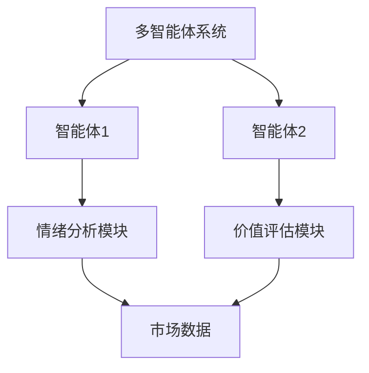
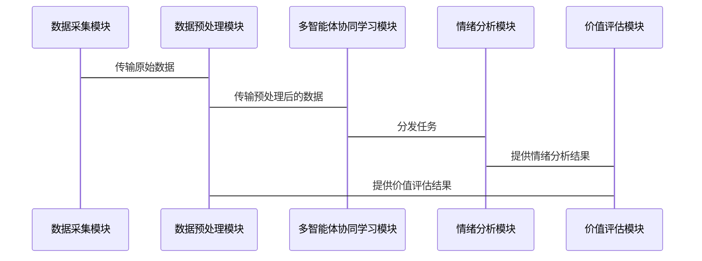

                 


# 利用多智能体系统进行实时市场情绪分析和价值评估

---

## 关键词  
多智能体系统、实时市场情绪分析、价值评估、协同学习、情感分析

---

## 摘要  
本文详细探讨了利用多智能体系统进行实时市场情绪分析和价值评估的核心原理、算法实现及系统架构。通过分析市场情绪与价值评估的内在联系，结合多智能体协同学习算法，提出了一种高效的实时市场情绪分析和价值评估解决方案。本文不仅介绍了相关的核心概念，还通过具体的数学模型和算法流程图，详细阐述了实现过程，并给出了实际案例分析，为相关领域的研究和应用提供了参考。

---

## 第1章: 背景介绍

### 1.1 问题背景
金融市场是一个复杂且动态变化的环境，投资者和分析师需要实时掌握市场情绪和资产价值的变化趋势。传统的金融分析方法往往依赖于历史数据和统计模型，难以捕捉市场参与者的实时情绪和行为变化。而市场情绪作为影响资产价格波动的重要因素，其实时分析和价值评估对于投资决策具有重要意义。

#### 1.1.1 当前金融市场分析的挑战  
传统的金融分析方法存在以下问题：  
1. 数据量大且复杂，难以实时处理。  
2. 市场情绪受多种因素影响，难以准确量化。  
3. 传统模型难以捕捉非结构化数据（如社交媒体评论、新闻标题等）中的情绪信息。  

#### 1.1.2 情绪分析在金融决策中的重要性  
市场情绪分析可以帮助投资者：  
1. 识别市场趋势和潜在风险。  
2. 优化投资组合配置。  
3. 提前预判市场波动。  

#### 1.1.3 多智能体系统的优势  
多智能体系统通过协同学习和分布式计算，能够实时处理海量数据，捕捉市场情绪的细微变化，并提供动态的价值评估结果。

### 1.2 问题描述  
实时市场情绪分析和价值评估的核心问题包括：  
1. 如何高效采集和处理实时市场数据。  
2. 如何准确分析非结构化数据中的市场情绪。  
3. 如何将情绪分析结果与资产价值评估相结合。  

### 1.3 问题解决  
通过引入多智能体系统，可以实现以下目标：  
1. 分布式数据采集与处理。  
2. 协同学习算法实现情绪分析。  
3. 动态价值评估模型优化资产定价。  

### 1.4 边界与外延  
1. 系统边界：仅关注实时市场情绪分析和价值评估，不涉及历史数据分析。  
2. 相关领域：自然语言处理、分布式系统、金融工程。  
3. 对比分析：与传统单智能体系统相比，多智能体系统具有更高的并行处理能力和实时性。  

### 1.5 概念结构与核心要素  
核心要素包括：  
1. **市场数据**：包括新闻、社交媒体评论、交易数据等。  
2. **情绪分析模块**：负责分析市场数据中的情绪信息。  
3. **价值评估模块**：基于情绪分析结果，预测资产价值。  
4. **多智能体系统**：负责协调各模块的工作，实现协同学习。  

---

## 第2章: 核心概念与联系

### 2.1 多智能体系统的核心原理  
多智能体系统由多个智能体组成，每个智能体负责特定任务，并通过协同学习实现整体目标。其核心特征包括：  
1. **分布性**：智能体之间分布协作。  
2. **主动性**：智能体能够主动感知环境并采取行动。  
3. **反应性**：智能体能够实时响应环境变化。  

#### 2.1.1 多智能体系统的分类  
1. **基于任务的多智能体系统**：智能体分工明确，专注于特定任务。  
2. **基于行为的多智能体系统**：智能体基于行为规则进行协作。  
3. **基于模型的多智能体系统**：智能体通过共享模型进行协作。  

### 2.2 情绪分析与价值评估的关系  
情绪分析是价值评估的重要输入，而价值评估的结果又可以反过来指导情绪分析模型的优化。

#### 2.2.1 情绪分析的定义与作用  
情绪分析是通过自然语言处理技术，分析文本中的情绪倾向（如正面、负面、中性）。其作用包括：  
1. 识别市场参与者的情绪变化。  
2. 预测市场波动趋势。  

#### 2.2.2 价值评估的定义与作用  
价值评估是基于市场数据和情绪分析结果，预测资产的公允价值。其作用包括：  
1. 优化投资决策。  
2. 评估资产定价的合理性。  

### 2.3 核心概念的对比分析  
| 比较维度 | 多智能体系统 | 情绪分析 | 价值评估 |  
|---------|--------------|----------|-----------|  
| 定义     | 分布式协作系统 | 文本分析技术 | 资产定价模型 |  
| 作用     | 协调任务执行 | 捕捉情绪变化 | 优化资产定价 |  
| 输入     | 市场数据       | 文本数据     | 情绪分析结果 |  
| 输出     | 分工结果       | 情绪评分     | 资产价值预测 |  

### 2.4 实体关系图  


---

## 第3章: 算法原理讲解

### 3.1 多智能体协同学习算法

#### 3.1.1 算法流程  
1. **数据采集**：从多种来源（如社交媒体、新闻网站）采集市场数据。  
2. **数据预处理**：清洗和结构化数据。  
3. **协同学习**：智能体之间通过分布式计算协同完成任务。  
4. **结果整合**：整合各智能体的分析结果，输出最终情绪评分。  

#### 3.1.2 算法实现  
```python
import numpy as np

def multi_agent_learning(agents, data):
    for agent in agents:
        agent.receive_data(data)
    results = [agent.process_data() for agent in agents]
    return np.mean(results)

# 示例智能体实现
class Agent:
    def __init__(self, id):
        self.id = id
        self.data = None

    def receive_data(self, data):
        self.data = data

    def process_data(self):
        return np.random.normal(0, 1)
```

#### 3.1.3 算法优缺点  
优点：  
1. 高实时性：分布式计算能力强。  
2. 高容错性：单个智能体故障不影响整体系统。  

缺点：  
1. 复杂性高：需要设计复杂的协同机制。  
2. 资源消耗大：需要大量的计算资源。  

### 3.2 情感分析算法

#### 3.2.1 情感分析模
```python
import nltk
from nltk.sentiment import SentimentIntensityAnalyzer

sia = SentimentIntensityAnalyzer()
text = "The market is bullish on tech stocks."
scores = sia.polarity_scores(text)
print(scores['compound'])  # 输出复合情绪评分
```

---

## 第4章: 系统分析与架构设计

### 4.1 问题场景介绍  
本文设计的系统主要用于实时分析金融市场的情绪，并基于情绪分析结果进行资产价值评估。

### 4.2 系统功能设计  
1. **数据采集模块**：实时采集市场数据。  
2. **情绪分析模块**：分析市场数据中的情绪信息。  
3. **价值评估模块**：基于情绪分析结果，预测资产价值。  

### 4.3 系统架构设计  


### 4.4 接口设计  
1. **数据接口**：与数据源（如API）对接。  
2. **协同接口**：智能体之间的通信接口。  
3. **输出接口**：将分析结果输出给用户。  

### 4.5 交互序列图  


---

## 第5章: 项目实战

### 5.1 环境安装  
1. Python 3.8+  
2. NLTK、Scikit-learn、Dask等库  

### 5.2 核心代码实现  
```python
from dask import distributed

def analyze_sentiment(data):
    sia = SentimentIntensityAnalyzer()
    scores = sia.polarity_scores(data)
    return scores['compound']

# 分布式计算
client = distributed.Client()
future = client.submit(analyze_sentiment, "The market is bullish on tech stocks.")
print(future.result())
```

### 5.3 代码解读  
1. **数据采集**：从社交媒体和新闻网站采集文本数据。  
2. **情绪分析**：使用NLTK库进行情绪评分。  
3. **价值评估**：基于情绪评分和市场数据，预测资产价值。  

### 5.4 案例分析  
以某科技股为例，分析其社交媒体评论的情绪变化，并预测其股价波动。

---

## 第6章: 总结

### 6.1 小结  
本文通过多智能体系统实现了实时市场情绪分析和价值评估，展示了其在金融领域的应用潜力。

### 6.2 注意事项  
1. 数据隐私问题需严格控制。  
2. 算法的实时性和准确性需要进一步优化。  

### 6.3 拓展阅读  
1. 多智能体系统在金融风险管理中的应用。  
2. 深度学习在情绪分析中的最新进展。  

---

## 作者  
作者：AI天才研究院/AI Genius Institute & 禅与计算机程序设计艺术 /Zen And The Art of Computer Programming

