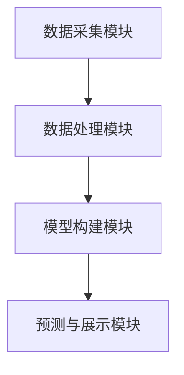
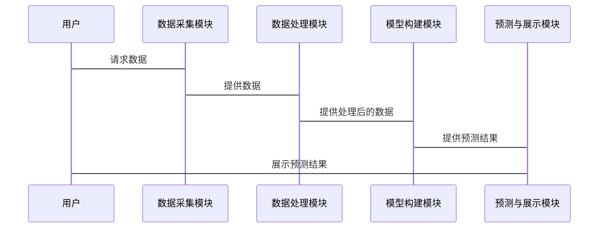

                 


# 利用多智能体系统预测公司长期增长潜力

> 关键词：多智能体系统, 公司增长潜力, 预测模型, 协作预测, 人工智能

> 摘要：本文深入探讨了利用多智能体系统预测公司长期增长潜力的方法。通过分析多智能体系统的组成、算法原理和系统架构，结合实际案例，展示了如何通过多智能体协同预测模型来提升公司增长潜力的预测精度和可解释性。文章内容涵盖背景介绍、核心概念、算法实现、系统设计和项目实战，为读者提供了从理论到实践的全面指导。

---

# 第一部分：多智能体系统与公司增长潜力预测概述

# 第1章：多智能体系统与公司增长潜力预测概述

## 1.1 多智能体系统的基本概念

### 1.1.1 多智能体系统的定义

多智能体系统（Multi-Agent System, 简称MAS）是由多个相互作用的智能体组成的系统，这些智能体通过协作或竞争完成特定任务。每个智能体都是一个独立的实体，具有一定的知识、目标和行为能力。

$$\text{MAS} = \{\text{Agent}_1, \text{Agent}_2, ..., \text{Agent}_n\}$$

### 1.1.2 多智能体系统的特征

| 特征 | 描述 |
|------|------|
| 分布式 | 每个智能体独立运行，任务分解到多个智能体 |
| 协作性 | 智能体之间通过协作完成复杂任务 |
| 反应性 | 智能体能够感知环境并做出实时反应 |
| 社会性 | 智能体之间存在社会互动和信息交换 |

### 1.1.3 多智能体系统与单智能体系统的区别

| 对比维度 | 单智能体系统 | 多智能体系统 |
|----------|--------------|--------------|
| 系统复杂性 | 简单 | 复杂 |
| 资源利用 | 单一 | 分散 |
| 计算效率 | 低 | 高 |
| 可扩展性 | 低 | 高 |

## 1.2 公司增长潜力预测的背景与意义

### 1.2.1 公司增长潜力预测的定义

公司增长潜力预测是指通过分析公司的历史数据、市场环境、行业趋势等因素，预测公司未来一段时间内的增长能力。增长潜力可以通过多种指标衡量，如收入增长率、利润率、市场占有率等。

### 1.2.2 公司增长潜力预测的重要性

1. **投资决策支持**：投资者可以根据预测结果做出更明智的投资决策。
2. **企业战略规划**：帮助企业制定更合理的长期发展目标。
3. **风险预警**：及时发现潜在风险，调整经营策略。

### 1.2.3 多智能体系统在公司增长预测中的优势

多智能体系统能够从多个维度、多个角度对数据进行分析，结合多个智能体的预测结果，最终得出更准确的预测结论。

## 1.3 本章小结

本章主要介绍了多智能体系统的基本概念和公司增长潜力预测的背景与意义，强调了多智能体系统在公司增长预测中的优势。

---

# 第二部分：多智能体系统的核心概念与原理

# 第2章：多智能体系统的组成与功能

## 2.1 多智能体系统的组成

### 2.1.1 智能体的定义与分类

智能体（Agent）是一个能够感知环境并采取行动以实现目标的实体。根据智能体的智能水平，可以分为：

| 类型 | 描述 |
|------|------|
| 反应式智能体 | 基于当前感知做出反应 |
| 计划式智能体 | 具有目标规划和执行能力 |
| 学习式智能体 | 能够通过经验改进性能 |

### 2.1.2 多智能体系统中的角色分配

在公司增长潜力预测中，多智能体系统可以分配如下角色：

1. 数据采集智能体：负责收集公司历史数据、市场数据等。
2. 数据处理智能体：对数据进行清洗、转换和预处理。
3. 模型构建智能体：负责构建预测模型。
4. 预测智能体：基于模型进行预测并输出结果。

### 2.1.3 智能体之间的通信机制

智能体之间的通信可以通过以下方式实现：

1. **直接通信**：智能体之间直接交换信息。
2. **间接通信**：通过中间媒介（如共享数据库）进行信息传递。
3. **事件驱动通信**：通过事件触发通信。

## 2.2 多智能体系统的功能模块

### 2.2.1 数据采集与处理模块

数据采集与处理模块负责从多个数据源（如公司财务报表、市场报告、行业趋势等）获取数据，并进行清洗和预处理。

### 2.2.2 模型构建与分析模块

模型构建与分析模块负责构建预测模型，如时间序列模型、机器学习模型等，并对模型进行训练和优化。

### 2.2.3 预测与决策模块

预测与决策模块基于训练好的模型进行预测，并根据预测结果生成决策建议。

## 2.3 本章小结

本章详细介绍了多智能体系统的组成和功能模块，强调了智能体之间的协作和通信机制在公司增长潜力预测中的重要性。

---

# 第三部分：多智能体系统预测公司增长潜力的算法原理

# 第3章：多智能体系统预测算法概述

## 3.1 常见的预测算法

### 3.1.1 时间序列分析

时间序列分析是一种基于历史数据预测未来趋势的方法。常用的算法包括ARIMA、GARCH等。

### 3.1.2 机器学习算法

机器学习算法通过训练数据学习特征，从而进行预测。常用的算法包括线性回归、支持向量机（SVM）、随机森林等。

### 3.1.3 强化学习算法

强化学习算法通过智能体与环境的交互，学习最优策略。常用的算法包括Q-Learning、Deep Q-Network（DQN）等。

## 3.2 多智能体协同预测的原理

### 3.2.1 多智能体协同的基本原理

多智能体协同预测通过多个智能体分别对不同的数据源或模型进行预测，然后将结果进行融合，最终得到一个更准确的预测结果。

### 3.2.2 协作预测的数学模型

$$P_{\text{final}} = f(P_1, P_2, ..., P_n)$$

其中，$P_{\text{final}}$ 是最终预测结果，$P_i$ 是第 $i$ 个智能体的预测结果，$f$ 是融合函数。

### 3.2.3 协作预测的实现步骤

1. 数据预处理：对数据进行清洗和标准化。
2. 模型训练：训练多个预测模型。
3. 结果融合：将多个模型的预测结果进行融合。
4. 预测输出：输出最终的预测结果。

## 3.3 本章小结

本章介绍了常见的预测算法，并详细讲解了多智能体协同预测的原理和实现步骤。

---

# 第四部分：系统架构与实现

# 第4章：系统架构设计

## 4.1 系统功能设计

### 4.1.1 数据采集模块

数据采集模块负责从多个数据源（如公司财务报表、市场报告、行业趋势等）获取数据。

### 4.1.2 数据处理模块

数据处理模块对数据进行清洗、转换和预处理。

### 4.1.3 模型构建模块

模型构建模块负责构建预测模型，并对模型进行训练和优化。

### 4.1.4 预测与展示模块

预测与展示模块基于训练好的模型进行预测，并将结果以可视化的方式展示出来。

## 4.2 系统架构图



## 4.3 接口设计与交互流程

### 4.3.1 系统接口设计

1. 数据接口：提供数据输入和输出接口。
2. 模型接口：提供模型训练和预测接口。
3. 展示接口：提供结果展示接口。

### 4.3.2 系统交互流程图



## 4.4 本章小结

本章详细介绍了系统的功能设计和架构设计，并通过图表展示了系统的交互流程。

---

# 第五部分：项目实战与案例分析

# 第5章：项目实战

## 5.1 环境安装与配置

### 5.1.1 Python环境的安装

安装Python 3.x版本，推荐使用Anaconda分布。

### 5.1.2 第三方库的安装

安装所需的第三方库，如Pandas、NumPy、Scikit-learn等。

## 5.2 系统核心实现

### 5.2.1 数据预处理代码

```python
import pandas as pd
import numpy as np

# 数据加载
data = pd.read_csv('company_growth.csv')

# 数据清洗
data.dropna(inplace=True)
data = data[~data['收入'].isnull()]
```

### 5.2.2 模型构建代码

```python
from sklearn.ensemble import RandomForestRegressor

# 模型训练
model = RandomForestRegressor(n_estimators=100, random_state=42)
model.fit(X_train, y_train)
```

### 5.2.3 预测与结果展示代码

```python
# 预测
y_pred = model.predict(X_test)

# 结果展示
import matplotlib.pyplot as plt

plt.plot(y_test, label='实际值')
plt.plot(y_pred, label='预测值')
plt.legend()
plt.show()
```

## 5.3 代码应用解读与分析

### 5.3.1 代码功能分析

1. 数据预处理代码：负责对数据进行清洗和预处理。
2. 模型构建代码：基于随机森林算法构建预测模型。
3. 预测与结果展示代码：进行预测并可视化结果。

### 5.3.2 代码实现细节

- 数据预处理：使用Pandas进行数据清洗。
- 模型构建：使用Scikit-learn中的随机森林算法。
- 结果展示：使用Matplotlib进行可视化。

### 5.3.3 代码优化建议

- 可以尝试其他模型（如XGBoost、LightGBM）进行对比。
- 对模型进行超参数优化。

## 5.4 实际案例分析

### 5.4.1 案例背景介绍

假设我们有一家科技公司，希望通过多智能体系统预测其未来5年的增长潜力。

### 5.4.2 数据分析与处理

加载公司过去5年的财务数据和市场数据，进行清洗和预处理。

### 5.4.3 模型训练与预测

基于随机森林算法进行模型训练，并对未来5年的增长潜力进行预测。

### 5.4.4 结果分析与解读

通过可视化结果，分析预测值与实际值的拟合程度，评估模型的准确性。

## 5.5 本章小结

本章通过实际案例展示了系统的实现过程，包括环境配置、数据处理、模型训练和结果展示。

---

# 第六部分：最佳实践与总结

# 第6章：最佳实践与总结

## 6.1 小结与回顾

### 6.1.1 本书主要内容回顾

本书从多智能体系统的概念出发，详细讲解了其在公司增长潜力预测中的应用，包括系统架构设计、算法实现和项目实战。

### 6.1.2 多智能体系统预测的核心要点总结

- 多智能体系统的协作性和分布性是其核心优势。
- 数据预处理和特征工程对模型性能至关重要。
- 模型融合和超参数优化可以进一步提升预测精度。

## 6.2 注意事项与建议

### 6.2.1 系统设计中的注意事项

- 确保数据来源的多样性和可靠性。
- 合理设计智能体之间的通信机制。
- 定期对模型进行更新和优化。

### 6.2.2 实际应用中的建议

- 结合业务需求选择合适的算法。
- 注重数据安全和隐私保护。
- 定期进行模型验证和评估。

---

# 作者

作者：AI天才研究院/AI Genius Institute & 禅与计算机程序设计艺术 /Zen And The Art of Computer Programming

