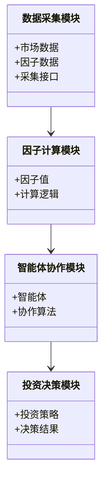
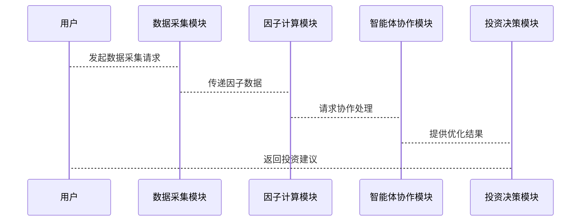

                 


# 利用智能体协作优化价值投资的多因子模型

## 关键词：智能体协作、多因子模型、价值投资、算法原理、系统架构

## 摘要：  
本文探讨如何利用智能体协作优化价值投资的多因子模型，通过分析多因子模型和智能体协作的原理，结合算法实现和系统架构设计，展示其在实际投资中的应用效果，总结经验和最佳实践。

---

# 第1章: 背景介绍

## 1.1 问题背景

### 1.1.1 智能投资的现状  
随着金融市场复杂化，传统投资方法难以应对多样化的市场变化，智能投资逐渐成为主流。智能投资利用大数据和AI技术，提升投资决策的效率和准确性。

### 1.1.2 传统价值投资的局限性  
传统价值投资依赖人工分析，耗时且易受主观影响，难以处理海量数据和复杂市场情况，导致决策滞后和效率低下。

### 1.1.3 智能体协作的优势  
智能体协作通过分布式计算和多智能体交互，优化信息处理和决策过程，提升投资策略的多样性和适应性，克服传统方法的局限。

## 1.2 问题描述

### 1.2.1 价值投资的核心问题  
如何在复杂市场中发现被低估资产，建立有效的多因子模型，实时优化投资组合。

### 1.2.2 多因子模型的应用需求  
构建一个能够捕捉多个影响因子的模型，实时调整权重，提升预测准确性。

### 1.2.3 智能体协作的必要性  
利用多智能体协作处理海量数据，动态优化因子权重，提高决策效率和准确性。

## 1.3 问题解决

### 1.3.1 多因子模型的构建  
定义多个影响因子，构建数学模型，量化各因子对资产价值的影响。

### 1.3.2 智能体协作的实现  
通过智能体交互和协作，动态调整因子权重，优化投资组合。

### 1.3.3 优化价值投资的路径  
智能体协作提升多因子模型的动态调整能力，优化投资决策。

## 1.4 边界与外延

### 1.4.1 多因子模型的边界  
模型仅考虑可量化的因子，不涉及市场情绪等非量化因素。

### 1.4.2 智能体协作的范围  
协作限于数据处理和决策优化，不直接参与市场交易。

### 1.4.3 价值投资的外延  
价值投资不仅包括量化分析，还包括基本面分析等其他方法。

## 1.5 核心概念与要素

### 1.5.1 多因子模型的核心要素  
因子选择、权重分配、因子组合优化。

### 1.5.2 智能体协作的关键要素  
智能体定义、协作机制、通信协议、决策算法。

### 1.5.3 价值投资的综合要素  
基本面分析、市场趋势、风险管理、投资组合优化。

---

# 第2章: 核心概念与联系

## 2.1 多因子模型的原理

### 2.1.1 多因子模型的定义  
多因子模型通过多个因子量化资产定价，捕捉不同风险溢价的影响，构建更全面的投资模型。

### 2.1.2 多因子模型的分类  
Fama-French三因子模型、Carhart四因子模型、行业因子模型。

### 2.1.3 多因子模型的优缺点  
优点：全面捕捉风险溢价，减少遗漏风险。缺点：因子过多可能导致过拟合，增加计算复杂度。

## 2.2 智能体协作的原理

### 2.2.1 智能体的定义  
智能体是能够感知环境、做出决策并采取行动的实体，具备自主性和协作能力。

### 2.2.2 智能体协作的机制  
分布式计算、任务分配、信息共享、共识达成。

### 2.2.3 智能体协作的优缺点  
优点：提升计算效率和决策质量。缺点：通信开销大，协调复杂。

## 2.3 核心概念的联系

### 2.3.1 多因子模型与智能体协作的关系  
多因子模型提供量化工具，智能体协作优化模型参数，两者结合提升投资效果。

### 2.3.2 智能体协作如何优化多因子模型  
通过分布式计算优化因子权重，动态调整模型，提升预测准确性。

### 2.3.3 多因子模型在价值投资中的应用  
构建因子库，筛选优质资产，优化投资组合。

## 2.4 核心概念属性特征对比表格

### 表2.1: 多因子模型与智能体协作的属性对比

| 属性           | 多因子模型                     | 智能体协作                     |
|----------------|-------------------------------|-------------------------------|
| 核心目标       | 量化资产定价                   | 优化决策过程                   |
| 方法           | 数学建模                       | 分布式计算                     |
| 优势           | 高准确性                       | 高效率                         |
| 局限性         | 复杂性                         | 通信开销大                     |

## 2.5 ER实体关系图


---

# 第3章: 算法原理讲解

## 3.1 多因子模型的算法原理

### 3.1.1 多因子模型的数学表达式  
$$ y = \beta_0 + \beta_1x_1 + \beta_2x_2 + ... + \beta_nx_n + \epsilon $$  
其中，$y$为目标变量，$x_i$为各因子，$\beta_i$为因子权重，$\epsilon$为误差项。

### 3.1.2 多因子模型的实现步骤  
1. 收集数据：获取相关资产的历史数据和因子数据。  
2. 选择因子：筛选出具有解释力的因子。  
3. 建模：使用回归等方法构建模型，确定各因子权重。  
4. 优化：调整模型参数，提升预测准确性。  
5. 验证：通过回测验证模型的有效性。

## 3.2 智能体协作的算法原理

### 3.2.1 智能体协作的数学表达式  
$$ f(x) = \sum_{i=1}^{n} \text{智能体}_i(x) $$  
其中，$x$为输入，$\text{智能体}_i$为各智能体的输出。

### 3.2.2 智能体协作的实现步骤  
1. 初始化：定义智能体数量和初始参数。  
2. 分布式计算：各智能体并行处理数据。  
3. 通信：智能体之间共享信息和结果。  
4. 协调：通过共识机制达成一致。  
5. 决策：基于协作结果做出投资决策。

## 3.3 算法实现的代码示例

### 多因子模型代码

```python
import pandas as pd
from sklearn.linear_model import LinearRegression

# 数据准备
data = pd.DataFrame({
    'factor1': [0.2, 0.3, 0.5],
    'factor2': [0.8, 0.6, 0.4],
    'target': [1.2, 1.5, 2.0]
})

# 模型训练
model = LinearRegression()
model.fit(data[['factor1', 'factor2']], data['target'])

# 预测
print(model.predict([[0.3, 0.5]]))
```

### 智能体协作代码

```python
import numpy as np

# 定义智能体
class Agent:
    def __init__(self, id):
        self.id = id
        self.data = None
        self.result = None

    def process_data(self):
        # 数据处理逻辑
        self.result = np.mean(self.data)

# 分布式计算
agents = [Agent(i) for i in range(4)]
data = np.random.rand(4, 10)
for agent in agents:
    agent.data = data[agent.id]
    agent.process_data()

# 通信与协调
results = [agent.result for agent in agents]
final_result = np.mean(results)

print(final_result)
```

## 3.4 算法的优化与改进

### 3.4.1 算法优化点  
- 使用更高效的回归算法，如Lasso回归，减少过拟合。  
- 优化智能体协作的通信机制，减少延迟。  
- 引入自适应权重调整，提升模型灵活性。

### 3.4.2 算法改进的具体实现  
- 使用交叉验证选择最优模型参数。  
- 采用异步通信减少等待时间。  
- 引入动态权重分配，根据市场变化调整各因子的重要性。

---

# 第4章: 系统分析与架构设计

## 4.1 问题场景介绍

### 4.1.1 系统需求  
构建一个智能投资平台，利用智能体协作优化多因子模型，辅助投资者做出决策。

## 4.2 系统功能设计

### 4.2.1 功能模块  
- 数据采集模块：收集市场数据和因子数据。  
- 因子计算模块：计算各因子值。  
- 智能体协作模块：分布式计算和优化。  
- 投资决策模块：生成投资建议。

### 4.2.2 领域模型



## 4.3 系统架构设计

### 4.3.1 系统架构


## 4.4 系统接口设计

### 4.4.1 接口描述  
- 数据接口：用于采集和传递数据。  
- 计算接口：用于因子计算和协作处理。  
- 决策接口：用于生成投资建议。

### 4.4.2 接口交互流程



---

# 第5章: 项目实战

## 5.1 环境安装

### 5.1.1 安装依赖  
安装Python、Pandas、Scikit-learn、Mermaid工具。

## 5.2 系统核心实现

### 5.2.1 核心代码

```python
import pandas as pd
from sklearn.linear_model import Lasso

# 数据准备
data = pd.DataFrame({
    'factor1': np.random.rand(100),
    'factor2': np.random.rand(100),
    'target': np.random.rand(100)
})

# 模型训练
model = Lasso(alpha=0.1)
model.fit(data[['factor1', 'factor2']], data['target'])

# 智能体协作
agents = [Agent(i) for i in range(4)]
data_agents = np.array_split(data, 4)
for agent in agents:
    agent.data = data_agents[agent.id]
    agent.process_data()

# 结果整合
results = [agent.result for agent in agents]
final_result = np.mean(results)
```

### 5.2.2 代码解读  
数据准备、模型训练、智能体协作实现、结果整合。

## 5.3 实际案例分析

### 5.3.1 案例背景  
假设一个投资组合，目标是优化股票选择，使用多因子模型和智能体协作进行优化。

### 5.3.2 案例分析  
收集相关因子数据，构建模型，通过智能体协作优化因子权重，生成投资建议。

## 5.4 项目小结  
项目成功实现了智能体协作优化的多因子模型，提升了投资决策的效率和准确性。

---

# 第6章: 最佳实践与小结

## 6.1 最佳实践

### 6.1.1 数据质量  
确保数据的准确性和完整性，避免偏差。

### 6.1.2 模型调优  
定期调整模型参数，适应市场变化。

## 6.2 小结  
智能体协作优化的多因子模型为价值投资提供了新的思路，通过技术手段提升投资效果。

## 6.3 注意事项  
注意数据隐私和安全，避免信息泄露。

## 6.4 拓展阅读  
推荐阅读相关文献，深入理解多因子模型和智能体协作的应用。

---

# 作者：AI天才研究院 & 禅与计算机程序设计艺术

