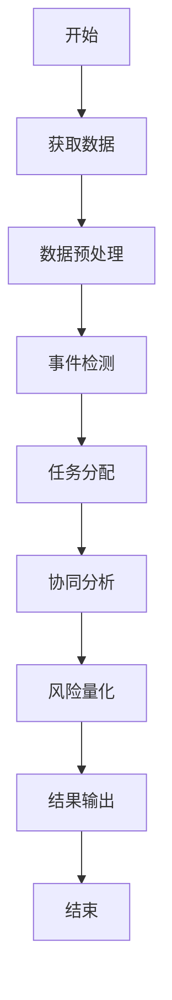
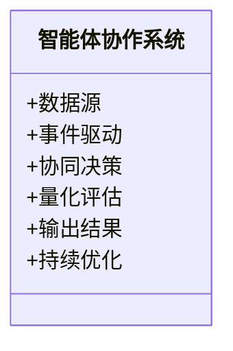
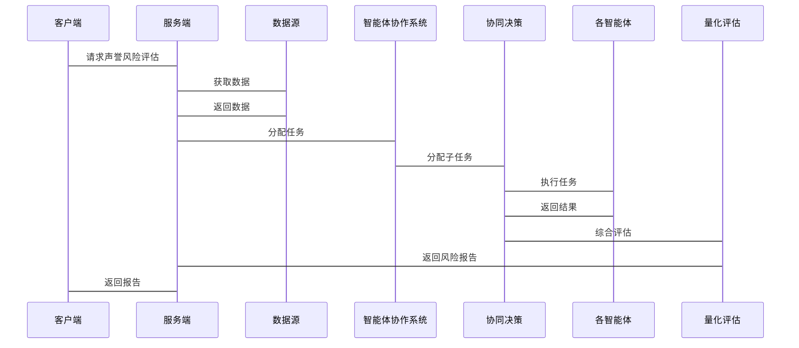

                 


# 利用智能体协作进行全面的公司声誉风险量化

> 关键词：智能体协作、声誉风险、风险管理、多智能体系统、量化模型

> 摘要：本文探讨了利用智能体协作技术进行全面的公司声誉风险量化的方法。通过分析声誉风险的多维度特性，结合智能体协作的优势，构建了智能化的声誉风险管理框架，并详细阐述了其实现原理和应用场景。本文从问题背景、核心概念、算法原理、系统架构到项目实战，全面解析了如何利用智能体协作技术来提升企业声誉风险管理的效率和准确性。

---

## 第一部分: 背景介绍

### 第1章: 问题背景与定义

#### 1.1 问题背景
##### 1.1.1 公司声誉的重要性
公司声誉是企业宝贵的无形资产，直接影响客户信任度、品牌价值和市场地位。然而，声誉危机一旦发生，往往难以挽回，且影响深远。

##### 1.1.2 声誉风险的定义与特征
声誉风险是指由于企业行为或外部事件导致公众对企业的信任度下降，进而对企业利益造成损失的风险。其特点是隐蔽性、突发性和扩散性。

##### 1.1.3 当前声誉风险管理的挑战
传统声誉管理方法依赖人工监测和主观判断，存在效率低、覆盖范围有限、实时性差等问题，难以应对复杂多变的市场环境。

#### 1.2 问题描述
##### 1.2.1 声誉风险的多维度性
声誉风险不仅涉及产品质量、服务态度，还包括企业社会责任、高管言行等多方面因素。

##### 1.2.2 智能体协作的必要性
智能体协作能够通过分布式计算和协同机制，实时分析海量数据，为声誉风险管理提供高效解决方案。

##### 1.2.3 当前声誉风险管理的局限性
传统方法难以应对数据量大、信息分散、事件复杂等挑战，亟需智能化工具提升管理效率。

#### 1.3 问题解决
##### 1.3.1 智能体协作的优势
智能体协作能够实现数据的实时处理、事件的快速响应和风险的精准量化。

##### 1.3.2 多智能体协作的实现路径
通过分布式计算、任务分配和协同机制，构建智能化声誉风险管理框架。

##### 1.3.3 声誉风险量化的目标与意义
量化声誉风险能够帮助企业提前预警潜在危机，制定有效的应对策略，降低损失。

### 第2章: 智能体协作与声誉风险量化框架

#### 2.1 智能体协作的基本概念
##### 2.1.1 智能体的定义与分类
智能体是一种能够感知环境、自主决策并执行任务的实体，可分为简单智能体和复杂智能体。

##### 2.1.2 多智能体协作的原理
多智能体协作通过任务分配、信息共享和协同决策，实现复杂问题的高效解决。

##### 2.1.3 智能体协作的实现方式
采用分布式计算、事件驱动和知识共享等技术，构建智能体协作系统。

#### 2.2 声誉风险量化框架
##### 2.2.1 框架的组成与功能
框架包括数据采集、分析、评估和可视化四个模块，实现声誉风险的全生命周期管理。

##### 2.2.2 框架的输入与输出
输入包括企业内外部数据、实时舆情等，输出为声誉风险量化结果和应对策略。

##### 2.2.3 框架的实施步骤
包括数据收集、预处理、分析建模、结果输出和持续优化等步骤。

#### 2.3 框架的边界与外延
##### 2.3.1 框架的应用场景
适用于企业日常声誉管理、危机公关、品牌价值评估等场景。

##### 2.3.2 框架的适用范围
适用于数据量大、业务复杂、声誉风险较高的行业。

##### 2.3.3 框架的限制与不足
依赖数据质量和模型准确性，且需要持续优化和更新。

## 第3章: 核心概念与联系

### 3.1 核心概念原理
#### 3.1.1 智能体协作的核心机制
智能体通过分布式计算和协同决策，实现任务的有效分配和执行。

#### 3.1.2 声誉风险的多维度评估
从产品质量、服务态度、社会责任等多个维度评估声誉风险。

#### 3.1.3 数据驱动的量化方法
利用大数据分析和机器学习技术，量化声誉风险的影响程度。

### 3.2 概念属性特征对比表格
#### 表3-1: 智能体协作与传统声誉管理的对比

| 特性              | 传统声誉管理          | 智能体协作声誉管理        |
|-------------------|----------------------|--------------------------|
| 数据处理能力      | 有限，依赖人工分析    | 强大，支持海量数据处理    |
| 实时性            | 较低，响应速度慢      | 高，实时监测和响应        |
| 分析深度          | 浅，依赖经验判断      | 深，基于数据驱动的分析    |
| 管理效率          | 低，依赖人工干预      | 高，自动化处理和优化      |

### 3.3 ER实体关系图架构
```mermaid
erDiagram
    actor 智能体协作系统
    actor 企业声誉
    actor 声誉风险
    actor 数据源
    actor 事件驱动
    actor 协同决策
    actor 量化评估
    actor 输出结果
    actor 持续优化

    智能体协作系统 --> 数据源: 获取数据
    数据源 --> 事件驱动: 触发事件
    事件驱动 --> 协同决策: 分配任务
    协同决策 --> 量化评估: 计算风险
    量化评估 --> 输出结果: 生成报告
    输出结果 --> 持续优化: 更新模型
    持续优化 --> 智能体协作系统: 提供反馈
```

---

## 第4章: 算法原理讲解

### 4.1 算法核心思想
通过多智能体协作，实现对声誉风险的实时监测、分析和量化。

### 4.2 算法实现步骤


### 4.3 算法数学模型
声誉评分模型：
$$ R_i = \alpha \cdot Q_i + \beta \cdot S_i + \gamma \cdot T_i $$
其中，$R_i$ 表示第 $i$ 个智能体的声誉评分，$Q_i$ 是产品质量评分，$S_i$ 是服务评分，$T_i$ 是社会责任评分，$\alpha, \beta, \gamma$ 是权重系数。

风险评估模型：
$$ Risk = \sum_{i=1}^{n} w_i \cdot R_i $$
其中，$w_i$ 是第 $i$ 个智能体的权重，$n$ 是智能体总数。

### 4.4 算法实现代码
```python
class ReputationalRiskQuantifier:
    def __init__(self, agents):
        self.agents = agents  # 智能体列表
        self.data_source = None  # 数据源

    def collect_data(self):
        # 从数据源获取声誉相关数据
        self.data_source = self.get_data()

    def process_data(self):
        # 对数据进行预处理
        self.preprocess_data()

    def quantify_risk(self):
        # 计算声誉风险
        total_risk = 0
        for agent in self.agents:
            score = agent.calculate_reputation()
            total_risk += score
        return total_risk

    def get_data(self):
        # 示例：从数据库获取数据
        return "reputation_data.csv"

    def preprocess_data(self):
        # 示例：数据清洗和特征提取
        pass
```

---

## 第5章: 系统分析与架构设计

### 5.1 问题场景介绍
企业声誉风险管理需要实时监测舆情、分析潜在风险、制定应对策略。

### 5.2 系统功能设计
#### 5.2.1 领域模型


#### 5.2.2 系统架构


#### 5.2.3 系统接口设计
- 数据接口：提供数据采集和处理功能。
- 评估接口：提供声誉风险评估和结果输出功能。

#### 5.2.4 系统交互


---

## 第6章: 项目实战

### 6.1 环境安装与配置
安装Python、机器学习库（如scikit-learn）和相关数据处理工具。

### 6.2 核心代码实现
```python
def main():
    from reputational_risk_quantifier import ReputationalRiskQuantifier
    agents = [Agent1(), Agent2(), Agent3()]
    quantifier = ReputationalRiskQuantifier(agents)
    quantifier.collect_data()
    quantifier.process_data()
    risk = quantifier.quantify_risk()
    print(f"声誉风险值：{risk}")

if __name__ == "__main__":
    main()
```

### 6.3 代码解读与分析
- `ReputationalRiskQuantifier` 类负责协调多个智能体，完成数据采集、处理和风险量化。
- 各智能体通过协同决策算法分配任务，实现对声誉风险的多维度评估。

### 6.4 实际案例分析
以一家互联网企业为例，通过智能体协作系统，实时监测舆情，快速识别潜在风险，制定应对策略。

### 6.5 项目小结
通过项目实战，验证了智能体协作在声誉风险管理中的有效性，为企业提供了一种高效、智能的解决方案。

---

## 第7章: 最佳实践与小结

### 7.1 最佳实践 tips
- 数据质量是关键，确保数据来源可靠、格式统一。
- 模型需要不断优化，根据实际效果调整权重和参数。
- 建立完善的监控机制，实时跟踪声誉风险变化。

### 7.2 小结
本文详细介绍了利用智能体协作进行全面的公司声誉风险量化的方法，从理论到实践，为企业的声誉管理提供了新的思路和解决方案。

### 7.3 注意事项
- 智能体协作系统需要持续优化和更新，以适应市场环境的变化。
- 在实际应用中，需注意数据隐私和合规性问题。

### 7.4 拓展阅读
- 《多智能体系统与协同计算》
- 《大数据与人工智能在声誉管理中的应用》

---

## 作者信息

作者：AI天才研究院/AI Genius Institute & 禅与计算机程序设计艺术 /Zen And The Art of Computer Programming

