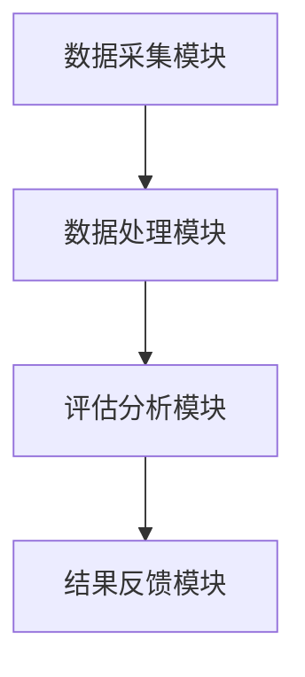

                 


# 利用智能体协作进行全面的公司文化一致性评估

---

## 关键词
- 公司文化一致性
- 智能体协作
- 文化评估模型
- 系统架构设计
- 机器学习

---

## 摘要
随着企业规模的不断扩大，公司文化一致性评估的重要性日益凸显。传统的评估方法往往依赖人工调查和主观判断，存在效率低下、结果不准确的问题。为了解决这些问题，智能体协作技术被引入，通过多智能体的协同工作，实现对公司文化的全面、客观评估。本文详细探讨了智能体协作的基本原理、公司文化评估的核心指标、智能体协作在评估中的应用、评估模型的构建与实现、系统架构设计以及实际案例分析。通过理论与实践相结合的方式，为读者提供了一套完整的公司文化一致性评估解决方案。

---

## 第1章: 公司文化一致性评估的背景与挑战

### 1.1 什么是公司文化一致性
#### 1.1.1 公司文化的定义与重要性
公司文化是一个组织的价值观、行为规范、思维方式和企业精神的总和。它决定了组织的行为方式和员工的工作态度，是企业成功的关键因素之一。一个一致的文化能够增强员工的归属感，提升企业的凝聚力和竞争力。

#### 1.1.2 文化一致性在企业中的意义
文化一致性是指企业在不同部门、层级和员工之间，文化价值观和行为规范的一致性。文化一致的企业更容易实现战略目标，提升员工满意度和忠诚度，同时也更容易吸引和留住优秀人才。

#### 1.1.3 当前评估文化一致性的难点
传统的文化评估方法通常依赖问卷调查和主观判断，存在以下问题：
1. **数据片面性**：问卷调查的结果容易受到填写者主观因素的影响，难以全面反映真实情况。
2. **效率低下**：手动收集和分析数据耗时耗力，难以快速得到评估结果。
3. **缺乏客观性**：缺乏统一的评估标准和方法，导致评估结果的可信度不足。

---

### 1.2 智能体协作的概念与优势
#### 1.2.1 智能体的基本定义
智能体（Agent）是指能够感知环境并采取行动以实现目标的实体。智能体可以是软件程序、机器人或其他具备自主决策能力的实体。

#### 1.2.2 协作智能体的特点
协作智能体是指多个智能体协同工作，共同完成复杂任务的能力。协作智能体的特点包括：
1. **分布式智能**：多个智能体协同工作，每个智能体负责不同的任务。
2. **自主性**：每个智能体能够自主决策，无需外部干预。
3. **通信能力**：智能体之间能够通过通信机制共享信息和协调行动。

#### 1.2.3 智能体协作在文化评估中的优势
智能体协作能够通过多个智能体的协同工作，实现对组织文化的一致性评估。其优势包括：
1. **高效性**：多个智能体同时处理数据，显著提高评估效率。
2. **准确性**：通过智能体的协作，能够更全面地收集和分析数据，提高评估结果的准确性。
3. **灵活性**：智能体可以根据实际情况动态调整评估策略，适应不同的评估需求。

---

## 第2章: 智能体协作的基本原理

### 2.1 智能体协作的定义与分类
#### 2.1.1 单智能体与多智能体系统
单智能体系统是指只有一个智能体完成任务，而多智能体系统则是指多个智能体协同工作。

#### 2.1.2 协作智能体的类型
协作智能体可以分为以下几种类型：
1. **基于规则的协作**：通过预定义的规则进行协作，适用于任务简单、规则明确的场景。
2. **基于学习的协作**：通过机器学习算法，智能体能够自主学习协作策略，适用于任务复杂、规则动态变化的场景。
3. **基于协商的协作**：智能体之间通过协商达成一致，适用于任务分工和资源分配的场景。

---

### 2.2 协作智能体的通信机制
#### 2.2.1 通信协议的选择
协作智能体之间的通信需要选择合适的通信协议。常用的通信协议包括：
1. **HTTP/HTTPS**：适用于基于Web的服务。
2. **TCP/IP**：适用于点对点通信。
3. **MQTT**：适用于低带宽、高延迟的环境。

#### 2.2.2 信息传递的效率
信息传递的效率直接影响协作智能体的工作效率。为了提高信息传递效率，可以采用以下方法：
1. **减少数据冗余**：通过数据压缩和加密技术，减少数据传输量。
2. **优化通信频率**：根据任务需求，合理安排通信频率。

#### 2.2.3 信息传递的可靠性
为了确保信息传递的可靠性，可以采用以下措施：
1. **数据校验**：通过校验码确保数据传输过程中不会发生错误。
2. **冗余传输**：在数据传输过程中，重复传输关键信息，确保信息的准确到达。

---

### 2.3 协作智能体的决策模型
#### 2.3.1 基于规则的决策
基于规则的决策是指智能体根据预定义的规则进行决策。例如，当某个条件满足时，智能体执行某个操作。

#### 2.3.2 基于学习的决策
基于学习的决策是指智能体通过机器学习算法，从历史数据中学习决策策略。例如，使用决策树、随机森林等算法进行分类和预测。

#### 2.3.3 基于协商的决策
基于协商的决策是指多个智能体通过协商达成一致，共同制定决策。例如，通过投票机制或协商算法确定最终的决策方案。

---

## 第3章: 公司文化评估的核心指标

### 3.1 企业文化的关键维度
#### 3.1.1 企业价值观
企业价值观是企业文化的核心，反映了企业对自身目标和使命的追求。例如，创新、客户至上、团队合作等。

#### 3.1.2 企业使命与愿景
企业使命是指企业存在的目的和意义，企业愿景是企业未来发展的目标。例如，成为行业领导者、为社会创造价值等。

#### 3.1.3 企业行为规范
企业行为规范是指企业在日常运营中必须遵守的行为准则。例如，员工的行为准则、客户服务规范、内部沟通规则等。

---

### 3.2 员工文化认同度的测量
#### 3.2.1 员工满意度调查
通过员工满意度调查，可以了解员工对企业文化的一致性认同程度。例如，通过问卷调查了解员工对企业的价值观和行为规范的认同程度。

#### 3.2.2 员工价值观与企业文化的匹配度
通过对比员工个人价值观与企业文化的匹配度，可以评估员工的文化认同度。例如，使用价值观匹配度模型进行评估。

#### 3.2.3 员工行为分析
通过分析员工的行为数据，可以了解员工的实际行为是否符合企业文化的要求。例如，通过分析员工的工作表现、沟通方式等，评估员工的文化认同度。

---

## 第4章: 智能体协作在文化评估中的应用

### 4.1 智能体协作评估系统的设计
#### 4.1.1 系统目标与范围
系统目标是通过智能体协作实现对公司文化的全面评估。系统范围包括数据采集、数据处理、评估分析和结果反馈。

#### 4.1.2 系统功能模块划分
系统功能模块包括：
1. **数据采集模块**：负责采集员工行为数据和文化相关数据。
2. **数据处理模块**：负责对数据进行清洗、转换和特征提取。
3. **评估分析模块**：负责根据数据构建评估模型，分析文化一致性。
4. **结果反馈模块**：负责将评估结果反馈给企业，提供改进建议。

#### 4.1.3 系统性能指标
系统性能指标包括：
1. **处理速度**：系统在单位时间内处理的最大数据量。
2. **准确性**：评估结果的准确率。
3. **响应时间**：系统对请求的响应时间。

---

### 4.2 智能体协作评估流程
#### 4.2.1 数据采集与处理
数据采集模块通过多种渠道采集员工行为数据和文化相关数据，例如通过传感器、日志文件和员工问卷调查等。

#### 4.2.2 智能体协作的执行步骤
1. **数据预处理**：对采集到的数据进行清洗和转换，提取特征。
2. **智能体协作**：多个智能体协同工作，对数据进行分析和评估。
3. **结果分析**：根据分析结果，生成评估报告。

#### 4.2.3 结果分析与反馈
评估结果通过可视化界面展示给企业，提供改进建议和文化管理策略。

---

## 第5章: 评估模型的构建与实现

### 5.1 数据预处理与特征提取
#### 5.1.1 数据清洗方法
数据清洗包括删除重复数据、处理缺失值、纠正错误数据等。

#### 5.1.2 特征选择策略
特征选择策略包括基于统计的方法（如卡方检验）、基于机器学习的方法（如随机森林）和基于领域知识的方法。

#### 5.1.3 数据转换技术
数据转换技术包括归一化、标准化、特征工程等。

---

### 5.2 智能体协作模型的训练
#### 5.2.1 模型选择与训练策略
模型选择包括选择适合任务的算法，例如决策树、随机森林、神经网络等。训练策略包括交叉验证、超参数调优等。

#### 5.2.2 模型调优与评估
模型调优包括优化超参数、选择合适的特征等。模型评估包括准确率、召回率、F1分数等指标。

#### 5.2.3 模型的可解释性分析
模型的可解释性分析包括分析模型的决策过程，理解模型的输出结果。

---

### 5.3 模型评估与优化
#### 5.3.1 评估指标的选择
评估指标包括准确率、精确率、召回率、F1分数等。

#### 5.3.2 模型优化方法
模型优化方法包括增加数据量、调整模型结构、优化超参数等。

#### 5.3.3 模型的鲁棒性测试
鲁棒性测试包括测试模型在不同数据集上的表现，验证模型的泛化能力。

---

## 第6章: 系统架构与实现

### 6.1 系统架构设计
#### 6.1.1 问题场景介绍
系统需要解决的问题包括如何高效采集和处理数据，如何通过智能体协作实现文化一致性评估。

#### 6.1.2 项目介绍
项目旨在通过智能体协作技术，构建一个全面、客观的公司文化一致性评估系统。

#### 6.1.3 系统功能设计
系统功能设计包括：
1. **数据采集模块**：采集员工行为数据和文化相关数据。
2. **数据处理模块**：对数据进行清洗、转换和特征提取。
3. **评估分析模块**：构建评估模型，分析文化一致性。
4. **结果反馈模块**：生成评估报告，提供改进建议。

#### 6.1.4 系统架构图


---

### 6.2 系统实现

#### 6.2.1 环境安装
需要安装的环境包括：
- Python 3.8+
- TensorFlow 2.0+
- Pandas 1.0+
- Scikit-learn 0.24+

#### 6.2.2 核心代码实现
以下是核心代码示例：
```python
import pandas as pd
from sklearn.ensemble import RandomForestClassifier
from sklearn.metrics import accuracy_score

# 数据加载
data = pd.read_csv('culture_data.csv')

# 特征选择
features = data.drop('label', axis=1)
labels = data['label']

# 模型训练
model = RandomForestClassifier()
model.fit(features, labels)

# 模型预测
predictions = model.predict(features)

# 模型评估
accuracy = accuracy_score(labels, predictions)
print(f'Accuracy: {accuracy}')
```

#### 6.2.3 案例分析
通过实际案例分析，验证系统的有效性和准确性。例如，通过分析某公司的员工数据，评估其文化一致性，并提出改进建议。

---

## 第7章: 总结与展望

### 7.1 总结
本文详细探讨了利用智能体协作进行全面的公司文化一致性评估的方法。通过智能体协作技术，可以实现高效、准确的文化评估，为企业提供有力的支持。

### 7.2 展望
未来的研究方向包括：
1. **智能体协作算法的优化**：进一步优化协作算法，提高评估效率和准确性。
2. **文化评估模型的改进**：引入更先进的机器学习算法，提高模型的准确率和可解释性。
3. **系统的扩展与应用**：将智能体协作技术应用于更多的领域，如教育、医疗等。

---

## 作者信息

作者：AI天才研究院/AI Genius Institute & 禅与计算机程序设计艺术/Zen And The Art of Computer Programming

