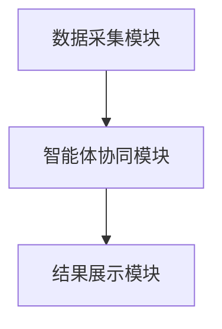

                 


# 利用智能体系统进行全面的公司创新效率评估

## 关键词：智能体系统, 创新效率评估, 多智能体协同, 知识表示, 智能决策优化

## 摘要：
创新效率是企业在快速变化的市场环境中保持竞争力的关键因素。传统的创新效率评估方法往往依赖人工分析和经验判断，存在主观性高、效率低下且难以量化的问题。随着人工智能技术的快速发展，智能体系统作为一种新兴的解决方案，为企业提供了更加智能化、自动化和精准的创新效率评估手段。本文将详细探讨智能体系统在创新效率评估中的应用，从理论基础到算法实现，再到实际案例，全面解析如何利用智能体系统提升企业的创新效率评估能力。

---

## 第1章：背景与概念

### 1.1 智能体系统的基本概念
#### 1.1.1 智能体系统的定义
智能体系统是由多个智能体组成的分布式系统，每个智能体能够感知环境、自主决策、协同工作，并通过通信机制实现目标。智能体的核心特征包括自主性、反应性、社会性和学习性。

#### 1.1.2 创新效率评估的定义
创新效率评估是对企业在创新过程中所投入的资源与产出成果之间的关系进行量化分析，旨在帮助企业识别创新过程中的瓶颈，优化资源配置，提升创新产出。

#### 1.1.3 智能体系统与创新效率评估的结合
通过智能体系统，可以实时监控企业创新活动的各个环节，分析数据并提供优化建议，从而实现创新效率的全面提升。

### 1.2 智能体系统的优势
#### 1.2.1 自主性与实时性
智能体能够自主感知环境变化，并实时调整策略，确保创新效率评估的动态性和准确性。

#### 1.2.2 分布式与协作性
通过多智能体的协作，可以实现对企业创新活动的多维度分析，覆盖从创意产生到成果落地的全过程。

#### 1.2.3 可扩展性与适应性
智能体系统可以根据企业的实际需求进行扩展，并快速适应市场环境的变化。

---

## 第2章：智能体系统的理论基础

### 2.1 多智能体系统的架构
多智能体系统由多个智能体组成，每个智能体负责特定的任务，通过通信机制实现协同。常见的多智能体系统架构包括集中式、分布式和混合式架构。

### 2.2 知识表示与推理
知识表示是智能体系统的核心，通过构建知识图谱，可以实现对企业创新活动的深度理解。知识推理则基于这些知识进行逻辑推理，支持智能决策。

### 2.3 智能体的决策优化
通过强化学习和遗传算法等技术，智能体能够不断优化其决策策略，提升创新效率评估的准确性。

---

## 第3章：创新效率评估的数学模型

### 3.1 评估指标体系
创新效率评估需要构建多维度的指标体系，包括创新投入、创新产出、创新周期和创新质量等指标。

### 3.2 数学模型的构建
基于指标体系，构建创新效率评估的数学模型，如下所示：

$$ \text{创新效率} = \frac{\text{创新产出}}{\text{创新投入}} $$

### 3.3 数据预处理与特征提取
通过数据清洗和特征提取，确保输入数据的高质量，为模型提供可靠的基础。

---

## 第4章：基于智能体的创新效率评估算法

### 4.1 算法概述
基于智能体的创新效率评估算法是一种分布式计算方法，通过多个智能体协同完成任务。

### 4.2 算法实现步骤
1. 初始化智能体
2. 数据采集与预处理
3. 知识表示与推理
4. 智能决策优化
5. 结果输出与反馈

### 4.3 算法伪代码
```python
def initialize_agents():
    # 初始化智能体
    pass

def collect_data():
    # 数据采集
    pass

def knowledge_reasoning():
    # 知识推理
    pass

def decision_optimization():
    # 决策优化
    pass

def output_results():
    # 结果输出
    pass
```

---

## 第5章：系统架构设计

### 5.1 系统架构概述
创新效率评估系统由数据采集模块、智能体协同模块和结果展示模块组成。

### 5.2 系统架构图


### 5.3 系统功能设计
- 数据采集：从企业创新活动中采集数据。
- 智能体协同：通过智能体协同完成数据处理和分析。
- 结果展示：将评估结果以可视化形式展示。

---

## 第6章：项目实战

### 6.1 环境搭建
需要安装Python、机器学习库（如TensorFlow、Scikit-learn）和可视化工具（如Matplotlib）。

### 6.2 核心代码实现
```python
import numpy as np
from sklearn.metrics import accuracy_score

def evaluate_efficiency(data):
    # 数据预处理
    processed_data = preprocess(data)
    # 知识推理
    knowledge = knowledge_reasoning(processed_data)
    # 决策优化
    result = optimize_decision(knowledge)
    return result

def preprocess(data):
    # 数据清洗和特征提取
    pass

def knowledge_reasoning(data):
    # 知识推理
    pass

def optimize_decision(knowledge):
    # 决策优化
    pass
```

### 6.3 案例分析
通过实际案例分析，展示智能体系统在创新效率评估中的应用效果。

---

## 第7章：案例分析与最佳实践

### 7.1 案例分析
通过具体案例，展示智能体系统在创新效率评估中的实际效果。

### 7.2 最佳实践
- 数据质量是关键，确保数据的准确性和完整性。
- 智能体协同是核心，通过有效的通信机制实现高效协同。

---

## 第8章：总结与展望

### 8.1 总结
智能体系统为企业创新效率评估提供了全新的解决方案，通过多智能体协同和知识表示，能够实现高效、精准的评估。

### 8.2 展望
未来，智能体系统将在创新效率评估中发挥更加重要的作用，结合边缘计算和区块链技术，进一步提升系统的安全性和可信度。

---

## 作者：AI天才研究院 & 禅与计算机程序设计艺术

