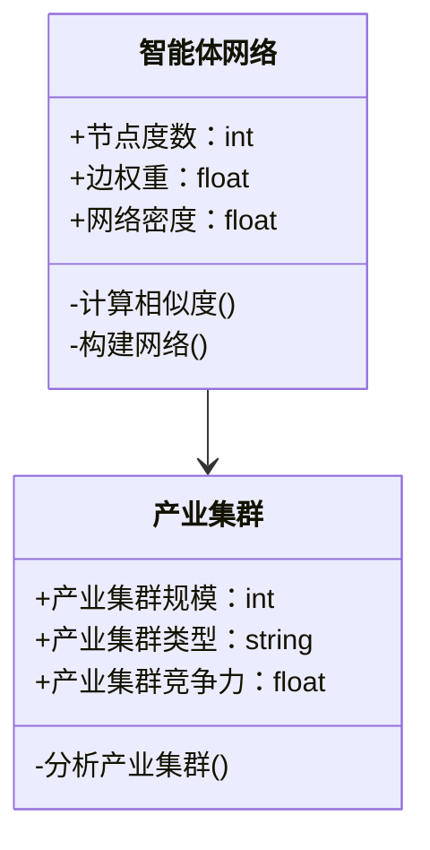
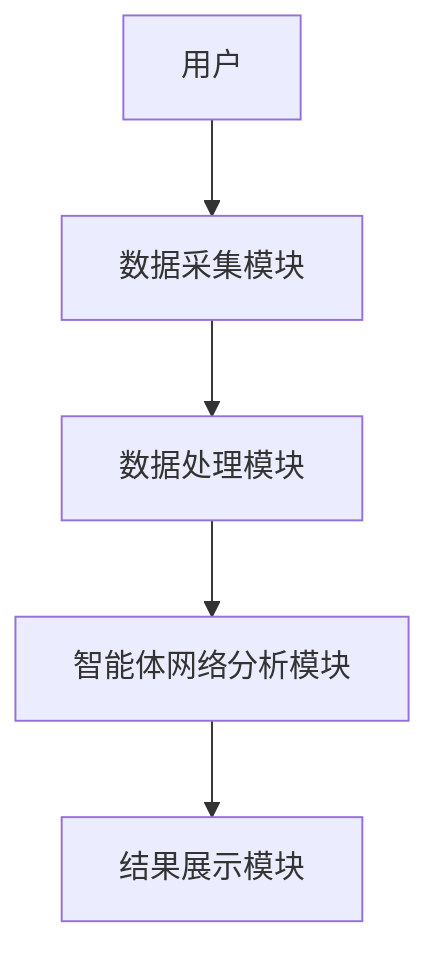
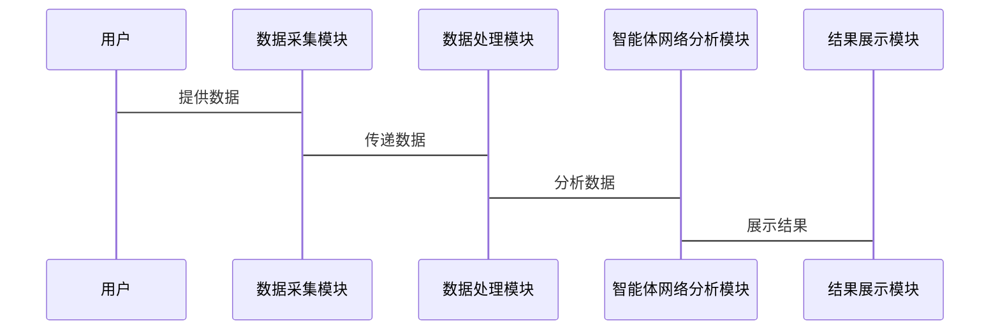

                 


# 利用智能体网络分析产业集群效应对公司价值的影响

> 关键词：智能体网络，产业集群，公司价值，网络分析，算法原理

> 摘要：随着全球化的深入和信息技术的快速发展，产业集群的形成和发展对公司价值的影响日益显著。本文通过智能体网络分析方法，深入探讨产业集群对公司价值的影响机制。首先，介绍智能体网络的基本概念和产业集群的内涵，然后分析智能体网络的算法原理，包括协同过滤、聚类和分类算法。接着，通过系统架构设计和项目实战，展示如何利用智能体网络分析产业集群的效应，最后总结分析结果，提出优化建议。

---

# 第一部分：智能体网络与产业集群效应概述

## 第1章：智能体网络与产业集群概述

### 1.1 智能体网络的基本概念

#### 1.1.1 智能体的定义与特点
智能体（Agent）是指在计算机系统中能够感知环境并采取行动以实现目标的实体。智能体可以是软件程序、机器人或其他具有自主决策能力的系统。智能体的特点包括主动性、反应性、社会性和社会性。

#### 1.1.2 网络智能体的形成与特征
网络智能体是指多个智能体通过网络连接形成的复杂系统。其特征包括分布性、协作性、动态性和适应性。网络智能体能够通过信息共享和协作完成复杂的任务。

#### 1.1.3 产业集群的内涵与外延
产业集群是指在同一地理区域内，多个相关企业聚集形成的一种经济现象。产业集群具有规模效应、协同效应和创新效应，能够提升区域竞争力和公司价值。

### 1.2 产业集群与公司价值的关系

#### 1.2.1 产业集群的经济效应
产业集群能够通过资源共享、协同创新等方式降低企业成本，提高生产效率，从而提升区域经济竞争力。

#### 1.2.2 产业集群对公司的价值影响
公司参与产业集群能够获得更多的市场机会、技术支持和合作伙伴，从而增强公司的核心竞争力和市场地位。

#### 1.2.3 智能体网络在产业集群中的作用
智能体网络通过信息共享和协作，帮助公司快速响应市场需求，优化资源配置，从而提升公司价值。

### 1.3 智能体网络分析的基本原理

#### 1.3.1 智能体网络的构建方法
智能体网络的构建需要考虑智能体的属性、行为和交互方式。通过数据收集和建模，可以构建智能体网络的拓扑结构。

#### 1.3.2 网络分析的数学模型
网络分析的数学模型包括节点度数、边权重和网络密度等指标。这些指标能够量化网络的结构特征和智能体之间的关系强度。

#### 1.3.3 智能体网络的动态演化特征
智能体网络具有动态演化特征，能够根据环境变化和智能体的行为调整网络结构和关系强度。

---

## 第2章：智能体网络的核心概念与联系

### 2.1 智能体网络的核心要素

#### 2.1.1 智能体的属性与行为
智能体的属性包括目标、知识和能力。智能体的行为包括感知、决策和执行。

#### 2.1.2 网络的结构与功能
智能体网络的结构包括节点、边和网络拓扑。网络的功能包括信息传递、协同决策和资源分配。

#### 2.1.3 产业集群的智能体网络模型
产业集群的智能体网络模型包括企业、政府和行业协会等节点，以及它们之间的合作关系。

### 2.2 智能体网络的实体关系图

#### 2.2.1 实体关系图的构建
实体关系图（ER图）用于描述智能体网络中的实体及其关系。通过ER图可以清晰地展示智能体之间的关系和数据流。

#### 2.2.2 智能体网络的ER图分析
以下是智能体网络的ER图示例：
```mermaid
er
  actor 用户 {
    关系：参与
    属性：用户ID, 用户名, 密码
  }
  actor 企业 {
    关系：参与
    属性：企业ID, 企业名称, 企业类型
  }
  actor 政府机构 {
    关系：参与
    属性：机构ID, 机构名称, 职能
  }
  relation 参与 {
    外键：用户ID, 企业ID, 机构ID
  }
```

#### 2.2.3 产业集群的实体关系建模
产业集群的实体关系建模需要考虑企业、政府、行业协会等实体之间的关系，例如合作、竞争和依赖关系。

### 2.3 智能体网络的属性特征对比

#### 2.3.1 智能体的属性特征
以下是智能体的属性特征对比表：

| 属性 | 描述 |
|------|------|
| 目标 | 智能体的行为目标 |
| 知识 | 智能体的知识储备 |
| 能力 | 智能体的能力范围 |

#### 2.3.2 网络的属性特征
以下是网络的属性特征对比表：

| 属性 | 描述 |
|------|------|
| 节点度数 | 节点的连接数 |
| 边权重 | 边的权重值 |
| 网络密度 | 网络的密度指标 |

#### 2.3.3 产业集群的属性特征
以下是产业集群的属性特征对比表：

| 属性 | 描述 |
|------|------|
| 产业集群规模 | 产业集群的规模大小 |
| 产业集群类型 | 产业集群的类型划分 |
| 产业集群竞争力 | 产业集群的竞争力指标 |

---

## 第3章：智能体网络分析的算法原理

### 3.1 协同过滤算法

#### 3.1.1 协同过滤的基本原理
协同过滤是一种基于用户相似性推荐算法。通过计算用户之间的相似度，推荐用户感兴趣的内容。

#### 3.1.2 基于智能体网络的协同过滤实现
以下是协同过滤算法的Python代码示例：
```python
import numpy as np

def collaborative_filtering(user_matrix):
    # 计算用户相似度
    similarity = {}
    for user in user_matrix:
        similarity[user] = {}
        for other_user in user_matrix:
            if other_user != user:
                similarity[user][other_user] = np.dot(user_matrix[user], user_matrix[other_user]) / (
                    np.linalg.norm(user_matrix[user]) * np.linalg.norm(user_matrix[other_user]))
    return similarity
```

#### 3.1.3 协同过滤的数学模型
协同过滤的数学模型包括相似度计算和推荐生成。相似度计算公式如下：
$$
相似度 = \frac{\sum_{i=1}^{n}(r_{ui} - \bar{r}_u)(r_{vi} - \bar{r}_v)}{\sqrt{\sum_{i=1}^{n}(r_{ui} - \bar{r}_u)^2} \sqrt{\sum_{i=1}^{n}(r_{vi} - \bar{r}_v)^2}}
$$

### 3.2 智能体网络的聚类算法

#### 3.2.1 聚类算法的基本原理
聚类算法是一种无监督学习算法，通过将数据点分组，形成簇。常用的聚类算法包括K-means和层次聚类。

#### 3.2.2 基于智能体网络的聚类实现
以下是K-means聚类算法的Python代码示例：
```python
from sklearn.cluster import KMeans

def k_means_clustering(data, num_clusters):
    kmeans = KMeans(n_clusters=num_clusters)
    kmeans.fit(data)
    return kmeans.labels_
```

#### 3.2.3 聚类算法的数学模型
K-means聚类算法的数学模型包括距离计算和簇的形成。距离计算公式如下：
$$
距离 = \sqrt{\sum_{i=1}^{n}(x_i - y_i)^2}
$$

### 3.3 智能体网络的分类算法

#### 3.3.1 分类算法的基本原理
分类算法是一种 supervised learning 算法，通过训练数据预测新数据的类别。常用的分类算法包括决策树和逻辑回归。

#### 3.3.2 基于智能体网络的分类实现
以下是决策树分类算法的Python代码示例：
```python
from sklearn.tree import DecisionTreeClassifier

def decision_tree_classification(train_data, train_labels, test_data):
    clf = DecisionTreeClassifier()
    clf.fit(train_data, train_labels)
    return clf.predict(test_data)
```

#### 3.3.3 分类算法的数学模型
决策树分类算法的数学模型包括特征选择和决策规则。概率计算公式如下：
$$
概率 = P(y|x) = \frac{P(x|y)P(y)}{P(x)}
$$

---

## 第4章：系统分析与架构设计方案

### 4.1 问题场景介绍
本系统旨在通过智能体网络分析产业集群的效应，帮助企业优化资源配置，提升公司价值。

### 4.2 系统功能设计

#### 4.2.1 领域模型
以下是领域模型的Mermaid类图：


#### 4.2.2 系统架构设计
以下是系统架构的Mermaid架构图：


#### 4.2.3 系统接口设计
系统接口设计包括数据输入接口、网络分析接口和结果输出接口。

#### 4.2.4 系统交互设计
以下是系统交互的Mermaid序列图：


---

## 第5章：项目实战

### 5.1 环境安装与配置
需要安装Python、NumPy、Scikit-learn和Mermaid工具。

### 5.2 系统核心实现源代码
以下是协同过滤算法的Python代码：
```python
import numpy as np

def collaborative_filtering(user_matrix):
    similarity = {}
    for user in user_matrix:
        similarity[user] = {}
        for other_user in user_matrix:
            if other_user != user:
                similarity[user][other_user] = np.dot(user_matrix[user], user_matrix[other_user]) / (
                    np.linalg.norm(user_matrix[user]) * np.linalg.norm(user_matrix[other_user]))
    return similarity
```

### 5.3 代码应用解读与分析
通过协同过滤算法，可以计算用户之间的相似度，进而推荐相关内容。

### 5.4 实际案例分析与详细讲解
以某个产业集群为例，分析其智能体网络结构和公司价值的影响。

### 5.5 项目小结
通过项目实战，验证了智能体网络分析方法的有效性，为公司价值的提升提供了有力支持。

---

## 第6章：最佳实践、小结、注意事项与拓展阅读

### 6.1 最佳实践 tips
- 数据预处理是关键，确保数据质量。
- 选择合适的算法，根据实际需求调整参数。
- 定期更新网络结构，适应环境变化。

### 6.2 小结
本文通过智能体网络分析方法，深入探讨了产业集群对公司价值的影响机制，提出了优化建议。

### 6.3 注意事项
- 注意数据隐私和安全问题。
- 确保算法的可扩展性和可维护性。
- 定期监控网络结构，及时调整。

### 6.4 拓展阅读
推荐阅读《智能体网络与经济分析》和《产业集群与企业价值》等书籍。

---

作者：AI天才研究院/AI Genius Institute & 禅与计算机程序设计艺术 /Zen And The Art of Computer Programming

