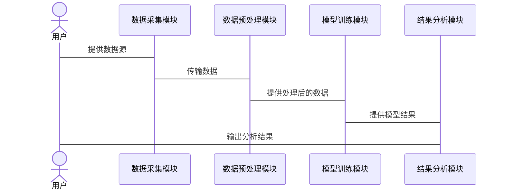

                 


# 利用智能体网络分析公司在产业链中的地位变化

## 关键词：智能体网络，产业链分析，公司地位，PageRank算法，系统架构，项目实战

## 摘要：  
本文详细探讨了如何利用智能体网络分析技术来评估和预测公司在一个产业链中的地位变化。通过分析产业链中的智能体网络结构，我们可以更好地理解各公司在产业链中的角色、影响力以及潜在的演变趋势。文章首先介绍智能体网络的基本概念和其在产业链分析中的应用背景，然后详细讲解智能体网络分析的核心算法和系统架构设计，最后通过具体案例展示如何将理论应用于实际项目中。本文还提供了Python代码示例和数学公式，帮助读者深入理解相关技术原理。

---

## 第1章: 智能体网络与产业链分析概述

### 1.1 智能体网络的定义与特点
智能体网络是一种基于图论的网络模型，用于描述多个智能体（节点）之间的关系和交互。智能体可以是公司、个人、组织或其他实体，每个节点具有以下特点：
- **智能性**：能够感知环境并做出决策。
- **自主性**：能够在没有外部干预的情况下独立运行。
- **协作性**：通过与其他智能体交互完成特定目标。

智能体网络的核心特点包括：
1. **动态性**：网络结构随时间变化，节点间的关系可以随时调整。
2. **复杂性**：节点之间的关系可能涉及多层复杂交互。
3. **可扩展性**：网络可以轻松扩展，添加新的节点或关系。

与传统网络分析相比，智能体网络更注重节点的智能性和自主性，能够更好地模拟现实中的复杂系统。

### 1.2 产业链分析的重要性
产业链是指从原材料到最终产品的生产过程中，各个参与者（如供应商、制造商、分销商、零售商）之间的协作关系。产业链分析的意义在于：
1. **优化资源配置**：通过分析产业链中的瓶颈环节，优化资源配置，提高效率。
2. **风险预警**：识别潜在的供应链风险，如供应商违约或市场需求变化。
3. **战略决策**：帮助企业制定更精准的市场进入或退出战略。

### 1.3 智能体网络分析的现状与挑战
当前，智能体网络分析技术在产业链中的应用主要集中在以下几个方面：
1. **供应链优化**：通过分析供应链中的节点关系，优化物流和库存管理。
2. **市场趋势预测**：通过分析产业链中的节点行为，预测市场趋势。
3. **竞争分析**：通过分析竞争对手在产业链中的位置，制定竞争策略。

然而，智能体网络分析也面临一些挑战：
- **数据获取难度**：产业链中的数据可能分散在不同企业，难以获取。
- **模型复杂性**：智能体网络的建模和分析需要复杂的算法支持。
- **计算资源需求**：大规模网络分析需要高性能计算资源。

---

## 第2章: 智能体网络的核心概念与联系

### 2.1 智能体网络的核心概念
智能体网络的核心概念包括以下几个方面：
- **节点**：智能体网络中的节点代表公司、个人或其他实体。
- **边**：节点之间的关系，可以表示为有向边或无向边。
- **权重**：边上的权重表示节点之间的交互强度或重要性。

### 2.2 智能体网络与产业链的关系
在产业链分析中，智能体网络可以映射到以下实体：
1. **供应商**：提供原材料或零部件的企业。
2. **制造商**：将原材料加工成产品的企业。
3. **分销商**：将产品分销到零售商的企业。
4. **零售商**：直接面向消费者的销售终端。

通过智能体网络，我们可以构建一个产业链的实体模型，其中每个节点代表一个企业，边代表企业之间的合作关系或供应链关系。

### 2.3 智能体网络的拓扑结构
智能体网络的拓扑结构可以通过以下几种方式表示：
- **ER图**：用于描述实体之间的关系。
- **网络图**：用于展示节点之间的连接关系。
- **层次结构图**：用于展示产业链中的层级关系。

---

## 第3章: 智能体网络分析的算法原理

### 3.1 智能体网络分析的核心算法
智能体网络分析的核心算法包括：
1. **PageRank算法**：用于计算节点的重要性。
2. **社区发现算法**：用于识别网络中的社区结构。

### 3.2 节点重要性计算的数学模型
节点重要性可以通过PageRank算法来计算。PageRank算法的数学公式如下：

$$ PR(i) = \alpha PR(i) + (1-\alpha) \sum_{j} \frac{PR(j)}{d(j)} $$

其中，$PR(i)$ 表示节点 $i$ 的PageRank值，$\alpha$ 是阻尼系数，$d(j)$ 是节点 $j$ 的出度。

### 3.3 算法实现的Python代码示例
以下是PageRank算法的Python实现示例：

```python
import networkx as nx

def calculatepagerank(graph):
    pr = nx.pagerank(graph)
    return pr

# 创建一个示例图
graph = nx.DiGraph()
graph.add_edge(1, 2)
graph.add_edge(2, 3)
graph.add_edge(3, 1)

pagerank = calculatepagerank(graph)
print(pagerank)
```

---

## 第4章: 智能体网络分析系统的架构设计

### 4.1 系统功能设计
智能体网络分析系统的功能模块包括：
1. **数据采集模块**：采集产业链中的数据。
2. **数据预处理模块**：清洗和转换数据。
3. **模型训练模块**：训练智能体网络分析模型。
4. **结果分析模块**：分析并输出结果。

### 4.2 系统架构设计
系统架构设计如下：


### 4.3 系统接口设计
系统接口设计如下：



---

## 第5章: 项目实战

### 5.1 项目背景
假设我们有一个包含多个供应商、制造商和分销商的产业链数据集。

### 5.2 项目实现
以下是项目的Python代码实现：

```python
import networkx as nx
import matplotlib.pyplot as plt

# 创建示例图
graph = nx.DiGraph()
graph.add_edge('A', 'B', weight=0.5)
graph.add_edge('B', 'C', weight=0.7)
graph.add_edge('C', 'D', weight=0.6)

# 计算PageRank
pagerank = nx.pagerank(graph)

# 绘制网络图
nx.draw(graph, with_labels=True, edge_labels='weight')
plt.show()

print(pagerank)
```

### 5.3 实际案例分析
通过上述代码，我们可以分析出节点的重要性，并识别出关键节点。

---

## 第6章: 总结与展望

### 6.1 总结
本文详细介绍了如何利用智能体网络分析公司在产业链中的地位变化。通过分析智能体网络的核心概念、算法原理和系统架构设计，我们能够更好地理解产业链中的复杂关系。

### 6.2 未来展望
未来，智能体网络分析技术可以进一步应用于以下几个方面：
1. **实时监控**：实时监控产业链中的动态变化。
2. **预测分析**：基于历史数据预测未来的产业链变化。
3. **多模态分析**：结合文本、图像等多种数据源进行分析。

### 6.3 最佳实践 Tips
1. **数据质量**：确保数据的准确性和完整性。
2. **模型可解释性**：注重模型的可解释性，以便更好地理解分析结果。
3. **持续优化**：定期更新模型，以适应产业链的变化。

---

## 作者：AI天才研究院/AI Genius Institute & 禅与计算机程序设计艺术 /Zen And The Art of Computer Programming

