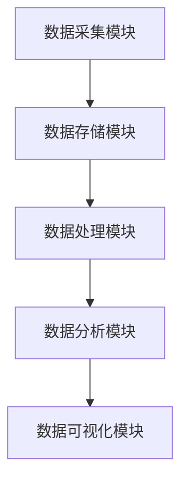
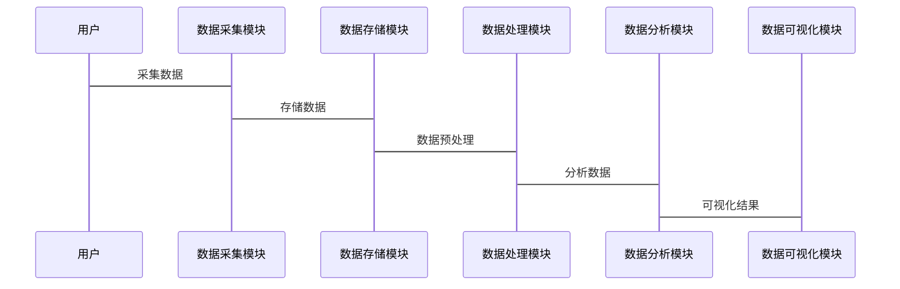

                 


# 利用智能体网络分析公司的创新合作网络价值

---

## 关键词：智能体网络，创新合作网络，网络价值分析，社会网络分析，图论算法，系统设计

---

## 摘要：

随着企业之间的合作日益复杂，创新合作网络的价值分析成为企业战略管理的重要工具。本文通过智能体网络分析的方法，探讨如何量化公司创新合作网络的价值，优化网络结构，提升企业创新效率和竞争力。

---

# 第1章: 智能体网络与创新合作网络概述

## 1.1 智能体网络的基本概念

### 1.1.1 智能体的定义与特征

智能体（Agent）是指具有感知环境、自主决策和行动能力的实体。智能体网络则是由多个智能体通过某种交互机制构成的复杂系统。

- **感知能力**：智能体能够通过传感器或其他方式获取环境信息。
- **自主决策**：智能体基于获取的信息做出决策，无需外部干预。
- **协作能力**：智能体之间可以通过通信模块进行协作。

### 1.1.2 智能体网络的形成机制

智能体网络的形成机制主要包括以下几种：

1. **自组织机制**：智能体基于局部信息自主组织成网络。
2. **中心化机制**：由一个或多个中心节点协调网络的形成。
3. **混合机制**：结合自组织和中心化的特点，形成灵活的网络结构。

### 1.1.3 智能体网络与创新合作网络的关系

创新合作网络是指企业在创新过程中形成的合作伙伴关系网络。智能体网络通过模拟这些合作关系，帮助企业更好地分析和优化创新网络的结构和价值。

---

## 1.2 创新合作网络的价值分析

### 1.2.1 创新合作网络的定义

创新合作网络是指企业在创新过程中形成的合作伙伴关系网络。这些合作伙伴包括供应商、客户、研发机构等。

### 1.2.2 创新合作网络的核心要素

- **节点**：代表企业或组织。
- **边**：代表合作关系。
- **权重**：表示合作的强度或频率。

### 1.2.3 创新合作网络的分析框架

创新合作网络的分析框架包括以下几个方面：

1. **网络密度**：衡量网络中合作关系的紧密程度。
2. **中心性**：识别网络中的关键节点。
3. **聚类性**：分析网络中的集群现象。

---

## 1.3 本章小结

本章介绍了智能体网络的基本概念和创新合作网络的核心要素，为后续分析奠定了基础。

---

# 第2章: 智能体网络的结构与模型

## 2.1 智能体网络的节点与边

### 2.1.1 节点的定义与属性

节点是智能体网络的基本单元，代表智能体或实体。

- **节点的属性**：包括智能体的能力、资源、角色等。
- **节点的权重**：表示智能体在网络中的重要性。

### 2.1.2 边的定义与权重

边表示智能体之间的连接关系，权重表示连接的强度。

- **边的权重计算**：可以通过合作频率、合作强度等指标来量化。

### 2.1.3 网络的密度与连接性

网络密度是指网络中边的数量与可能存在的边数的比率。

- **网络密度公式**：$$\text{密度} = \frac{\text{边数}}{\text{可能的边数}}$$

---

## 2.2 智能体网络的数学模型

### 2.2.1 网络的度分布模型

度分布模型描述了网络中节点度数的分布情况。

- **度分布公式**：$$P(k) = \frac{\text{度数为}k\text{的节点数}}{\text{总节点数}}$$

### 2.2.2 网络的聚类系数模型

聚类系数模型描述了网络中节点的聚集程度。

- **聚类系数公式**：$$C = \frac{\text{三角形数量}}{\text{可能的三角形数量}}$$

### 2.2.3 网络的路径分析模型

路径分析模型用于分析网络中节点之间的最短路径。

- **最短路径算法**：如Dijkstra算法和Floyd-Warshall算法。

---

## 2.3 智能体网络的拓扑结构

### 2.3.1 树状结构

树状结构是一种无环的连通图。

- **树状结构特点**：层次分明，路径唯一。

### 2.3.2 网状结构

网状结构是一种高度连接的网络结构。

- **网状结构特点**：节点之间有多条路径，冗余性高。

### 2.3.3 层次结构

层次结构将网络划分为多个层次，每个层次具有特定的功能。

- **层次结构特点**：层次分明，功能明确。

---

## 2.4 本章小结

本章详细介绍了智能体网络的结构与模型，为后续分析提供了理论基础。

---

# 第3章: 创新合作网络的价值评估方法

## 3.1 创新合作网络的价值模型

### 3.1.1 价值模型的构建

创新合作网络的价值模型可以从以下几个方面构建：

1. **合作强度**：合作频率、合作成果等。
2. **合作质量**：合作的深度、合作的创新能力等。
3. **合作稳定性**：合作的持续性、合作的稳定性等。

### 3.1.2 价值模型的评估指标

- **合作强度指标**：如合作项目的数量、合作项目的成功概率等。
- **合作质量指标**：如合作项目的创新性、合作项目的影响力等。
- **合作稳定性指标**：如合作项目的持续时间、合作项目的变动频率等。

### 3.1.3 价值模型的验证方法

- **实证分析**：通过实际数据验证模型的有效性。
- **仿真分析**：通过仿真模拟验证模型的合理性。

---

## 3.2 创新合作网络的影响力分析

### 3.2.1 中心性分析

中心性分析用于识别网络中的关键节点。

- **度中心性**：节点的度数越高，中心性越强。
- **接近中心性**：节点到其他节点的最短路径越短，中心性越强。

### 3.2.2 权重分析

权重分析用于评估节点在网络中的重要性。

- **节点权重计算**：可以通过合作强度、合作质量等指标进行加权。

### 3.2.3 聚类分析

聚类分析用于分析网络中的集群现象。

- **聚类算法**：如K-means算法、层次聚类算法等。

---

## 3.3 创新合作网络的优化策略

### 3.3.1 网络结构优化

网络结构优化包括优化网络的密度、中心性等。

- **网络密度优化**：增加边的数量，提高网络的连接性。
- **网络层次优化**：优化网络的层次结构，提高网络的效率。

### 3.3.2 节点权重优化

节点权重优化包括优化节点的度数、权重等。

- **节点权重调整**：通过调整节点的权重，优化网络的结构。

### 3.3.3 边权重优化

边权重优化包括优化边的权重、边的连接方式等。

- **边权重调整**：通过调整边的权重，优化网络的结构。

---

## 3.4 本章小结

本章详细介绍了创新合作网络的价值评估方法和优化策略。

---

# 第4章: 智能体网络分析的工具与方法

## 4.1 智能体网络分析的工具

### 4.1.1 社会网络分析工具

- **Gephi**：用于可视化和分析社会网络结构。
- **NetworkX**：用于构建和分析网络结构。

### 4.1.2 图论算法工具

- **矩阵分析工具**：如MATLAB、NumPy等。
- **聚类分析工具**：如scikit-learn、K-means等。

### 4.1.3 数据挖掘工具

- **Python的网络分析库**：如NetworkX、igraph等。
- **R语言的网络分析包**：如igraph、sna等。

---

## 4.2 智能体网络分析的方法

### 4.2.1 数据采集方法

- **数据采集工具**：如API接口、网络爬虫等。
- **数据预处理**：如数据清洗、数据转换等。

### 4.2.2 数据分析方法

- **社会网络分析**：如中心性分析、聚类分析等。
- **图论算法**：如最短路径算法、聚类算法等。

### 4.2.3 数据可视化方法

- **可视化工具**：如Gephi、Graphviz等。
- **可视化方法**：如节点布局、边权重展示等。

---

## 4.3 本章小结

本章介绍了智能体网络分析的主要工具和方法，为后续分析提供了技术支持。

---

# 第5章: 智能体网络分析的系统设计

## 5.1 系统功能设计

### 5.1.1 数据采集模块

- **功能描述**：采集公司创新合作网络的数据。
- **实现方式**：通过API接口或网络爬虫实现。

### 5.1.2 数据存储模块

- **功能描述**：存储采集到的数据。
- **实现方式**：使用数据库或文件存储。

### 5.1.3 数据处理模块

- **功能描述**：对数据进行清洗、转换等预处理。
- **实现方式**：使用Python的Pandas库实现。

### 5.1.4 数据分析模块

- **功能描述**：对数据进行分析，生成分析结果。
- **实现方式**：使用NetworkX或igraph库实现。

### 5.1.5 数据可视化模块

- **功能描述**：将分析结果可视化。
- **实现方式**：使用Gephi或Graphviz实现。

---

## 5.2 系统架构设计

### 5.2.1 系统架构图



### 5.2.2 系统交互图



---

## 5.3 本章小结

本章详细介绍了智能体网络分析系统的功能设计和架构设计。

---

# 第6章: 项目实战

## 6.1 项目背景

某公司希望通过分析其创新合作网络的价值，优化其合作网络结构，提升创新效率。

---

## 6.2 系统实现

### 6.2.1 环境安装

- **Python版本**：Python 3.8以上
- **依赖库安装**：NetworkX、Gephi、Pandas等。

### 6.2.2 核心实现代码

```python
import networkx as nx
import numpy as np

# 创建智能体网络
G = nx.Graph()
G.add_nodes_from(["A", "B", "C", "D", "E"])
G.add_edges_from([("A", "B"), ("B", "C"), ("C", "D"), ("D", "E"), ("E", "A")])

# 计算网络的度分布
degree = nx.degree(G)
print("度分布:", degree)

# 计算网络的聚类系数
clustering = nx.clustering(G)
print("聚类系数:", clustering)

# 计算网络的中心性
centrality = nx.betweenness_centrality(G)
print("中心性:", centrality)
```

### 6.2.3 代码应用解读

上述代码创建了一个简单的智能体网络，并计算了网络的度分布、聚类系数和中心性。

---

## 6.3 实际案例分析

以某公司为例，分析其创新合作网络的价值。

---

## 6.4 项目小结

本章通过实际案例展示了智能体网络分析系统的实现和应用。

---

# 第7章: 总结与展望

## 7.1 研究总结

智能体网络分析为企业提供了量化创新合作网络价值的重要工具。

---

## 7.2 未来展望

未来，智能体网络分析将更加智能化、自动化，为企业提供更高效的决策支持。

---

## 7.3 注意事项

在实际应用中，需要注意数据的准确性和算法的适用性。

---

## 7.4 拓展阅读

推荐阅读相关领域的书籍和论文，深入了解智能体网络分析的理论和应用。

---

# 作者：AI天才研究院/AI Genius Institute & 禅与计算机程序设计艺术 /Zen And The Art of Computer Programming

